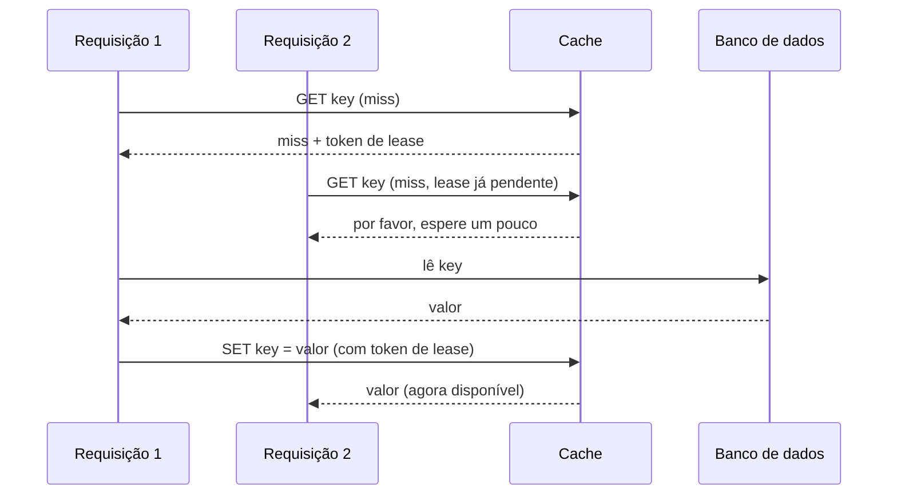

## Objetivos de Aprendizagem

- Explicar o problema da manada estrondosa (thundering herd) com precisão: o que especificamente dá errado quando uma chave de cache popular expira ou é removida sob uma carga pesada de leituras concorrentes.
- Descrever o mecanismo de leases do Facebook e rastrear exatamente como ele evita uma manada estrondosa sem simplesmente serializar todas as leituras de uma chave.
- Explicar a corrida de leitura desatualizada que um caminho de escrita ingênuo (cache e depois banco de dados) cria, e como a invalidação via um daemon que lê o log de commits do banco de dados a trata.
- Explicar o que é um pool regional, que tipo específico de dado ele mira, e que trade-off ele faz em comparação com replicar esses mesmos dados em todo cluster local.

## Contexto e Motivação

Todo sistema estudado anteriormente nesta disciplina (GFS, Bigtable, Dynamo, Spanner) é ele mesmo um sistema de registro: o armazenamento real, durável e autoritativo de algum dado. Um cache tem um papel diferente e complementar: ele guarda uma cópia de dados que já vivem de forma durável em outro lugar (normalmente um banco de dados), puramente para atender leituras mais rápido do que o armazenamento durável conseguiria sozinho. Em pequena escala, raciocinar sobre um cache é quase trivial: consulte uma chave e, num miss, leia o valor do banco de dados e guarde-o no cache para a próxima vez. O relato publicado pelo próprio Facebook sobre escalar exatamente essa ideia simples para atender trilhões de itens e tratar bilhões de requisições por segundo, apresentado no USENIX NSDI em 2013, é um estudo de caso valioso para esta disciplina precisamente porque mostra vários modos de falha genuinamente novos que só aparecem nessa escala, cada um com uma correção específica e deliberada, e não um que já seria óbvio na versão em pequena escala da mesma ideia.

## Teoria Central

### O problema da manada estrondosa

Considere uma única chave de cache muito popular (digamos, um dado da página de perfil de uma celebridade, lido por um número enorme de requisições concorrentes). Se essa chave expira ou é removida do cache, a próxima leitura que der miss vai, no projeto ingênuo, buscar o valor no banco de dados e repovoar o cache, o que isoladamente não é problema. O problema é a concorrência: na escala do Facebook, potencialmente milhares de requisições concorrentes podem chegar para essa mesma chave agora ausente dentro da mesma janela breve, antes que qualquer uma delas tenha terminado de repovoar o cache e, no projeto ingênuo, cada uma dessas milhares de requisições vê um miss de forma independente e emite de forma independente a sua própria leitura ao banco de dados, todas de uma vez. É um pico repentino e concentrado de carga redundante atingindo o banco de dados para o que deveria ter sido um único evento de miss e reabastecimento do cache. Este é o problema da **manada estrondosa** (thundering herd), e em escala ele é uma ameaça real e recorrente à estabilidade do banco de dados, e não um caso extremo raro ou meramente teórico.

### Leases: deixar uma requisição repovoar enquanto as outras esperam, sem serialização completa

A correção do Facebook é um mecanismo de **lease**. Quando uma requisição sofre um miss de cache numa chave, o cache não só reporta "não encontrado": ele também entrega a essa requisição um lease, um token único preso àquela chave específica. Crucialmente, se outra requisição para a mesma chave chega logo depois, enquanto o lease ainda está pendente, o cache diz a essa segunda requisição para esperar brevemente, em vez de também mandá-la buscar no banco de dados. A única requisição que detém o lease válido é a única autorizada a buscar no banco de dados e então gravar o valor de volta no cache, apresentando o seu token de lease ao fazer isso, e quando essa gravação tem sucesso, o cache entrega o valor agora repovoado a toda outra requisição que estava esperando. Para limitar ainda mais o estrago mesmo que algo dê errado (uma requisição que detém um lease trava ou atrasa inesperadamente), o cache só emite um token de lease novo por chave mais ou menos uma vez a cada dez segundos, então, mesmo no pior caso, só um número pequeno e limitado de leituras ao banco de dados para uma única chave quente pode se acumular numa dada janela, em vez de um pico ilimitado de milhares de uma vez.

### Invalidação: evitar que o cache sirva dados desatualizados depois de uma escrita no banco

Um problema separado surge especificamente das escritas: se uma aplicação, depois de escrever um valor novo no banco de dados, também atualiza o cache diretamente, uma corrida entre dois escritores concorrentes pode deixar o cache guardando um valor mais antigo que o do banco de dados, permanentemente, até que a chave por acaso expire sozinha. O projeto do Facebook, em vez disso, apaga (invalida) a entrada em cache em vez de tentar atualizá-la diretamente depois de uma escrita e, o que é importante, faz isso por um mecanismo dedicado, em vez de confiar que o caminho de código da aplicação que fez a escrita vai se lembrar de forma confiável de invalidar também cada entrada de cache afetada. Um daemon (o artigo chama esse componente de `mcsqueal`) lê diretamente o próprio log de commits do banco de dados, extrai quais linhas acabaram de mudar e transmite pedidos de remoção para as chaves de cache correspondentes a todo cluster de front-end relevante. Como ele lê do log de commits autoritativo do banco de dados, em vez de depender de código de aplicação espalhado se lembrando corretamente de invalidar o cache em todo caminho de escrita, ele é ao mesmo tempo mais confiável e centraliza uma preocupação (evitar que o cache sirva dados sabidamente desatualizados) que de outro modo precisaria ser reimplementada corretamente em cada lugar em que a aplicação escreve no banco de dados.

### Pools regionais: nem todo tipo de chave quente se beneficia de replicação local completa

A implantação de cache do Facebook é organizada em clusters (máquinas relativamente próximas que atendem o tráfego de usuários de uma região) e, acima disso, em regiões. Para a maioria dos dados em cache, replicá-los no cache de cada cluster local é a escolha certa, mantendo os dados acessados com frequência o mais perto possível das requisições que os leem. Mas o artigo identifica uma categoria específica e diferente de dados, grandes em tamanho e acessados com pouca frequência, para a qual a replicação completa por cluster é um desperdício: replicar um item grande e raramente lido no cache de cada cluster consome uma quantidade proporcional de memória em cada um desses clusters, para pouquíssimo benefício real, já que o item raramente é lido de qualquer um deles. Para exatamente essa categoria, o Facebook usa um **pool regional**, uma única camada de cache compartilhada, acessível a vários clusters de front-end dentro da mesma região, que guarda uma cópia desses dados grandes e frios em vez de uma cópia por cluster. É uma troca deliberada de uma latência um pouco maior (um cluster que lê do pool regional não está lendo do seu próprio cache imediatamente local) por uma grande redução da memória total usada na região, corretamente ajustada a dados para os quais esse custo de latência raramente é pago, precisamente porque eles são acessados com pouca frequência.

## Exemplos Resolvidos

### Exemplo 1: rastreando uma manada estrondosa, com e sem leases

**Problema:** Uma chave quente expira, e 2.000 requisições para ela chegam dentro da mesma janela de 50 milissegundos. Rastreie o que acontece (a) sem o mecanismo de leases, e (b) com ele.

**Rastreamento, sem leases:** As 2.000 requisições veem um miss de forma independente (a chave expirou e nada a repovoou ainda), e as 2.000 emitem de forma independente uma leitura ao banco de dados para o mesmo dado subjacente: um pico de carga 2.000 vezes redundante para o que deveria ter precisado de exatamente uma leitura no banco de dados.

**Rastreamento, com leases:** A primeira das 2.000 requisições a chegar vê o miss e recebe um token de lease. As 1.999 requisições restantes, chegando dentro da mesma janela breve, veem cada uma que um lease para esta chave já está pendente, e recebem a instrução de esperar brevemente, em vez de serem mandadas elas mesmas ao banco de dados. Só a única requisição que detém o lease de fato lê o banco de dados e então grava o valor de volta no cache; quando essa gravação termina, as outras 1.999 requisições, que estavam esperando, recebem o valor agora repovoado diretamente do cache. O banco de dados viu exatamente uma leitura para esta chave durante a janela inteira, e não 2.000.

### Exemplo 2: rastreando a corrida de leitura desatualizada que a invalidação evita

**Problema:** Uma aplicação atualiza um campo do perfil de um usuário no banco de dados e, no projeto ingênuo, também escreve o valor novo diretamente no cache logo em seguida. Uma segunda requisição concorrente, processando uma versão um pouco mais antiga da mesma atualização (talvez tentada de novo depois de um atraso), realiza os mesmos dois passos um momento depois, mas a sua escrita no banco de dados na verdade executa primeiro, enquanto a sua escrita no cache atrasa um pouco. Rastreie como o cache pode terminar permanentemente desatualizado, e depois rastreie como o projeto de invalidação via log de commits do Facebook evita isso.

**Rastreamento, atualização direta do cache (a corrida):** Suponha que a requisição A (a atualização mais nova) escreva no banco de dados e depois escreva o valor novo diretamente no cache. Suponha que a requisição B (a atualização mais antiga, tentada de novo) já tivesse escrito o seu valor mais antigo no banco de dados antes, mas que a sua própria escrita direta no cache acabe executando depois que a escrita de A no cache termina, por causa de algum atraso de escalonamento. O cache agora guarda o valor mais antigo de B, mesmo que o banco de dados guarde corretamente o valor mais novo de A, e o cache vai continuar servindo silenciosamente esse valor desatualizado a todo leitor até que a chave eventualmente expire sozinha: uma resposta ativamente errada, e não meramente lenta.

**Rastreamento, com invalidação baseada no log de commits:** Nem a requisição A nem a B escrevem no cache diretamente. Em vez disso, cada escrita no banco de dados é simplesmente registrada no próprio log de commits do banco, na ordem em que o próprio banco de fato as confirmou (a escrita de A, depois a de B, ou a de B e depois a de A, qualquer que tenha sido a que o banco genuinamente executou primeiro e registrou como tal). O daemon no estilo `mcsqueal` lê esse log de commits autoritativo e emite uma invalidação de cache (uma remoção, e não uma atualização direta de valor) para a chave afetada depois de cada escrita que observa. Independentemente da intercalação exata, a entrada de cache desta chave termina apagada depois da verdadeira escrita final do próprio banco de dados, e a próxima leitura simplesmente sofre um miss comum, buscando o valor atual e correto diretamente no banco de dados, exatamente o mesmo caminho de repovoamento bem compreendido que o Exemplo 1 já cobre, em vez de servir silenciosamente um valor desatualizado sem nenhum sinal de que algo esteve errado.

## Equívocos Comuns e Armadilhas

- **"Os leases funcionam fazendo toda requisição para uma chave quente esperar numa fila estrita, uma de cada vez."** Só a única requisição que detém o lease de fato realiza a leitura cara no banco de dados; toda outra requisição concorrente para essa mesma chave espera brevemente e então recebe o valor já repovoado diretamente do cache quando a gravação de quem detém o lease termina, e não cada uma delas eventualmente tendo a sua vez de ler o banco de dados. O banco de dados vê essencialmente uma leitura para a rajada inteira, e não uma fila serializada de muitas.
- **"Invalidar o cache e atualizar o cache são dois jeitos igualmente bons de manter um cache correto depois de uma escrita; a invalidação é só a preferência de estilo do Facebook."** Atualizações diretas do cache a partir do código da aplicação criam a corrida específica que o Exemplo 2 desenvolve: vence a atualização de cache do escritor que por acaso executar por último, independentemente de qual escrita no banco de dados de fato aconteceu por último, um bug de corretude genuíno, e não uma escolha de estilo. A invalidação contorna isso por completo ao nunca escrever um valor diretamente no cache a partir do caminho de escrita: o próximo leitor simplesmente o repovoa corretamente a partir do estado atual e autoritativo do próprio banco de dados.
- **"Um pool regional é só uma camada de cache normal com outro nome."** Um pool regional mira especificamente dados grandes e acessados com pouca frequência, e troca deliberadamente uma latência um pouco maior por cluster por uma grande redução da memória total usada, guardando uma cópia compartilhada por região em vez de uma cópia por cluster. Usá-lo para dados quentes, pequenos e acessados com frequência seria a escolha errada, já que essa categoria de dados se beneficia especificamente de ser replicada perto de cada cluster que a lê, exatamente o trade-off oposto ao que um pool regional faz.

## Resumo

A implantação de memcached do Facebook revela três modos de falha específicos que só aparecem em escala muito grande, cada um com uma correção deliberada e distinta, e não uma de que um projeto de cache e depois banco de dados em pequena escala já precisaria. O problema da manada estrondosa, milhares de requisições concorrentes lendo de forma independente o banco de dados depois do miss da mesma chave, é tratado pelos leases, que deixam exatamente uma requisição repovoar o cache enquanto as outras esperam brevemente o seu resultado, em vez de cada uma emitir a sua própria leitura redundante ao banco. A corrida de leitura desatualizada, em que atualizar o cache diretamente a partir do código da aplicação pode deixar um valor desatualizado permanentemente em cache dependendo da sorte na ordem das escritas, é tratada invalidando (apagando) a entrada de cache via um daemon dedicado que lê o próprio log de commits autoritativo do banco de dados, em vez de confiar que código de aplicação espalhado vai atualizar corretamente o próprio cache. E os pools regionais trocam uma pequena quantidade de latência por cluster por uma grande redução da memória total usada, especificamente para a categoria de dados, grandes e acessados com pouca frequência, em que a replicação completa por cluster seria de outro modo um desperdício. Cada mecanismo mira um problema preciso e concreto, visível só em escala, exatamente a lição recorrente desta disciplina de que as escolhas de engenharia específicas de um sistema real decorrem diretamente dos modos de falha específicos que a sua escala real expõe.

## Documentation Links

- [Nishtala et al.: Scaling Memcache at Facebook (USENIX NSDI 2013)](https://www.usenix.org/conference/nsdi13/technical-sessions/presentation/nishtala): doc
