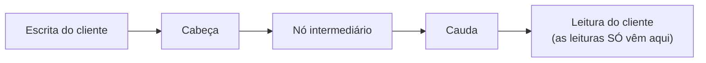

## Objetivos de Aprendizagem

- Descrever a organização de cabeça, cauda e nós intermediários do Chain Replication, e enunciar com precisão qual nó trata as escritas e qual nó trata as leituras.
- Explicar por que toda leitura reflete toda escrita confirmada anterior sob o Chain Replication, a mesma garantia de consistência forte que a replicação primário-backup oferece, e identificar exatamente o estado de qual nó uma leitura consulta para obtê-la.
- Explicar a vantagem de vazão que o Chain Replication tem sobre um projeto primário-backup tradicional, em que um único primário precisa tanto aplicar toda escrita quanto repassá-la a cada backup.
- Rastrear o que acontece com as leituras e escritas quando um nó intermediário da cadeia falha, e explicar por que isso exige só um reparo local (remover um nó), e não a reconfiguração mais complexa de que um sistema baseado em quórum precisaria.

## Contexto e Motivação

O conceito anterior desenvolveu o two-phase commit e a sua fraqueza de bloqueio para coordenar uma transação entre várias partições. Este conceito dá um passo atrás, para uma pergunta mais estreita, mas ainda fundamental, já tocada no conceito de abertura desta disciplina e desenvolvida formalmente em Sistemas Distribuídos I: dado um único dado replicado (não uma transação de múltiplas partições, só o conjunto de réplicas de uma chave), como as leituras e escritas devem ser encaminhadas entre as réplicas para obter ao mesmo tempo consistência forte e boa vazão? Sistemas Distribuídos I desenvolve duas respostas clássicas: a replicação primário-backup (um único primário ordena as escritas e as repassa aos backups, e normalmente também atende as leituras) e a replicação baseada em quórum (escritas e leituras precisam, cada uma, alcançar algum quórum de réplicas). O Chain Replication, publicado no OSDI em 2004 por van Renesse e Schneider, é uma terceira resposta, deliberadamente diferente, e estudá-lo aqui importa especificamente pelo que ele revela sobre um gargalo de vazão do projeto primário-backup padrão que é fácil de ignorar: um único primário nesse projeto precisa tratar pessoalmente o tráfego de escrita completo duas vezes, uma para aplicar cada escrita localmente e outra para repassar essa mesma escrita a cada backup. Isso significa que a capacidade do próprio primário, e não a capacidade total do conjunto de réplicas inteiro, limita a vazão de escrita do sistema.

## Teoria Central

### A organização de cabeça, cauda e nós intermediários

O Chain Replication organiza um conjunto de réplicas numa cadeia linear, em vez de uma organização em estrela, com um primário central falando com cada backup de forma independente. O primeiro nó da cadeia é a **cabeça** (head), o último nó é a **cauda** (tail), e todo nó entre os dois é um **nó intermediário**. Os papéis são estritos e simples: toda escrita é enviada à cabeça, e só à cabeça; toda leitura é enviada à cauda, e só à cauda.

Uma escrita que chega à cabeça é aplicada ali e então repassada ao próximo nó da cadeia, que a aplica e a repassa adiante, e assim por diante, um salto por vez, até chegar à cauda, que a aplica e, crucialmente, é o ponto em que a escrita é considerada totalmente confirmada. A cauda envia a confirmação de volta (diretamente ao cliente, ou propagada para trás pela cadeia, dependendo da variante específica) só depois de ela mesma ter aplicado a escrita.

### Por que isto dá a mesma consistência forte do primário-backup, usando só a cauda

Como toda leitura vai exclusivamente para a cauda, e a cauda é, por construção, o último nó a aplicar qualquer escrita (ela fica no fim da cadeia que toda escrita precisa percorrer por completo antes de ser confirmada), uma leitura na cauda tem a garantia de refletir toda escrita que já foi confirmada, e não tem como ver uma escrita que ainda não terminou de se propagar pela cadeia inteira, já que tal escrita ainda nem teria chegado à cauda, nem sido aplicada por ela. Esta é precisamente a garantia de consistência forte (toda leitura vê toda escrita confirmada anterior) que a replicação primário-backup oferece, mas alcançada por um mecanismo estruturalmente diferente: um pipeline estrito e ordenado por todas as réplicas, em vez de um único primário empurrando escritas para os backups em paralelo, de forma independente, e só depois tendo confiança suficiente do recebimento delas para atender ele mesmo uma leitura consistente.

### A vantagem de vazão sobre o primário-backup

No projeto primário-backup padrão (desenvolvido em Sistemas Distribuídos I), um único primário precisa, para cada escrita, aplicar a escrita ao seu próprio estado local e, separadamente, enviar essa mesma escrita a cada um dos seus backups. Isso significa que a largura de banda de saída e a capacidade de processamento do próprio primário são consumidas uma vez por escrita vezes o número de backups, além da aplicação da escrita em si. Conforme o número de backups cresce (para tolerar mais falhas simultâneas), a carga de trabalho por escrita do primário cresce junto: o primário faz estritamente mais trabalho do que qualquer backup isolado.

A estrutura de pipeline do Chain Replication espalha esse mesmo trabalho total de repasse por todos os nós da cadeia, em vez de concentrá-lo num nó: a cabeça repassa para exatamente um vizinho (o próximo nó da cadeia), esse nó repassa para exatamente um vizinho, e assim por diante. Todo nó da cadeia (exceto a cauda, que não precisa repassar nada) faz a mesma quantidade pequena e constante de trabalho de repasse, um envio para um vizinho, não importa o comprimento da cadeia. Isso significa que adicionar mais réplicas (para tolerar mais falhas) não aumenta o fardo de repasse por escrita de nenhum nó individual, como aumentaria para um primário no projeto padrão, e a capacidade geral de processamento de escritas do sistema escala de forma mais favorável conforme réplicas são adicionadas, exatamente de acordo com a metade "vazão" do enquadramento de "vazão versus latência" do conceito de abertura desta disciplina. Mas não sem um custo real: a latência de ponta a ponta de uma escrita individual cresce com o comprimento da cadeia, já que uma escrita agora precisa saltar por todos os nós em sequência antes de ser confirmada, em vez de ser enviada a todos os backups em paralelo, como faz a replicação primário-backup. O Chain Replication é, portanto, uma troca deliberada de uma latência por escrita um pouco maior por uma vazão de escrita agregada substancialmente maior, exatamente o tipo de trade-off explícito e nomeado que o conceito de abertura desta disciplina argumenta que todo sistema estudado aqui faz de propósito.

### Tratando a falha de um nó intermediário com só um reparo local

Quando um nó intermediário falha, a cadeia é reparada simplesmente removendo-o: o predecessor do nó intermediário na cadeia é reconectado diretamente ao sucessor do nó intermediário, e o repasse continua ao longo dessa cadeia agora um pouco mais curta. Como todo nó antes do que falhou já aplicou toda escrita que repassou (um nó só repassa uma escrita depois de aplicá-la localmente), e o sucessor do nó que falhou tem a garantia de já ter toda escrita que o nó que falhou aplicou e repassou com sucesso antes de falhar, essa emenda não perde nenhum dado já confirmado, e não exige nada parecido com uma reconfiguração completa de quórum ou uma nova rodada explícita de acordo sobre quais réplicas agora constituem o conjunto válido: a correção é inteiramente local aos dois vizinhos imediatamente ao redor da falha. (A falha da cabeça ou da cauda exige um pouco de tratamento adicional, promovendo o próximo nó da cadeia para assumir aquele papel específico, mas isso ainda é um ajuste comparativamente simples e local, e não uma reconfiguração completa.)

## Exemplos Resolvidos

### Exemplo 1: rastreando uma escrita por uma cadeia de quatro nós

**Problema:** Uma cadeia consiste em Cabeça, M1, M2 e Cauda, nessa ordem. Um cliente escreve o valor `v` para a chave `k`. Rastreie cada passo, e identifique o momento exato em que a escrita se torna confirmada.

**Rastreamento:** O cliente envia a escrita `k = v` para a Cabeça. A Cabeça a aplica localmente (a sua própria cópia de `k` agora é `v`) e repassa a escrita para M1. M1 a aplica localmente e a repassa para M2. M2 a aplica localmente e a repassa para a Cauda. A Cauda a aplica localmente, e é precisamente nesse momento, quando a Cauda aplicou a escrita, que a escrita é considerada confirmada; a Cauda então envia uma confirmação (diretamente ao cliente, ou para trás pela cadeia, dependendo da implementação) atestando que a escrita é durável. Note que a Cabeça, M1 e M2 tinham todos uma versão de `k = v` localmente antes da Cauda, mas nenhuma dessas aplicações anteriores é o que torna a escrita confirmada; só a aplicação na Cauda é, e é exatamente por isso que toda leitura futura (sempre direcionada à Cauda) tem a garantia de ver esta escrita depois que ela for confirmada.

### Exemplo 2: rastreando uma leitura que corre com uma escrita ainda não totalmente propagada

**Problema:** Usando a mesma cadeia do Exemplo 1, suponha que uma escrita `k = v2` tenha sido aplicada pela Cabeça e por M1, e esteja a caminho de M2, mas ainda não tenha chegado à Cauda, quando um cliente emite uma leitura de `k`. O que a leitura devolve, e por que essa é a resposta correta e consistente, e não uma desatualizada?

**Resolução:** Como as leituras são direcionadas exclusivamente à Cauda, e a Cauda ainda não recebeu nem aplicou a escrita `k = v2` (ela ainda está a caminho, passando por M2), a leitura devolve o valor atual de `k` na Cauda, qualquer que tenha sido o valor confirmado anteriormente (chame-o de `v1`), e não o `v2` mais novo e ainda não confirmado. Esta é a resposta correta e consistente, e não uma desatualizada, precisamente porque `v2` ainda não foi de fato confirmado (a confirmação só acontece quando a Cauda o aplica, conforme o Exemplo 1), então um cliente que lê antes desse ponto não deveria vê-lo. Ver `v1` aqui é exatamente análogo a uma leitura que corre com uma escrita não confirmada em qualquer sistema fortemente consistente: a leitura simplesmente acontece antes do ponto de confirmação da escrita, e reflete corretamente o estado naquele momento, e não um estado futuro que ainda não teve efeito de fato.

## Equívocos Comuns e Armadilhas

- **"Como a cabeça aplica uma escrita primeiro, a cabeça é onde uma escrita de fato se torna confirmada."** A confirmação acontece especificamente na cauda, o último nó da cadeia a aplicar a escrita, e não na cabeça. Um cliente que lê da cauda antes que uma escrita tenha se propagado até lá corretamente ainda não a vê, exatamente como o Exemplo 2 desenvolve, mesmo que a cabeça (e possivelmente vários nós intermediários) já a tenha aplicado localmente.
- **"O Chain Replication é simplesmente um caso especial da replicação primário-backup, só que visualizado como uma linha em vez de uma estrela."** O caminho de leitura é a diferença estrutural-chave: na replicação primário-backup, o próprio primário normalmente atende as leituras diretamente a partir do seu estado; no Chain Replication, as leituras são atendidas exclusivamente pela cauda, um nó dedicado e diferente daquele (a cabeça) que recebe as escritas. É especificamente essa separação, mais o repasse em pipeline, um vizinho por vez, que produz a vantagem de vazão do Chain Replication sobre um primário que precisa repassar pessoalmente cada escrita a cada backup.
- **"Uma cadeia mais longa (mais réplicas) sempre torna o sistema estritamente melhor, já que tolera mais falhas sem nenhuma desvantagem real."** Uma cadeia mais longa de fato tolera mais falhas simultâneas, mas ao custo direto de uma latência por escrita maior, já que uma escrita agora precisa percorrer mais saltos sequenciais antes de chegar à cauda e ser confirmada. Esta é a instância concreta, nomeada explicitamente na seção de Teoria Central, do trade-off entre vazão e latência que o conceito de abertura desta disciplina identifica como uma escolha que todo sistema aqui faz deliberadamente, e não uma melhoria gratuita sem custo correspondente.

## Resumo

O Chain Replication organiza as réplicas numa cadeia linear estrita: as escritas entram só pela cabeça e são aplicadas e repassadas, um nó por vez, até chegar à cauda, que é o único ponto de confirmação e o único nó para o qual as leituras são direcionadas. Isso dá a mesma garantia de consistência forte da replicação primário-backup (toda leitura reflete toda escrita confirmada anterior), porque a cauda, por construção, é sempre o último nó que qualquer escrita alcança, mas espalha a carga de trabalho de repasse por escrita de forma uniforme por todos os nós da cadeia, em vez de concentrá-la inteiramente num único primário, dando uma vazão de escrita agregada substancialmente melhor conforme mais réplicas são adicionadas, ao custo direto de uma latência por escrita maior por causa da propagação sequencial, salto a salto. A falha de um nó intermediário exige só uma pequena emenda local, reconectando os seus vizinhos imediatos, em vez de uma reconfiguração completa de quórum, já que todo nó antes do ponto de falha já aplicou e repassou de forma durável toda escrita sobre a qual vai ser consultado. O próximo conceito estuda o Spanner, que constrói transações entre shards diretamente sobre a estrutura de two-phase commit do conceito anterior, enquanto replica o próprio coordenador de cada shard usando um grupo baseado em Paxos, especificamente para tratar a fraqueza de bloqueio desse protocolo.

## Documentation Links

- [van Renesse, Schneider: Chain Replication for Supporting High Throughput and Availability (OSDI 2004)](https://www.usenix.org/legacy/event/osdi04/tech/full_papers/renesse/renesse.pdf): doc
