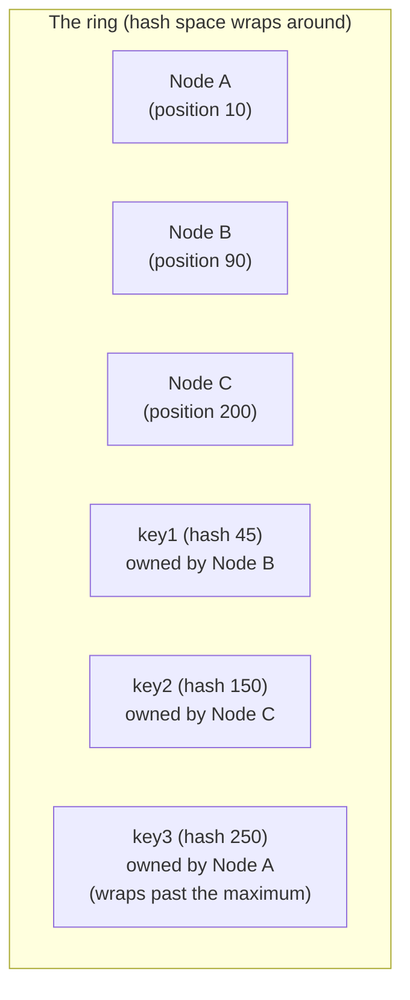

## Learning Objectives

- Explain the specific problem plain modulo hashing (key hash mod N nodes) has when N changes, and quantify how much data has to move.
- Describe how consistent hashing places both nodes and keys on the same ring, and how a key's owning node is determined.
- Explain why consistent hashing bounds the amount of data that moves when a node joins or leaves to roughly the data owned by that node's immediate neighbors on the ring, not the whole dataset.
- Explain the purpose of virtual nodes (multiple ring positions per physical node) and what specific problem they solve that plain consistent hashing alone does not.

## Context & Motivation

Every system studied so far in this discipline, GFS and MapReduce, deals with data that is explicitly split into large, coarse-grained chunks or input splits, and a central master that tracks exactly where each one lives. The next several concepts study a different family of systems, key-value stores like Dynamo, that instead need to partition a huge number of small, individual keys across many machines, without necessarily relying on a single central authority to look up every key's location. This introduces a distinct, foundational problem this concept isolates and solves on its own, before the next two concepts build the rest of Dynamo's design on top of it: given N machines, how should a key be assigned to one of them, in a way that stays reasonably balanced, and that does not require re-shuffling nearly all the data whenever a machine is added or removed, since at Dynamo's target scale, machines joining and leaving is a routine, expected operational event, not a rare one.

The naive approach, computing `hash(key) mod N` and sending the key to that machine, fails specifically at the second requirement, changing N (from a machine joining or leaving) changes the result of the modulo operation for nearly every key, not just the keys that were actually on the affected machine, forcing a nearly complete data reshuffle for what should be a routine, minor cluster change. Consistent hashing, introduced originally for web-caching systems and adopted by Dynamo (among many other partitioned systems) as its core partitioning technique, solves exactly this problem, and understanding it in isolation here makes the rest of Dynamo's design, developed in the next two concepts, considerably easier to follow.

## Core Theory

### Why plain modulo hashing reshuffles almost everything

Consider 4 machines, numbered 0 through 3, and a key assigned to machine `hash(key) mod 4`. Adding a 5th machine changes every single key's assignment to `hash(key) mod 5`, and for the overwhelming majority of keys, the result of `mod 5` differs from the result of `mod 4`, meaning almost every key in the entire dataset must move to a different machine, even though, intuitively, only a small fraction of keys (those that should now belong to the new 5th machine) actually needed to move at all. This is the exact problem that makes plain modulo hashing unusable for a system where nodes join and leave routinely, as they do at Dynamo's operational scale, every node change would trigger a nearly complete, disruptive redistribution of the entire dataset.

### Placing nodes and keys on the same ring

Consistent hashing solves this by mapping both machines and keys into the same hash space, conventionally visualized as a ring (the space simply wraps around from its maximum value back to zero). Each physical machine is hashed (typically using its network address or a unique identifier) to one or more positions on this ring. Each key is also hashed onto the same ring. A key's owning machine is defined as the first machine encountered walking clockwise from the key's position on the ring, in other words, each machine owns the contiguous arc of the ring stretching from the previous machine's position (exclusive) to its own position (inclusive).

The key property this arrangement buys is immediate: when a new machine joins the ring at some position, it only takes over the arc immediately preceding its own position, an arc that previously belonged entirely to whichever machine was the next one clockwise. Every other machine's arc, and therefore every key that machine already owned, is completely unaffected. Symmetrically, when a machine leaves the ring, its entire arc is absorbed by the next machine clockwise, and again, no other machine's arc changes at all. In both cases, the amount of data that needs to move is proportional to the size of the one arc being added or removed, not to the size of the entire dataset, exactly the property plain modulo hashing lacked.

### Virtual nodes: fixing load imbalance from randomly placed points

Placing each physical machine at a single random position on the ring has a real practical weakness: with only a handful of machines, the arcs between them, determined purely by where their random hash positions happen to fall, can end up wildly uneven in size, purely by chance, one machine might get a tiny arc and very little data, while another gets a huge arc and a disproportionate share. Dynamo's answer is to give each physical machine many positions on the ring, called **virtual nodes**, rather than just one, typically dozens to hundreds of virtual nodes per physical machine. Since each physical machine now owns many small, scattered arcs rather than one large contiguous arc, the law of large numbers works in the system's favor, the total data owned by a given physical machine (the sum of all its scattered virtual nodes' arcs) evens out across machines far more reliably than a single random position per machine ever would, and a machine joining or leaving affects many small arcs spread around the ring rather than one large one, spreading the resulting data movement across many other machines instead of concentrating it entirely on whichever single machine happened to be the physical neighbor.

## Worked Examples

### Example 1: tracing a node addition on a small ring

**Problem:** A ring has three machines, X (position 10), Y (position 100), and Z (position 200), on a ring with positions from 0 to 255 (wrapping). Machine W joins at position 150. Determine which machine's data W's arrival actually affects, and which two machines are unaffected.

**Trace:** Before W joins, Y (at position 100) owns the arc from just past X (position 10) up to and including its own position 100, and Z (at position 200) owns the arc from just past Y (position 100) up to and including its own position 200, this second arc is exactly where 150 falls. When W joins at position 150, it takes over the portion of that arc from just past 100 up to and including 150, specifically, the keys that previously belonged to Z and hashed to a position between 101 and 150. Z retains ownership of keys hashing from 151 to 200. X's arc (from just past Z's position 200, wrapping around through 0, up to and including 10) is completely untouched, and Y's arc (from just past X's position 10 up to and including 100) is also completely untouched. Only Z lost data, specifically the portion now owned by W, exactly matching the property that node changes affect only immediate neighbors on the ring, not the whole dataset.

### Example 2: why virtual nodes even out an uneven three-machine ring

**Problem:** With only three machines placed at random single positions, suppose X, Y, and Z happen to land very close together (positions 10, 15, and 20 respectively) on a ring of size 1000. Explain concretely why this is a load-balance problem, and how giving each machine, say, 100 virtual node positions instead of one would address it.

**Resolution:** With single positions at 10, 15, and 20, the arc from just past Z (position 20) wrapping all the way around to X (position 10) spans 990 out of the 1000 total ring positions, meaning X alone would own roughly 99% of all keys, while Y and Z would together own barely 1%, a wildly unbalanced, purely accidental outcome of where their three random positions happened to fall. If, instead, each of the three machines is given 100 virtual node positions, scattered randomly across the same 1000-position ring, each physical machine now owns roughly 100 separate small arcs rather than one arc each, and because there are 300 total virtual-node positions spread across the ring rather than just 3, the arcs are, on average, roughly even in size regardless of the specific random placement of any individual virtual node, the same law of large numbers that makes many small random samples average out more reliably than a few large ones. The physical machines' total data ownership (the sum of each one's roughly 100 scattered arcs) now ends up close to balanced, a direct fix for exactly the imbalance the single-position version suffered from.

## Common Misconceptions & Pitfalls

- **"Consistent hashing means no data ever moves when the cluster changes."** Some data always moves, specifically the data in the arc being transferred to or from the joining or leaving node. The property consistent hashing actually buys is that only that one arc's worth of data moves, not the whole dataset, a bound proportional to roughly 1/N of the data for N machines, not a guarantee of zero movement.
- **"Virtual nodes are a separate technique from consistent hashing, an optional add-on."** Virtual nodes are how consistent hashing is actually deployed in essentially every real system that uses it, including Dynamo; a real deployment with only one ring position per physical machine would suffer the load-imbalance problem Example 2 develops, virtual nodes are the standard, near-universal fix, not an optional extra layered on afterward.
- **"The ring determines a fixed number of machines, like a traditional shard count that requires a re-partitioning migration to change."** The entire motivation for using the ring is the opposite, the number of machines (and virtual node positions) can change at essentially any time, with the ring's structure itself handling the resulting redistribution automatically and proportionally, rather than requiring a discrete, planned re-sharding migration the way a traditional fixed-shard-count system would.

## Summary

Plain modulo hashing (`hash(key) mod N`) reassigns nearly every key whenever N changes, making it unusable for a system where nodes join and leave routinely. Consistent hashing fixes this by mapping both machines and keys onto the same hash ring, with each machine owning the contiguous arc immediately preceding its position, so a machine joining or leaving only moves the one arc directly affected, not the whole dataset, exactly the bound needed at Dynamo's operational scale. Virtual nodes, giving each physical machine many scattered positions on the ring rather than one, fix the load-imbalance that a small number of randomly placed single positions would otherwise suffer from, evening out both steady-state data distribution and the data movement triggered by any single node change. The next two concepts build directly on this ring: Dynamo's replication and quorum design assigns each key not to one machine but to the next several distinct machines walking clockwise from its position, and its conflict-resolution design handles what happens when those replicas disagree.

## Documentation Links

- [DeCandia et al.: Dynamo: Amazon's Highly Available Key-value Store (SOSP 2007)](https://www.allthingsdistributed.com/files/amazon-dynamo-sosp2007.pdf): doc
