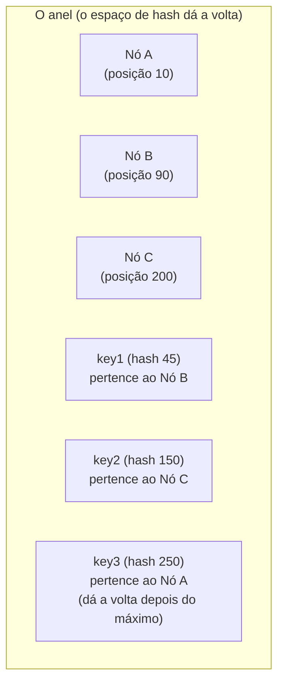

## Objetivos de Aprendizagem

- Explicar o problema específico que o hashing por módulo simples (hash da chave mod N nós) tem quando N muda, e quantificar quantos dados precisam se mover.
- Descrever como o hashing consistente posiciona tanto os nós quanto as chaves no mesmo anel, e como o nó dono de uma chave é determinado.
- Explicar por que o hashing consistente limita a quantidade de dados que se move quando um nó entra ou sai a aproximadamente os dados dos vizinhos imediatos desse nó no anel, e não o conjunto de dados inteiro.
- Explicar o propósito dos nós virtuais (várias posições no anel por nó físico) e qual problema específico eles resolvem que o hashing consistente simples sozinho não resolve.

## Contexto e Motivação

Todo sistema estudado até agora nesta disciplina, o GFS e o MapReduce, lida com dados explicitamente divididos em chunks ou pedaços de entrada grandes e de granularidade grossa, e um master central que acompanha exatamente onde cada um vive. Os próximos conceitos estudam uma família diferente de sistemas, armazenamentos chave-valor como o Dynamo, que em vez disso precisam particionar um número enorme de chaves pequenas e individuais entre muitas máquinas, sem necessariamente depender de uma única autoridade central para consultar a localização de cada chave. Isso introduz um problema distinto e fundamental, que este conceito isola e resolve por si só, antes que os próximos dois conceitos construam o resto do projeto do Dynamo em cima dele: dadas N máquinas, como uma chave deve ser atribuída a uma delas, de um jeito que fique razoavelmente balanceado e que não exija redistribuir quase todos os dados sempre que uma máquina é adicionada ou removida, já que, na escala alvo do Dynamo, máquinas entrando e saindo é um evento operacional rotineiro e esperado, e não raro.

A abordagem ingênua, calcular `hash(key) mod N` e mandar a chave para essa máquina, falha especificamente no segundo requisito: mudar N (por uma máquina entrando ou saindo) muda o resultado da operação de módulo para quase toda chave, e não só para as chaves que de fato estavam na máquina afetada, forçando uma redistribuição de dados quase completa para o que deveria ser uma mudança rotineira e pequena no cluster. O hashing consistente, introduzido originalmente para sistemas de cache web e adotado pelo Dynamo (entre muitos outros sistemas particionados) como a sua técnica central de particionamento, resolve exatamente esse problema, e entendê-lo isoladamente aqui torna o resto do projeto do Dynamo, desenvolvido nos próximos dois conceitos, consideravelmente mais fácil de acompanhar.

## Teoria Central

### Por que o hashing por módulo simples redistribui quase tudo

Considere 4 máquinas, numeradas de 0 a 3, e uma chave atribuída à máquina `hash(key) mod 4`. Adicionar uma 5ª máquina muda a atribuição de toda chave para `hash(key) mod 5` e, para a esmagadora maioria das chaves, o resultado de `mod 5` difere do resultado de `mod 4`, o que significa que quase toda chave do conjunto de dados inteiro precisa se mover para uma máquina diferente, mesmo que, intuitivamente, só uma pequena fração das chaves (as que agora deveriam pertencer à nova 5ª máquina) de fato precisasse se mover. Este é exatamente o problema que torna o hashing por módulo simples inutilizável para um sistema em que nós entram e saem rotineiramente, como acontece na escala operacional do Dynamo: toda mudança de nó dispararia uma redistribuição quase completa e disruptiva do conjunto de dados inteiro.

### Posicionando nós e chaves no mesmo anel

O hashing consistente resolve isso mapeando tanto as máquinas quanto as chaves no mesmo espaço de hash, convencionalmente visualizado como um anel (o espaço simplesmente dá a volta do seu valor máximo de volta ao zero). Cada máquina física passa por hash (normalmente usando o seu endereço de rede ou um identificador único) para uma ou mais posições nesse anel. Cada chave também passa por hash para o mesmo anel. A máquina dona de uma chave é definida como a primeira máquina encontrada ao caminhar no sentido horário a partir da posição da chave no anel. Em outras palavras, cada máquina é dona do arco contíguo do anel que vai da posição da máquina anterior (exclusive) até a sua própria posição (inclusive).

A propriedade-chave que esse arranjo compra é imediata: quando uma máquina nova entra no anel em alguma posição, ela só assume o arco imediatamente anterior à sua própria posição, um arco que antes pertencia inteiramente à máquina que vinha a seguir no sentido horário. O arco de toda outra máquina, e portanto toda chave que essa máquina já possuía, fica completamente inalterado. Simetricamente, quando uma máquina sai do anel, o seu arco inteiro é absorvido pela próxima máquina no sentido horário e, de novo, o arco de nenhuma outra máquina muda. Nos dois casos, a quantidade de dados que precisa se mover é proporcional ao tamanho do único arco sendo adicionado ou removido, e não ao tamanho do conjunto de dados inteiro, exatamente a propriedade que faltava ao hashing por módulo simples.

### Nós virtuais: corrigindo o desbalanceamento de carga de pontos posicionados aleatoriamente

Posicionar cada máquina física numa única posição aleatória do anel tem uma fraqueza prática real: com só um punhado de máquinas, os arcos entre elas, determinados puramente por onde as suas posições de hash aleatórias acabam caindo, podem terminar com tamanhos extremamente desiguais, por puro acaso. Uma máquina pode ficar com um arco minúsculo e pouquíssimos dados, enquanto outra fica com um arco enorme e uma fatia desproporcional. A resposta do Dynamo é dar a cada máquina física muitas posições no anel, chamadas de **nós virtuais**, em vez de só uma, normalmente de dezenas a centenas de nós virtuais por máquina física. Como cada máquina física agora é dona de muitos arcos pequenos e espalhados, em vez de um arco grande e contíguo, a lei dos grandes números trabalha a favor do sistema: o total de dados de uma dada máquina física (a soma dos arcos de todos os seus nós virtuais espalhados) se equilibra entre as máquinas de forma muito mais confiável do que uma única posição aleatória por máquina jamais conseguiria. Além disso, uma máquina entrando ou saindo afeta muitos arcos pequenos espalhados pelo anel, e não um grande, distribuindo a movimentação de dados resultante entre muitas outras máquinas, em vez de concentrá-la inteiramente na única máquina que por acaso era a vizinha física.

## Exemplos Resolvidos

### Exemplo 1: rastreando a adição de um nó num anel pequeno

**Problema:** Um anel tem três máquinas, X (posição 10), Y (posição 100) e Z (posição 200), num anel com posições de 0 a 255 (dando a volta). A máquina W entra na posição 150. Determine os dados de qual máquina a chegada de W de fato afeta, e quais duas máquinas não são afetadas.

**Rastreamento:** Antes de W entrar, Y (na posição 100) é dona do arco que vai de logo depois de X (posição 10) até a sua própria posição 100, inclusive, e Z (na posição 200) é dona do arco que vai de logo depois de Y (posição 100) até a sua própria posição 200, inclusive. É exatamente nesse segundo arco que 150 cai. Quando W entra na posição 150, ela assume a parte desse arco que vai de logo depois de 100 até 150, inclusive: especificamente, as chaves que antes pertenciam a Z e cujo hash caía numa posição de 101 a 150. Z continua dona das chaves com hash de 151 a 200. O arco de X (de logo depois da posição 200 de Z, dando a volta pelo 0, até 10, inclusive) fica completamente intocado, e o arco de Y (de logo depois da posição 10 de X até 100, inclusive) também fica completamente intocado. Só Z perdeu dados, especificamente a parte que agora pertence a W, exatamente de acordo com a propriedade de que mudanças de nó afetam só os vizinhos imediatos no anel, e não o conjunto de dados inteiro.

### Exemplo 2: por que os nós virtuais equilibram um anel desigual de três máquinas

**Problema:** Com só três máquinas posicionadas em posições únicas aleatórias, suponha que X, Y e Z acabem caindo muito perto umas das outras (posições 10, 15 e 20, respectivamente) num anel de tamanho 1.000. Explique concretamente por que isso é um problema de balanceamento de carga, e como dar a cada máquina, digamos, 100 posições de nó virtual em vez de uma resolveria isso.

**Resolução:** Com posições únicas em 10, 15 e 20, o arco que vai de logo depois de Z (posição 20), dando a volta inteira até X (posição 10), cobre 990 das 1.000 posições totais do anel, o que significa que X sozinha seria dona de cerca de 99% de todas as chaves, enquanto Y e Z juntas seriam donas de mal 1%: um resultado extremamente desbalanceado e puramente acidental de onde as suas três posições aleatórias acabaram caindo. Se, em vez disso, cada uma das três máquinas receber 100 posições de nó virtual, espalhadas aleatoriamente pelo mesmo anel de 1.000 posições, cada máquina física passa a ser dona de cerca de 100 arcos pequenos separados, em vez de um arco cada. E como há 300 posições de nó virtual no total espalhadas pelo anel, em vez de só 3, os arcos são, em média, de tamanho aproximadamente igual, independentemente da posição aleatória específica de qualquer nó virtual individual: a mesma lei dos grandes números que faz muitas amostras aleatórias pequenas se equilibrarem de forma mais confiável do que poucas amostras grandes. O total de dados de cada máquina física (a soma dos seus cerca de 100 arcos espalhados) agora fica perto do balanceado, uma correção direta exatamente do desbalanceamento de que a versão com posição única sofria.

## Equívocos Comuns e Armadilhas

- **"Hashing consistente significa que nenhum dado se move quando o cluster muda."** Alguns dados sempre se movem, especificamente os dados do arco que está sendo transferido para o nó que entra ou a partir do nó que sai. A propriedade que o hashing consistente de fato compra é que só os dados desse único arco se movem, e não o conjunto de dados inteiro: um limite proporcional a cerca de 1/N dos dados para N máquinas, e não uma garantia de movimentação zero.
- **"Os nós virtuais são uma técnica separada do hashing consistente, um complemento opcional."** Os nós virtuais são o modo como o hashing consistente é de fato implantado em essencialmente todo sistema real que o usa, incluindo o Dynamo. Uma implantação real com só uma posição no anel por máquina física sofreria o problema de desbalanceamento de carga que o Exemplo 2 desenvolve; os nós virtuais são a correção padrão e quase universal, e não um extra opcional colocado por cima depois.
- **"O anel determina um número fixo de máquinas, como uma contagem tradicional de shards que exige uma migração de reparticionamento para mudar."** Toda a motivação para usar o anel é o oposto: o número de máquinas (e de posições de nó virtual) pode mudar a essencialmente qualquer momento, com a própria estrutura do anel tratando a redistribuição resultante de forma automática e proporcional, em vez de exigir uma migração de re-sharding discreta e planejada, como um sistema tradicional com contagem fixa de shards exigiria.

## Resumo

O hashing por módulo simples (`hash(key) mod N`) reatribui quase toda chave sempre que N muda, tornando-o inutilizável para um sistema em que nós entram e saem rotineiramente. O hashing consistente corrige isso mapeando tanto as máquinas quanto as chaves no mesmo anel de hash, com cada máquina sendo dona do arco contíguo imediatamente anterior à sua posição, de modo que uma máquina entrando ou saindo só move o único arco diretamente afetado, e não o conjunto de dados inteiro, exatamente o limite necessário na escala operacional do Dynamo. Os nós virtuais, que dão a cada máquina física muitas posições espalhadas no anel em vez de uma, corrigem o desbalanceamento de carga de que um pequeno número de posições únicas aleatórias sofreria de outro modo, equilibrando tanto a distribuição de dados em regime permanente quanto a movimentação de dados disparada por qualquer mudança individual de nó. Os próximos dois conceitos constroem diretamente sobre este anel: o projeto de replicação e quórum do Dynamo atribui cada chave não a uma máquina, mas às próximas várias máquinas distintas no sentido horário a partir da sua posição, e o seu projeto de resolução de conflitos trata do que acontece quando essas réplicas discordam.

## Documentation Links

- [DeCandia et al.: Dynamo: Amazon's Highly Available Key-value Store (SOSP 2007)](https://www.allthingsdistributed.com/files/amazon-dynamo-sosp2007.pdf): doc
