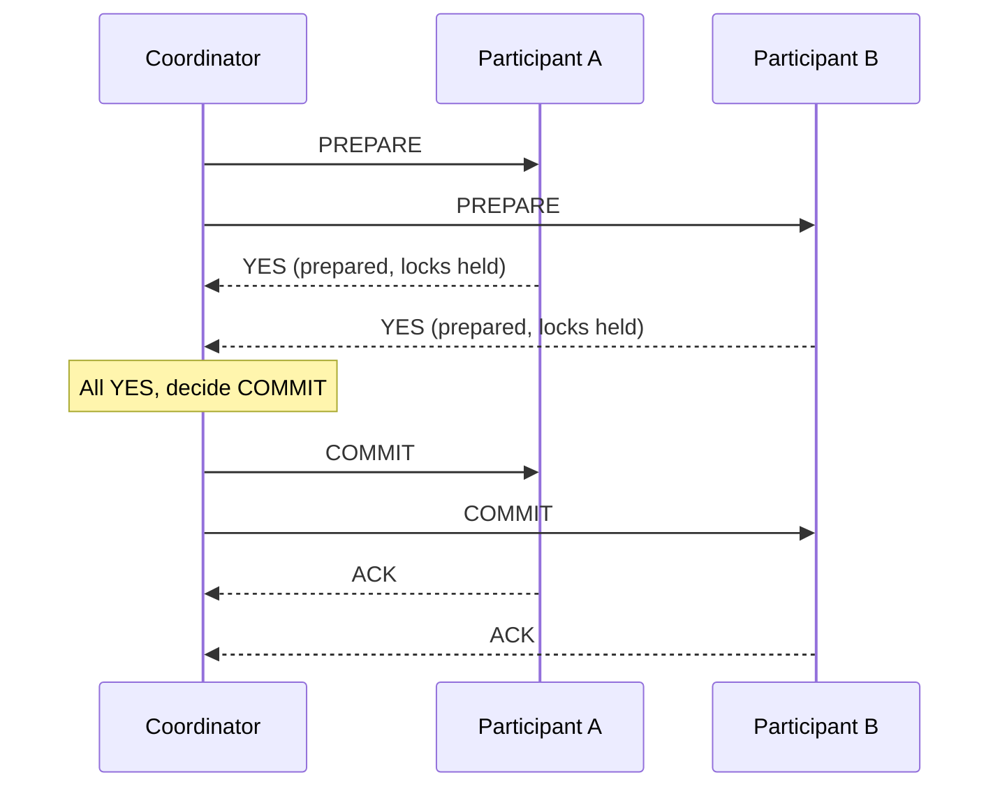

## Learning Objectives

- State the problem two-phase commit solves: making a transaction spanning multiple independent partitions commit or abort atomically everywhere, or nowhere.
- Trace both phases of two-phase commit precisely: the coordinator's prepare (vote) phase and its commit (or abort) phase, including what each participant does in each phase.
- Explain exactly why a participant that has voted "prepared" and then loses contact with the coordinator is stuck, unable to safely either commit or abort on its own, and why this is called the protocol's blocking problem.
- Contrast this distributed, multi-partition version of atomicity with the single-node ACID atomicity this platform's `database-systems` discipline already covers, and explain what is genuinely new here.

## Context & Motivation

Every system studied so far in this discipline, GFS, MapReduce, Dynamo, Bigtable, ZooKeeper, deals with data or coordination state that lives, for any single logical operation, within one clearly defined scope, a single chunk, a single key's set of replicas, a single znode. A materially harder problem appears the moment a single logical transaction needs to touch data that is partitioned across multiple, independent machines or shards, for example, moving money from an account stored on partition A to an account stored on partition B, where the transaction must either take effect on both partitions or on neither, an interrupted transfer that debits A but never credits B is a real, damaging failure, not a mere inconvenience.

This is a genuinely different problem from the single-node ACID atomicity this platform's core `database-systems` discipline already develops (using write-ahead logging and crash recovery to make a single node's own transaction atomic despite that node's own crash). Here, the challenge is coordinating atomicity *across* multiple independent nodes, each of which might individually be following its own correct, single-node ACID discipline, but which have no inherent way to agree with each other about whether a transaction spanning both of them should be kept or discarded. **Two-phase commit** (2PC) is the classic protocol answering exactly this question, and it is worth studying both for its own sake, since a version of it appears inside several real systems (including, as the next two concepts develop, inside Chain Replication's failure handling and Spanner's cross-shard transactions), and for its one well-known, serious weakness, which is precisely what motivates some of the more sophisticated designs studied later in this discipline.

## Core Theory

### The two phases, precisely

Two-phase commit involves one **coordinator** (the node initiating the transaction, or a designated node acting on the client's behalf) and several **participants** (the nodes holding the actual data the transaction touches, one per partition involved). The protocol proceeds in exactly two phases:

**Phase 1: Prepare (voting).** The coordinator sends a `PREPARE` message to every participant, asking each one whether it is able to commit its portion of the transaction. Each participant performs whatever local work is needed to be certain it *could* commit if asked to (acquiring the necessary locks, writing its own local, single-node write-ahead log entry recording its intended change, in exactly the sense this platform's `database-systems` discipline already develops for single-node durability), and replies either `YES` (I am prepared, and guarantee I can commit if instructed) or `NO` (I cannot commit this transaction, for any reason, a constraint violation, a lock conflict, insufficient resources).

**Phase 2: Commit or abort.** If the coordinator receives `YES` from every single participant, it decides to commit, and sends a `COMMIT` message to every participant, each of which then makes its already-prepared change durable and permanent. If the coordinator receives even one `NO` (or a timeout waiting for some participant's vote), it decides to abort, and sends an `ABORT` message to every participant instead, each of which discards its prepared change and releases the locks it was holding for it.

The critical property this buys, and the reason the protocol is structured as two separate phases rather than one, is that no participant commits its change until it already knows, via the coordinator's phase-2 decision, that every other participant is also guaranteed able to commit; a participant's phase-1 `YES` vote is a durable promise ("I will be able to commit if told to, no matter what"), not the commit itself, which is precisely what makes it safe for the coordinator to wait and collect every vote before making one single, atomic, all-or-nothing decision.

### The blocking problem: a prepared participant that loses the coordinator

The protocol has one well-known, serious weakness, directly visible once a specific failure timing is considered. Suppose a participant has voted `YES` in phase 1 (it is now prepared, holding its locks and its durable local log entry, genuinely able to commit or abort, waiting only to be told which), and then, before the coordinator's phase-2 decision message arrives, the coordinator itself crashes, or the network between the coordinator and this participant fails. The participant is now stuck: it cannot safely commit on its own (the coordinator might have received a `NO` from some other participant and decided to abort, in which case this participant committing anyway would violate atomicity), and it equally cannot safely abort on its own (the coordinator might have received `YES` from every participant and already decided to commit, told some other participants to commit, and simply not yet reached this one, in which case this participant aborting would just as badly violate atomicity). The only genuinely safe thing this participant can do is wait, continuing to hold its locks, until it can somehow learn the coordinator's actual decision, whether that means the coordinator recovers, or some other, separate recovery mechanism (outside plain two-phase commit itself) is used to determine the decision. This is exactly why the protocol is described as **blocking**: a single coordinator failure at precisely this moment can leave a participant holding locks, and therefore blocking other transactions that need those same locks, indefinitely, until the coordinator's fate is somehow resolved.

### Contrast with single-node ACID atomicity

This platform's `database-systems` discipline already develops how a single node achieves atomicity despite its own crash, using write-ahead logging: before a change is made durable, its intent is logged, and on restart after a crash, the log is replayed to redo committed work and undo uncommitted work, all within one node's own local view of its own log. Two-phase commit is solving a strictly harder version of the same underlying goal (all-or-nothing effect) but across multiple independent nodes, none of which has visibility into any other's local log, and where the actual point of "did this transaction happen" cannot be determined by consulting any single node's log alone, it depends on the coordinator's phase-2 decision, a single fact that must somehow be communicated to, and durably respected by, every participant. This is precisely the coordination problem single-node ACID logging does not need to solve, since a single node's log is, by definition, the sole authority on that node's own state.

## Worked Examples

### Example 1: tracing a successful cross-partition funds transfer

**Problem:** A transfer moves 50 units from an account on partition A to an account on partition B. Trace two-phase commit through to a successful commit.

**Trace:** The coordinator sends `PREPARE` to A and to B. Participant A checks that the source account has sufficient balance, acquires a lock on that account row, writes a local log entry recording "debit 50, pending," and replies `YES`. Participant B similarly acquires a lock on the destination account, writes a local log entry recording "credit 50, pending," and replies `YES`. Having received `YES` from both, the coordinator decides to commit, and sends `COMMIT` to both A and B. A applies the debit permanently and releases its lock; B applies the credit permanently and releases its lock. Both partitions now durably reflect the transfer, and neither one committed until both had already guaranteed, in phase 1, that they were able to.

### Example 2: tracing the blocking problem concretely, with a specific failure timing

**Problem:** Using the same transfer as Example 1, suppose both A and B vote `YES` in phase 1, but the coordinator crashes immediately afterward, before sending `COMMIT` or `ABORT` to either participant. Trace what state A and B are left in, and explain precisely why neither can safely resolve the situation on its own.

**Trace:** Both A and B are now in the "prepared" state: each is holding its lock on the relevant account row, and each has a durable local log entry recording its own half of the pending transaction, but neither has received the coordinator's actual decision. Participant A cannot simply decide to commit on its own, since it has no way to know whether B also voted `YES` (if B had instead voted `NO`, or never responded at all, the correct decision would have been to abort, and A committing anyway would leave the source account debited with no corresponding credit ever applied at B, a lost 50 units). A equally cannot simply decide to abort on its own, since, for all A knows, B also voted `YES`, and the coordinator, before crashing, might already have decided to commit and might already have told B to commit, in which case A aborting would leave B credited with no corresponding debit at A, an extra 50 units created from nothing. Both participants are therefore stuck holding their locks, unable to safely proceed in either direction, until the coordinator recovers and can tell them its actual decision (which it must itself have durably recorded before crashing, precisely so it can answer this question correctly once it comes back), or until some other, separate mechanism is used to resolve the outcome. This concrete stuck state, on both participants simultaneously, is exactly what the blocking problem refers to.

## Common Misconceptions & Pitfalls

- **"A participant voting YES in phase 1 has already committed its part of the transaction."** A `YES` vote is a durable promise to be able to commit if instructed, not the commit itself; the actual change only becomes permanent in phase 2, after the coordinator's decision arrives. This distinction is exactly what makes Example 2's stuck state possible in the first place, a participant can be fully prepared, with everything in place to commit, and still correctly not have committed yet.
- **"The blocking problem means two-phase commit is simply broken and should never be used."** The protocol correctly guarantees atomicity (it never lets some participants commit while others abort the same transaction) whenever the coordinator eventually does recover and deliver its decision; the blocking problem is specifically about availability during the window a coordinator is down, not about correctness being violated. Real systems that need atomicity across partitions but also want to avoid this specific availability weakness typically layer additional mechanisms, such as replicating the coordinator's own decision using a consensus protocol, on top of the basic two-phase commit structure developed here, exactly the kind of composition Spanner, studied later in this discipline, actually uses.
- **"Two-phase commit and single-node write-ahead logging solve unrelated problems."** They solve structurally related but genuinely distinct problems: WAL makes one node's own transaction durable and atomic despite that one node's own crash, using only that node's own log; two-phase commit makes a transaction spanning multiple independent nodes atomic despite any individual node's or the coordinator's crash, and depends on each participant's own local WAL-style durability (recording its prepared state) as one necessary ingredient, but adds an entirely new layer of cross-node coordination on top that single-node WAL alone does not, and cannot, provide.

## Summary

Two-phase commit coordinates a transaction spanning multiple independent partitions so that it commits everywhere or aborts everywhere, never a mix of both. In phase 1, a coordinator asks every participant to prepare (durably promise it can commit) and collects a vote from each; in phase 2, the coordinator decides to commit only if every vote was `YES`, and communicates that single decision to every participant, who then either finalizes or discards its prepared change accordingly. The protocol's well-known weakness is blocking: a participant that has voted `YES` and then loses contact with the coordinator before receiving its decision cannot safely commit or abort on its own, since either choice risks violating atomicity if the coordinator's actual decision turns out to have gone the other way, and must instead wait, holding its locks, until the coordinator's fate is somehow resolved. This is a genuinely harder problem than the single-node ACID atomicity this platform's `database-systems` discipline already covers, since no single participant's own log is sufficient authority on whether the overall, cross-partition transaction actually happened. The next two concepts study, respectively, an alternative replication design that sidesteps needing a separate commit-coordination step for ordinary writes (Chain Replication), and a real system, Spanner, that builds cross-shard transactions on top of exactly this two-phase-commit structure while addressing its blocking weakness using consensus-replicated coordinators.

## Documentation Links

- [Saltzer, Kaashoek: Principles of Computer System Design, Ch. 9 (Atomicity), MIT OCW](https://ocw.mit.edu/courses/res-6-004-principles-of-computer-system-design-an-introduction-spring-2009/de2b7c59e413f58e51eac60acd52efef_atomicity_open_5_0.pdf): doc
