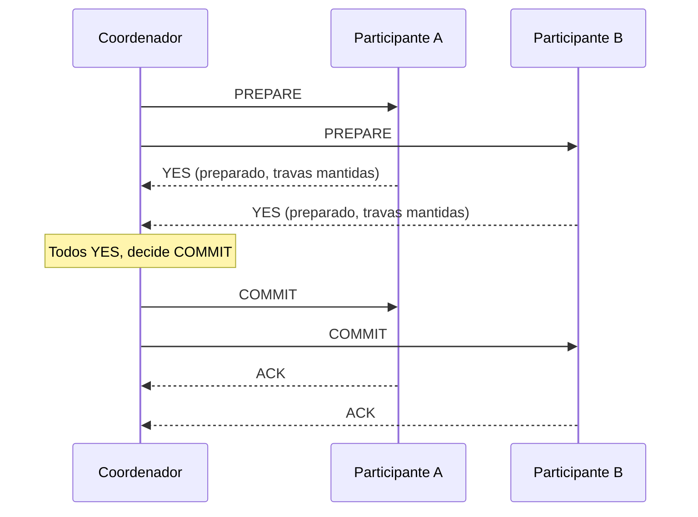

## Objetivos de Aprendizagem

- Enunciar o problema que o two-phase commit (confirmação em duas fases) resolve: fazer uma transação que abrange várias partições independentes confirmar ou abortar atomicamente em todo lugar, ou em lugar nenhum.
- Rastrear as duas fases do two-phase commit com precisão: a fase de preparação (votação) do coordenador e a sua fase de commit (ou de abort), incluindo o que cada participante faz em cada fase.
- Explicar exatamente por que um participante que votou "preparado" e então perde contato com o coordenador fica preso, incapaz de confirmar ou abortar com segurança por conta própria, e por que isso é chamado de problema de bloqueio do protocolo.
- Contrastar esta versão distribuída, de múltiplas partições, da atomicidade com a atomicidade ACID de um único nó que a disciplina `database-systems` desta plataforma já cobre, e explicar o que é genuinamente novo aqui.

## Contexto e Motivação

Todo sistema estudado até agora nesta disciplina (GFS, MapReduce, Dynamo, Bigtable, ZooKeeper) lida com dados ou estado de coordenação que vive, para qualquer operação lógica individual, dentro de um escopo claramente definido: um único chunk, o conjunto de réplicas de uma única chave, um único znode. Um problema substancialmente mais difícil aparece no momento em que uma única transação lógica precisa tocar dados particionados em várias máquinas ou shards independentes. Por exemplo, mover dinheiro de uma conta guardada na partição A para uma conta guardada na partição B, em que a transação precisa ter efeito nas duas partições ou em nenhuma: uma transferência interrompida que debita A mas nunca credita B é uma falha real e danosa, e não um mero inconveniente.

Este é um problema genuinamente diferente da atomicidade ACID de um único nó que a disciplina central `database-systems` desta plataforma já desenvolve (usando write-ahead logging e recuperação de travamentos para tornar atômica a transação de um único nó apesar do travamento desse próprio nó). Aqui, o desafio é coordenar a atomicidade *entre* vários nós independentes, cada um dos quais pode estar seguindo individualmente a sua própria disciplina ACID de nó único, correta, mas que não têm nenhum jeito inerente de concordar entre si sobre se uma transação que abrange os dois deve ser mantida ou descartada. O **two-phase commit** (2PC) é o protocolo clássico que responde exatamente a essa pergunta, e vale a pena estudá-lo tanto por si só, já que uma versão dele aparece dentro de vários sistemas reais (incluindo, como os próximos dois conceitos desenvolvem, no tratamento de falhas do Chain Replication e nas transações entre shards do Spanner), quanto pela sua única fraqueza séria e bem conhecida, que é precisamente o que motiva alguns dos projetos mais sofisticados estudados mais adiante nesta disciplina.

## Teoria Central

### As duas fases, com precisão

O two-phase commit envolve um **coordenador** (o nó que inicia a transação, ou um nó designado agindo em nome do cliente) e vários **participantes** (os nós que guardam os dados reais que a transação toca, um por partição envolvida). O protocolo prossegue em exatamente duas fases:

**Fase 1: Preparação (votação).** O coordenador envia uma mensagem `PREPARE` a cada participante, perguntando a cada um se ele é capaz de confirmar a sua parte da transação. Cada participante realiza qualquer trabalho local necessário para ter certeza de que *poderia* confirmar se lhe pedissem (adquirindo as travas necessárias, escrevendo a sua própria entrada de write-ahead log local, de nó único, que registra a mudança pretendida, exatamente no sentido que a disciplina `database-systems` desta plataforma já desenvolve para a durabilidade de um único nó), e responde `YES` (estou preparado, e garanto que consigo confirmar se instruído) ou `NO` (não consigo confirmar esta transação, por qualquer razão: uma violação de restrição, um conflito de travas, recursos insuficientes).

**Fase 2: Commit ou abort.** Se o coordenador recebe `YES` de todos os participantes, ele decide confirmar e envia uma mensagem `COMMIT` a cada participante, e cada um então torna durável e permanente a sua mudança já preparada. Se o coordenador recebe ao menos um `NO` (ou um timeout esperando o voto de algum participante), ele decide abortar e, em vez disso, envia uma mensagem `ABORT` a cada participante, e cada um descarta a sua mudança preparada e libera as travas que estava segurando para ela.

A propriedade crítica que isso compra, e a razão pela qual o protocolo é estruturado como duas fases separadas em vez de uma, é que nenhum participante confirma a sua mudança até já saber, pela decisão da fase 2 do coordenador, que todos os outros participantes também têm garantia de conseguir confirmar. O voto `YES` de um participante na fase 1 é uma promessa durável ("vou conseguir confirmar se me mandarem, aconteça o que acontecer"), e não o commit em si, e é precisamente isso que torna seguro para o coordenador esperar e coletar todos os votos antes de tomar uma única decisão atômica, de tudo ou nada.

### O problema de bloqueio: um participante preparado que perde o coordenador

O protocolo tem uma fraqueza séria e bem conhecida, diretamente visível quando se considera um momento específico de falha. Suponha que um participante tenha votado `YES` na fase 1 (agora ele está preparado, segurando as suas travas e a sua entrada de log local durável, genuinamente capaz de confirmar ou abortar, esperando só que lhe digam qual) e então, antes que a mensagem de decisão da fase 2 do coordenador chegue, o próprio coordenador trave, ou a rede entre o coordenador e este participante falhe. O participante agora está preso. Ele não pode confirmar com segurança por conta própria (o coordenador pode ter recebido um `NO` de algum outro participante e decidido abortar, caso em que este participante confirmar mesmo assim violaria a atomicidade), e igualmente não pode abortar com segurança por conta própria (o coordenador pode ter recebido `YES` de todos os participantes e já decidido confirmar, mandado alguns outros participantes confirmarem e simplesmente ainda não ter chegado a este, caso em que este participante abortar violaria a atomicidade da mesma forma). A única coisa genuinamente segura que este participante pode fazer é esperar, continuando a segurar as suas travas, até conseguir de algum jeito descobrir a decisão real do coordenador, seja porque o coordenador se recuperou, seja porque algum outro mecanismo de recuperação separado (fora do two-phase commit puro) foi usado para determinar a decisão. É exatamente por isso que o protocolo é descrito como **bloqueante**: uma única falha do coordenador precisamente nesse momento pode deixar um participante segurando travas, e portanto bloqueando outras transações que precisam dessas mesmas travas, indefinidamente, até que o destino do coordenador seja resolvido de algum jeito.

### Contraste com a atomicidade ACID de um único nó

A disciplina `database-systems` desta plataforma já desenvolve como um único nó alcança a atomicidade apesar do seu próprio travamento, usando write-ahead logging: antes que uma mudança se torne durável, a sua intenção é registrada no log e, na reinicialização depois de um travamento, o log é reproduzido para refazer o trabalho confirmado e desfazer o trabalho não confirmado, tudo dentro da visão local que um nó tem do seu próprio log. O two-phase commit resolve uma versão estritamente mais difícil do mesmo objetivo subjacente (efeito de tudo ou nada), mas entre vários nós independentes, nenhum dos quais tem visibilidade do log local de qualquer outro, e em que o ponto real de "esta transação aconteceu?" não pode ser determinado consultando o log de um único nó: ele depende da decisão da fase 2 do coordenador, um único fato que precisa de algum jeito ser comunicado a cada participante, e respeitado de forma durável por cada um. Este é precisamente o problema de coordenação que o logging ACID de um único nó não precisa resolver, já que o log de um único nó é, por definição, a única autoridade sobre o estado desse próprio nó.

## Exemplos Resolvidos

### Exemplo 1: rastreando uma transferência de fundos entre partições bem-sucedida

**Problema:** Uma transferência move 50 unidades de uma conta na partição A para uma conta na partição B. Rastreie o two-phase commit até um commit bem-sucedido.

**Rastreamento:** O coordenador envia `PREPARE` para A e para B. O participante A verifica que a conta de origem tem saldo suficiente, adquire uma trava na linha dessa conta, escreve uma entrada de log local registrando "débito de 50, pendente" e responde `YES`. O participante B, de forma semelhante, adquire uma trava na conta de destino, escreve uma entrada de log local registrando "crédito de 50, pendente" e responde `YES`. Tendo recebido `YES` dos dois, o coordenador decide confirmar e envia `COMMIT` para A e para B. A aplica o débito permanentemente e libera a sua trava; B aplica o crédito permanentemente e libera a sua trava. As duas partições agora refletem a transferência de forma durável, e nenhuma delas confirmou até que as duas já tivessem garantido, na fase 1, que eram capazes disso.

### Exemplo 2: rastreando o problema de bloqueio concretamente, com um momento de falha específico

**Problema:** Usando a mesma transferência do Exemplo 1, suponha que A e B votem `YES` na fase 1, mas o coordenador trave imediatamente depois, antes de enviar `COMMIT` ou `ABORT` a qualquer um dos participantes. Rastreie em que estado A e B ficam, e explique com precisão por que nenhum deles consegue resolver a situação com segurança por conta própria.

**Rastreamento:** A e B estão agora no estado "preparado": cada um está segurando a sua trava na linha de conta relevante, e cada um tem uma entrada de log local durável registrando a sua própria metade da transação pendente, mas nenhum recebeu a decisão real do coordenador. O participante A não pode simplesmente decidir confirmar por conta própria, já que não tem como saber se B também votou `YES` (se B tivesse votado `NO`, ou nunca tivesse respondido, a decisão correta teria sido abortar, e A confirmar mesmo assim deixaria a conta de origem debitada sem nenhum crédito correspondente jamais aplicado em B, 50 unidades perdidas). A igualmente não pode simplesmente decidir abortar por conta própria, já que, até onde A sabe, B também votou `YES`, e o coordenador, antes de travar, pode já ter decidido confirmar e já ter mandado B confirmar, caso em que A abortar deixaria B creditado sem nenhum débito correspondente em A, 50 unidades extras criadas do nada. Os dois participantes ficam, portanto, presos segurando as suas travas, incapazes de prosseguir com segurança em qualquer direção, até que o coordenador se recupere e possa lhes dizer a sua decisão real (que ele próprio precisa ter registrado de forma durável antes de travar, precisamente para conseguir responder a essa pergunta corretamente quando voltar), ou até que algum outro mecanismo separado seja usado para resolver o resultado. Esse estado concreto de travamento, nos dois participantes ao mesmo tempo, é exatamente o que o problema de bloqueio designa.

## Equívocos Comuns e Armadilhas

- **"Um participante que vota YES na fase 1 já confirmou a sua parte da transação."** Um voto `YES` é uma promessa durável de conseguir confirmar se instruído, e não o commit em si; a mudança real só se torna permanente na fase 2, depois que a decisão do coordenador chega. Essa distinção é exatamente o que torna possível o estado de travamento do Exemplo 2, para começo de conversa: um participante pode estar totalmente preparado, com tudo pronto para confirmar, e ainda assim, corretamente, não ter confirmado.
- **"O problema de bloqueio significa que o two-phase commit está simplesmente quebrado e nunca deveria ser usado."** O protocolo garante corretamente a atomicidade (ele nunca deixa alguns participantes confirmarem enquanto outros abortam a mesma transação) sempre que o coordenador eventualmente se recupera e entrega a sua decisão; o problema de bloqueio diz respeito especificamente à disponibilidade durante a janela em que um coordenador está fora do ar, e não à violação da corretude. Sistemas reais que precisam de atomicidade entre partições, mas também querem evitar essa fraqueza específica de disponibilidade, normalmente colocam mecanismos adicionais, como replicar a própria decisão do coordenador usando um protocolo de consenso, por cima da estrutura básica de two-phase commit desenvolvida aqui, exatamente o tipo de composição que o Spanner, estudado mais adiante nesta disciplina, de fato usa.
- **"O two-phase commit e o write-ahead logging de um único nó resolvem problemas sem relação."** Eles resolvem problemas estruturalmente relacionados, mas genuinamente distintos. O WAL torna a transação de um nó durável e atômica apesar do travamento desse próprio nó, usando só o log desse nó; o two-phase commit torna atômica uma transação que abrange vários nós independentes apesar do travamento de qualquer nó individual ou do coordenador, e depende da durabilidade local, no estilo WAL, de cada participante (registrando o seu estado preparado) como um ingrediente necessário, mas acrescenta por cima uma camada inteiramente nova de coordenação entre nós que o WAL de um único nó sozinho não oferece, nem pode oferecer.

## Resumo

O two-phase commit coordena uma transação que abrange várias partições independentes para que ela confirme em todo lugar ou aborte em todo lugar, nunca uma mistura das duas coisas. Na fase 1, um coordenador pede a cada participante que se prepare (prometa de forma durável que consegue confirmar) e coleta um voto de cada um; na fase 2, o coordenador decide confirmar só se todos os votos foram `YES`, e comunica essa única decisão a cada participante, que então finaliza ou descarta a sua mudança preparada de acordo. A fraqueza bem conhecida do protocolo é o bloqueio: um participante que votou `YES` e então perde contato com o coordenador antes de receber a sua decisão não consegue confirmar nem abortar com segurança por conta própria, já que qualquer escolha arrisca violar a atomicidade se a decisão real do coordenador tiver ido para o outro lado, e precisa, em vez disso, esperar, segurando as suas travas, até que o destino do coordenador seja resolvido de algum jeito. Este é um problema genuinamente mais difícil do que a atomicidade ACID de um único nó que a disciplina `database-systems` desta plataforma já cobre, já que o log de nenhum participante isolado é autoridade suficiente sobre se a transação geral, entre partições, de fato aconteceu. Os próximos dois conceitos estudam, respectivamente, um projeto de replicação alternativo que evita precisar de um passo separado de coordenação de commit para escritas comuns (Chain Replication), e um sistema real, o Spanner, que constrói transações entre shards exatamente sobre esta estrutura de two-phase commit, tratando a sua fraqueza de bloqueio com coordenadores replicados por consenso.

## Documentation Links

- [Saltzer, Kaashoek: Principles of Computer System Design, Ch. 9 (Atomicity), MIT OCW](https://ocw.mit.edu/courses/res-6-004-principles-of-computer-system-design-an-introduction-spring-2009/de2b7c59e413f58e51eac60acd52efef_atomicity_open_5_0.pdf): doc
