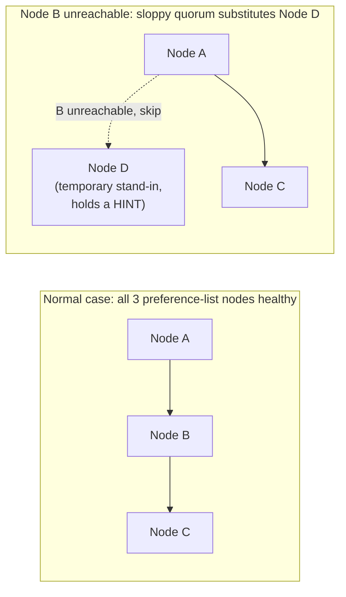

## Learning Objectives

- Define Dynamo's N, R, and W parameters and explain what property W plus R greater than N is intended to buy, and under what condition it actually holds.
- Explain the specific problem a strict quorum has when a designated replica is temporarily unreachable, and how a sloppy quorum avoids it.
- Trace hinted handoff: what a temporary stand-in node does with a hinted write, and what happens once the original, intended node comes back.
- State explicitly which one of the two axes from this discipline's opening concept, consistency versus availability, Dynamo's sloppy quorum design chooses, and why.

## Context & Motivation

The previous concept developed consistent hashing purely as a partitioning technique, assigning each key to a position on a ring and determining ownership by walking clockwise, without yet addressing replication or availability at all. Amazon's Dynamo, the system this concept and the next develop in full, was built for a specific, concrete requirement stated directly in its own paper: shopping cart and similar services at Amazon's scale must always accept a write, a customer adding an item to their cart cannot be told "please try again later" just because one particular server is briefly unreachable, since a lost or delayed write directly costs a completed purchase. This concept develops exactly how Dynamo achieves that "always accept a write" property, deliberately choosing availability over the alternative a strict quorum system would provide, precisely the trade-off named on the discipline's first axis, consistency versus availability under a partition.

## Core Theory

### N, R, and W: the replication and quorum parameters

Dynamo replicates each key to N distinct nodes (a configurable parameter; the paper's examples typically use N=3), determined by walking clockwise from the key's position on the consistent hashing ring and taking the first N distinct physical machines encountered, this ordered list of N nodes is called the key's **preference list**. A read operation is considered successful once R of these N replicas have responded (R is also configurable, and can be smaller than N), and a write is considered successful once W replicas have acknowledged it (again, configurable, and also not required to equal N).

The classic quorum intuition, and the reason systems commonly choose R plus W greater than N, is that any set of R replicas that answered a read and any set of W replicas that acknowledged a prior write must then overlap in at least one replica, guaranteeing the read sees at least one copy of the most recent write, provided reads and writes are always sent to a fixed, correct set of N replicas. Dynamo's own default configuration in the paper (N=3, R=2, W=2) satisfies R plus W greater than N (2 plus 2 is greater than 3). The next section, and the concept after this one, develop exactly why this overlap guarantee turns out to be weaker in Dynamo than it sounds, because of the specific mechanism, sloppy quorums, that this concept now introduces.

### The problem a strict quorum creates, and the sloppy quorum fix

A strict quorum insists that R or W must be satisfied specifically by the designated preference-list nodes, and nothing else. This creates exactly the availability problem Dynamo was built to avoid: if one of a key's three preference-list nodes is briefly unreachable (a network blip, a garbage-collection pause, a machine being rebooted for routine maintenance), a strict-quorum write requiring W=2 acknowledgments out of that specific set of 3 might still succeed (2 of the remaining 2 reachable nodes can still acknowledge), but the system's tolerance for a second, simultaneous unavailable node is now completely gone, and further, a strict-quorum system will typically refuse a write outright once it cannot reach enough of the specifically designated preference-list nodes, exactly the "please try again later" answer Dynamo's shopping cart requirement rules out.

Dynamo's fix is what its paper calls a **sloppy quorum**: rather than insisting on exactly the top N nodes of the preference list, a read or write is sent to, and considered successful based on responses from, the first N *healthy* nodes encountered while walking the preference list, skipping over any node that is currently known to be unreachable and continuing further down the ring to find a healthy substitute. This means a write can succeed, using its full W acknowledgments, even when one or more of the key's usual preference-list nodes are temporarily down, because a different, healthy node further along the ring simply stands in for the unreachable one.

### Hinted handoff: what the stand-in node does, and how the hint gets home

When a healthy node stands in for an unreachable preference-list node, as above, it stores the write data together with a **hint**, metadata recording which node this write was actually intended for. The stand-in node continues to serve as a temporary home for that data, and periodically attempts to contact the originally intended node; once that node becomes reachable again, the stand-in transfers the hinted data to it and, once the transfer is confirmed, can delete its own temporary copy. This is what lets the sloppy quorum's borrowed availability eventually resolve back into the system's normal, ring-determined replica placement, rather than leaving replicated data permanently scattered on whatever nodes happened to be healthy at write time.

## Worked Examples

### Example 1: tracing a write during a brief network partition

**Problem:** Key `k`'s preference list is [Node A, Node B, Node C] (N=3), with W=2 required for a successful write. Node B is temporarily unreachable due to a brief network issue, and a client writes a new value for `k`. Trace what Dynamo does, using sloppy quorum and hinted handoff.

**Trace:** Dynamo's coordinator attempts to send the write to A, B, and C. B does not respond within the timeout, so the coordinator continues walking the ring past C to find the next healthy node, say Node D. The write is sent to A, D (standing in for B, with a hint recording "this data belongs to B"), and C. A and C acknowledge normally. D also acknowledges, but stores the write together with the hint. Once 2 acknowledgments arrive (say, from A and C, or from A and D, whichever two respond first), the write is considered successful and the client receives a success response, even though B, one of the key's actual designated replicas, never received this write at all during this exchange. Later, once B recovers and becomes reachable, D detects this (via periodic retry) and hands off the hinted data to B, after which D can discard its temporary copy, at that point, the system is back to A, B, and C actually holding the write, matching the key's normal preference list.

### Example 2: what a strict quorum would have done differently in the same scenario

**Problem:** Using the same scenario as Example 1 (B unreachable, W=2 required), explain what a strict-quorum system (one that only counts acknowledgments from the designated preference-list nodes A, B, and C, with no substitution) would do, and why this illustrates Dynamo's explicit choice on the discipline's consistency-versus-availability axis.

**Resolution:** A strict-quorum system would attempt the write against exactly A, B, and C, and since B is unreachable, only A and C can possibly acknowledge, if both do, W=2 is technically still satisfiable in this specific case; but the system's effective fault tolerance for this write has dropped from tolerating any 1 of 3 nodes failing to tolerating 0 further failures, and if either A or C had also been briefly slow or unreachable at the same moment, the write would have failed outright, returned as an error to the client, exactly the "please try again later" outcome Dynamo's real requirement (a shopping cart write must always succeed) rules out. Dynamo's sloppy quorum sidesteps this entirely by substituting D for B, restoring the full W=2-out-of-3-healthy-nodes tolerance rather than degrading to 2-out-of-2 the moment any single designated node becomes briefly unreachable. This is a direct, concrete instance of Dynamo choosing availability over the stricter form of consistency a fixed-replica-set quorum would have provided, exactly the trade this discipline's opening concept named as Dynamo's defining choice on its first axis.

## Common Misconceptions & Pitfalls

- **"R plus W greater than N guarantees a read always sees the most recent write, the same way it would in a strict quorum system."** This classic guarantee assumes reads and writes are always satisfied by the same fixed set of N nodes. Because sloppy quorums allow a write's W acknowledgments to come from temporary stand-in nodes (as in Example 1) rather than strictly the preference list's designated nodes, a subsequent read satisfied by R of the *original* preference-list nodes can miss a write that is, for the moment, only durably held by a hinted stand-in node that has not yet handed its data off. Dynamo trades away the strict version of this guarantee specifically to buy the availability sloppy quorums provide, this is developed further, together with how Dynamo detects and resolves the resulting conflicts, in the next concept.
- **"A hinted stand-in node is a permanent additional replica, increasing the effective replication factor."** A hinted stand-in is explicitly temporary and is expected to hand its data off to the originally intended node once that node recovers, after which the stand-in can discard its copy. It is a mechanism for absorbing a temporary unavailability, not a permanent increase to the key's actual replica count.
- **"Sloppy quorums only matter during a full network partition splitting the cluster in two."** The mechanism activates any time even a single node on a key's preference list happens to be unreachable or slow, at Dynamo's target scale this happens constantly for mundane reasons (a machine undergoing routine maintenance, a brief garbage-collection pause, a transient network blip), not only during a dramatic, cluster-splitting partition event.

## Summary

Dynamo replicates each key to N nodes determined by its position on the consistent hashing ring (its preference list), and considers a read or write successful once R or W of those replicas respond, respectively. Rather than requiring R and W to be satisfied strictly by the designated preference-list nodes, which would force a write to fail outright whenever a single designated node is briefly unreachable, Dynamo uses a sloppy quorum: any healthy node further along the ring can temporarily stand in for an unreachable one, storing the write together with a hint recording its intended destination, and handing that data off once the intended node recovers, a mechanism called hinted handoff. This restores full write availability even during transient node unavailability, at the direct cost of weakening the classic quorum-overlap guarantee that a read is certain to see the latest write, a deliberate, explicit choice of availability over that stronger form of consistency, exactly matching Dynamo's target workload of an always-must-succeed shopping cart write. The next concept develops what happens when this weakened guarantee actually surfaces a real conflict, two clients' concurrent writes producing genuinely divergent versions that some later read must reconcile.

## Documentation Links

- [DeCandia et al.: Dynamo: Amazon's Highly Available Key-value Store (SOSP 2007)](https://www.allthingsdistributed.com/files/amazon-dynamo-sosp2007.pdf): doc
