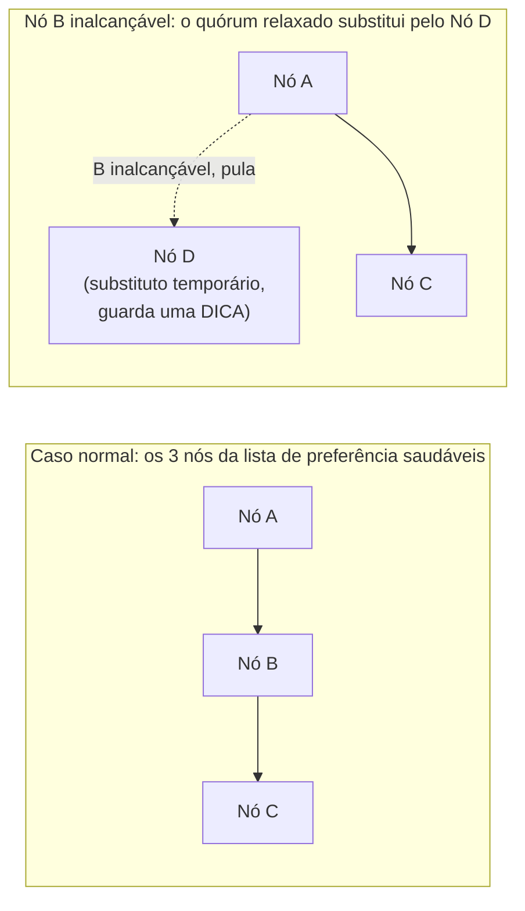

## Objetivos de Aprendizagem

- Definir os parâmetros N, R e W do Dynamo e explicar qual propriedade W mais R maior que N pretende comprar, e sob qual condição ela de fato vale.
- Explicar o problema específico que um quórum estrito tem quando uma réplica designada está temporariamente inalcançável, e como um quórum relaxado o evita.
- Rastrear o hinted handoff: o que um nó substituto temporário faz com uma escrita com dica, e o que acontece quando o nó original, o pretendido, volta.
- Enunciar explicitamente qual dos dois eixos do conceito de abertura desta disciplina, consistência versus disponibilidade, o projeto de quórum relaxado do Dynamo escolhe, e por quê.

## Contexto e Motivação

O conceito anterior desenvolveu o hashing consistente puramente como uma técnica de particionamento, atribuindo cada chave a uma posição num anel e determinando a posse caminhando no sentido horário, ainda sem tratar de replicação nem de disponibilidade. O Dynamo da Amazon, o sistema que este conceito e o próximo desenvolvem por completo, foi construído para um requisito específico e concreto, enunciado diretamente no seu próprio artigo: o carrinho de compras e serviços semelhantes na escala da Amazon precisam sempre aceitar uma escrita. Um cliente que adiciona um item ao carrinho não pode ouvir "por favor, tente de novo mais tarde" só porque um servidor específico está brevemente inalcançável, já que uma escrita perdida ou atrasada custa diretamente uma compra concluída. Este conceito desenvolve exatamente como o Dynamo alcança essa propriedade de "sempre aceitar uma escrita", escolhendo deliberadamente a disponibilidade em vez da alternativa que um sistema de quórum estrito ofereceria, precisamente o trade-off nomeado no primeiro eixo da disciplina, consistência versus disponibilidade sob uma partição.

## Teoria Central

### N, R e W: os parâmetros de replicação e quórum

O Dynamo replica cada chave em N nós distintos (um parâmetro configurável; os exemplos do artigo normalmente usam N=3), determinados ao caminhar no sentido horário a partir da posição da chave no anel de hashing consistente e pegar as primeiras N máquinas físicas distintas encontradas. Essa lista ordenada de N nós é chamada de **lista de preferência** da chave. Uma operação de leitura é considerada bem-sucedida quando R dessas N réplicas responderam (R também é configurável, e pode ser menor que N), e uma escrita é considerada bem-sucedida quando W réplicas a confirmaram (de novo, configurável, e também sem obrigação de ser igual a N).

A intuição clássica de quórum, e a razão pela qual os sistemas costumam escolher R mais W maior que N, é que qualquer conjunto de R réplicas que respondeu a uma leitura e qualquer conjunto de W réplicas que confirmou uma escrita anterior precisam então se sobrepor em pelo menos uma réplica, garantindo que a leitura veja pelo menos uma cópia da escrita mais recente, desde que leituras e escritas sejam sempre enviadas a um conjunto fixo e correto de N réplicas. A própria configuração padrão do Dynamo no artigo (N=3, R=2, W=2) satisfaz R mais W maior que N (2 mais 2 é maior que 3). A próxima seção, e o conceito depois deste, desenvolvem exatamente por que essa garantia de sobreposição acaba sendo mais fraca no Dynamo do que parece, por causa do mecanismo específico, os quóruns relaxados, que este conceito agora introduz.

### O problema que um quórum estrito cria, e a correção do quórum relaxado

Um quórum estrito insiste que R ou W sejam satisfeitos especificamente pelos nós designados da lista de preferência, e por nada mais. Isso cria exatamente o problema de disponibilidade que o Dynamo foi construído para evitar: se um dos três nós da lista de preferência de uma chave está brevemente inalcançável (uma oscilação de rede, uma pausa de coleta de lixo, uma máquina sendo reiniciada para manutenção de rotina), uma escrita de quórum estrito que exige W=2 confirmações daquele conjunto específico de 3 ainda pode ter sucesso (os 2 nós alcançáveis restantes ainda podem confirmar), mas a tolerância do sistema a um segundo nó indisponível ao mesmo tempo some por completo. Além disso, um sistema de quórum estrito normalmente recusa uma escrita de cara quando não consegue alcançar nós suficientes da lista de preferência especificamente designada, exatamente a resposta "por favor, tente de novo mais tarde" que o requisito do carrinho de compras do Dynamo descarta.

A correção do Dynamo é o que o seu artigo chama de **sloppy quorum** (quórum relaxado): em vez de insistir exatamente nos N primeiros nós da lista de preferência, uma leitura ou escrita é enviada aos primeiros N nós *saudáveis* encontrados ao percorrer a lista de preferência, e considerada bem-sucedida com base nas respostas deles, pulando qualquer nó atualmente conhecido como inalcançável e continuando adiante no anel para encontrar um substituto saudável. Isso significa que uma escrita pode ter sucesso, usando as suas W confirmações completas, mesmo quando um ou mais dos nós usuais da lista de preferência da chave estão temporariamente fora do ar, porque um nó diferente e saudável mais adiante no anel simplesmente substitui o inalcançável.

### Hinted handoff: o que o nó substituto faz, e como a dica volta para casa

Quando um nó saudável substitui um nó inalcançável da lista de preferência, como acima, ele armazena os dados da escrita junto com uma **dica** (hint), metadados que registram para qual nó essa escrita de fato se destinava. O nó substituto continua servindo como lar temporário desses dados e tenta periodicamente contatar o nó originalmente pretendido; quando esse nó fica alcançável de novo, o substituto transfere a ele os dados com dica e, uma vez confirmada a transferência, pode apagar a sua própria cópia temporária. É isso que permite que a disponibilidade emprestada do quórum relaxado eventualmente se resolva de volta no posicionamento normal de réplicas do sistema, determinado pelo anel, em vez de deixar dados replicados espalhados permanentemente pelos nós que por acaso estavam saudáveis no momento da escrita.

## Exemplos Resolvidos

### Exemplo 1: rastreando uma escrita durante uma breve partição de rede

**Problema:** A lista de preferência da chave `k` é [Nó A, Nó B, Nó C] (N=3), com W=2 exigido para uma escrita bem-sucedida. O Nó B está temporariamente inalcançável por causa de um breve problema de rede, e um cliente escreve um valor novo para `k`. Rastreie o que o Dynamo faz, usando quórum relaxado e hinted handoff.

**Rastreamento:** O coordenador do Dynamo tenta enviar a escrita para A, B e C. B não responde dentro do timeout, então o coordenador continua percorrendo o anel depois de C para encontrar o próximo nó saudável, digamos o Nó D. A escrita é enviada para A, para D (substituindo B, com uma dica registrando "estes dados pertencem a B") e para C. A e C confirmam normalmente. D também confirma, mas armazena a escrita junto com a dica. Quando chegam 2 confirmações (digamos, de A e C, ou de A e D, quaisquer dois que respondam primeiro), a escrita é considerada bem-sucedida e o cliente recebe uma resposta de sucesso, mesmo que B, uma das réplicas de fato designadas da chave, nunca tenha recebido esta escrita durante essa troca. Mais tarde, quando B se recupera e fica alcançável, D detecta isso (via novas tentativas periódicas) e repassa os dados com dica para B, depois do que D pode descartar a sua cópia temporária. A essa altura, o sistema volta a ter A, B e C de fato guardando a escrita, de acordo com a lista de preferência normal da chave.

### Exemplo 2: o que um quórum estrito teria feito de diferente no mesmo cenário

**Problema:** Usando o mesmo cenário do Exemplo 1 (B inalcançável, W=2 exigido), explique o que um sistema de quórum estrito (um que só conta confirmações dos nós designados da lista de preferência, A, B e C, sem substituição) faria, e por que isso ilustra a escolha explícita do Dynamo no eixo de consistência versus disponibilidade da disciplina.

**Resolução:** Um sistema de quórum estrito tentaria a escrita exatamente em A, B e C e, como B está inalcançável, só A e C poderiam confirmar. Se os dois confirmarem, W=2 ainda é tecnicamente satisfazível neste caso específico; mas a tolerância a falhas efetiva do sistema para esta escrita caiu de tolerar a falha de qualquer 1 de 3 nós para tolerar 0 falhas adicionais e, se A ou C também estivesse brevemente lento ou inalcançável no mesmo momento, a escrita teria falhado de cara, devolvida como erro ao cliente, exatamente o resultado "por favor, tente de novo mais tarde" que o requisito real do Dynamo (uma escrita no carrinho de compras precisa sempre ter sucesso) descarta. O quórum relaxado do Dynamo contorna isso por completo substituindo B por D, restaurando a tolerância completa de W=2 de 3 nós saudáveis, em vez de degradar para 2 de 2 no momento em que qualquer nó designado fica brevemente inalcançável. Esta é uma instância direta e concreta de o Dynamo escolher a disponibilidade em vez da forma mais estrita de consistência que um quórum com conjunto fixo de réplicas teria oferecido, exatamente o trade-off que o conceito de abertura desta disciplina nomeou como a escolha definidora do Dynamo no seu primeiro eixo.

## Equívocos Comuns e Armadilhas

- **"R mais W maior que N garante que uma leitura sempre veja a escrita mais recente, do mesmo jeito que garantiria num sistema de quórum estrito."** Essa garantia clássica assume que leituras e escritas são sempre satisfeitas pelo mesmo conjunto fixo de N nós. Como os quóruns relaxados permitem que as W confirmações de uma escrita venham de nós substitutos temporários (como no Exemplo 1), e não estritamente dos nós designados da lista de preferência, uma leitura subsequente satisfeita por R dos nós *originais* da lista de preferência pode deixar de ver uma escrita que, no momento, só está guardada de forma durável por um nó substituto com dica que ainda não repassou os seus dados. O Dynamo abre mão da versão estrita dessa garantia especificamente para comprar a disponibilidade que os quóruns relaxados oferecem; isso é desenvolvido mais a fundo, junto com o modo como o Dynamo detecta e resolve os conflitos resultantes, no próximo conceito.
- **"Um nó substituto com dica é uma réplica adicional permanente, aumentando o fator de replicação efetivo."** Um substituto com dica é explicitamente temporário e deve repassar os seus dados ao nó originalmente pretendido quando esse nó se recuperar, depois do que o substituto pode descartar a sua cópia. É um mecanismo para absorver uma indisponibilidade temporária, e não um aumento permanente do número real de réplicas da chave.
- **"Os quóruns relaxados só importam durante uma partição de rede completa que divide o cluster em dois."** O mecanismo é ativado sempre que mesmo um único nó da lista de preferência de uma chave estiver inalcançável ou lento. Na escala alvo do Dynamo, isso acontece o tempo todo por razões banais (uma máquina passando por manutenção de rotina, uma breve pausa de coleta de lixo, uma oscilação transitória de rede), e não só durante um evento dramático de partição que divide o cluster.

## Resumo

O Dynamo replica cada chave em N nós determinados pela sua posição no anel de hashing consistente (a sua lista de preferência), e considera uma leitura ou escrita bem-sucedida quando R ou W dessas réplicas respondem, respectivamente. Em vez de exigir que R e W sejam satisfeitos estritamente pelos nós designados da lista de preferência, o que forçaria uma escrita a falhar de cara sempre que um único nó designado estivesse brevemente inalcançável, o Dynamo usa um quórum relaxado: qualquer nó saudável mais adiante no anel pode substituir temporariamente um inalcançável, armazenando a escrita junto com uma dica que registra o seu destino pretendido e repassando esses dados quando o nó pretendido se recuperar, um mecanismo chamado hinted handoff. Isso restaura a disponibilidade completa de escrita mesmo durante indisponibilidades transitórias de nós, ao custo direto de enfraquecer a garantia clássica de sobreposição de quórum de que uma leitura com certeza verá a escrita mais recente: uma escolha deliberada e explícita da disponibilidade em vez dessa forma mais forte de consistência, exatamente de acordo com a carga de trabalho alvo do Dynamo, uma escrita de carrinho de compras que sempre precisa ter sucesso. O próximo conceito desenvolve o que acontece quando essa garantia enfraquecida de fato faz surgir um conflito real: as escritas concorrentes de dois clientes produzindo versões genuinamente divergentes que alguma leitura posterior precisa reconciliar.

## Documentation Links

- [DeCandia et al.: Dynamo: Amazon's Highly Available Key-value Store (SOSP 2007)](https://www.allthingsdistributed.com/files/amazon-dynamo-sosp2007.pdf): doc
