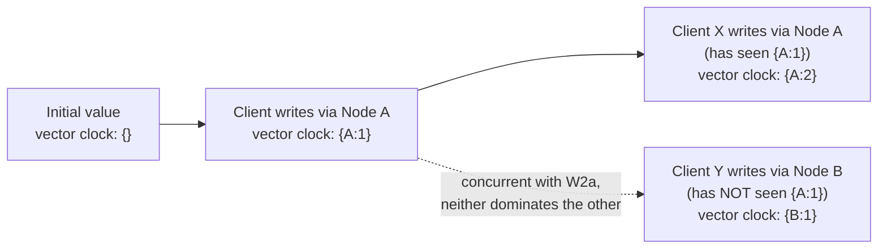

## Learning Objectives

- Explain concretely how a sloppy quorum can let two clients write the same key concurrently without either one seeing the other's write.
- Define a vector clock as Dynamo uses it, and explain what comparing two vector clocks can determine: that one write causally preceded another, or that they are genuinely concurrent.
- Explain what Dynamo does when a read discovers multiple, causally concurrent versions of a value, and why it hands the conflict to the application rather than resolving it silently.
- Contrast Dynamo's approach (surface the conflict) with a system that instead uses "last write wins" by physical timestamp, and explain the specific correctness problem last-write-wins has.

## Context & Motivation

The previous concept ended by naming the specific cost of sloppy quorums: a read satisfied by the original preference-list nodes can miss a write that briefly landed only on a hinted stand-in, and this concept develops what actually happens when that gap surfaces as a real, user-visible conflict. Because Dynamo lets a write succeed as soon as W nodes acknowledge it, using whichever nodes happen to be healthy at that moment, two clients can write to the same key at nearly the same time and each get back a success response, without either client's write path ever including a node that has already seen the other client's write. Both versions are now live, replicated to some overlapping or non-overlapping set of nodes, and Dynamo needs a principled way to describe this situation precisely, and a policy for what to do about it, rather than silently and arbitrarily picking one version and discarding the other.

Dynamo's answer is to be honest about the situation rather than hide it: attach enough metadata to every version of a value that a reader can determine, precisely, whether one version causally followed another (in which case the later one safely supersedes it) or whether two versions are genuinely concurrent, meaning neither one is derived from the other and Dynamo itself has no principled basis for picking a winner. In the second case, Dynamo returns both versions to the application and lets it decide how to merge them, an explicit, deliberate refusal to guess on Dynamo's part, matched to its target workload (the paper's own example is a shopping cart, where the correct merge of two concurrent versions is usually the union of both carts' items, a domain-specific rule only the application layer actually knows).

## Core Theory

### Vector clocks: recording causal history, not physical time

A **vector clock**, as Dynamo uses the term, is a list of (node, counter) pairs attached to every version of a stored value. Whenever a node handles a write to a key, it increments its own counter in that key's vector clock (creating an entry for itself if none existed yet) and stores the updated vector clock alongside the new value. Comparing two vector clocks, call them V1 and V2, tells you one of exactly two things: either V1's counters are all less than or equal to V2's corresponding counters (and at least one is strictly less), meaning V1 causally precedes V2, the write that produced V2 happened with knowledge of the write that produced V1, so V2 can safely be treated as superseding V1; or neither vector clock dominates the other this way (V1 has a higher counter for some node while V2 has a higher counter for a different node), meaning the two writes are **concurrent**, neither happened with knowledge of the other, and there is no causally correct way to say one supersedes the other.

This is a strictly more precise tool than a physical timestamp for exactly the reason a physical clock cannot provide: a timestamp only records *when* a write happened according to some (possibly skewed, possibly unsynchronized) clock, while a vector clock records *what causal history that write is aware of*, which is the actual question that matters when deciding whether one version can safely be discarded in favor of another.

### What a read does when it finds concurrent versions

Because sloppy quorums (previous concept) mean a read's R responding nodes might not include every node that has seen every write, a read can genuinely encounter multiple different versions of the same key, each with its own vector clock. The read compares every pair of returned vector clocks: any version whose vector clock is causally dominated by another returned version is simply discarded (it is known to be stale, safely superseded). What remains after this filtering, potentially more than one version, are versions Dynamo has determined are genuinely concurrent, with no causal ordering between them, and Dynamo returns all of them to the requesting application, rather than picking one arbitrarily. The application is then responsible for producing a single, merged value (using whatever domain-specific logic is correct for that data, such as unioning cart contents), and writing that merged value back, which itself becomes a new version whose vector clock reflects that it descends from, and therefore supersedes, all the concurrent versions it merged.

### Contrast: last-write-wins by physical timestamp

An alternative, simpler policy some systems use is "last write wins," comparing physical wall-clock timestamps attached to each version and keeping only the one with the latest timestamp, discarding the other entirely and silently. This avoids ever bothering the application with a conflict, but it has a specific, serious correctness problem this discipline can now state precisely: physical clocks across different machines are never perfectly synchronized (a fact this discipline's foundational theory already established when covering physical clock drift), so "latest timestamp" can easily disagree with "actually happened later" or "was aware of the other write," and worse, last-write-wins actively discards data, a client's legitimate concurrent write can simply vanish because its timestamp happened to be a few milliseconds earlier due to nothing more than clock skew between two machines, with no signal to the application, and no opportunity to merge, that this ever happened.

## Worked Examples

### Example 1: tracing two concurrent shopping cart writes to a conflict

**Problem:** A shopping cart starts empty (vector clock `{}`). Client X, whose write is coordinated by Node A, adds item "book" (vector clock becomes `{A:1}`). Later, without either client having seen the other's most recent state, Client Y (also coordinated by Node A, but working from the same `{A:1}` version Client X started from, before X's write propagated back to Y) adds item "pen," and, separately, Client X, working from its own already-updated `{A:1}` version, adds a second item "pencil." Determine the vector clocks of the two resulting versions and whether Dynamo will detect them as concurrent.

**Trace:** Client X's second write starts from vector clock `{A:1}` (its own prior write) and, coordinated again by Node A, produces `{A:2}`, holding cart contents `["book", "pencil"]`. Client Y's write also starts from `{A:1}` (the version it read, before X's second write existed) but happens to be coordinated by a different node this time, say Node B (perhaps because A was momentarily part of a sloppy-quorum substitution, or simply because requests are not pinned to one coordinator), producing vector clock `{A:1, B:1}`, holding cart contents `["book", "pen"]`. Comparing `{A:2}` to `{A:1, B:1}`: neither dominates the other (`{A:2}` has a higher A-counter, but no B entry at all, while `{A:1, B:1}` has a B-counter that `{A:2}` lacks entirely), so Dynamo correctly identifies these as concurrent versions, not one superseding the other, and a subsequent read will receive both `["book", "pencil"]` and `["book", "pen"]` back, for the application to merge.

### Example 2: merging the conflict, and why last-write-wins would have silently lost data here

**Problem:** Using the two concurrent cart versions from Example 1, describe the merge the application should perform, and then explain concretely what a last-write-wins policy would have done instead, and what would have been lost.

**Resolution:** The application-level merge for a shopping cart is a union of items: combining `["book", "pencil"]` and `["book", "pen"]` gives `["book", "pencil", "pen"]` (with "book," present in both, included once), correctly preserving every item either client actually added. This merged version is then written back with a new vector clock, say `{A:3, B:1}`, that causally dominates both `{A:2}` and `{A:1, B:1}`, so future reads correctly treat it as superseding both prior concurrent versions rather than triggering the conflict again. A last-write-wins policy, by contrast, would compare only the two versions' physical timestamps and keep whichever one happened to have the later clock reading, discarding the other entirely, if Client Y's write to Node B happened to be timestamped a few milliseconds after Client X's write to Node A (regardless of which one a person would say "really" happened first, or regardless of clock skew between A and B), the system would silently keep only `["book", "pen"]` and permanently lose the "pencil" item Client X added, with no error, no conflict signal, and no opportunity for the application to notice or recover the lost data.

## Common Misconceptions & Pitfalls

- **"Vector clocks tell you which write happened later in real time."** They tell you about causal awareness, not physical time, a version's vector clock reflects what causal history the writer had already seen, not what a wall clock would have shown. Two writes can be vector-clock-concurrent even if one genuinely happened a few seconds after the other in real time, precisely because the later writer never actually saw the earlier write before producing its own, exactly the scenario Example 1 traces.
- **"Concurrent versions are a bug or a sign of data corruption."** They are an expected, correctly detected consequence of the availability Dynamo's sloppy quorums deliberately provide, developed in the previous concept, not a malfunction. Dynamo's vector clock mechanism is specifically what lets it detect this situation precisely and hand it to the application, rather than either crashing or silently corrupting data.
- **"Handing conflicts to the application is a design weakness Dynamo should have avoided by picking a smarter automatic merge rule."** A domain-agnostic system genuinely cannot know the correct merge semantics for arbitrary data, unioning items is correct for a shopping cart, but would be nonsensical for, say, a single account balance, where a completely different reconciliation rule would be needed. Dynamo's choice to surface the conflict, rather than guess, is precisely what avoids the silent, arbitrary data loss last-write-wins produces, developed in Example 2.

## Summary

Because Dynamo's sloppy quorums let writes succeed via different, possibly non-overlapping sets of nodes, two clients can write the same key concurrently without either seeing the other's write, producing genuinely divergent versions. Dynamo tags every version with a vector clock, a per-node counter recording causal awareness rather than physical time, and comparing two vector clocks determines precisely whether one causally supersedes the other or whether they are truly concurrent. When a read finds concurrent versions, Dynamo discards any that are causally superseded but returns every remaining, genuinely concurrent version to the application, rather than guessing at a merge, since only the application knows the domain-correct way to reconcile them (such as unioning a shopping cart's items). This is a deliberate, honest alternative to a simpler last-write-wins-by-timestamp policy, which would instead silently and permanently discard one of two concurrent writes based on possibly skewed physical clocks, with no signal to the application that data was ever lost.

## Documentation Links

- [DeCandia et al.: Dynamo: Amazon's Highly Available Key-value Store (SOSP 2007)](https://www.allthingsdistributed.com/files/amazon-dynamo-sosp2007.pdf): doc
