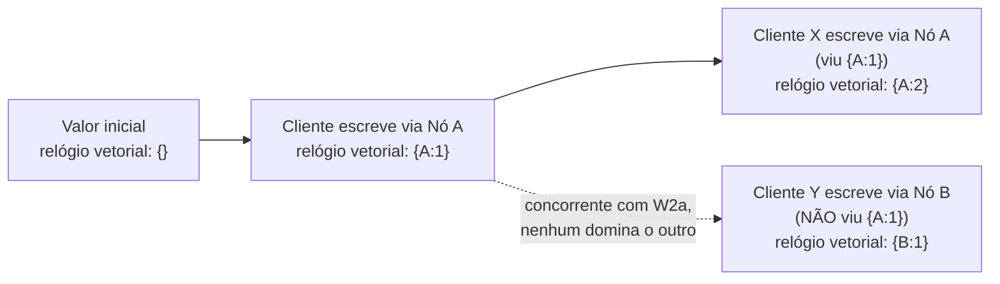

## Objetivos de Aprendizagem

- Explicar concretamente como um quórum relaxado pode permitir que dois clientes escrevam a mesma chave de forma concorrente sem que nenhum deles veja a escrita do outro.
- Definir um relógio vetorial do jeito que o Dynamo o usa, e explicar o que comparar dois relógios vetoriais consegue determinar: que uma escrita precedeu causalmente outra, ou que elas são genuinamente concorrentes.
- Explicar o que o Dynamo faz quando uma leitura descobre várias versões causalmente concorrentes de um valor, e por que ele entrega o conflito à aplicação em vez de resolvê-lo silenciosamente.
- Contrastar a abordagem do Dynamo (expor o conflito) com a de um sistema que, em vez disso, usa "a última escrita vence" por timestamp físico, e explicar o problema de corretude específico que a política de última escrita vence tem.

## Contexto e Motivação

O conceito anterior terminou nomeando o custo específico dos quóruns relaxados: uma leitura satisfeita pelos nós originais da lista de preferência pode deixar de ver uma escrita que caiu brevemente só num substituto com dica, e este conceito desenvolve o que de fato acontece quando essa lacuna aparece como um conflito real, visível ao usuário. Como o Dynamo deixa uma escrita ter sucesso assim que W nós a confirmam, usando quaisquer nós que por acaso estejam saudáveis naquele momento, dois clientes podem escrever na mesma chave quase ao mesmo tempo e cada um receber uma resposta de sucesso, sem que o caminho de escrita de nenhum dos clientes inclua um nó que já tenha visto a escrita do outro cliente. As duas versões agora estão vivas, replicadas em algum conjunto de nós que pode ou não se sobrepor, e o Dynamo precisa de um jeito fundamentado de descrever essa situação com precisão, e de uma política para o que fazer a respeito, em vez de escolher silenciosa e arbitrariamente uma versão e descartar a outra.

A resposta do Dynamo é ser honesto sobre a situação em vez de escondê-la: anexar a toda versão de um valor metadados suficientes para que um leitor consiga determinar, com precisão, se uma versão seguiu causalmente outra (caso em que a posterior a substitui com segurança) ou se duas versões são genuinamente concorrentes, o que significa que nenhuma deriva da outra e o próprio Dynamo não tem nenhuma base fundamentada para escolher uma vencedora. No segundo caso, o Dynamo devolve as duas versões à aplicação e a deixa decidir como mesclá-las: uma recusa explícita e deliberada de adivinhar por parte do Dynamo, ajustada à sua carga de trabalho alvo (o próprio exemplo do artigo é um carrinho de compras, onde a mescla correta de duas versões concorrentes geralmente é a união dos itens dos dois carrinhos, uma regra específica do domínio que só a camada de aplicação de fato conhece).

## Teoria Central

### Relógios vetoriais: registrando a história causal, e não o tempo físico

Um **relógio vetorial**, no sentido em que o Dynamo usa o termo, é uma lista de pares (nó, contador) anexada a toda versão de um valor armazenado. Sempre que um nó trata uma escrita numa chave, ele incrementa o seu próprio contador no relógio vetorial daquela chave (criando uma entrada para si mesmo se ainda não existia) e armazena o relógio vetorial atualizado junto com o valor novo. Comparar dois relógios vetoriais, chame-os de V1 e V2, diz uma de exatamente duas coisas. Ou todos os contadores de V1 são menores ou iguais aos contadores correspondentes de V2 (e pelo menos um é estritamente menor), o que significa que V1 precede causalmente V2: a escrita que produziu V2 aconteceu com conhecimento da escrita que produziu V1, então V2 pode ser tratado com segurança como substituto de V1. Ou nenhum relógio vetorial domina o outro desse jeito (V1 tem um contador maior para algum nó enquanto V2 tem um contador maior para um nó diferente), o que significa que as duas escritas são **concorrentes**: nenhuma aconteceu com conhecimento da outra, e não há nenhum jeito causalmente correto de dizer que uma substitui a outra.

Esta é uma ferramenta estritamente mais precisa do que um timestamp físico, exatamente pela razão que um relógio físico não consegue oferecer: um timestamp só registra *quando* uma escrita aconteceu segundo algum relógio (possivelmente desviado, possivelmente não sincronizado), enquanto um relógio vetorial registra *de qual história causal aquela escrita tem conhecimento*, que é a pergunta que de fato importa ao decidir se uma versão pode ser descartada com segurança em favor de outra.

### O que uma leitura faz quando encontra versões concorrentes

Como os quóruns relaxados (conceito anterior) significam que os R nós que respondem a uma leitura podem não incluir todo nó que viu toda escrita, uma leitura pode genuinamente encontrar várias versões diferentes da mesma chave, cada uma com o seu próprio relógio vetorial. A leitura compara cada par de relógios vetoriais devolvidos: qualquer versão cujo relógio vetorial seja causalmente dominado por outra versão devolvida é simplesmente descartada (sabe-se que está desatualizada, substituída com segurança). O que resta depois dessa filtragem, potencialmente mais de uma versão, são versões que o Dynamo determinou serem genuinamente concorrentes, sem ordem causal entre elas, e o Dynamo devolve todas elas à aplicação solicitante, em vez de escolher uma arbitrariamente. A aplicação é então responsável por produzir um único valor mesclado (usando qualquer lógica específica do domínio que seja correta para aqueles dados, como unir o conteúdo de carrinhos) e escrever esse valor mesclado de volta, que se torna ele mesmo uma versão nova cujo relógio vetorial reflete que ela descende de, e portanto substitui, todas as versões concorrentes que mesclou.

### Contraste: última escrita vence por timestamp físico

Uma política alternativa e mais simples que alguns sistemas usam é "a última escrita vence" (last write wins): comparar os timestamps físicos de relógio de parede anexados a cada versão e manter só a que tem o timestamp mais recente, descartando a outra por inteiro e silenciosamente. Isso evita incomodar a aplicação com um conflito, mas tem um problema de corretude específico e sério que esta disciplina agora consegue enunciar com precisão. Os relógios físicos de máquinas diferentes nunca estão perfeitamente sincronizados (um fato que a teoria fundamental desta disciplina já estabeleceu ao cobrir o desvio de relógios físicos), então "timestamp mais recente" pode facilmente discordar de "de fato aconteceu depois" ou de "tinha conhecimento da outra escrita". Pior, a política de última escrita vence descarta dados ativamente: a escrita concorrente legítima de um cliente pode simplesmente desaparecer porque o seu timestamp acabou ficando alguns milissegundos mais cedo por nada além do desvio de relógio entre duas máquinas, sem nenhum sinal para a aplicação, e sem nenhuma oportunidade de mescla, de que isso aconteceu.

## Exemplos Resolvidos

### Exemplo 1: rastreando duas escritas concorrentes num carrinho de compras até um conflito

**Problema:** Um carrinho de compras começa vazio (relógio vetorial `{}`). O Cliente X, cuja escrita é coordenada pelo Nó A, adiciona o item "book" (o relógio vetorial vira `{A:1}`). Depois, sem que nenhum dos clientes tenha visto o estado mais recente do outro, o Cliente Y (trabalhando a partir da mesma versão `{A:1}` de onde o Cliente X partiu, antes de a escrita seguinte de X se propagar até Y) adiciona o item "pen" e, separadamente, o Cliente X, trabalhando a partir da sua própria versão `{A:1}` já atualizada, adiciona um segundo item, "pencil". Determine os relógios vetoriais das duas versões resultantes e se o Dynamo vai detectá-las como concorrentes.

**Rastreamento:** A segunda escrita do Cliente X parte do relógio vetorial `{A:1}` (a sua própria escrita anterior) e, coordenada de novo pelo Nó A, produz `{A:2}`, guardando o conteúdo de carrinho `["book", "pencil"]`. A escrita do Cliente Y também parte de `{A:1}` (a versão que ele leu, antes de a segunda escrita de X existir), mas desta vez acaba sendo coordenada por um nó diferente, digamos o Nó B (talvez porque A estava momentaneamente envolvido numa substituição de quórum relaxado, ou simplesmente porque as requisições não ficam presas a um coordenador), produzindo o relógio vetorial `{A:1, B:1}`, com o conteúdo de carrinho `["book", "pen"]`. Comparando `{A:2}` com `{A:1, B:1}`: nenhum domina o outro (`{A:2}` tem um contador de A maior, mas nenhuma entrada de B, enquanto `{A:1, B:1}` tem um contador de B que falta por completo em `{A:2}`). Então o Dynamo identifica corretamente essas versões como concorrentes, e não uma substituindo a outra, e uma leitura subsequente vai receber de volta tanto `["book", "pencil"]` quanto `["book", "pen"]`, para a aplicação mesclar.

### Exemplo 2: mesclando o conflito, e por que a política de última escrita vence teria perdido dados silenciosamente aqui

**Problema:** Usando as duas versões concorrentes do carrinho do Exemplo 1, descreva a mescla que a aplicação deve realizar, e depois explique concretamente o que uma política de última escrita vence teria feito em vez disso, e o que teria sido perdido.

**Resolução:** A mescla no nível da aplicação para um carrinho de compras é a união dos itens: combinar `["book", "pencil"]` e `["book", "pen"]` dá `["book", "pencil", "pen"]` (com "book", presente nos dois, incluído uma vez), preservando corretamente todo item que qualquer um dos clientes de fato adicionou. Essa versão mesclada é então escrita de volta com um relógio vetorial novo, digamos `{A:3, B:1}`, que domina causalmente tanto `{A:2}` quanto `{A:1, B:1}`, para que as leituras futuras a tratem corretamente como substituta das duas versões concorrentes anteriores, em vez de dispararem o conflito de novo. Uma política de última escrita vence, em contraste, compararia só os timestamps físicos das duas versões e manteria a que por acaso tivesse a leitura de relógio mais recente, descartando a outra por inteiro. Se a escrita do Cliente Y no Nó B tivesse por acaso um timestamp alguns milissegundos depois da escrita do Cliente X no Nó A (independentemente de qual uma pessoa diria que "realmente" aconteceu primeiro, ou do desvio de relógio entre A e B), o sistema manteria silenciosamente só `["book", "pen"]` e perderia permanentemente o item "pencil" que o Cliente X adicionou, sem erro, sem sinal de conflito, e sem nenhuma oportunidade para a aplicação notar ou recuperar os dados perdidos.

## Equívocos Comuns e Armadilhas

- **"Os relógios vetoriais dizem qual escrita aconteceu depois em tempo real."** Eles falam de consciência causal, e não de tempo físico: o relógio vetorial de uma versão reflete qual história causal o escritor já tinha visto, e não o que um relógio de parede teria mostrado. Duas escritas podem ser concorrentes segundo os relógios vetoriais mesmo que uma tenha genuinamente acontecido alguns segundos depois da outra em tempo real, precisamente porque o escritor posterior nunca chegou a ver a escrita anterior antes de produzir a sua, exatamente o cenário que o Exemplo 1 rastreia.
- **"Versões concorrentes são um bug ou um sinal de corrupção de dados."** Elas são uma consequência esperada, e detectada corretamente, da disponibilidade que os quóruns relaxados do Dynamo oferecem deliberadamente (desenvolvidos no conceito anterior), e não um defeito. O mecanismo de relógios vetoriais do Dynamo é especificamente o que permite a ele detectar essa situação com precisão e entregá-la à aplicação, em vez de travar ou corromper dados silenciosamente.
- **"Entregar conflitos à aplicação é uma fraqueza de projeto que o Dynamo deveria ter evitado escolhendo uma regra de mescla automática mais inteligente."** Um sistema agnóstico de domínio genuinamente não consegue saber a semântica de mescla correta para dados arbitrários: unir itens é correto para um carrinho de compras, mas não faria sentido para, digamos, o saldo único de uma conta, onde uma regra de reconciliação completamente diferente seria necessária. A escolha do Dynamo de expor o conflito, em vez de adivinhar, é precisamente o que evita a perda de dados silenciosa e arbitrária que a política de última escrita vence produz, desenvolvida no Exemplo 2.

## Resumo

Como os quóruns relaxados do Dynamo deixam as escritas terem sucesso por meio de conjuntos de nós diferentes e possivelmente sem sobreposição, dois clientes podem escrever a mesma chave de forma concorrente sem que nenhum veja a escrita do outro, produzindo versões genuinamente divergentes. O Dynamo marca toda versão com um relógio vetorial, um contador por nó que registra a consciência causal em vez do tempo físico, e comparar dois relógios vetoriais determina com precisão se um substitui causalmente o outro ou se eles são de fato concorrentes. Quando uma leitura encontra versões concorrentes, o Dynamo descarta as que foram causalmente substituídas, mas devolve toda versão restante, genuinamente concorrente, à aplicação, em vez de adivinhar uma mescla, já que só a aplicação conhece o jeito correto, para o domínio, de reconciliá-las (como unir os itens de um carrinho de compras). Esta é uma alternativa deliberada e honesta a uma política mais simples de última escrita vence por timestamp, que em vez disso descartaria silenciosa e permanentemente uma de duas escritas concorrentes com base em relógios físicos possivelmente desviados, sem nenhum sinal para a aplicação de que dados foram perdidos.

## Documentation Links

- [DeCandia et al.: Dynamo: Amazon's Highly Available Key-value Store (SOSP 2007)](https://www.allthingsdistributed.com/files/amazon-dynamo-sosp2007.pdf): doc
