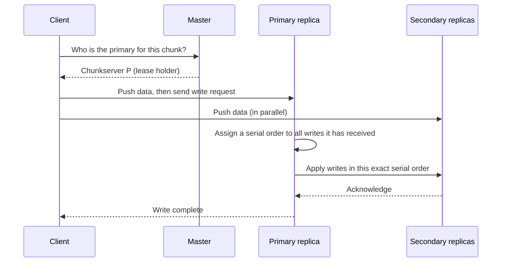

## Learning Objectives

- State GFS's own terminology for the outcomes a region of a file can be in after a series of mutations: consistent, defined, and inconsistent, and explain what each one actually guarantees a reader.
- Explain the role of a chunk's primary replica and its lease, and how the primary orders concurrent writes from multiple clients.
- Describe the atomic record append operation, what problem it solves, and why it makes a weaker per-byte guarantee than a normal write in exchange for a stronger concurrency guarantee.
- Explain why GFS's relaxed consistency model is a deliberate fit for its append-heavy, single-writer-rare target workload, rather than a shortcut taken for its own sake.

## Context & Motivation

The previous concept described how a client locates and reads or writes chunk data, but left one crucial question open: when multiple clients write to the same chunk, or the same file, concurrently, what does a reader see afterward, and how much of that view is actually guaranteed rather than accidental? A traditional single-machine file system answers this question almost for free, there is one disk, one set of bytes, and the operating system serializes concurrent writes to the same file region in some order. GFS cannot rely on anything nearly that simple, since each chunk exists as three separate physical replicas on three separate machines, and a write must somehow be applied to all three in a way that leaves them agreeing with each other, without paying the cost of a full distributed consensus protocol for every single write.

GFS's answer is deliberately not "the strongest possible guarantee at any cost." Instead, it defines a small, precise vocabulary of exactly what guarantee a client gets after different kinds of mutations, and it is honest that some of those outcomes are weaker than what a single-machine file system would give. This is not sloppiness, it is a considered trade-off: GFS's target applications (the paper cites its own web crawler and later MapReduce as primary examples) mostly append to files that many producers write concurrently and one or a few consumers read afterward, and mostly do not care about the exact byte offset at which each producer's contribution landed, only that every contribution appears somewhere in the file, intact and not corrupted. Given that specific access pattern, GFS's relaxed model buys a large amount of concurrency and throughput at a cost its target applications genuinely do not pay.

## Core Theory

### Consistent, defined, and undefined regions

GFS defines a file region's state after a series of mutations using two independent properties. A region is **consistent** if all clients, reading from any of the chunk's replicas, see the same data, no matter which replica they happen to read from. A region is **defined** if it is consistent, and every client also sees exactly the data written by the most recent mutation in its entirety, with nothing mixed in from a concurrent, overlapping mutation. A region can be consistent but **undefined**: every replica agrees with every other replica (so no reader sees a different answer depending on which replica it hit), but the actual bytes in that region may be a mixture of several different concurrent writers' data, rather than cleanly one writer's data or another's.

This matters specifically when multiple clients issue overlapping writes to the same byte range of a file at close to the same time, a case the paper treats as rare and not particularly optimized for: GFS guarantees the result will be consistent (every replica agrees), but does not guarantee it will be defined (a reader cannot assume the bytes in that region came from only one of the writers). If a write fails partway through on some replica (say, due to a chunkserver crashing mid-write), the affected region becomes genuinely **inconsistent**, different replicas can disagree, and GFS does not automatically repair this for a plain write, though it does detect and report such failures to the client so it can retry.

### The primary replica, its lease, and how concurrent writes get ordered

For every chunk, the master grants a time-limited **lease** to exactly one of its replicas, designating that replica the **primary** for the duration of the lease. All other replicas holding that chunk are secondaries. This single design choice is what lets GFS avoid running a full consensus protocol on every write: since exactly one replica (the primary) is authorized to decide the order of concurrent writes at any given moment, that replica simply assigns each incoming write a serial number and applies them in that order, then tells every secondary to apply the same writes in the same order. As long as every replica applies writes in the identical sequence handed down by the primary, all replicas end up consistent with each other, which is precisely the "consistent" guarantee from above, whether or not the actual content ends up "defined" depends on whether the writes overlapped.

The lease has a further practical benefit: because it is time-limited and must be periodically renewed by the master (piggybacked on the regular HeartBeat messages), if a primary becomes unreachable, the master simply lets its lease expire and grants a new lease to a different replica, without needing any special failover protocol, an ordinary consequence of leases being self-expiring rather than requiring an explicit revocation message that might itself be lost.

### Atomic record append: a weaker byte-offset guarantee for a stronger concurrency guarantee

GFS's most distinctive operation is `RecordAppend`, and understanding why it exists is the key to understanding why GFS's whole consistency model is shaped the way it is. A plain write specifies an exact byte offset, and if two clients write to overlapping offsets concurrently, the result can end up undefined, as described above, precisely the case GFS does not optimize for. `RecordAppend` instead lets GFS itself choose the offset: the client supplies only the data to append, and the primary appends it, atomically, at whatever offset is currently at the end of the file (specifically, at the end of the last chunk of the file, padding to the next chunk if the record would not fit in the chunk's remaining space), returning that offset to the client afterward.

This directly targets GFS's real workload: many producers (say, hundreds of MapReduce workers each emitting log records or output entries to a single shared output file) can call `RecordAppend` concurrently, and each one is guaranteed its record is appended atomically as one contiguous block, at least once, somewhere in the file, without any producer needing to coordinate with the others about who writes to which offset. The specific guarantee is subtle and worth stating precisely: the data itself is guaranteed to appear as one atomic, contiguous unit (never interleaved byte-by-byte with another writer's concurrent record), but GFS does not guarantee each record appears exactly once, and does not guarantee the file contains no padding or duplicate records if a write had to be retried after a partial failure on some replica. A GFS client library that calls `RecordAppend` must therefore tolerate the possibility of duplicate or padded records downstream, precisely the trade GFS's paper describes as acceptable because its actual client applications, reading such files, already skip padding and de-duplicate records using per-record checksums, a cost those applications were willing to take on in exchange for never needing to coordinate concurrent writers on offsets at all.

## Worked Examples

### Example 1: two workers appending to a shared output file concurrently

**Problem:** Two MapReduce workers, A and B, each call `RecordAppend` on the same GFS output file at nearly the same moment, worker A appending the record `"result-A"` and worker B appending `"result-B"`. Trace what GFS guarantees about the outcome, and what it does not guarantee.

**Trace:** Both `RecordAppend` requests reach the chunk's primary. The primary serializes them, say, it processes A's request first, appending `"result-A"` at the current end of the file and advancing the end-of-file offset, then processes B's request, appending `"result-B"` immediately after. The primary instructs every secondary to apply the two appends in this exact same order. **Guaranteed:** the file, read from any replica, will contain both `"result-A"` and `"result-B"` as two separate, intact, non-interleaved records, consistent because every replica applied them in the same order. **Not guaranteed:** which record ends up first in the file (A could just as easily have been serialized after B, since "nearly the same moment" does not specify a winner), and neither worker can predict in advance the exact byte offset its own record landed at, only GFS knows that, and returns it after the fact.

### Example 2: contrasting a plain overlapping write with a record append

**Problem:** Suppose, instead of calling `RecordAppend`, workers A and B had each issued a plain `Write` to the exact same byte offset in the file, one writing `"AAAAAAAA"` and the other `"BBBBBBBB"`, at nearly the same time. Contrast the possible outcome with Example 1.

**Trace:** The primary still serializes the two writes into some order and applies them identically on every replica, so the result is still consistent, every replica will agree on the same final bytes at that offset. But because both writes targeted the *same* byte range, the region is not guaranteed to be defined: depending on exactly how the two writes' byte ranges were serialized and applied, a reader might see all of `"AAAAAAAA"`, all of `"BBBBBBBB"`, or, if the writes overlapped only partially, some byte-level mixture like `"AAAABBBB"`, and GFS makes no promise about which. This is exactly the scenario `RecordAppend` in Example 1 was designed to avoid, by never letting two concurrent appends target the same byte range in the first place, GFS itself picks a non-overlapping offset for each one.

## Common Misconceptions & Pitfalls

- **"Consistent means the file contains exactly what each writer intended, in order."** Consistent only means every replica agrees with every other replica, it says nothing about whether the content itself is free of interleaving from concurrent overlapping writers. That stronger guarantee is what GFS calls "defined," and GFS explicitly does not promise it for concurrent overlapping plain writes to the same region.
- **"RecordAppend guarantees each record appears exactly once."** It guarantees at-least-once, atomic, contiguous appends, not exactly-once. A retry after a partial failure can leave duplicate or padded data in the file, which is why GFS's real client applications include their own de-duplication logic (typically via a checksum or sequence number embedded in each record) rather than trusting the file to contain no duplicates.
- **"The primary and its lease are just an optimization, any replica could apply writes in any order and reconcile later."** The lease is what makes GFS's whole consistency model work at all without full consensus on every write: because exactly one replica is authorized to pick the serial order for a given chunk at any moment, there is nothing to reconcile later, every replica already applied writes in the same order the primary chose. Removing the single-primary-per-lease design would reintroduce exactly the distributed-ordering problem GFS is specifically trying to sidestep for performance.

## Summary

GFS defines a precise, three-way vocabulary for what a client can rely on after concurrent mutations: consistent (every replica agrees), defined (consistent, and cleanly reflects one writer's data with no interleaving), and inconsistent (replicas can disagree, following a failed mutation). A time-limited lease designates one replica as primary for each chunk, and that primary alone assigns a serial order to concurrent writes, which every secondary then applies identically, this single mechanism is what lets GFS guarantee consistency without running full consensus on every write. The atomic `RecordAppend` operation lets GFS itself choose the append offset, guaranteeing each record lands atomically and intact somewhere in the file (though not necessarily exactly once), specifically to let many concurrent producers append to a shared file without coordinating on offsets, a deliberate trade of a weaker per-record guarantee for a dramatically simpler and more concurrent write path, exactly matched to GFS's real target workload of many producers appending to shared output files.

## Documentation Links

- [Ghemawat, Gobioff, Leung: The Google File System (SOSP 2003)](https://research.google.com/archive/gfs-sosp2003.pdf): doc
