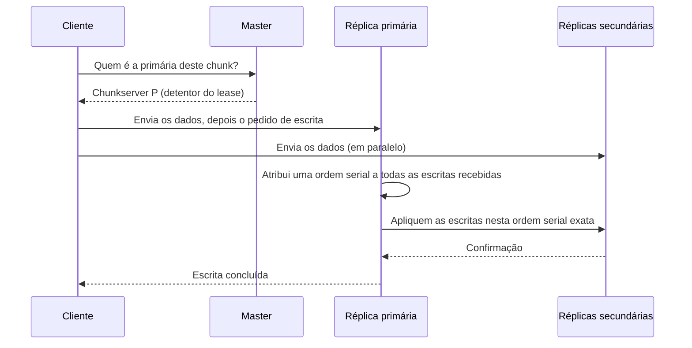

## Objetivos de Aprendizagem

- Enunciar a terminologia própria do GFS para os resultados em que uma região de um arquivo pode estar depois de uma série de mutações (consistente, definida e inconsistente) e explicar o que cada um de fato garante a um leitor.
- Explicar o papel da réplica primária de um chunk e do seu lease, e como a primária ordena escritas concorrentes de vários clientes.
- Descrever a operação de anexação atômica de registros, qual problema ela resolve, e por que ela dá uma garantia por byte mais fraca do que uma escrita normal em troca de uma garantia de concorrência mais forte.
- Explicar por que o modelo de consistência relaxado do GFS é um encaixe deliberado para a sua carga de trabalho alvo, pesada em anexações e com escritas de escritor único raras, em vez de um atalho tomado por si só.

## Contexto e Motivação

O conceito anterior descreveu como um cliente localiza e lê ou escreve dados de um chunk, mas deixou uma pergunta crucial em aberto: quando vários clientes escrevem no mesmo chunk, ou no mesmo arquivo, de forma concorrente, o que um leitor vê depois, e quanto dessa visão é de fato garantido, e não acidental? Um sistema de arquivos tradicional de uma única máquina responde a essa pergunta quase de graça: há um disco, um conjunto de bytes, e o sistema operacional serializa as escritas concorrentes na mesma região de arquivo em alguma ordem. O GFS não pode contar com nada nem de perto tão simples, já que cada chunk existe como três réplicas físicas separadas em três máquinas separadas, e uma escrita precisa de algum jeito ser aplicada às três de um modo que as deixe concordando umas com as outras, sem pagar o custo de um protocolo de consenso distribuído completo para cada escrita.

A resposta do GFS deliberadamente não é "a garantia mais forte possível a qualquer custo". Em vez disso, ele define um vocabulário pequeno e preciso de exatamente qual garantia um cliente recebe depois de diferentes tipos de mutação, e é honesto sobre o fato de que alguns desses resultados são mais fracos do que o que um sistema de arquivos de uma única máquina daria. Isso não é desleixo, é um trade-off pensado: as aplicações alvo do GFS (o artigo cita o seu próprio rastreador web e, depois, o MapReduce como exemplos principais) majoritariamente anexam a arquivos que muitos produtores escrevem de forma concorrente e um ou poucos consumidores leem depois, e majoritariamente não se importam com o deslocamento exato de byte em que a contribuição de cada produtor caiu, só com o fato de que toda contribuição aparece em algum lugar do arquivo, intacta e não corrompida. Dado esse padrão de acesso específico, o modelo relaxado do GFS compra uma grande quantidade de concorrência e vazão a um custo que as suas aplicações alvo genuinamente não pagam.

## Teoria Central

### Regiões consistentes, definidas e indefinidas

O GFS define o estado de uma região de arquivo depois de uma série de mutações usando duas propriedades independentes. Uma região é **consistente** se todos os clientes, lendo de qualquer uma das réplicas do chunk, veem os mesmos dados, não importa de qual réplica leiam. Uma região é **definida** se é consistente e, além disso, todo cliente vê exatamente os dados escritos pela mutação mais recente na sua totalidade, sem nada misturado de uma mutação concorrente e sobreposta. Uma região pode ser consistente mas **indefinida**: toda réplica concorda com todas as outras (então nenhum leitor vê uma resposta diferente dependendo de qual réplica acessou), mas os bytes reais naquela região podem ser uma mistura dos dados de vários escritores concorrentes diferentes, em vez de limpamente os dados de um escritor ou de outro.

Isso importa especificamente quando vários clientes emitem escritas sobrepostas na mesma faixa de bytes de um arquivo quase ao mesmo tempo, um caso que o artigo trata como raro e não particularmente otimizado: o GFS garante que o resultado será consistente (toda réplica concorda), mas não garante que será definido (um leitor não pode assumir que os bytes daquela região vieram de só um dos escritores). Se uma escrita falha no meio do caminho em alguma réplica (digamos, por causa de um chunkserver que trava no meio da escrita), a região afetada fica genuinamente **inconsistente**: réplicas diferentes podem discordar, e o GFS não repara isso automaticamente para uma escrita simples, embora detecte e reporte essas falhas ao cliente para que ele possa tentar de novo.

### A réplica primária, o seu lease, e como as escritas concorrentes são ordenadas

Para cada chunk, o master concede um **lease** de tempo limitado a exatamente uma das suas réplicas, designando essa réplica como a **primária** durante o lease. Todas as outras réplicas que guardam esse chunk são secundárias. Esta única escolha de projeto é o que permite ao GFS evitar rodar um protocolo de consenso completo a cada escrita: como exatamente uma réplica (a primária) está autorizada a decidir a ordem das escritas concorrentes num dado momento, essa réplica simplesmente atribui um número serial a cada escrita que chega e as aplica nessa ordem, e então diz a cada secundária para aplicar as mesmas escritas na mesma ordem. Desde que toda réplica aplique as escritas na sequência idêntica repassada pela primária, todas as réplicas terminam consistentes umas com as outras, que é precisamente a garantia "consistente" de acima; se o conteúdo real termina "definido" ou não depende de as escritas terem se sobreposto.

O lease tem um benefício prático adicional: como ele tem tempo limitado e precisa ser renovado periodicamente pelo master (aproveitando as mensagens HeartBeat regulares), se uma primária fica inalcançável, o master simplesmente deixa o seu lease expirar e concede um novo lease a uma réplica diferente, sem precisar de nenhum protocolo especial de failover. É uma consequência comum de os leases expirarem sozinhos, em vez de exigirem uma mensagem explícita de revogação que poderia ela mesma se perder.

### Anexação atômica de registros: uma garantia de deslocamento mais fraca por uma garantia de concorrência mais forte

A operação mais característica do GFS é o `RecordAppend`, e entender por que ela existe é a chave para entender por que todo o modelo de consistência do GFS tem a forma que tem. Uma escrita simples especifica um deslocamento exato de byte e, se dois clientes escrevem em deslocamentos sobrepostos de forma concorrente, o resultado pode terminar indefinido, como descrito acima, precisamente o caso que o GFS não otimiza. O `RecordAppend`, em vez disso, deixa o próprio GFS escolher o deslocamento: o cliente fornece só os dados a anexar, e a primária os anexa, atomicamente, em qualquer que seja o deslocamento atual do fim do arquivo (especificamente, no fim do último chunk do arquivo, preenchendo até o próximo chunk se o registro não couber no espaço restante do chunk), devolvendo esse deslocamento ao cliente depois.

Isso mira diretamente a carga de trabalho real do GFS: muitos produtores (digamos, centenas de workers do MapReduce, cada um emitindo registros de log ou entradas de saída para um único arquivo de saída compartilhado) podem chamar o `RecordAppend` de forma concorrente, e cada um tem a garantia de que o seu registro é anexado atomicamente como um bloco contíguo, pelo menos uma vez, em algum lugar do arquivo, sem que nenhum produtor precise se coordenar com os outros sobre quem escreve em qual deslocamento. A garantia específica é sutil e vale a pena enunciá-la com precisão: os dados em si têm a garantia de aparecer como uma unidade atômica e contígua (nunca intercalada byte a byte com o registro concorrente de outro escritor), mas o GFS não garante que cada registro apareça exatamente uma vez, e não garante que o arquivo não contenha preenchimento ou registros duplicados se uma escrita precisou ser tentada de novo depois de uma falha parcial em alguma réplica. Uma biblioteca cliente do GFS que chama o `RecordAppend` precisa, portanto, tolerar a possibilidade de registros duplicados ou preenchidos mais adiante, precisamente o trade-off que o artigo do GFS descreve como aceitável, porque as suas aplicações clientes reais, ao ler esses arquivos, já pulam o preenchimento e removem duplicatas usando checksums por registro. É um custo que essas aplicações estavam dispostas a assumir em troca de nunca precisar coordenar escritores concorrentes sobre deslocamentos.

## Exemplos Resolvidos

### Exemplo 1: dois workers anexando a um arquivo de saída compartilhado de forma concorrente

**Problema:** Dois workers do MapReduce, A e B, chamam cada um o `RecordAppend` no mesmo arquivo de saída do GFS quase no mesmo momento, o worker A anexando o registro `"result-A"` e o worker B anexando `"result-B"`. Rastreie o que o GFS garante sobre o resultado, e o que ele não garante.

**Rastreamento:** Os dois pedidos de `RecordAppend` chegam à primária do chunk. A primária os serializa: digamos que ela processe primeiro o pedido de A, anexando `"result-A"` no fim atual do arquivo e avançando o deslocamento de fim de arquivo, e depois processe o pedido de B, anexando `"result-B"` logo em seguida. A primária instrui cada secundária a aplicar as duas anexações exatamente nessa mesma ordem. **Garantido:** o arquivo, lido de qualquer réplica, vai conter tanto `"result-A"` quanto `"result-B"` como dois registros separados, intactos e não intercalados, consistentes porque toda réplica os aplicou na mesma ordem. **Não garantido:** qual registro fica primeiro no arquivo (A poderia muito bem ter sido serializado depois de B, já que "quase no mesmo momento" não especifica um vencedor), e nenhum dos workers consegue prever de antemão o deslocamento exato de byte em que o seu próprio registro caiu; só o GFS sabe isso, e o devolve depois do fato.

### Exemplo 2: contrastando uma escrita simples sobreposta com uma anexação de registro

**Problema:** Suponha que, em vez de chamar o `RecordAppend`, os workers A e B tivessem emitido cada um um `Write` simples exatamente no mesmo deslocamento de byte do arquivo, um escrevendo `"AAAAAAAA"` e o outro `"BBBBBBBB"`, quase ao mesmo tempo. Contraste o resultado possível com o Exemplo 1.

**Rastreamento:** A primária ainda serializa as duas escritas em alguma ordem e as aplica de forma idêntica em toda réplica, então o resultado ainda é consistente: toda réplica vai concordar sobre os mesmos bytes finais naquele deslocamento. Mas, como as duas escritas miraram a *mesma* faixa de bytes, a região não tem garantia de ser definida: dependendo de exatamente como as faixas de bytes das duas escritas foram serializadas e aplicadas, um leitor poderia ver todo o `"AAAAAAAA"`, todo o `"BBBBBBBB"` ou, se as escritas se sobrepuseram só parcialmente, alguma mistura no nível de byte como `"AAAABBBB"`, e o GFS não promete nada sobre qual. Este é exatamente o cenário que o `RecordAppend` do Exemplo 1 foi projetado para evitar, nunca deixando duas anexações concorrentes mirarem a mesma faixa de bytes, para começo de conversa: o próprio GFS escolhe um deslocamento sem sobreposição para cada uma.

## Equívocos Comuns e Armadilhas

- **"Consistente significa que o arquivo contém exatamente o que cada escritor pretendia, em ordem."** Consistente só significa que toda réplica concorda com todas as outras; não diz nada sobre se o conteúdo em si está livre de intercalação de escritores concorrentes sobrepostos. Essa garantia mais forte é o que o GFS chama de "definida", e o GFS explicitamente não a promete para escritas simples concorrentes e sobrepostas na mesma região.
- **"O RecordAppend garante que cada registro apareça exatamente uma vez."** Ele garante anexações atômicas, contíguas e pelo menos uma vez, e não exatamente uma vez. Uma nova tentativa depois de uma falha parcial pode deixar dados duplicados ou de preenchimento no arquivo, e é por isso que as aplicações clientes reais do GFS incluem a sua própria lógica de remoção de duplicatas (normalmente via um checksum ou um número de sequência embutido em cada registro), em vez de confiar que o arquivo não contém duplicatas.
- **"A primária e o seu lease são só uma otimização; qualquer réplica poderia aplicar escritas em qualquer ordem e reconciliar depois."** O lease é o que faz o modelo de consistência inteiro do GFS funcionar sem consenso completo a cada escrita: como exatamente uma réplica está autorizada a escolher a ordem serial de um dado chunk em qualquer momento, não há nada a reconciliar depois, já que toda réplica já aplicou as escritas na mesma ordem que a primária escolheu. Remover o projeto de uma primária única por lease reintroduziria exatamente o problema de ordenação distribuída que o GFS está especificamente tentando contornar por desempenho.

## Resumo

O GFS define um vocabulário preciso, de três vias, para aquilo em que um cliente pode confiar depois de mutações concorrentes: consistente (toda réplica concorda), definida (consistente, e reflete limpamente os dados de um escritor, sem intercalação) e inconsistente (as réplicas podem discordar, depois de uma mutação que falhou). Um lease de tempo limitado designa uma réplica como primária para cada chunk, e só essa primária atribui uma ordem serial às escritas concorrentes, que toda secundária então aplica de forma idêntica. Este único mecanismo é o que permite ao GFS garantir consistência sem rodar consenso completo a cada escrita. A operação atômica `RecordAppend` deixa o próprio GFS escolher o deslocamento da anexação, garantindo que cada registro caia de forma atômica e intacta em algum lugar do arquivo (embora não necessariamente exatamente uma vez), especificamente para permitir que muitos produtores concorrentes anexem a um arquivo compartilhado sem se coordenar sobre deslocamentos: uma troca deliberada de uma garantia por registro mais fraca por um caminho de escrita dramaticamente mais simples e mais concorrente, exatamente ajustado à carga de trabalho alvo real do GFS, de muitos produtores anexando a arquivos de saída compartilhados.

## Documentation Links

- [Ghemawat, Gobioff, Leung: The Google File System (SOSP 2003)](https://research.google.com/archive/gfs-sosp2003.pdf): doc
