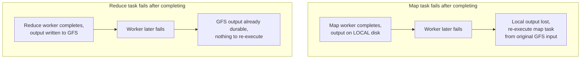

## Learning Objectives

- Explain how the MapReduce master detects a worker failure and what it does differently for a failed map task versus a failed reduce task.
- Explain the locality optimization: why the master tries to schedule a map task on the machine already holding its input data, and what resource this specifically conserves.
- Define a straggler and explain why a single slow machine is treated as seriously as a dead one, and what backup task execution does about it.
- Explain why map tasks can simply be re-run from scratch on failure, while output already fully written by a completed reduce task does not need to be redone.

## Context & Motivation

The previous concept described the map and reduce functions as if they simply run to completion, but at the scale MapReduce actually targets, hundreds or thousands of worker machines executing a single job, treating every task as certain to succeed on its first attempt would make the whole system unusable in practice: at that many machines, some fraction will crash, lose their local disk, or simply run much slower than their peers during essentially every job that runs long enough to matter. The MapReduce paper's own operational experience made this concrete rather than hypothetical, machine failures during a job were routine, not exceptional, at Google's actual cluster scale.

This is the same posture the discipline's opening concept described as the defining shift of cloud-scale systems: partial failure is the expected steady state, and the entire value of the MapReduce runtime, beyond simply parallelizing the two user functions, is that it absorbs this expected failure entirely inside the runtime, so that the map and reduce functions themselves, and the programmer who wrote them, never need to contain a single line of failure-handling code. This concept develops exactly how the runtime does that: worker failure detection and task re-execution, the locality optimization that reduces how much data needs to move across the network in the first place, and the specific problem of a straggler, a machine that has not failed but is simply running slowly enough to hold up the entire job.

## Core Theory

### Detecting failure and re-executing tasks

The MapReduce master periodically pings every worker it has assigned a task to. If a worker does not respond within a timeout, the master marks it as failed, and marks any map or reduce task that worker was running (or had completed, if it was a map task) as needing to run again on a different worker.

The reason map and reduce tasks are treated differently here is worth making precise. A completed **map task**'s output sits only on the local disk of the worker that produced it, waiting to be read remotely during the shuffle by reduce workers. If that worker later fails, even after the map task finished, its intermediate output becomes unreachable along with the failed machine, so the master must re-execute that map task from scratch on a different worker, re-reading the original input split (still safely available, replicated in GFS) and re-emitting the intermediate output somewhere reachable again. A completed **reduce task**, by contrast, writes its final output directly to GFS, which is itself replicated and durable independent of the worker that wrote it, so if a worker fails after completing a reduce task, that task's output survives the failure and does not need to be redone at all, only in-progress, not-yet-completed reduce tasks on a failed worker need to be re-executed.

Because map is a pure function of its input split, with no dependency on any other map task's output, and reduce is a pure function of its complete, sorted intermediate list, re-executing a task from scratch on a different worker produces exactly the same result the original execution would have, this determinism, inherited directly from the purely functional shape of the programming model, is precisely what makes blind re-execution a correct and sufficient fault-tolerance strategy, with no need for checkpointing partial progress inside a task.

### Locality: moving computation to the data, not data to the computation

At the scale MapReduce targets, network bandwidth between machines is frequently the scarcer resource compared to local disk bandwidth, reading data from a machine's own local disk is fast and free of network contention, while reading the same data over the network competes with every other machine's traffic on the same switches. The MapReduce master exploits this directly during scheduling: since GFS already tracks which chunkservers hold each chunk of the input data, and MapReduce input splits are aligned to GFS chunk boundaries, the master preferentially schedules a map task on a worker machine that is itself a chunkserver already holding a replica of that task's input split (or, failing that, a machine on the same network rack as such a chunkserver). The paper reports this optimization as effective enough that, for large jobs, most input data is read entirely from local disk, with essentially no network bandwidth consumed for the map phase's input reads at all, a direct, practical payoff of GFS's chunk-location metadata being available to schedule against.

### Stragglers and backup task execution

A **straggler** is a worker that has not failed by any of the detection mechanisms above, it is still responding to pings, but is simply completing its assigned task far more slowly than its peers, for reasons that can include a failing disk performing unusually slow reads, contention from another process on a shared machine, or a flaky network interface causing frequent low-level retransmissions. A straggler is a serious problem specifically because the overall job cannot finish until every one of its tasks finishes, so a single machine running ten times slower than the rest can dominate the total wall-clock time of an otherwise fast job, even though nothing about that machine counts as a failure by any of the mechanisms already described.

MapReduce's answer is **backup task execution**: as a job nears completion, with only a small number of tasks still in progress, the master proactively schedules backup copies of those remaining in-progress tasks on other, idle workers, letting the original execution and the backup execution race each other. Whichever one finishes first, the original or the backup, has its output used, and the other is simply discarded. The paper reports this mechanism as substantially reducing overall job completion time in practice, directly addressing the specific case where waiting for the single, slowest straggler to finish would otherwise have dominated the job's total running time.

## Worked Examples

### Example 1: tracing a map worker crash mid-job

**Problem:** A MapReduce job has 100 map tasks and 10 reduce tasks. Map task 37 has already completed and its output has been partially read by reduce task 4 during the shuffle, when the worker running map task 37 crashes entirely (disk failure). Trace what the master does, and whether reduce task 4's already-shuffled data is lost.

**Trace:** The master's periodic ping to the worker that ran map task 37 goes unanswered past the timeout, and the master marks that worker as failed. Because map task 37's intermediate output lived only on that worker's now-unreachable local disk, the master marks map task 37 itself as needing re-execution, not merely "needing its output re-fetched," and schedules it to run again on a different available worker, which re-reads the original input split for task 37 from GFS (safely replicated and unaffected by the crash) and re-produces the intermediate output. Reduce task 4, if it had already fully read task 37's contribution to its partition before the crash, keeps that data in its own local buffers, buffered intermediate data already pulled by a reduce task does not vanish; but if reduce task 4 has not yet run to completion, it will, once map task 37's re-execution finishes, pull that task's re-produced output the same way it would have pulled the original, so the job's final result is unaffected by the crash, only delayed by however long re-executing one map task takes.

### Example 2: a straggler versus a genuine failure, and why they need different handling

**Problem:** Two workers in a 200-map-task job are behaving unusually. Worker A stops responding to the master's pings entirely. Worker B is still responding normally to pings, but its assigned map task has been running for 40 minutes while every other map task in the job finished within 3 minutes. Explain what mechanism handles each case and why the same mechanism would not work for both.

**Resolution:** Worker A has failed by the concrete detection mechanism this concept develops (missed pings past a timeout), so the master marks it failed and re-executes whatever task it was running, exactly as in Example 1. This mechanism would not help with worker B at all: worker B is still responding to pings, so it is never marked as failed, and its task is never automatically re-executed by the failure-detection path alone, technically, it is still making forward progress, just far slower than its peers. Worker B's situation is exactly what backup task execution exists to address: once the job is close to finishing (most of the other 199 map tasks already done), the master notices worker B's task is still outstanding and proactively launches a second, backup execution of that same task on a different, idle worker, letting the two race, whichever one (the original slow worker or the fresh backup) finishes first has its output kept, and the job does not end up waiting the full 40-plus minutes worker B alone would have taken.

## Common Misconceptions & Pitfalls

- **"A completed map task's work is safe once it finishes, the same way a completed reduce task's is."** A map task's output sits only on the local disk of the worker that ran it until every reduce task has finished shuffling it, if that worker fails afterward, the map task must be re-executed from scratch, because its output is now unreachable. A completed reduce task's output, by contrast, is already durably written to GFS, replicated independently of the worker, and does not need re-execution if that worker later fails. This asymmetry follows directly from where each type of task's output physically lives, not from any difference in how reliable map versus reduce tasks are.
- **"Backup task execution is the same mechanism as failure recovery, just triggered earlier."** They solve different problems and trigger on different signals. Failure recovery re-executes a task because its assigned worker has stopped responding entirely, a definite, binary signal. Backup execution launches a redundant execution of a task that is still running normally, just unusually slowly, a comparative, relative signal (this task, versus its peers) that a hard ping timeout would never catch, since the straggling worker never actually stops answering pings.
- **"Locality scheduling guarantees every map task reads its input from local disk."** It is a strong preference the master applies whenever possible, not an absolute guarantee, if every worker holding a replica of a given input split happens to already be busy with other tasks when that split needs to be scheduled, the master will fall back to scheduling the task on a more distant worker (ideally still on the same rack) and accept the extra network cost for that one task, rather than leaving the split unprocessed.

## Summary

The MapReduce runtime absorbs failure entirely inside itself, so the map and reduce functions a programmer writes never need any failure-handling logic. Worker failure is detected by missed pings, and a failed worker's map tasks (whose output lived only on its now-unreachable local disk) are re-executed from the original, GFS-durable input, while a failed worker's already-completed reduce tasks (whose output is already durably written to GFS) do not need re-execution at all. Scheduling deliberately favors locality, running a map task on or near the machine already holding its GFS input chunk, to conserve network bandwidth, frequently the scarcer resource at this scale. A straggler, a worker that has not failed but is running unusually slowly, is a distinct problem from an outright failure, and is addressed by backup task execution, proactively launching a redundant copy of a slow, still-in-progress task on an idle worker and keeping whichever copy finishes first. Together, deterministic re-execution, locality-aware scheduling, and backup execution are what let MapReduce treat partial machine failure, and the milder problem of a merely slow machine, as ordinary, absorbed conditions rather than exceptional events that would otherwise need to be handled by every individual job's own logic.

## Documentation Links

- [Dean, Ghemawat: MapReduce: Simplified Data Processing on Large Clusters (OSDI 2004)](https://research.google.com/archive/mapreduce-osdi04.pdf): doc
