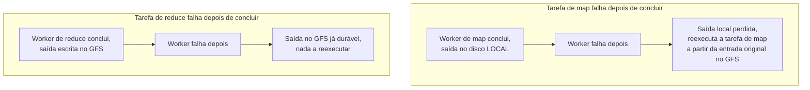

## Objetivos de Aprendizagem

- Explicar como o master do MapReduce detecta a falha de um worker e o que ele faz de diferente para uma tarefa de map que falhou versus uma tarefa de reduce que falhou.
- Explicar a otimização de localidade: por que o master tenta escalonar uma tarefa de map na máquina que já guarda os seus dados de entrada, e que recurso isso especificamente economiza.
- Definir um straggler (retardatário) e explicar por que uma única máquina lenta é tratada com tanta seriedade quanto uma morta, e o que a execução de tarefas de backup faz a respeito.
- Explicar por que as tarefas de map podem simplesmente ser rodadas de novo do zero em caso de falha, enquanto a saída já totalmente escrita por uma tarefa de reduce concluída não precisa ser refeita.

## Contexto e Motivação

O conceito anterior descreveu as funções map e reduce como se elas simplesmente rodassem até o fim, mas na escala que o MapReduce de fato mira (centenas ou milhares de máquinas worker executando um único job), tratar toda tarefa como certa de ter sucesso na primeira tentativa tornaria o sistema inteiro inutilizável na prática. Com tantas máquinas, alguma fração vai travar, perder o seu disco local ou simplesmente rodar muito mais devagar do que as outras durante essencialmente todo job que rode por tempo suficiente para importar. A própria experiência operacional do artigo do MapReduce tornou isso concreto, e não hipotético: falhas de máquina durante um job eram rotina, e não exceção, na escala real dos clusters do Google.

Esta é a mesma postura que o conceito de abertura da disciplina descreveu como a mudança definidora dos sistemas em escala de nuvem: a falha parcial é a condição permanente esperada, e todo o valor do runtime do MapReduce, além de simplesmente paralelizar as duas funções do usuário, é que ele absorve essa falha esperada inteiramente dentro do runtime, de modo que as próprias funções map e reduce, e o programador que as escreveu, nunca precisam conter uma única linha de código de tratamento de falhas. Este conceito desenvolve exatamente como o runtime faz isso: a detecção de falhas de workers e a reexecução de tarefas, a otimização de localidade que reduz quantos dados precisam se mover pela rede, para começo de conversa, e o problema específico de um straggler, uma máquina que não falhou, mas está simplesmente rodando devagar o suficiente para segurar o job inteiro.

## Teoria Central

### Detectando falhas e reexecutando tarefas

O master do MapReduce faz ping periodicamente em todo worker a que atribuiu uma tarefa. Se um worker não responde dentro de um timeout, o master o marca como falho e marca qualquer tarefa de map ou de reduce que aquele worker estava rodando (ou tinha concluído, se era uma tarefa de map) como precisando rodar de novo num worker diferente.

Vale a pena tornar precisa a razão pela qual as tarefas de map e de reduce são tratadas de forma diferente aqui. A saída de uma **tarefa de map** concluída fica só no disco local do worker que a produziu, esperando para ser lida remotamente durante o shuffle pelos workers de reduce. Se esse worker falha depois, mesmo depois de a tarefa de map ter terminado, a sua saída intermediária fica inalcançável junto com a máquina que falhou, então o master precisa reexecutar essa tarefa de map do zero num worker diferente, relendo o pedaço de entrada original (ainda disponível com segurança, replicado no GFS) e reemitindo a saída intermediária em algum lugar alcançável de novo. Uma **tarefa de reduce** concluída, em contraste, escreve a sua saída final diretamente no GFS, que é ele mesmo replicado e durável independentemente do worker que o escreveu. Então, se um worker falha depois de concluir uma tarefa de reduce, a saída dessa tarefa sobrevive à falha e não precisa ser refeita; só as tarefas de reduce em andamento, ainda não concluídas, num worker que falhou precisam ser reexecutadas.

Como o map é uma função pura do seu pedaço de entrada, sem dependência da saída de nenhuma outra tarefa de map, e o reduce é uma função pura da sua lista intermediária completa e ordenada, reexecutar uma tarefa do zero num worker diferente produz exatamente o mesmo resultado que a execução original teria produzido. Esse determinismo, herdado diretamente da forma puramente funcional do modelo de programação, é precisamente o que torna a reexecução cega uma estratégia de tolerância a falhas correta e suficiente, sem necessidade de checkpoints do progresso parcial dentro de uma tarefa.

### Localidade: levar a computação aos dados, e não os dados à computação

Na escala que o MapReduce mira, a largura de banda de rede entre máquinas é frequentemente o recurso mais escasso em comparação com a largura de banda do disco local: ler dados do disco local de uma máquina é rápido e livre de disputa na rede, enquanto ler os mesmos dados pela rede compete com o tráfego de todas as outras máquinas nos mesmos switches. O master do MapReduce explora isso diretamente durante o escalonamento: como o GFS já acompanha quais chunkservers guardam cada chunk dos dados de entrada, e os pedaços de entrada do MapReduce são alinhados às fronteiras dos chunks do GFS, o master escalona preferencialmente uma tarefa de map numa máquina worker que é ela mesma um chunkserver que já guarda uma réplica do pedaço de entrada daquela tarefa (ou, na falta disso, numa máquina no mesmo rack de rede que tal chunkserver). O artigo relata essa otimização como eficaz o bastante para que, em jobs grandes, a maior parte dos dados de entrada seja lida inteiramente do disco local, sem praticamente nenhuma largura de banda de rede consumida para as leituras de entrada da fase de map: um retorno direto e prático de os metadados de localização de chunks do GFS estarem disponíveis para guiar o escalonamento.

### Stragglers e execução de tarefas de backup

Um **straggler** é um worker que não falhou por nenhum dos mecanismos de detecção acima (ele ainda responde aos pings), mas está simplesmente concluindo a sua tarefa atribuída muito mais devagar do que os outros, por razões que podem incluir um disco falhando que faz leituras excepcionalmente lentas, disputa com outro processo numa máquina compartilhada, ou uma interface de rede instável que causa retransmissões frequentes de baixo nível. Um straggler é um problema sério especificamente porque o job como um todo não consegue terminar até que cada uma das suas tarefas termine, então uma única máquina rodando dez vezes mais devagar do que as demais pode dominar o tempo total de relógio de um job de outro modo rápido, mesmo que nada naquela máquina conte como falha por nenhum dos mecanismos já descritos.

A resposta do MapReduce é a **execução de tarefas de backup**: conforme um job se aproxima do fim, com só um pequeno número de tarefas ainda em andamento, o master escalona proativamente cópias de backup dessas tarefas restantes em outros workers ociosos, deixando a execução original e a execução de backup correrem uma contra a outra. A que terminar primeiro, a original ou a de backup, tem a sua saída usada, e a outra é simplesmente descartada. O artigo relata que esse mecanismo reduz substancialmente o tempo total de conclusão dos jobs na prática, tratando diretamente o caso específico em que esperar o único straggler mais lento terminar teria, de outro modo, dominado o tempo total de execução do job.

## Exemplos Resolvidos

### Exemplo 1: rastreando o travamento de um worker de map no meio do job

**Problema:** Um job MapReduce tem 100 tarefas de map e 10 tarefas de reduce. A tarefa de map 37 já foi concluída e a sua saída foi parcialmente lida pela tarefa de reduce 4 durante o shuffle quando o worker que rodou a tarefa de map 37 trava por completo (falha de disco). Rastreie o que o master faz, e se os dados já embaralhados da tarefa de reduce 4 são perdidos.

**Rastreamento:** O ping periódico do master para o worker que rodou a tarefa de map 37 fica sem resposta além do timeout, e o master marca esse worker como falho. Como a saída intermediária da tarefa de map 37 vivia só no disco local agora inalcançável desse worker, o master marca a própria tarefa de map 37 como precisando de reexecução (e não meramente "precisando que a sua saída seja buscada de novo") e a escalona para rodar de novo num worker disponível diferente, que relê do GFS o pedaço de entrada original da tarefa 37 (replicado com segurança e não afetado pelo travamento) e reproduz a saída intermediária. A tarefa de reduce 4, se já tinha lido por completo a contribuição da tarefa 37 para a sua partição antes do travamento, mantém esses dados nos seus próprios buffers locais: os dados intermediários já puxados por uma tarefa de reduce não somem. Mas se a tarefa de reduce 4 ainda não rodou até o fim, ela vai, assim que a reexecução da tarefa de map 37 terminar, puxar a saída reproduzida dessa tarefa do mesmo jeito que teria puxado a original. Assim, o resultado final do job não é afetado pelo travamento, só atrasado pelo tempo que levar para reexecutar uma tarefa de map.

### Exemplo 2: um straggler versus uma falha genuína, e por que eles precisam de tratamentos diferentes

**Problema:** Dois workers num job de 200 tarefas de map estão se comportando de forma incomum. O worker A para de responder aos pings do master por completo. O worker B ainda responde normalmente aos pings, mas a sua tarefa de map atribuída está rodando há 40 minutos, enquanto todas as outras tarefas de map do job terminaram em até 3 minutos. Explique qual mecanismo trata cada caso e por que o mesmo mecanismo não funcionaria para os dois.

**Resolução:** O worker A falhou pelo mecanismo de detecção concreto que este conceito desenvolve (pings perdidos além de um timeout), então o master o marca como falho e reexecuta qualquer tarefa que ele estivesse rodando, exatamente como no Exemplo 1. Esse mecanismo não ajudaria em nada com o worker B: o worker B ainda responde aos pings, então nunca é marcado como falho, e a sua tarefa nunca é reexecutada automaticamente só pelo caminho de detecção de falhas. Tecnicamente, ele ainda está progredindo, só que muito mais devagar do que os outros. A situação do worker B é exatamente o que a execução de tarefas de backup existe para tratar: quando o job está perto de terminar (a maioria das outras 199 tarefas de map já concluída), o master percebe que a tarefa do worker B ainda está pendente e lança proativamente uma segunda execução, de backup, dessa mesma tarefa num worker diferente e ocioso, deixando as duas correrem. A que terminar primeiro (o worker lento original ou o backup novo) tem a sua saída mantida, e o job não acaba esperando os mais de 40 minutos que o worker B sozinho levaria.

## Equívocos Comuns e Armadilhas

- **"O trabalho de uma tarefa de map concluída está seguro assim que ela termina, do mesmo jeito que o de uma tarefa de reduce concluída."** A saída de uma tarefa de map fica só no disco local do worker que a rodou até que toda tarefa de reduce termine de embaralhá-la; se esse worker falha depois, a tarefa de map precisa ser reexecutada do zero, porque a sua saída agora está inalcançável. A saída de uma tarefa de reduce concluída, em contraste, já está escrita de forma durável no GFS, replicada independentemente do worker, e não precisa de reexecução se esse worker falhar depois. Essa assimetria decorre diretamente de onde a saída de cada tipo de tarefa vive fisicamente, e não de nenhuma diferença de confiabilidade entre tarefas de map e de reduce.
- **"A execução de tarefas de backup é o mesmo mecanismo que a recuperação de falhas, só disparado mais cedo."** Eles resolvem problemas diferentes e disparam com sinais diferentes. A recuperação de falhas reexecuta uma tarefa porque o worker atribuído parou de responder por completo, um sinal definido e binário. A execução de backup lança uma execução redundante de uma tarefa que ainda está rodando normalmente, só que excepcionalmente devagar, um sinal comparativo e relativo (esta tarefa versus as outras) que um timeout rígido de ping nunca pegaria, já que o worker retardatário nunca para de fato de responder aos pings.
- **"O escalonamento por localidade garante que toda tarefa de map leia a sua entrada do disco local."** É uma preferência forte que o master aplica sempre que possível, e não uma garantia absoluta: se todo worker que guarda uma réplica de um dado pedaço de entrada estiver por acaso ocupado com outras tarefas quando esse pedaço precisar ser escalonado, o master recorre a escalonar a tarefa num worker mais distante (idealmente ainda no mesmo rack) e aceita o custo extra de rede para essa tarefa, em vez de deixar o pedaço sem processar.

## Resumo

O runtime do MapReduce absorve a falha inteiramente dentro de si, de modo que as funções map e reduce que um programador escreve nunca precisam de nenhuma lógica de tratamento de falhas. A falha de um worker é detectada por pings perdidos, e as tarefas de map de um worker que falhou (cuja saída vivia só no seu disco local agora inalcançável) são reexecutadas a partir da entrada original, durável no GFS, enquanto as tarefas de reduce já concluídas de um worker que falhou (cuja saída já está escrita de forma durável no GFS) não precisam de reexecução nenhuma. O escalonamento favorece deliberadamente a localidade, rodando uma tarefa de map na máquina que já guarda o seu chunk de entrada no GFS, ou perto dela, para economizar largura de banda de rede, frequentemente o recurso mais escasso nessa escala. Um straggler, um worker que não falhou mas está rodando excepcionalmente devagar, é um problema distinto de uma falha completa, e é tratado pela execução de tarefas de backup: lançar proativamente uma cópia redundante de uma tarefa lenta, ainda em andamento, num worker ocioso, e manter a cópia que terminar primeiro. Juntos, a reexecução determinística, o escalonamento consciente da localidade e a execução de backup são o que permite ao MapReduce tratar a falha parcial de máquinas, e o problema mais brando de uma máquina meramente lenta, como condições comuns e absorvidas, em vez de eventos excepcionais que de outro modo precisariam ser tratados pela lógica própria de cada job.

## Documentation Links

- [Dean, Ghemawat: MapReduce: Simplified Data Processing on Large Clusters (OSDI 2004)](https://research.google.com/archive/mapreduce-osdi04.pdf): doc
