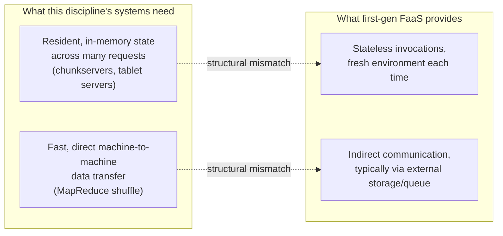

## Learning Objectives

- Describe the Function-as-a-Service (FaaS) model precisely: what a function author actually provides, and what the platform manages on their behalf.
- Explain what a cold start is, why it happens, and why it is a direct, structural consequence of the FaaS model's own autoscaling-to-zero property, not an implementation bug to be patched away.
- State the Berkeley critique's central argument: what specific gap exists between FaaS's statelessness and the actual needs of the data-centric, distributed systems studied throughout this discipline.
- Explain why a stateless function is a poor fit for building something like a GFS chunkserver or a Bigtable tablet server directly, while still being a reasonable fit for other, narrower tasks.

## Context & Motivation

Every system studied so far in this discipline runs as a set of long-lived server processes, a GFS chunkserver, a Bigtable tablet server, a Dynamo node, that are provisioned in advance, keep substantial state resident in memory, and are expected to run continuously. Serverless computing, and specifically the Function-as-a-Service (FaaS) model popularized by AWS Lambda and covered directly in MIT 6.5840's own case-study reading list, offers a genuinely different operational model: rather than provisioning and managing servers at all, a developer supplies only a small, typically stateless handler function, and the cloud platform is responsible for everything else, provisioning compute to run it on demand, scaling automatically from zero to potentially thousands of concurrent invocations as load requires, and billing strictly per invocation rather than for continuously reserved capacity.

This is a genuine, valuable step forward specifically for the autoscaling and operational-simplicity axis, an application that receives bursty, unpredictable traffic no longer needs its own engineers to provision, monitor, and scale a fleet of servers for it. But a widely cited systems critique from UC Berkeley, published at CIDR in 2019 (the same venue tradition, innovative-data-systems research, that has published foundational systems ideas), argues that first-generation FaaS platforms are disappointingly limited specifically where this discipline's other case studies need the most: the model is deliberately, structurally stateless and comparatively poor at fast networking between functions, precisely the two things a GFS chunkserver, a Bigtable tablet server, or a Dynamo node cannot do without. Studying this critique directly, rather than only celebrating FaaS's autoscaling benefits, is exactly in keeping with this discipline's running practice of reading each system for the specific trade-off it makes, not treating any one system as an unqualified, universal answer.

## Core Theory

### The FaaS model: what the author provides, what the platform manages

A FaaS function is, in its simplest form, a single handler: given some input event (an HTTP request, a message from a queue, a file upload notification), it runs some computation and returns a result, then the platform is free to tear down whatever execution environment ran it. The function author does not choose which physical machine runs any given invocation, does not provision a fixed number of instances in advance, and, critically, cannot generally rely on any in-memory state persisting reliably from one invocation to the next, each invocation is expected to be able to start from a fresh, empty execution environment. In exchange for accepting this constraint, the platform handles provisioning entirely automatically: if invocation traffic surges from zero to thousands of concurrent requests, the platform starts however many execution environments are needed to handle them, and if traffic drops back to zero, the platform can scale all the way back down, incurring no cost at all for idle capacity, exactly the autoscaling and pay-per-use property the Berkeley paper credits as a genuine step forward.

### Cold starts: a structural consequence of scaling to zero, not a bug

A **cold start** is the extra latency an invocation experiences when the platform must first provision a brand-new execution environment for it (allocating resources, loading the function's code and any runtime or dependencies, initializing the language runtime) before that invocation can actually begin running, as opposed to a **warm start**, where an already-initialized, previously-used execution environment is available to reuse immediately. Cold starts are not an implementation defect a platform could simply patch away, they are a direct, structural consequence of the very property that makes FaaS attractive in the first place: a platform that scales all the way down to zero idle capacity when there is no traffic has, by definition, nothing already warm and waiting the moment a new burst of traffic arrives, some initial invocations in that burst must pay the cost of provisioning a fresh environment from scratch. Platforms mitigate this in practice (keeping some environments warm for a period after their last use, provisioning ahead of predictable traffic patterns), but the underlying tension, zero idle cost only by also accepting some nonzero cold-start latency somewhere, is inherent to the model's own scale-to-zero promise, not something any particular platform's engineering has simply failed to solve.

### The Berkeley critique: stateless and network-poor, exactly where this discipline's systems need state and fast networking most

The Berkeley paper's central, specific argument is that first-generation FaaS's two defining constraints, deliberate statelessness between invocations, and comparatively slow, indirect communication between functions (typically routed through an external storage or messaging service, rather than functions talking to each other directly over a fast local network), place it at odds with exactly the requirements of the data-centric, distributed-systems workloads this whole discipline studies. A GFS chunkserver's entire value comes from holding chunk data resident and quickly servable across many sequential requests, a stateless-between-invocations model would force every single chunk access to reload or refetch data from some other, external, durable location, defeating the locality and low-latency access GFS's whole architecture is built to provide. Similarly, MapReduce's shuffle phase depends on reduce workers reading intermediate data directly, over the network, from the local disks of specific map workers, a fast, direct machine-to-machine data path that a FaaS platform's typical function-to-function communication model, routed indirectly through an external service, is comparatively poorly suited to providing at the throughput and latency this discipline's case studies actually require.

This is not an argument that FaaS is poorly engineered, it is an argument that FaaS's genuinely valuable autoscaling property was, in its first generation, bundled together with statelessness and indirect networking as if those were necessary companions, when the Berkeley authors argue they are not inherently linked, and that a serverless platform could, in principle, keep the autoscaling and pay-per-use benefits while providing better support for state and fast networking, a design space the paper explicitly calls for future serverless systems to explore, rather than treating first-generation FaaS as a finished, complete answer.

## Worked Examples

### Example 1: tracing why a GFS chunkserver cannot simply be reimplemented as a FaaS function

**Problem:** A team considers reimplementing a GFS chunkserver as a collection of FaaS functions, one invocation per client read or write request, to gain FaaS's autoscaling benefits. Trace concretely what would need to change about GFS's actual design (from the earlier GFS concepts in this discipline) for this to work, and what would be lost.

**Trace:** A real GFS chunkserver holds chunk data resident on its own local disk and serves many sequential read and write requests against that same, already-open local data, entirely within one long-lived process. A stateless FaaS reimplementation could not assume any chunk data is already present in a given invocation's fresh execution environment, so every single read would need to first fetch the relevant chunk data from some external, durable store (defeating the entire point of a chunkserver holding data locally in the first place), and every write would need to persist through that same external store rather than simply appending to a local file the way the actual GFS design does. The specific properties the earlier GFS concepts in this discipline develop, direct client-to-chunkserver data transfer bypassing any additional hop, and a primary replica maintaining an ordered, in-memory lease and write-ordering state across many sequential writes, both depend on a long-lived, stateful process, exactly what a stateless FaaS invocation model does not provide, confirming concretely why this discipline's earlier case studies are built as long-lived servers, not as collections of FaaS functions.

### Example 2: a workload where FaaS's trade-offs are actually a good fit

**Problem:** Contrast the chunkserver case above with a genuinely different workload: resizing user-uploaded images, triggered by an upload event, with each resize operation independent of every other one and typically completing in under a second. Explain why FaaS's statelessness and cold-start trade-off are much less costly here.

**Resolution:** Each image-resize invocation needs no state carried over from any other invocation, the input (one uploaded image) and the output (one resized image) are entirely self-contained, so FaaS's stateless-between-invocations constraint costs nothing here, there was never any state that needed to persist across invocations in the first place. Upload traffic for this kind of workload is also naturally bursty and unpredictable (a sudden wave of uploads, then long idle periods), exactly the traffic shape FaaS's scale-to-zero, pay-per-invocation model is well suited to, without needing to keep a fleet of servers provisioned and idle during the quiet periods. A cold start adding a few hundred milliseconds of latency to an occasional resize invocation is a minor, tolerable cost for this workload, in a way it would not be for, say, a chunkserver expected to serve latency-sensitive reads continuously. This contrast is precisely the discipline's recurring lesson: FaaS is a well-matched, deliberate choice for stateless, independent, bursty workloads, and a structurally poor match for the stateful, high-throughput, tightly-networked systems this discipline studies as its other case studies.

## Common Misconceptions & Pitfalls

- **"Cold starts are a solvable engineering bug, and a sufficiently well-engineered FaaS platform will eventually eliminate them entirely."** Cold starts are a structural consequence of scaling all the way to zero idle capacity, a platform can reduce their frequency or severity (keeping some environments warm, predicting load ahead of time), but eliminating them entirely would require never actually scaling to zero, at which point the platform is no longer providing the specific zero-idle-cost property that makes FaaS's pricing and operational model distinctive in the first place.
- **"The Berkeley critique is arguing that serverless computing is a bad idea and should be avoided."** The paper explicitly credits autoscaling and pay-per-use as a genuine step forward, its argument is narrower and more constructive: first-generation FaaS unnecessarily bundled that genuine advance together with statelessness and indirect networking, and it calls for future serverless designs to keep the autoscaling benefit while providing better support for state and fast communication, not for abandoning serverless computing altogether.
- **"Every system in this discipline could, in principle, be rebuilt on FaaS with enough engineering effort, since FaaS functions can call out to external storage for whatever state they need."** Routing every stateful operation through an external store, as Example 1 traces for a chunkserver, does not merely add minor overhead, it removes exactly the properties (local, resident state served with minimal added latency; fast, direct machine-to-machine data transfer) that this discipline's earlier case studies are specifically engineered around, the mismatch is structural, not a matter of insufficient engineering effort.

## Summary

The Function-as-a-Service model lets a developer supply only a small, stateless handler function, while the platform manages provisioning, automatic scaling from zero to high concurrency, and per-invocation billing entirely on its own, a genuine, valuable advance specifically for bursty, unpredictable, stateless workloads. Cold starts, the added latency of provisioning a fresh execution environment, are a direct, structural consequence of scaling all the way to zero idle capacity, not an implementation flaw to be engineered away. A widely cited Berkeley critique argues that first-generation FaaS's two defining constraints, statelessness between invocations and comparatively slow, indirect inter-function communication, are specifically at odds with the data-centric, stateful, tightly-networked systems this discipline studies as its other case studies, a GFS chunkserver or a Bigtable tablet server cannot be naturally rebuilt as stateless functions without losing exactly the properties that make them work, while a genuinely stateless, independent, bursty workload like image resizing is a strong, natural fit for the model's actual trade-offs. This closes the discipline's tour of individual case studies; the capstone that follows asks which of these systems, and their specific, deliberate trade-offs, is the right choice for several concrete, realistic workloads.

## Documentation Links

- [Hellerstein et al.: Serverless Computing: One Step Forward, Two Steps Back (CIDR 2019)](https://www.cidrdb.org/cidr2019/papers/p119-hellerstein-cidr19.pdf): doc
