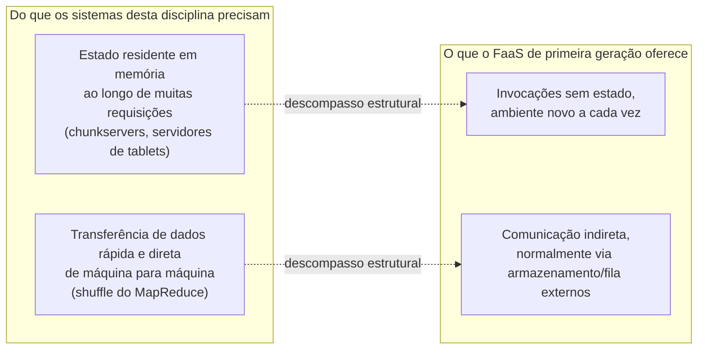

## Objetivos de Aprendizagem

- Descrever o modelo Function-as-a-Service (FaaS) com precisão: o que o autor de uma função de fato fornece, e o que a plataforma gerencia por ele.
- Explicar o que é um cold start (partida a frio), por que ele acontece, e por que ele é uma consequência direta e estrutural da própria propriedade de autoescalonamento até zero do modelo FaaS, e não um bug de implementação a ser corrigido.
- Enunciar o argumento central da crítica de Berkeley: qual lacuna específica existe entre a ausência de estado do FaaS e as necessidades reais dos sistemas distribuídos centrados em dados estudados ao longo desta disciplina.
- Explicar por que uma função sem estado é um encaixe ruim para construir diretamente algo como um chunkserver do GFS ou um servidor de tablets do Bigtable, embora ainda seja um encaixe razoável para outras tarefas mais estreitas.

## Contexto e Motivação

Todo sistema estudado até agora nesta disciplina roda como um conjunto de processos servidores de vida longa (um chunkserver do GFS, um servidor de tablets do Bigtable, um nó do Dynamo) que são provisionados com antecedência, mantêm um estado substancial residente em memória e devem rodar continuamente. A computação serverless, e especificamente o modelo Function-as-a-Service (FaaS) popularizado pelo AWS Lambda e coberto diretamente na própria lista de leituras de estudos de caso do MIT 6.5840, oferece um modelo operacional genuinamente diferente: em vez de provisionar e gerenciar servidores, um desenvolvedor fornece só uma pequena função handler, normalmente sem estado, e a plataforma de nuvem é responsável por todo o resto, provisionando computação para rodá-la sob demanda, escalando automaticamente de zero a potencialmente milhares de invocações concorrentes conforme a carga exige, e cobrando estritamente por invocação, em vez de por capacidade reservada continuamente.

Este é um avanço genuíno e valioso especificamente no eixo de autoescalonamento e simplicidade operacional: uma aplicação que recebe tráfego em rajadas, imprevisível, não precisa mais que os seus próprios engenheiros provisionem, monitorem e escalem uma frota de servidores para ela. Mas uma crítica de sistemas amplamente citada, da UC Berkeley, publicada no CIDR em 2019 (a mesma tradição de conferência, de pesquisa inovadora em sistemas de dados, que publicou ideias fundamentais de sistemas), argumenta que as plataformas FaaS de primeira geração são decepcionantemente limitadas exatamente onde os outros estudos de caso desta disciplina mais precisam: o modelo é deliberada e estruturalmente sem estado e comparativamente fraco em rede rápida entre funções, precisamente as duas coisas sem as quais um chunkserver do GFS, um servidor de tablets do Bigtable ou um nó do Dynamo não funciona. Estudar essa crítica diretamente, em vez de só celebrar os benefícios de autoescalonamento do FaaS, está exatamente de acordo com a prática constante desta disciplina de ler cada sistema pelo trade-off específico que ele faz, sem tratar nenhum sistema como uma resposta universal e sem ressalvas.

## Teoria Central

### O modelo FaaS: o que o autor fornece, o que a plataforma gerencia

Uma função FaaS é, na sua forma mais simples, um único handler: dado algum evento de entrada (uma requisição HTTP, uma mensagem de uma fila, uma notificação de upload de arquivo), ela roda alguma computação e devolve um resultado, e então a plataforma fica livre para desmontar o ambiente de execução que a rodou. O autor da função não escolhe qual máquina física roda cada invocação, não provisiona um número fixo de instâncias com antecedência e, crucialmente, em geral não pode contar que algum estado em memória persista de forma confiável de uma invocação para a próxima: espera-se que cada invocação consiga começar a partir de um ambiente de execução novo e vazio. Em troca de aceitar essa restrição, a plataforma trata o provisionamento de forma inteiramente automática: se o tráfego de invocações sobe de zero para milhares de requisições concorrentes, a plataforma inicia quantos ambientes de execução forem necessários para tratá-las e, se o tráfego cai de volta a zero, a plataforma pode escalar totalmente para baixo, sem nenhum custo por capacidade ociosa, exatamente a propriedade de autoescalonamento e pagamento por uso que o artigo de Berkeley reconhece como um avanço genuíno.

### Cold starts: uma consequência estrutural de escalar até zero, e não um bug

Um **cold start** é a latência extra que uma invocação sofre quando a plataforma precisa primeiro provisionar um ambiente de execução totalmente novo para ela (alocando recursos, carregando o código da função e qualquer runtime ou dependência, inicializando o runtime da linguagem) antes que essa invocação possa de fato começar a rodar, em oposição a um **warm start** (partida a quente), em que um ambiente de execução já inicializado e usado antes está disponível para reutilização imediata. Os cold starts não são um defeito de implementação que uma plataforma poderia simplesmente corrigir: eles são uma consequência direta e estrutural da própria propriedade que torna o FaaS atraente, para começo de conversa. Uma plataforma que escala totalmente até zero capacidade ociosa quando não há tráfego não tem, por definição, nada já aquecido e esperando no momento em que chega uma nova rajada de tráfego, e algumas invocações iniciais dessa rajada precisam pagar o custo de provisionar um ambiente novo do zero. As plataformas mitigam isso na prática (mantendo alguns ambientes aquecidos por um período depois do último uso, provisionando com antecedência para padrões de tráfego previsíveis), mas a tensão subjacente (custo ocioso zero só aceitando também alguma latência de cold start não nula em algum lugar) é inerente à própria promessa de escalar até zero do modelo, e não algo que a engenharia de alguma plataforma específica simplesmente falhou em resolver.

### A crítica de Berkeley: sem estado e pobre em rede, exatamente onde os sistemas desta disciplina mais precisam de estado e de rede rápida

O argumento central e específico do artigo de Berkeley é que as duas restrições definidoras do FaaS de primeira geração (a ausência deliberada de estado entre invocações, e uma comunicação comparativamente lenta e indireta entre funções, normalmente roteada por um serviço externo de armazenamento ou de mensagens, em vez de as funções falarem diretamente entre si por uma rede local rápida) o colocam em conflito exatamente com os requisitos das cargas de trabalho de sistemas distribuídos centrados em dados que esta disciplina inteira estuda. Todo o valor de um chunkserver do GFS vem de manter os dados dos chunks residentes e rapidamente servíveis ao longo de muitas requisições sequenciais; um modelo sem estado entre invocações forçaria cada acesso a chunk a recarregar ou buscar de novo os dados de algum outro local externo e durável, derrotando a localidade e o acesso de baixa latência que toda a arquitetura do GFS é construída para oferecer. Da mesma forma, a fase de shuffle do MapReduce depende de os workers de reduce lerem os dados intermediários diretamente, pela rede, dos discos locais de workers de map específicos, um caminho de dados rápido e direto de máquina para máquina que o modelo típico de comunicação entre funções de uma plataforma FaaS, roteado indiretamente por um serviço externo, é comparativamente pouco adequado para oferecer na vazão e na latência que os estudos de caso desta disciplina de fato exigem.

Isto não é um argumento de que o FaaS é mal projetado. É um argumento de que a propriedade genuinamente valiosa de autoescalonamento do FaaS foi, na sua primeira geração, empacotada junto com a ausência de estado e a rede indireta como se estas fossem companheiras necessárias, quando os autores de Berkeley argumentam que elas não estão inerentemente ligadas, e que uma plataforma serverless poderia, em princípio, manter os benefícios de autoescalonamento e de pagamento por uso enquanto oferece melhor suporte a estado e a rede rápida: um espaço de projeto que o artigo explicitamente pede que os futuros sistemas serverless explorem, em vez de tratar o FaaS de primeira geração como uma resposta acabada e completa.

## Exemplos Resolvidos

### Exemplo 1: rastreando por que um chunkserver do GFS não pode simplesmente ser reimplementado como uma função FaaS

**Problema:** Uma equipe considera reimplementar um chunkserver do GFS como uma coleção de funções FaaS, uma invocação por pedido de leitura ou escrita de cliente, para ganhar os benefícios de autoescalonamento do FaaS. Rastreie concretamente o que precisaria mudar no projeto real do GFS (dos conceitos anteriores sobre o GFS nesta disciplina) para que isso funcionasse, e o que seria perdido.

**Rastreamento:** Um chunkserver real do GFS guarda os dados dos chunks residentes no seu próprio disco local e atende muitos pedidos sequenciais de leitura e escrita sobre esses mesmos dados locais já abertos, inteiramente dentro de um processo de vida longa. Uma reimplementação FaaS sem estado não poderia assumir que algum dado de chunk já está presente no ambiente de execução novo de uma dada invocação, então toda leitura precisaria primeiro buscar os dados de chunk relevantes em algum armazenamento externo e durável (derrotando todo o propósito de um chunkserver guardar dados localmente, para começo de conversa), e toda escrita precisaria persistir por esse mesmo armazenamento externo, em vez de simplesmente anexar a um arquivo local, como faz o projeto real do GFS. As propriedades específicas que os conceitos anteriores sobre o GFS nesta disciplina desenvolvem (a transferência de dados direta do cliente para o chunkserver, sem nenhum salto adicional, e uma réplica primária mantendo um estado ordenado em memória de lease e de ordem de escritas ao longo de muitas escritas sequenciais) dependem ambas de um processo com estado e de vida longa, exatamente o que um modelo de invocação FaaS sem estado não oferece. Isso confirma concretamente por que os estudos de caso anteriores desta disciplina são construídos como servidores de vida longa, e não como coleções de funções FaaS.

### Exemplo 2: uma carga de trabalho em que os trade-offs do FaaS são de fato um bom encaixe

**Problema:** Contraste o caso do chunkserver acima com uma carga de trabalho genuinamente diferente: redimensionar imagens enviadas por usuários, disparado por um evento de upload, com cada operação de redimensionamento independente de todas as outras e normalmente concluída em menos de um segundo. Explique por que a ausência de estado e o trade-off de cold start do FaaS custam muito menos aqui.

**Resolução:** Cada invocação de redimensionamento de imagem não precisa de nenhum estado trazido de qualquer outra invocação: a entrada (uma imagem enviada) e a saída (uma imagem redimensionada) são inteiramente autocontidas, então a restrição do FaaS de ausência de estado entre invocações não custa nada aqui, já que nunca houve estado que precisasse persistir entre invocações, para começo de conversa. O tráfego de uploads para esse tipo de carga de trabalho também é naturalmente em rajadas e imprevisível (uma onda repentina de uploads, e depois longos períodos ociosos), exatamente o formato de tráfego para o qual o modelo de escalar até zero e de pagamento por invocação do FaaS é bem adequado, sem precisar manter uma frota de servidores provisionada e ociosa durante os períodos calmos. Um cold start que acrescenta algumas centenas de milissegundos de latência a uma invocação ocasional de redimensionamento é um custo pequeno e tolerável para essa carga de trabalho, de um jeito que não seria para, digamos, um chunkserver que deve atender continuamente leituras sensíveis à latência. Esse contraste é precisamente a lição recorrente da disciplina: o FaaS é uma escolha bem ajustada e deliberada para cargas de trabalho sem estado, independentes e em rajadas, e um encaixe estruturalmente ruim para os sistemas com estado, de alta vazão e fortemente interligados por rede que esta disciplina estuda como os seus outros estudos de caso.

## Equívocos Comuns e Armadilhas

- **"Os cold starts são um bug de engenharia solucionável, e uma plataforma FaaS suficientemente bem projetada vai eventualmente eliminá-los por completo."** Os cold starts são uma consequência estrutural de escalar totalmente até zero capacidade ociosa. Uma plataforma pode reduzir a sua frequência ou gravidade (mantendo alguns ambientes aquecidos, prevendo a carga com antecedência), mas eliminá-los por completo exigiria nunca escalar de fato até zero, e aí a plataforma não estaria mais oferecendo a propriedade específica de custo ocioso zero que torna o modelo de preços e de operação do FaaS característico, para começo de conversa.
- **"A crítica de Berkeley está argumentando que a computação serverless é uma má ideia e deve ser evitada."** O artigo reconhece explicitamente o autoescalonamento e o pagamento por uso como um avanço genuíno. O seu argumento é mais estreito e construtivo: o FaaS de primeira geração empacotou desnecessariamente esse avanço genuíno junto com a ausência de estado e a rede indireta, e o artigo pede que os futuros projetos serverless mantenham o benefício de autoescalonamento enquanto oferecem melhor suporte a estado e a comunicação rápida, e não que a computação serverless seja abandonada por completo.
- **"Todo sistema desta disciplina poderia, em princípio, ser reconstruído sobre FaaS com esforço de engenharia suficiente, já que as funções FaaS podem chamar um armazenamento externo para qualquer estado de que precisem."** Rotear toda operação com estado por um armazenamento externo, como o Exemplo 1 rastreia para um chunkserver, não acrescenta meramente uma pequena sobrecarga: isso remove exatamente as propriedades (estado local e residente, servido com o mínimo de latência adicional; transferência de dados rápida e direta de máquina para máquina) em torno das quais os estudos de caso anteriores desta disciplina são especificamente projetados. O descompasso é estrutural, e não uma questão de esforço de engenharia insuficiente.

## Resumo

O modelo Function-as-a-Service permite que um desenvolvedor forneça só uma pequena função handler sem estado, enquanto a plataforma gerencia sozinha o provisionamento, o escalonamento automático de zero a alta concorrência e a cobrança por invocação: um avanço genuíno e valioso especificamente para cargas de trabalho em rajadas, imprevisíveis e sem estado. Os cold starts, a latência adicional de provisionar um ambiente de execução novo, são uma consequência direta e estrutural de escalar totalmente até zero capacidade ociosa, e não uma falha de implementação a ser eliminada por engenharia. Uma crítica amplamente citada de Berkeley argumenta que as duas restrições definidoras do FaaS de primeira geração, a ausência de estado entre invocações e uma comunicação entre funções comparativamente lenta e indireta, estão especificamente em conflito com os sistemas centrados em dados, com estado e fortemente interligados por rede que esta disciplina estuda como os seus outros estudos de caso. Um chunkserver do GFS ou um servidor de tablets do Bigtable não pode ser reconstruído naturalmente como funções sem estado sem perder exatamente as propriedades que os fazem funcionar, enquanto uma carga de trabalho genuinamente sem estado, independente e em rajadas, como o redimensionamento de imagens, é um encaixe forte e natural para os trade-offs reais do modelo. Isto encerra o percurso da disciplina pelos estudos de caso individuais; o projeto final que vem a seguir pergunta qual destes sistemas, com os seus trade-offs específicos e deliberados, é a escolha certa para várias cargas de trabalho concretas e realistas.

## Documentation Links

- [Hellerstein et al.: Serverless Computing: One Step Forward, Two Steps Back (CIDR 2019)](https://www.cidrdb.org/cidr2019/papers/p119-hellerstein-cidr19.pdf): doc
