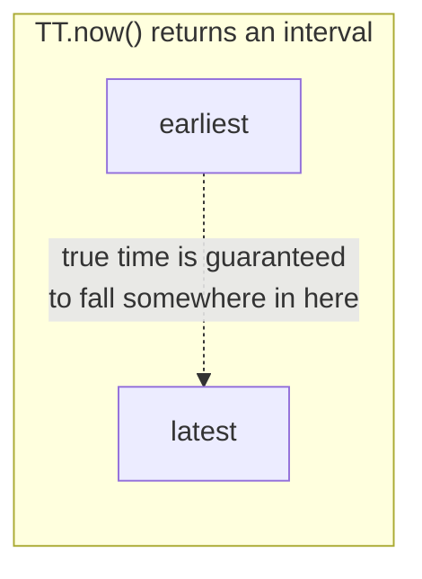

## Learning Objectives

- State what external consistency guarantees, and explain why it is a strictly stronger, harder-to-achieve property across geographically separated data centers than the linearizability already covered in Distributed Systems I.
- Describe the TrueTime API precisely: what it returns, and what specific fact about physical clocks it exposes rather than hides.
- Explain the commit wait rule and trace exactly why waiting out TrueTime's uncertainty interval before releasing a transaction's results is what turns bounded clock uncertainty into a correctness guarantee.
- Contrast Spanner's choice (strong, externally consistent transactions, achieved by combining Paxos-replicated shards with two-phase commit across shards) against Dynamo's choice (availability, via sloppy quorums and vector clocks), as two deliberate, opposite answers to the same underlying CAP trade-off.

## Context & Motivation

Every consistency guarantee this discipline has discussed so far, GFS's per-chunk consistency, Dynamo's deliberately relaxed eventual consistency, ZooKeeper's ZAB-ordered writes, applies to data living within a single cluster, typically a single data center or a small number of nearby ones. Spanner, Google's globally distributed database, published at OSDI in 2012, targets a genuinely harder version of the consistency problem: a single transaction might touch data replicated across data centers on different continents, separated by tens or hundreds of milliseconds of network latency, and Spanner's paper claims something stronger than merely being internally consistent within any one shard, it claims **external consistency**, sometimes called strict serializability, across the entire globally distributed system.

The specific new problem here is not that consensus becomes impossible across data centers, Paxos (already covered in Distributed Systems I) works correctly regardless of geographic distance, it just becomes slower, since messages take longer to cross continents. The new problem is ordering transactions across the whole system in a way that matches real-world, physical time, so that if transaction T1 finishes before transaction T2 even starts, from any external observer's point of view, T1's effects are guaranteed to be ordered before T2's, everywhere in the system, not just within whichever single shard either one happens to touch. Spanner's genuinely novel contribution is not a new consensus algorithm, it reuses Paxos for per-shard replication and two-phase commit (the previous concept) for cross-shard transactions, its contribution is TrueTime, an API that turns physical clock uncertainty from a hidden, ignored problem into an explicitly exposed, bounded quantity the rest of the system can be built around.

## Core Theory

### External consistency, precisely, and why it is harder than linearizability

**Linearizability**, developed in Distributed Systems I, requires that operations on a single object appear to take effect atomically at some point between their invocation and their response, consistent with real-time ordering for operations on that same object. **External consistency** extends this same real-time-ordering requirement across the *entire system*, not just a single object or a single shard, if transaction T1's commit completes (in real, physical time) before transaction T2 even begins, then T1's commit timestamp must be earlier than T2's commit timestamp, even if T1 and T2 touch completely different shards, replicated in completely different data centers, with no data in common between them at all. This is a strictly harder property to guarantee across a geographically distributed system than linearizability restricted to a single, co-located object, because it requires the *timestamps* assigned to transactions across genuinely independent, physically distant parts of the system to correctly reflect real-world time ordering, and real-world time, across machines with their own independent physical clocks, is exactly the thing that is normally impossible to know with certainty.

### TrueTime: exposing clock uncertainty instead of hiding it

Every machine's physical clock, even one regularly synchronized against GPS receivers and atomic clocks (as Google's infrastructure specifically uses), still has some amount of drift and synchronization error relative to true, absolute time, an ordinary clock API that simply returns "the current time" as a single number necessarily hides this uncertainty, and a system built naively on top of it might assign two transactions timestamps that appear correctly ordered, `t1 < t2`, while their true, real-world commit order was actually the opposite, precisely because the clocks that produced those timestamps were not perfectly synchronized.

TrueTime's API, `TT.now()`, returns not a single timestamp but an **interval**, `[earliest, latest]`, guaranteed to contain the true, absolute time at the moment of the call. Google's infrastructure keeps this interval's width, the uncertainty bound, small in practice (the paper reports it typically well under 10 milliseconds) by equipping data centers with a mix of GPS receivers and atomic clocks as time references, but the width is never claimed to be zero, and Spanner's design does not assume it ever will be, it is explicitly built to remain correct for whatever the current bound happens to be, larger or smaller.

### Commit wait: turning a bounded uncertainty into a correctness guarantee

Spanner assigns every transaction a commit timestamp drawn using TrueTime, and the specific mechanism that turns TrueTime's bounded uncertainty into an actual external-consistency guarantee is **commit wait**: before a transaction's coordinator releases its results (making its effects externally visible), it waits until it is certain, according to TrueTime, that the transaction's assigned commit timestamp is now safely in the past, concretely, it waits until `TT.now().earliest` is greater than the transaction's own commit timestamp. Because this wait guarantees the commit timestamp has genuinely passed, in true time, before any other transaction can possibly observe this transaction's effects, any subsequent transaction that begins afterward is guaranteed to be assigned a strictly later timestamp, and external consistency follows directly: a transaction that visibly finishes before another one begins is guaranteed a strictly smaller commit timestamp, exactly the ordering external consistency requires.

The paper reports that, because TrueTime's uncertainty interval is kept small in practice, this commit wait step typically adds only a few milliseconds of latency to a transaction, a real, deliberate, measured cost, but a modest, bounded one, in exchange for a correctness guarantee (external consistency across the entire globally distributed system) that would otherwise require either a much slower, fully synchronous global-ordering protocol for every single transaction, or would simply not be achievable at all with an ordinary, uncertainty-hiding clock API.

### How this connects to Paxos and two-phase commit, rather than replacing them

Spanner does not replace Paxos or two-phase commit with something new, it composes them, using TrueTime specifically to solve the one problem neither of those existing tools solves on its own: assigning globally, externally consistent timestamps. Each shard in Spanner is itself replicated using Paxos (developed in Distributed Systems I), giving each individual shard the same fault-tolerant, consistent replication ZooKeeper's ZAB and Chain Replication's pipeline each provide in their own way. A transaction spanning multiple shards uses two-phase commit (the previous concept) to coordinate across them, with the coordinator for that two-phase commit itself being a Paxos-replicated group rather than a single, individually-crashable machine, directly addressing the blocking weakness the previous concept identified: if the specific machine currently acting as coordinator leader crashes, the Paxos group backing it elects a new leader (using the same mechanism Raft or Paxos leader election already provides) that already has access to the same replicated commit-decision log, rather than leaving participants stuck waiting for one single, now-dead machine to recover.

## Worked Examples

### Example 1: tracing commit wait for a single transaction

**Problem:** A transaction's coordinator calls `TT.now()` while assigning a commit timestamp, receiving the interval `[earliest: 100.000, latest: 100.007]` (in some absolute time unit), and assigns the transaction commit timestamp `s = 100.007` (the upper bound of the interval, a common choice ensuring the assigned timestamp is definitely not earlier than the true current time). Trace what commit wait requires before the coordinator can release this transaction's results.

**Trace:** The coordinator must wait until it can call `TT.now()` again and observe an interval whose `earliest` bound is strictly greater than `s = 100.007`, for example, once `TT.now()` returns `[earliest: 100.008, latest: 100.015]`, `100.008 > 100.007` holds, and the coordinator now knows, with certainty (since `earliest` is guaranteed to be a true lower bound on the actual current time), that true, absolute time has genuinely passed `100.007`. Only at this point does the coordinator release the transaction's results. If the very next `TT.now()` call had instead returned, say, `[earliest: 100.005, latest: 100.010]` (still possible if very little real time has elapsed since the first call), the coordinator would need to keep waiting, since `100.005` is not yet strictly greater than the assigned commit timestamp `100.007`.

### Example 2: why commit wait, not merely assigning increasing timestamps, is necessary for external consistency

**Problem:** Suppose Spanner instead simply assigned each transaction a timestamp using `TT.now().latest` and released results immediately, with no wait at all. Using a concrete pair of transactions, T1 (assigned timestamp 100.007, committing on a machine whose clock happens to be running slightly fast) and T2 (beginning shortly after T1's commit is visible, assigned timestamp using a different machine whose clock happens to be running slightly slow), explain concretely how external consistency could be violated without commit wait.

**Resolution:** Without commit wait, T1's results are released to the rest of the system the instant its timestamp (100.007) is assigned, with no guarantee that true, absolute time has actually reached 100.007 yet, it is entirely possible T1's fast-running clock assigned 100.007 while true time was actually still only, say, 100.002. If T2 then begins and is assigned a timestamp by a different, slow-running machine, say 100.004 (which that machine's clock genuinely believes is later than true time 100.002, but which the numeric value 100.004 nonetheless makes smaller than T1's 100.007), external consistency is violated: T2 genuinely began, in real time, after T1's results were already visible, but T2's numeric timestamp (100.004) is smaller than T1's (100.007), the exact opposite of the ordering external consistency requires. Commit wait prevents this specific failure by refusing to release T1's results until TrueTime itself confirms, via its guaranteed lower bound, that true time has actually passed T1's assigned timestamp, so any transaction that could possibly have started afterward is guaranteed to be assigned a timestamp using a `TT.now()` call whose interval genuinely lies later, avoiding exactly the fast-clock-versus-slow-clock inversion this example traces.

## Common Misconceptions & Pitfalls

- **"TrueTime eliminates clock uncertainty."** TrueTime does the opposite of eliminating uncertainty, it measures and exposes it explicitly, as a bounded interval, rather than pretending a single returned number is exact. Spanner's correctness comes from building commit wait around this honestly-exposed uncertainty, not from making the uncertainty disappear.
- **"Since Spanner uses Paxos, its external consistency guarantee comes directly from Paxos, the same way ZooKeeper's ordering guarantee comes from ZAB."** Paxos (replicating each individual shard) guarantees consistency and ordering *within* that one shard, exactly as ZAB does for ZooKeeper's single znode tree. It says nothing, on its own, about ordering transactions correctly *across* different shards replicated in different data centers, that cross-shard, globally-scoped ordering guarantee is specifically what TrueTime and commit wait provide, layered on top of, not instead of, per-shard Paxos replication.
- **"Commit wait is a workaround for a limitation Google could eventually engineer away with better clocks."** The paper is explicit that Spanner's design does not assume the uncertainty interval will shrink to zero, commit wait's correctness argument holds for whatever the current bound actually is; better clocks (smaller intervals) simply make commit wait faster in practice, they do not remove the need for it, since even an extremely small, nonzero uncertainty interval still requires waiting out that interval to convert it into a certain, past-tense fact.

## Summary

Spanner targets external consistency, a real-time ordering guarantee across its entire globally distributed system, strictly stronger than linearizability restricted to a single object or shard. Its key mechanism, TrueTime, returns an explicit uncertainty interval guaranteed to contain the true time, rather than a single, falsely precise timestamp, and commit wait uses this honestly-exposed uncertainty directly: a transaction's coordinator waits until TrueTime confirms the transaction's assigned commit timestamp has genuinely passed in real time before releasing its results, which is precisely what guarantees any later-starting transaction receives a strictly later timestamp. Spanner achieves this by composing, not replacing, tools already covered in this discipline and in Distributed Systems I, Paxos replicates each individual shard, two-phase commit coordinates transactions across shards, and TrueTime specifically supplies the missing piece, correct, externally consistent timestamps, that neither Paxos nor two-phase commit alone provides. This stands in direct, deliberate contrast to Dynamo's choice, developed earlier in this discipline, of availability over strong consistency during a partition, Spanner instead pays a small, bounded commit-wait latency cost on every transaction specifically to guarantee the strongest form of consistency this discipline studies, a concrete instance of the very first axis this discipline's opening concept named.

## Documentation Links

- [Corbett et al.: Spanner: Google's Globally-Distributed Database (OSDI 2012)](https://www.usenix.org/system/files/conference/osdi12/osdi12-final-16.pdf): doc
