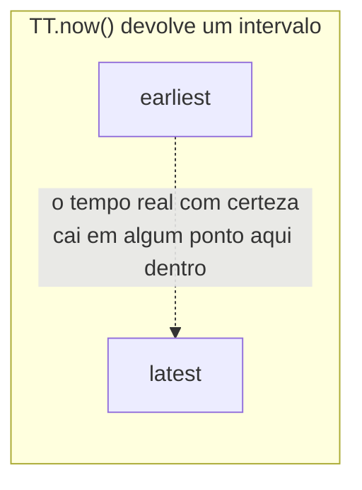

## Objetivos de Aprendizagem

- Enunciar o que a consistência externa garante, e explicar por que ela é uma propriedade estritamente mais forte e mais difícil de alcançar entre data centers geograficamente separados do que a linearizabilidade já coberta em Sistemas Distribuídos I.
- Descrever a API do TrueTime com precisão: o que ela devolve, e que fato específico sobre relógios físicos ela expõe em vez de esconder.
- Explicar a regra de commit wait e rastrear exatamente por que esperar o intervalo de incerteza do TrueTime passar antes de liberar os resultados de uma transação é o que transforma uma incerteza de relógio limitada numa garantia de corretude.
- Contrastar a escolha do Spanner (transações fortes e externamente consistentes, alcançadas combinando shards replicados por Paxos com two-phase commit entre shards) com a escolha do Dynamo (disponibilidade, via quóruns relaxados e relógios vetoriais), como duas respostas deliberadas e opostas ao mesmo trade-off CAP subjacente.

## Contexto e Motivação

Toda garantia de consistência que esta disciplina discutiu até agora (a consistência por chunk do GFS, a consistência eventual deliberadamente relaxada do Dynamo, as escritas ordenadas pelo ZAB do ZooKeeper) se aplica a dados que vivem dentro de um único cluster, normalmente um único data center ou um pequeno número de data centers próximos. O Spanner, o banco de dados globalmente distribuído do Google, publicado no OSDI em 2012, mira uma versão genuinamente mais difícil do problema de consistência: uma única transação pode tocar dados replicados em data centers de continentes diferentes, separados por dezenas ou centenas de milissegundos de latência de rede, e o artigo do Spanner afirma algo mais forte do que meramente ser internamente consistente dentro de qualquer shard: ele afirma **consistência externa**, às vezes chamada de serializabilidade estrita, em todo o sistema globalmente distribuído.

O problema novo e específico aqui não é que o consenso se torne impossível entre data centers: o Paxos (já coberto em Sistemas Distribuídos I) funciona corretamente independentemente da distância geográfica, só fica mais lento, já que as mensagens levam mais tempo para cruzar continentes. O problema novo é ordenar as transações em todo o sistema de um jeito que corresponda ao tempo físico do mundo real, de modo que, se a transação T1 termina antes mesmo de a transação T2 começar, do ponto de vista de qualquer observador externo, os efeitos de T1 tenham a garantia de ser ordenados antes dos de T2, em todo o sistema, e não só dentro do shard que cada uma por acaso toca. A contribuição genuinamente nova do Spanner não é um novo algoritmo de consenso (ele reutiliza o Paxos para a replicação por shard e o two-phase commit, do conceito anterior, para as transações entre shards); a sua contribuição é o TrueTime, uma API que transforma a incerteza dos relógios físicos de um problema escondido e ignorado numa quantidade explicitamente exposta e limitada, em torno da qual o resto do sistema pode ser construído.

## Teoria Central

### Consistência externa, com precisão, e por que ela é mais difícil que a linearizabilidade

A **linearizabilidade**, desenvolvida em Sistemas Distribuídos I, exige que as operações sobre um único objeto pareçam ter efeito atomicamente em algum ponto entre a sua invocação e a sua resposta, de forma coerente com a ordem em tempo real das operações sobre esse mesmo objeto. A **consistência externa** estende esse mesmo requisito de ordem em tempo real para o *sistema inteiro*, e não só para um único objeto ou um único shard: se o commit da transação T1 termina (em tempo real, físico) antes mesmo de a transação T2 começar, então o timestamp de commit de T1 precisa ser anterior ao timestamp de commit de T2, mesmo que T1 e T2 toquem shards completamente diferentes, replicados em data centers completamente diferentes, sem nenhum dado em comum entre elas. Esta é uma propriedade estritamente mais difícil de garantir num sistema geograficamente distribuído do que a linearizabilidade restrita a um único objeto colocalizado, porque ela exige que os *timestamps* atribuídos às transações em partes genuinamente independentes e fisicamente distantes do sistema reflitam corretamente a ordem do tempo do mundo real, e o tempo do mundo real, entre máquinas com os seus próprios relógios físicos independentes, é exatamente a coisa que normalmente é impossível saber com certeza.

### TrueTime: expor a incerteza dos relógios em vez de escondê-la

O relógio físico de toda máquina, mesmo um sincronizado regularmente com receptores GPS e relógios atômicos (como a infraestrutura do Google especificamente usa), ainda tem alguma quantidade de deriva e erro de sincronização em relação ao tempo real e absoluto. Uma API de relógio comum, que simplesmente devolve "a hora atual" como um único número, necessariamente esconde essa incerteza, e um sistema construído ingenuamente sobre ela pode atribuir a duas transações timestamps que parecem corretamente ordenados, `t1 < t2`, enquanto a ordem real de commit delas no mundo real foi na verdade a oposta, precisamente porque os relógios que produziram esses timestamps não estavam perfeitamente sincronizados.

A API do TrueTime, `TT.now()`, não devolve um único timestamp, mas um **intervalo**, `[earliest, latest]`, com garantia de conter o tempo real e absoluto no momento da chamada. A infraestrutura do Google mantém a largura desse intervalo, o limite de incerteza, pequena na prática (o artigo relata que ela normalmente fica bem abaixo de 10 milissegundos) equipando os data centers com uma mistura de receptores GPS e relógios atômicos como referências de tempo, mas nunca se afirma que a largura é zero, e o projeto do Spanner não assume que ela um dia será: ele é explicitamente construído para permanecer correto para qualquer que seja o limite atual, maior ou menor.

### Commit wait: transformar uma incerteza limitada numa garantia de corretude

O Spanner atribui a toda transação um timestamp de commit obtido usando o TrueTime, e o mecanismo específico que transforma a incerteza limitada do TrueTime numa garantia real de consistência externa é o **commit wait** (espera de commit): antes que o coordenador de uma transação libere os seus resultados (tornando os seus efeitos externamente visíveis), ele espera até ter certeza, segundo o TrueTime, de que o timestamp de commit atribuído à transação agora está seguramente no passado. Concretamente, ele espera até que `TT.now().earliest` seja maior que o próprio timestamp de commit da transação. Como essa espera garante que o timestamp de commit genuinamente já passou, em tempo real, antes que qualquer outra transação possa observar os efeitos desta, qualquer transação subsequente que comece depois tem a garantia de receber um timestamp estritamente posterior, e a consistência externa segue diretamente: uma transação que termina visivelmente antes de outra começar tem a garantia de um timestamp de commit estritamente menor, exatamente a ordem que a consistência externa exige.

O artigo relata que, como o intervalo de incerteza do TrueTime é mantido pequeno na prática, esse passo de commit wait normalmente acrescenta só alguns milissegundos de latência a uma transação: um custo real, deliberado e medido, mas modesto e limitado, em troca de uma garantia de corretude (consistência externa em todo o sistema globalmente distribuído) que de outro modo exigiria um protocolo de ordenação global totalmente síncrono e muito mais lento para cada transação, ou simplesmente não seria alcançável com uma API de relógio comum, que esconde a incerteza.

### Como isto se conecta ao Paxos e ao two-phase commit, em vez de substituí-los

O Spanner não substitui o Paxos nem o two-phase commit por algo novo: ele os compõe, usando o TrueTime especificamente para resolver o único problema que nenhuma dessas ferramentas existentes resolve sozinha, que é atribuir timestamps globais e externamente consistentes. Cada shard do Spanner é ele mesmo replicado usando Paxos (desenvolvido em Sistemas Distribuídos I), dando a cada shard individual a mesma replicação consistente e tolerante a falhas que o ZAB do ZooKeeper e o pipeline do Chain Replication oferecem, cada um do seu jeito. Uma transação que abrange vários shards usa two-phase commit (o conceito anterior) para coordenar entre eles, e o coordenador desse two-phase commit é ele mesmo um grupo replicado por Paxos, e não uma única máquina que pode travar individualmente, tratando diretamente a fraqueza de bloqueio que o conceito anterior identificou. Se a máquina específica que está atuando como líder coordenador trava, o grupo Paxos por trás dela elege um novo líder (usando o mesmo mecanismo que a eleição de líder do Raft ou do Paxos já oferece) que já tem acesso ao mesmo log replicado de decisões de commit, em vez de deixar os participantes presos esperando uma única máquina, agora morta, se recuperar.

## Exemplos Resolvidos

### Exemplo 1: rastreando o commit wait de uma única transação

**Problema:** O coordenador de uma transação chama `TT.now()` ao atribuir um timestamp de commit, recebendo o intervalo `[earliest: 100.000, latest: 100.007]` (em alguma unidade de tempo absoluta), e atribui à transação o timestamp de commit `s = 100.007` (o limite superior do intervalo, uma escolha comum que garante que o timestamp atribuído definitivamente não é anterior ao tempo real atual). Rastreie o que o commit wait exige antes que o coordenador possa liberar os resultados desta transação.

**Rastreamento:** O coordenador precisa esperar até poder chamar `TT.now()` de novo e observar um intervalo cujo limite `earliest` seja estritamente maior que `s = 100.007`. Por exemplo, quando `TT.now()` devolver `[earliest: 100.008, latest: 100.015]`, `100.008 > 100.007` vale, e o coordenador agora sabe, com certeza (já que `earliest` tem garantia de ser um limite inferior verdadeiro do tempo atual real), que o tempo real e absoluto genuinamente passou de `100.007`. Só nesse momento o coordenador libera os resultados da transação. Se a chamada seguinte a `TT.now()` tivesse devolvido, digamos, `[earliest: 100.005, latest: 100.010]` (ainda possível se muito pouco tempo real tiver passado desde a primeira chamada), o coordenador precisaria continuar esperando, já que `100.005` ainda não é estritamente maior que o timestamp de commit atribuído, `100.007`.

### Exemplo 2: por que o commit wait, e não meramente atribuir timestamps crescentes, é necessário para a consistência externa

**Problema:** Suponha que o Spanner, em vez disso, simplesmente atribuísse a cada transação um timestamp usando `TT.now().latest` e liberasse os resultados imediatamente, sem espera nenhuma. Usando um par concreto de transações, T1 (com timestamp atribuído `100.007`, confirmando numa máquina cujo relógio por acaso está um pouco adiantado) e T2 (que começa logo depois que o commit de T1 fica visível, com timestamp atribuído por uma máquina diferente, cujo relógio por acaso está um pouco atrasado), explique concretamente como a consistência externa poderia ser violada sem o commit wait.

**Resolução:** Sem o commit wait, os resultados de T1 são liberados para o resto do sistema no instante em que o seu timestamp (`100.007`) é atribuído, sem nenhuma garantia de que o tempo real e absoluto já tenha de fato chegado a `100.007`: é inteiramente possível que o relógio adiantado de T1 tenha atribuído `100.007` enquanto o tempo real ainda estava, digamos, em `100.002`. Se T2 então começa e recebe um timestamp de uma máquina diferente, com relógio atrasado, digamos `100.004` (que o relógio dessa máquina genuinamente acredita ser posterior ao tempo real `100.002`, mas cujo valor numérico ainda assim é menor que o `100.007` de T1), a consistência externa é violada: T2 genuinamente começou, em tempo real, depois que os resultados de T1 já estavam visíveis, mas o timestamp numérico de T2 (`100.004`) é menor que o de T1 (`100.007`), exatamente o oposto da ordem que a consistência externa exige. O commit wait evita essa falha específica recusando-se a liberar os resultados de T1 até que o próprio TrueTime confirme, pelo seu limite inferior garantido, que o tempo real de fato passou do timestamp atribuído a T1, de modo que qualquer transação que possa ter começado depois tenha a garantia de receber um timestamp de uma chamada a `TT.now()` cujo intervalo esteja genuinamente mais adiante, evitando exatamente a inversão entre relógio adiantado e relógio atrasado que este exemplo rastreia.

## Equívocos Comuns e Armadilhas

- **"O TrueTime elimina a incerteza dos relógios."** O TrueTime faz o oposto de eliminar a incerteza: ele a mede e a expõe explicitamente, como um intervalo limitado, em vez de fingir que um único número devolvido é exato. A corretude do Spanner vem de construir o commit wait em torno dessa incerteza honestamente exposta, e não de fazer a incerteza desaparecer.
- **"Como o Spanner usa Paxos, a sua garantia de consistência externa vem diretamente do Paxos, do mesmo jeito que a garantia de ordenação do ZooKeeper vem do ZAB."** O Paxos (replicando cada shard individual) garante consistência e ordenação *dentro* daquele único shard, exatamente como o ZAB faz para a árvore única de znodes do ZooKeeper. Ele não diz nada, por si só, sobre ordenar transações corretamente *entre* shards diferentes, replicados em data centers diferentes. Essa garantia de ordenação entre shards, de escopo global, é especificamente o que o TrueTime e o commit wait oferecem, em camada por cima da replicação Paxos por shard, e não no lugar dela.
- **"O commit wait é um contorno para uma limitação que o Google poderia eventualmente eliminar por engenharia com relógios melhores."** O artigo é explícito ao dizer que o projeto do Spanner não assume que o intervalo de incerteza vai encolher até zero: o argumento de corretude do commit wait vale para qualquer que seja o limite atual de fato. Relógios melhores (intervalos menores) simplesmente tornam o commit wait mais rápido na prática; eles não eliminam a necessidade dele, já que mesmo um intervalo de incerteza extremamente pequeno, mas não nulo, ainda exige esperar esse intervalo passar para convertê-lo num fato certo e no passado.

## Resumo

O Spanner mira a consistência externa, uma garantia de ordem em tempo real em todo o seu sistema globalmente distribuído, estritamente mais forte que a linearizabilidade restrita a um único objeto ou shard. O seu mecanismo-chave, o TrueTime, devolve um intervalo de incerteza explícito com garantia de conter o tempo real, em vez de um único timestamp falsamente preciso, e o commit wait usa diretamente essa incerteza honestamente exposta: o coordenador de uma transação espera até que o TrueTime confirme que o timestamp de commit atribuído à transação genuinamente passou em tempo real antes de liberar os seus resultados, e é precisamente isso que garante que qualquer transação que comece depois receba um timestamp estritamente posterior. O Spanner alcança isso compondo, e não substituindo, ferramentas já cobertas nesta disciplina e em Sistemas Distribuídos I: o Paxos replica cada shard individual, o two-phase commit coordena as transações entre shards, e o TrueTime fornece especificamente a peça que faltava, timestamps corretos e externamente consistentes, que nem o Paxos nem o two-phase commit sozinhos oferecem. Isso contrasta direta e deliberadamente com a escolha do Dynamo, desenvolvida mais cedo nesta disciplina, de disponibilidade em vez de consistência forte durante uma partição: o Spanner, em vez disso, paga um custo de latência de commit wait pequeno e limitado em toda transação, especificamente para garantir a forma mais forte de consistência que esta disciplina estuda, uma instância concreta do primeiro eixo que o conceito de abertura desta disciplina nomeou.

## Documentation Links

- [Corbett et al.: Spanner: Google's Globally-Distributed Database (OSDI 2012)](https://www.usenix.org/system/files/conference/osdi12/osdi12-final-16.pdf): doc
