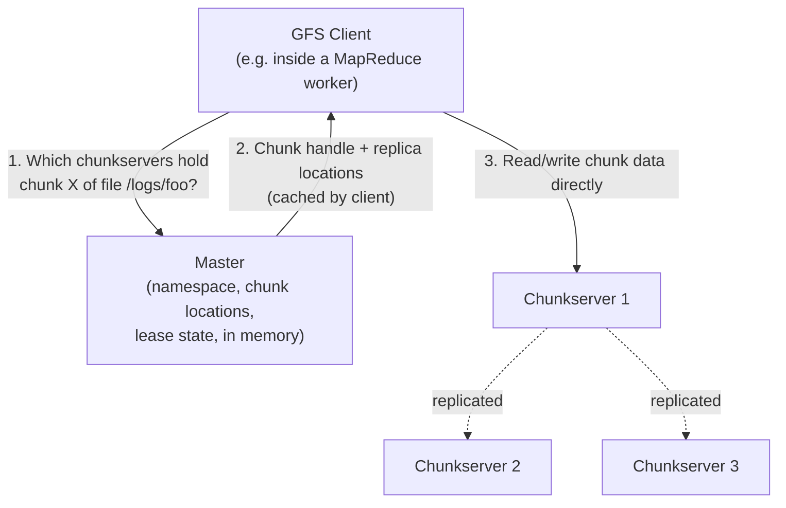

## Learning Objectives

- Describe the three roles in a GFS deployment (master, chunkservers, clients) and state precisely what data each one stores.
- Explain why GFS chooses a 64MB chunk size, and what specific costs that choice avoids compared to a traditional file system's small block size.
- Trace the sequence of messages a client sends to read data from GFS, distinguishing metadata operations (talk to the master) from data operations (talk to a chunkserver directly).
- Explain why a single master, despite being an apparent single point of failure, actually simplifies the overall design, and what GFS does to keep that master from becoming a bottleneck.
- State the replication factor GFS uses by default and explain what problem replication solves that is separate from the problem a single master solves.

## Context & Motivation

By the early 2000s, Google's engineers faced a data storage problem that no off-the-shelf file system was designed for: hundreds of terabytes of data (crawled web pages, index shards, log files), spread across thousands of inexpensive, individually unreliable commodity machines, needed to look to applications like one enormous, coherent file system. Existing distributed file systems of the era generally assumed failure was rare and files were used the way a single desktop machine uses them, opened, read or written in place, and closed. Google's actual workload looked nothing like that: files were enormous (multi-gigabyte), almost always written by appending new data rather than overwriting existing data, and almost always read either as a large streaming sequential scan or as a sequential append, essentially never as small random-access reads or writes to an existing offset.

The Google File System paper, published at SOSP in 2003, is explicit that GFS is not a general-purpose file system, it is a special-purpose one, deliberately co-designed with its two most important client applications (initially, the web crawler and the search index builder, later, and most relevantly to this discipline, MapReduce). Every architectural choice that might look unusual compared to a traditional file system, the single master, the deliberately relaxed consistency model developed in the next concept, the specialized atomic record append operation, follows directly from taking that specific workload seriously rather than trying to build something general.

This concept develops the architecture: what a client, the master, and a chunkserver each do, and how they interact, leaving the consistency guarantees GFS makes about concurrent writers for the next concept to develop in full.

## Core Theory

### The three components and what each one stores

A GFS cluster consists of exactly one active **master** and many **chunkservers**, serving many **clients** (the applications, like MapReduce, that read and write GFS files).

**The master** stores only metadata, and never touches actual file data. Its state fits comfortably in memory (this is a deliberate design choice, an in-memory master with periodic operation-log checkpoints to disk is simple and fast) and consists of: the file system's namespace (the directory hierarchy), the mapping from each file to the ordered list of 64-bit chunk handles that make it up, the current locations of each chunk's replicas (which chunkservers hold it), and which chunkserver currently holds the *lease* for each chunk (developed in the next concept). Critically, chunk-to-chunkserver location mappings are not persisted durably by the master at all, the master simply asks every chunkserver, at startup and periodically thereafter via HeartBeat messages, which chunks it currently holds, and rebuilds this mapping from those answers. This means a chunkserver can be added, removed, or restarted without the master's persistent state needing any update.

**Chunkservers** store the actual file data, as chunks, each identified by a globally unique, master-assigned 64-bit chunk handle, and each chunk stored as a plain file in the chunkserver's local file system. Chunkservers know nothing about GFS's namespace or which file a chunk belongs to; they simply serve read and write requests for chunks by handle, as instructed by the master or directly by clients.

**Clients** link a GFS client library into the application (in this discipline's context, into the MapReduce runtime that reads and writes GFS files). The client library implements the GFS API and talks to both the master (for metadata: "which chunkservers hold chunk X of file Y") and directly to chunkservers (for the actual data transfer), and it is this direct client-to-chunkserver data path, entirely bypassing the master, that keeps the master from becoming a throughput bottleneck even though every single chunk lookup passes through it first.

### Why 64MB chunks, and why this design deliberately avoids small files

GFS's chunk size, 64MB, is dramatically larger than the 4KB blocks a traditional file system like ext4 or NTFS uses. This is not an arbitrary number; it directly targets three specific costs that GFS's designers judged as the actual bottlenecks in their target workload:

1. **Metadata volume at the master.** Every chunk needs an entry in the master's in-memory metadata. With a small block size and petabytes of data, the number of blocks (and therefore the metadata size and the master's memory footprint) would be unmanageably large. A 64MB chunk size keeps the total number of chunks, and therefore the metadata size, small enough to comfortably fit in the master's memory even for a very large file system.
2. **Network overhead per operation.** For the target workload of huge sequential reads and appends, a client that needs a chunk's location talks to the master once per 64MB, then can perform many megabytes of actual I/O against a chunkserver directly, without going back to the master again. A small block size would mean the master is contacted vastly more often relative to the actual data transferred, turning it into both a network and a scalability bottleneck.
3. **Persistent TCP connections.** A client working through a large file keeps a data connection open to the same chunkserver across the full size of a chunk, amortizing TCP connection setup cost over 64MB of transfer rather than needing a fresh connection every few kilobytes.

The paper is candid about the corresponding downside: a small file made of only one or a few chunks becomes a hotspot if many clients access it at once, since only a handful of chunkservers hold it. Google's answer at the time was operational, deliberately keeping small files rare in the target workload, and, for cases where it mattered, giving such files a higher replication factor, rather than changing the chunk size design.

### Why one master simplifies more than it endangers

A single master holding all metadata is, at first glance, an alarming design, an obvious single point of failure and an apparent scalability bottleneck. GFS's designers made this choice deliberately, and the architecture above shows why it is safer than it looks: since actual data flows directly between clients and chunkservers, never through the master, the master's job is reduced to answering small, fast metadata lookups, not moving any of the actual bytes, so its role as a potential bottleneck is far smaller than "master handles every I/O operation" would suggest. In exchange, a single master with global knowledge can make placement and re-replication decisions (where should this chunk's third replica go, which chunkserver has the most free space, which rack has redundancy already) that would require complex distributed consensus if the metadata were itself sharded across multiple servers. GFS does harden this single point of failure in two ways: an operation log persisted to disk (and replicated to backup machines) lets a restarted master replay its complete history and recover its full in-memory state, and, historically, Google ran a "shadow master" that could take over reads (though not the single authoritative role for writes) if the primary master became unavailable.

### Replication: a separate concern from the master's metadata

Each chunk is replicated, by default, across three chunkservers (the paper's default, and typically on separate racks, so a single rack failure or top-of-rack switch outage does not take out every replica of a chunk at once). This is a distinct concern from the master's own metadata durability discussed above: the master tracks *where* the three replicas of each chunk currently live, and if a chunkserver fails (detected via missed HeartBeats), the master notices that some chunks have fallen below their target replication factor and schedules new copies onto other chunkservers to restore it, all without any client-visible interruption to reads or writes of other, unaffected chunks.

## Worked Examples

### Example 1: tracing a client's read of one chunk

**Problem:** A MapReduce worker needs to read bytes 130,000,000 through 130,050,000 of a 500MB input file stored in GFS. Trace every message this requires, from the client's request to the actual data arriving.

**Trace:**
1. The client library computes which chunk index this byte range falls in: since chunks are 64MB (67,108,864 bytes), byte 130,000,000 falls in chunk index 1 (bytes 67,108,864 through 134,217,727), specifically not in chunk 0 or chunk 2.
2. The client sends the master a request: "for file F, give me the chunk handle and current replica locations for chunk index 1." (If the client has recently made this same request and cached the answer, this step is skipped entirely, chunk locations do not change often enough to require asking on every single read.)
3. The master, consulting its in-memory metadata, replies with the chunk's 64-bit handle and the list of chunkservers currently holding a replica (say, chunkservers 7, 12, and 19).
4. The client picks the closest replica (GFS clients prefer the chunkserver nearest on the network, to reduce cross-rack traffic) and sends a direct read request to that chunkserver for the specific byte range within the chunk, entirely bypassing the master for this data transfer.
5. The chunkserver reads the requested bytes from its local disk (the chunk is simply a regular file in its local file system) and returns them directly to the client.

Note that the master was contacted exactly once, for metadata only, and the actual 50,000 bytes of data flowed in a single direct client-to-chunkserver exchange, illustrating precisely why the master's single-machine role does not become a data-transfer bottleneck.

### Example 2: a chunkserver failure and its recovery, traced

**Problem:** Chunkserver 12 (from Example 1) crashes. Describe, step by step, what happens to the chunk it was holding, and confirm client reads of that chunk are unaffected.

**Trace:**
1. Chunkserver 12 stops sending HeartBeat messages to the master. After a timeout with no HeartBeat, the master marks chunkserver 12 as dead and, for every chunk it believes chunkserver 12 was holding (this is exactly the file-to-chunk-to-location mapping the master maintains), notes that this chunk now has only 2 live replicas instead of 3.
2. Any client that already cached chunkserver 12 as a location for that chunk simply gets a connection failure if it tries to read from it, and falls back to one of the other two replicas (7 or 19 from Example 1) instead, no read is actually lost, since two other live, up-to-date replicas already exist.
3. The master schedules a re-replication: it picks a new, healthy chunkserver (say, chunkserver 22) and instructs one of the surviving replicas (say, chunkserver 7) to copy the chunk's data directly to chunkserver 22.
4. Once the copy completes, the master updates its in-memory metadata, chunk locations for this chunk are now {7, 19, 22}, and the chunk is back to its target replication factor of 3.

At no point in this trace did any client-visible read of this chunk, or of any other chunk in the file system, fail permanently or block waiting on this recovery, illustrating the specific fault-tolerance property replication buys: transparent recovery from an individual machine failure, which at GFS's scale (Google reported clusters where a few machine failures per day was routine) is not a rare event to plan for, it is the expected background condition the whole design assumes.

## Common Misconceptions & Pitfalls

- **"A single master means GFS cannot scale past what one machine can handle."** The master's job is metadata only, not data transfer, actual reads and writes flow directly between clients and chunkservers. A 64MB chunk size specifically keeps the ratio of master-metadata-operations to actual-bytes-transferred low, so the master's single-machine capacity for metadata operations, not for total data throughput, is what would eventually need addressing (and GFS's designers judged this sufficient for their target cluster sizes and workload).
- **"64MB chunks are just an arbitrary large number, any large block size would do."** The specific size is chosen to balance the three costs the Core Theory section develops (master metadata volume, network round-trips to the master, TCP connection amortization) against the real downside of hotspotting small files; it is a deliberate engineering trade-off tuned to GFS's actual target workload of huge files and sequential access, not an arbitrary round number.
- **"Replication and the operation log solve the same problem."** They protect against different failures. Chunk replication (three copies across chunkservers) protects the actual file *data* against a chunkserver failing. The operation log (persisted by the master and replayed on restart) protects the master's *metadata* (the namespace and chunk-location bookkeeping) against the master itself failing; losing the operation log would not directly lose any file data sitting safely on chunkservers, but it would leave the system unable to find that data without a full chunkserver-by-chunkserver scan to rebuild the mapping from scratch.

## Summary

GFS is a special-purpose distributed file system, co-designed with its target workload of huge files accessed through large sequential reads and appends, not a general-purpose replacement for a traditional file system. A single in-memory master stores only metadata (namespace, chunk locations, lease state) and is contacted for lookups only, actual data flows directly between clients and chunkservers, which is why the master's single-machine role does not become a throughput bottleneck. Chunks are large (64MB) specifically to keep metadata volume, master round-trips, and connection overhead small relative to the target workload's huge sequential transfers, at the deliberate cost of hotspotting for small files. Each chunk is replicated, by default across three chunkservers, and the master detects chunkserver failure via missed HeartBeats and transparently schedules re-replication, all invisible to a client reading or writing any other, unaffected chunk. The next concept develops precisely what consistency guarantees GFS makes to a client when multiple writers append to the same file concurrently.

## Documentation Links

- [Ghemawat, Gobioff, Leung: The Google File System (SOSP 2003)](https://research.google.com/archive/gfs-sosp2003.pdf): doc
- [MIT 6.5840: Course Schedule (GFS lecture)](https://pdos.csail.mit.edu/6.824/schedule.html): doc
