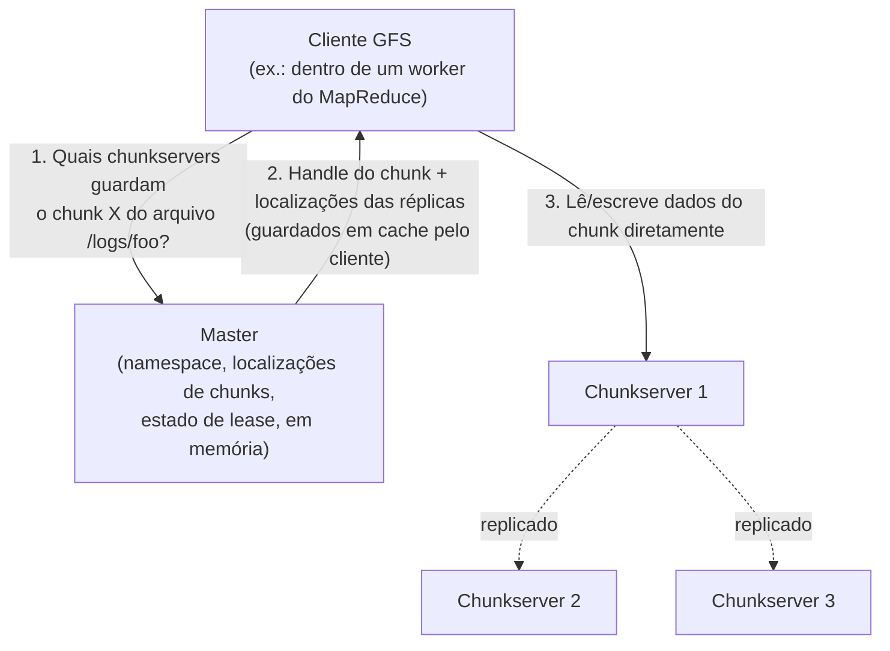

## Objetivos de Aprendizagem

- Descrever os três papéis numa implantação do GFS (master, chunkservers, clientes) e enunciar com precisão quais dados cada um armazena.
- Explicar por que o GFS escolhe um tamanho de chunk de 64MB, e quais custos específicos essa escolha evita em comparação com o tamanho de bloco pequeno de um sistema de arquivos tradicional.
- Rastrear a sequência de mensagens que um cliente envia para ler dados do GFS, distinguindo operações de metadados (falar com o master) de operações de dados (falar diretamente com um chunkserver).
- Explicar por que um único master, apesar de ser um aparente ponto único de falha, na verdade simplifica o projeto como um todo, e o que o GFS faz para evitar que esse master vire um gargalo.
- Enunciar o fator de replicação que o GFS usa por padrão e explicar qual problema a replicação resolve, separado do problema que um único master resolve.

## Contexto e Motivação

No início dos anos 2000, os engenheiros do Google enfrentavam um problema de armazenamento de dados para o qual nenhum sistema de arquivos pronto havia sido projetado: centenas de terabytes de dados (páginas web rastreadas, fragmentos de índice, arquivos de log), espalhados por milhares de máquinas comuns, baratas e individualmente pouco confiáveis, precisavam parecer para as aplicações um único sistema de arquivos enorme e coerente. Os sistemas de arquivos distribuídos existentes na época geralmente assumiam que a falha era rara e que os arquivos eram usados do jeito que uma única máquina de mesa os usa: abertos, lidos ou escritos no lugar, e fechados. A carga de trabalho real do Google não se parecia em nada com isso: os arquivos eram enormes (de vários gigabytes), quase sempre escritos anexando dados novos em vez de sobrescrever dados existentes, e quase sempre lidos como uma varredura sequencial grande em fluxo ou como uma anexação sequencial, essencialmente nunca como pequenas leituras ou escritas de acesso aleatório num deslocamento existente.

O artigo do Google File System, publicado no SOSP em 2003, é explícito ao dizer que o GFS não é um sistema de arquivos de propósito geral: é um de propósito específico, deliberadamente projetado em conjunto com as suas duas aplicações clientes mais importantes (inicialmente, o rastreador web e o construtor do índice de busca; depois, e mais relevante para esta disciplina, o MapReduce). Toda escolha arquitetural que pode parecer incomum em comparação com um sistema de arquivos tradicional (o master único, o modelo de consistência deliberadamente relaxado desenvolvido no próximo conceito, a operação especializada de anexação atômica de registros) decorre diretamente de levar a sério essa carga de trabalho específica, em vez de tentar construir algo geral.

Este conceito desenvolve a arquitetura: o que um cliente, o master e um chunkserver fazem cada um, e como interagem, deixando as garantias de consistência que o GFS oferece sobre escritores concorrentes para o próximo conceito desenvolver por completo.

## Teoria Central

### Os três componentes e o que cada um armazena

Um cluster GFS consiste em exatamente um **master** ativo e muitos **chunkservers**, atendendo muitos **clientes** (as aplicações, como o MapReduce, que leem e escrevem arquivos do GFS).

**O master** armazena só metadados, e nunca toca nos dados reais dos arquivos. O seu estado cabe confortavelmente em memória (esta é uma escolha de projeto deliberada: um master em memória com checkpoints periódicos do log de operações em disco é simples e rápido) e consiste em: o namespace do sistema de arquivos (a hierarquia de diretórios), o mapeamento de cada arquivo para a lista ordenada de handles de chunk de 64 bits que o compõem, as localizações atuais das réplicas de cada chunk (quais chunkservers o guardam), e qual chunkserver detém atualmente o *lease* de cada chunk (desenvolvido no próximo conceito). Crucialmente, os mapeamentos de localização de chunk para chunkserver não são persistidos de forma durável pelo master: o master simplesmente pergunta a cada chunkserver, na inicialização e periodicamente depois disso via mensagens HeartBeat, quais chunks ele guarda no momento, e reconstrói esse mapeamento a partir dessas respostas. Isso significa que um chunkserver pode ser adicionado, removido ou reiniciado sem que o estado persistente do master precise de nenhuma atualização.

**Os chunkservers** armazenam os dados reais dos arquivos, como chunks, cada um identificado por um handle de chunk de 64 bits globalmente único, atribuído pelo master, e cada chunk armazenado como um arquivo comum no sistema de arquivos local do chunkserver. Os chunkservers não sabem nada sobre o namespace do GFS nem sobre a qual arquivo um chunk pertence; eles simplesmente atendem pedidos de leitura e escrita de chunks por handle, conforme instruídos pelo master ou diretamente pelos clientes.

**Os clientes** ligam uma biblioteca cliente do GFS à aplicação (no contexto desta disciplina, ao runtime do MapReduce que lê e escreve arquivos do GFS). A biblioteca cliente implementa a API do GFS e fala tanto com o master (para metadados: "quais chunkservers guardam o chunk X do arquivo Y") quanto diretamente com os chunkservers (para a transferência de dados de fato). É esse caminho de dados direto do cliente para o chunkserver, contornando inteiramente o master, que evita que o master vire um gargalo de vazão, mesmo que toda consulta de chunk passe primeiro por ele.

### Por que chunks de 64MB, e por que este projeto evita deliberadamente arquivos pequenos

O tamanho de chunk do GFS, 64MB, é drasticamente maior que os blocos de 4KB que um sistema de arquivos tradicional como o ext4 ou o NTFS usa. Não é um número arbitrário; ele mira diretamente três custos específicos que os projetistas do GFS julgaram ser os gargalos reais da sua carga de trabalho alvo:

1. **Volume de metadados no master.** Todo chunk precisa de uma entrada nos metadados em memória do master. Com um tamanho de bloco pequeno e petabytes de dados, o número de blocos (e, portanto, o tamanho dos metadados e o consumo de memória do master) seria grande a ponto de ser ingerenciável. Um tamanho de chunk de 64MB mantém o número total de chunks, e portanto o tamanho dos metadados, pequeno o bastante para caber confortavelmente na memória do master, mesmo para um sistema de arquivos muito grande.
2. **Sobrecarga de rede por operação.** Para a carga de trabalho alvo de leituras sequenciais e anexações enormes, um cliente que precisa da localização de um chunk fala com o master uma vez a cada 64MB, e depois pode realizar muitos megabytes de E/S real diretamente com um chunkserver, sem voltar ao master. Um tamanho de bloco pequeno significaria contatar o master muito mais vezes em relação aos dados realmente transferidos, transformando-o num gargalo tanto de rede quanto de escalabilidade.
3. **Conexões TCP persistentes.** Um cliente que percorre um arquivo grande mantém uma conexão de dados aberta com o mesmo chunkserver ao longo do tamanho inteiro de um chunk, amortizando o custo de estabelecer a conexão TCP em 64MB de transferência, em vez de precisar de uma conexão nova a cada poucos kilobytes.

O artigo é franco sobre a desvantagem correspondente: um arquivo pequeno, feito de um ou poucos chunks, vira um ponto quente se muitos clientes o acessam ao mesmo tempo, já que só um punhado de chunkservers o guarda. A resposta do Google na época foi operacional: manter deliberadamente os arquivos pequenos raros na carga de trabalho alvo e, nos casos em que isso importava, dar a esses arquivos um fator de replicação maior, em vez de mudar o projeto do tamanho de chunk.

### Por que um único master simplifica mais do que ameaça

Um único master guardando todos os metadados é, à primeira vista, um projeto alarmante: um ponto único de falha óbvio e um aparente gargalo de escalabilidade. Os projetistas do GFS fizeram essa escolha deliberadamente, e a arquitetura acima mostra por que ela é mais segura do que parece. Como os dados reais fluem diretamente entre clientes e chunkservers, nunca pelo master, o trabalho do master se reduz a responder consultas de metadados pequenas e rápidas, sem mover nenhum dos bytes reais, então o seu papel como gargalo potencial é muito menor do que "o master trata toda operação de E/S" sugeriria. Em troca, um único master com conhecimento global consegue tomar decisões de posicionamento e de re-replicação (para onde deve ir a terceira réplica deste chunk, qual chunkserver tem mais espaço livre, qual rack já tem redundância) que exigiriam um consenso distribuído complexo se os próprios metadados fossem fragmentados entre vários servidores. O GFS reforça esse ponto único de falha de duas formas: um log de operações persistido em disco (e replicado para máquinas de backup) permite que um master reiniciado reproduza o seu histórico completo e recupere todo o seu estado em memória e, historicamente, o Google rodava um "master sombra" que podia assumir as leituras (embora não o papel único e autoritativo para escritas) se o master primário ficasse indisponível.

### Replicação: uma preocupação separada dos metadados do master

Cada chunk é replicado, por padrão, em três chunkservers (o padrão do artigo, e normalmente em racks separados, para que a falha de um único rack ou uma queda do switch de topo de rack não derrube todas as réplicas de um chunk de uma vez). Esta é uma preocupação distinta da durabilidade dos próprios metadados do master discutida acima: o master acompanha *onde* as três réplicas de cada chunk vivem no momento e, se um chunkserver falha (detectado via HeartBeats perdidos), o master percebe que alguns chunks caíram abaixo do seu fator de replicação alvo e agenda cópias novas em outros chunkservers para restaurá-lo, tudo sem nenhuma interrupção visível ao cliente nas leituras ou escritas de outros chunks não afetados.

## Exemplos Resolvidos

### Exemplo 1: rastreando a leitura de um chunk por um cliente

**Problema:** Um worker do MapReduce precisa ler os bytes de 130.000.000 a 130.050.000 de um arquivo de entrada de 500MB armazenado no GFS. Rastreie toda mensagem que isso exige, do pedido do cliente até a chegada dos dados de fato.

**Rastreamento:**
1. A biblioteca cliente calcula em qual índice de chunk essa faixa de bytes cai: como os chunks têm 64MB (67.108.864 bytes), o byte 130.000.000 cai no índice de chunk 1 (bytes de 67.108.864 a 134.217.727), e especificamente não no chunk 0 nem no chunk 2.
2. O cliente envia ao master um pedido: "para o arquivo F, me dê o handle do chunk e as localizações atuais das réplicas do índice de chunk 1." (Se o cliente fez esse mesmo pedido recentemente e guardou a resposta em cache, este passo é pulado por inteiro: as localizações dos chunks não mudam com frequência suficiente para exigir uma pergunta a cada leitura.)
3. O master, consultando os seus metadados em memória, responde com o handle de 64 bits do chunk e a lista de chunkservers que guardam uma réplica no momento (digamos, os chunkservers 7, 12 e 19).
4. O cliente escolhe a réplica mais próxima (os clientes do GFS preferem o chunkserver mais próximo na rede, para reduzir o tráfego entre racks) e envia um pedido de leitura direto a esse chunkserver para a faixa específica de bytes dentro do chunk, contornando inteiramente o master nessa transferência de dados.
5. O chunkserver lê os bytes pedidos do seu disco local (o chunk é simplesmente um arquivo comum no seu sistema de arquivos local) e os devolve diretamente ao cliente.

Note que o master foi contatado exatamente uma vez, só para metadados, e os 50.000 bytes reais de dados fluíram numa única troca direta entre cliente e chunkserver, ilustrando precisamente por que o papel de máquina única do master não vira um gargalo de transferência de dados.

### Exemplo 2: a falha de um chunkserver e a sua recuperação, rastreadas

**Problema:** O chunkserver 12 (do Exemplo 1) trava. Descreva, passo a passo, o que acontece com o chunk que ele guardava, e confirme que as leituras desse chunk pelos clientes não são afetadas.

**Rastreamento:**
1. O chunkserver 12 para de enviar mensagens HeartBeat ao master. Depois de um timeout sem HeartBeat, o master marca o chunkserver 12 como morto e, para todo chunk que acredita que o chunkserver 12 guardava (exatamente o mapeamento de arquivo para chunk para localização que o master mantém), anota que esse chunk agora tem só 2 réplicas vivas em vez de 3.
2. Qualquer cliente que já tinha o chunkserver 12 em cache como localização daquele chunk simplesmente recebe uma falha de conexão se tentar ler dele, e recorre a uma das outras duas réplicas (7 ou 19, do Exemplo 1). Nenhuma leitura é de fato perdida, já que duas outras réplicas vivas e atualizadas já existem.
3. O master agenda uma re-replicação: escolhe um chunkserver novo e saudável (digamos, o chunkserver 22) e instrui uma das réplicas sobreviventes (digamos, o chunkserver 7) a copiar os dados do chunk diretamente para o chunkserver 22.
4. Quando a cópia termina, o master atualiza os seus metadados em memória: as localizações deste chunk agora são {7, 19, 22}, e o chunk está de volta ao seu fator de replicação alvo de 3.

Em nenhum momento deste rastreamento alguma leitura visível ao cliente deste chunk, ou de qualquer outro chunk do sistema de arquivos, falhou permanentemente ou ficou bloqueada esperando por esta recuperação. Isso ilustra a propriedade específica de tolerância a falhas que a replicação compra: recuperação transparente da falha de uma máquina individual, o que, na escala do GFS (o Google relatou clusters em que algumas falhas de máquina por dia eram rotina), não é um evento raro a planejar, é a condição de fundo esperada que o projeto inteiro assume.

## Equívocos Comuns e Armadilhas

- **"Um único master significa que o GFS não consegue escalar além do que uma máquina aguenta."** O trabalho do master é só de metadados, não de transferência de dados: as leituras e escritas reais fluem diretamente entre clientes e chunkservers. Um tamanho de chunk de 64MB mantém especificamente baixa a razão entre operações de metadados no master e bytes realmente transferidos, então o que eventualmente precisaria ser tratado é a capacidade de máquina única do master para operações de metadados, e não para a vazão total de dados (e os projetistas do GFS julgaram isso suficiente para os tamanhos de cluster e a carga de trabalho que tinham como alvo).
- **"Chunks de 64MB são só um número grande arbitrário; qualquer tamanho de bloco grande serviria."** O tamanho específico é escolhido para equilibrar os três custos que a seção de Teoria Central desenvolve (volume de metadados no master, idas e voltas de rede até o master, amortização de conexões TCP) contra a desvantagem real dos pontos quentes em arquivos pequenos; é um trade-off de engenharia deliberado, ajustado à carga de trabalho alvo real do GFS, de arquivos enormes e acesso sequencial, e não um número redondo arbitrário.
- **"A replicação e o log de operações resolvem o mesmo problema."** Eles protegem contra falhas diferentes. A replicação de chunks (três cópias entre chunkservers) protege os *dados* reais dos arquivos contra a falha de um chunkserver. O log de operações (persistido pelo master e reproduzido na reinicialização) protege os *metadados* do master (o namespace e a contabilidade de localização dos chunks) contra a falha do próprio master. Perder o log de operações não perderia diretamente nenhum dado de arquivo guardado em segurança nos chunkservers, mas deixaria o sistema incapaz de encontrar esses dados sem uma varredura completa, chunkserver por chunkserver, para reconstruir o mapeamento do zero.

## Resumo

O GFS é um sistema de arquivos distribuído de propósito específico, projetado em conjunto com a sua carga de trabalho alvo de arquivos enormes acessados por leituras sequenciais grandes e anexações, e não um substituto de propósito geral para um sistema de arquivos tradicional. Um único master em memória armazena só metadados (namespace, localizações de chunks, estado de lease) e é contatado só para consultas: os dados reais fluem diretamente entre clientes e chunkservers, e é por isso que o papel de máquina única do master não vira um gargalo de vazão. Os chunks são grandes (64MB) especificamente para manter o volume de metadados, as idas e voltas ao master e a sobrecarga de conexão pequenos em relação às transferências sequenciais enormes da carga de trabalho alvo, ao custo deliberado de pontos quentes em arquivos pequenos. Cada chunk é replicado, por padrão, em três chunkservers, e o master detecta a falha de um chunkserver via HeartBeats perdidos e agenda a re-replicação de forma transparente, tudo invisível para um cliente que lê ou escreve qualquer outro chunk não afetado. O próximo conceito desenvolve precisamente quais garantias de consistência o GFS dá a um cliente quando vários escritores anexam ao mesmo arquivo de forma concorrente.

## Documentation Links

- [Ghemawat, Gobioff, Leung: The Google File System (SOSP 2003)](https://research.google.com/archive/gfs-sosp2003.pdf): doc
- [MIT 6.5840: Course Schedule (GFS lecture)](https://pdos.csail.mit.edu/6.824/schedule.html): doc
