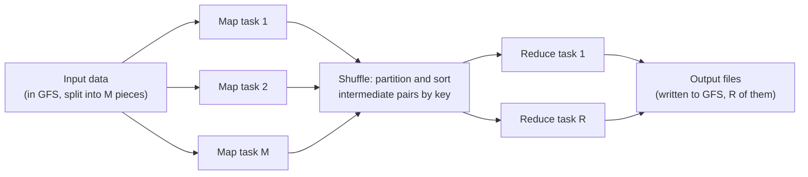

## Learning Objectives

- State the two functions a MapReduce programmer must supply, map and reduce, and explain precisely what type of input and output each one takes.
- Trace the full execution pipeline of a MapReduce job: splitting input, running map tasks, the shuffle, running reduce tasks, and writing output, identifying which stage reads from and writes to GFS.
- Explain why the intermediate data between map and reduce is partitioned by key, and why this partitioning is what makes parallel reduction correct rather than merely fast.
- Write the map and reduce functions for a simple problem (word counting) and explain what each invocation actually receives and emits.

## Context & Motivation

By the time GFS existed, Google's engineers still faced a second, related problem: an enormous number of large computations, counting words across a huge web crawl, building an inverted index, computing summaries of daily log data, needed to run over data spread across thousands of machines, and nearly every one of these computations followed the same underlying shape: apply some per-record transformation to a huge dataset, then aggregate the transformed records by some key. Before MapReduce, each new computation of this shape required its engineers to re-solve the same hard distributed-systems problems from scratch: how to split the input across machines, how to schedule work and recover from a worker crashing partway through, how to move intermediate results to the right place for aggregation, and how to handle a machine that is simply slow rather than dead.

The MapReduce paper, published at OSDI in 2004 by Jeffrey Dean and Sanjay Ghemawat, observes that this repeated, painful infrastructure work can be factored out entirely, if the actual computation is expressed using only two simple, purely functional operations, map and reduce, borrowed from functional programming but applied here at a scale functional programming's original designers never anticipated. Once a computation is expressed this way, the MapReduce runtime itself, not the application programmer, becomes responsible for parallelization, scheduling, data movement, and fault tolerance, developed fully in the next concept, letting engineers who are not distributed-systems specialists write large-scale parallel computations by writing what are, in isolation, two ordinary sequential functions.

This concept develops the programming model itself, the shape of map and reduce, and the pipeline a MapReduce job goes through from raw input to final output, leaving the runtime's fault-tolerance and scheduling mechanisms for the next concept.

## Core Theory

### The two functions, and what they actually receive and emit

A MapReduce job is specified by exactly two user-supplied functions, both expressed as operating over key/value pairs.

The **map** function takes one input key/value pair and produces zero, one, or many intermediate key/value pairs. Critically, map is applied independently to every input record, with no visibility into any other record, which is precisely what makes it trivially parallelizable across as many machines as there is input data to split across.

```
map(input_key, input_value) -> list of (intermediate_key, intermediate_value)
```

The **reduce** function takes one intermediate key, together with the complete list of every intermediate value that any map invocation anywhere produced for that specific key, and produces a (typically much shorter) list of output values for that key.

```
reduce(intermediate_key, list of intermediate_values) -> list of output_values
```

Between these two user-supplied functions sits a step the MapReduce runtime performs automatically, not something the programmer writes: taking every intermediate key/value pair emitted by every map invocation, across every machine, and grouping all the values that share the same intermediate key together, so that each reduce invocation receives the complete list for its key, no matter how many different map tasks, on how many different machines, originally produced pieces of that list. This grouping step is usually called the **shuffle**, and its correctness (every value for a given key ends up at the one reduce invocation responsible for that key, and no reduce invocation runs before it has the complete list) is exactly what makes reduce's output correct, not merely fast.

### The full execution pipeline



1. **Split.** The MapReduce library automatically splits the input files (typically already sitting in GFS) into M pieces, usually aligned to GFS chunk boundaries, so that each split can be processed by one map task without needing to fetch data from more than one or two chunkservers.
2. **Map.** The runtime assigns each of the M splits to an available worker machine, which runs the user's map function once per input record in its split, buffering the emitted intermediate key/value pairs in memory and periodically writing them to local disk, partitioned into R regions using a partitioning function (by default, a hash of the intermediate key modulo R) so that all pairs for a given key end up in the same one of the R partitions, no matter which map task produced them.
3. **Shuffle.** Once a map task finishes, the locations of its R partitioned intermediate files (still sitting on that worker's local disk, not yet in GFS) are reported back to the master, which forwards them to the reduce workers responsible for each partition. Each reduce worker reads, over the network, its one assigned partition's data from every map task's local output, then sorts the combined data by intermediate key, this is what turns "many separate, unordered chunks of intermediate pairs" into "one complete, grouped-by-key list per reduce invocation."
4. **Reduce.** Each reduce worker iterates over its sorted intermediate data, and for each distinct key, calls the user's reduce function exactly once with that key and the complete list of values for it, appending the reduce function's output to a final output file specific to that reduce task.
5. **Write output.** Each of the R reduce tasks writes its own output file, typically back into GFS, giving R output files total for the job (a downstream job, or a human, can read all R files as the job's complete output).

## Worked Examples

### Example 1: word count, the canonical MapReduce example

**Problem:** Write map and reduce functions that count the number of occurrences of every distinct word across a large collection of documents, and trace their execution on two tiny input documents.

**The functions:**
```
map(document_name, document_text):
    for each word w in document_text:
        emit(w, "1")

reduce(word, list_of_counts):
    total = sum of the integers in list_of_counts
    emit(word, total)
```

**Trace.** Suppose the input is split into two documents, handled by two map tasks. Document 1 contains the text `"the cat sat"`, document 2 contains `"the dog sat too"`.

Map task 1 (processing document 1) emits: `("the", "1")`, `("cat", "1")`, `("sat", "1")`.
Map task 2 (processing document 2) emits: `("the", "1")`, `("dog", "1")`, `("sat", "1")`, `("too", "1")`.

The shuffle groups these seven intermediate pairs by key, regardless of which map task produced them: key `"the"` collects the list `["1", "1"]` (one from each map task), key `"sat"` collects `["1", "1"]` (also one from each), while `"cat"`, `"dog"`, and `"too"` each collect a single-element list `["1"]`.

Reduce is then invoked once per distinct key: `reduce("the", ["1", "1"])` emits `("the", 2)`; `reduce("sat", ["1", "1"])` emits `("sat", 2)`; `reduce("cat", ["1"])` emits `("cat", 1)`; and similarly for `"dog"` and `"too"`, each emitting a count of 1. The final output, across however many of the R output files each key happened to land in, is the correct word count for every word across both documents, even though no single map task, and no single reduce task, ever saw both documents' full text at once.

### Example 2: why the shuffle's grouping, not just its speed, is what makes this correct

**Problem:** Suppose, instead of the runtime performing a correct shuffle, each reduce task were mistakenly given only the intermediate pairs from map tasks running on the same physical machine, rather than from every map task cluster-wide. Explain concretely what would go wrong with the word count example above.

**Resolution:** If map task 1 and map task 2 in Example 1 ran on different physical machines, and reduce task assignment ignored that fact, then the reduce invocation handling the key `"the"` might only ever see the single `"1"` emitted by whichever map task happened to run on its own machine, entirely missing the `"1"` emitted by the other map task on a different machine. The final count for `"the"` would silently come out as 1 instead of the correct 2, not because either map function or the reduce function contains a bug, but because the grouping step failed to actually gather every value for a given key from across the whole cluster before invoking reduce. This is precisely why the shuffle is not merely a performance optimization to be tuned or skipped, it is the mechanism that makes the parallel-map-then-parallel-reduce structure produce the same answer a single sequential pass over all the data would have produced.

## Common Misconceptions & Pitfalls

- **"Map and reduce are two steps that run one after the other, like a simple pipeline."** Within a single job, yes, all mapping conceptually precedes all reducing (a reduce invocation needs the complete list of values for its key before it can run correctly). But many map tasks run in parallel across many machines simultaneously, and many reduce tasks likewise run in parallel across many machines simultaneously, the model is a two-phase parallel pipeline, not two sequential single steps.
- **"The programmer controls which machine runs which map or reduce task, or how the shuffle physically works."** Neither is true, and this is the entire point of the model: the programmer supplies only the map and reduce functions, described as if operating on a single key/value pair or a single key's value list, respectively, with no awareness of machines, tasks, or the network at all. The runtime, developed in the next concept, is solely responsible for turning those two sequential-looking functions into an actual parallel, fault-tolerant execution across a cluster.
- **"Reduce receives values from only one map task."** Reduce receives the complete list of every value emitted for its key by every map task across the entire job, potentially hundreds of different map tasks running on hundreds of different machines, this is exactly the correctness property Example 2 shows breaking if the shuffle groups incorrectly.

## Summary

MapReduce factors a large class of data-parallel computations into exactly two user-supplied, purely functional pieces: map, applied independently to every input record to emit intermediate key/value pairs, and reduce, applied once per distinct intermediate key to the complete list of values the whole cluster produced for that key. Between them, the runtime automatically performs a shuffle, partitioning and grouping every intermediate pair by key across every map task's output, which is what guarantees each reduce invocation sees the complete list for its key, correctness, not merely a way to move data faster. Because map and reduce are expressed with no awareness of machines or the network, the same two functions that would work correctly as a small sequential program also run correctly as a large parallel job, with the runtime alone responsible for splitting input, scheduling tasks across a cluster, and, as the next concept develops, tolerating the machine failures that are the expected condition at this scale.

## Documentation Links

- [Dean, Ghemawat: MapReduce: Simplified Data Processing on Large Clusters (OSDI 2004)](https://research.google.com/archive/mapreduce-osdi04.pdf): doc
