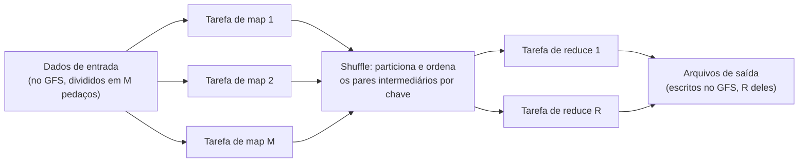

## Objetivos de Aprendizagem

- Enunciar as duas funções que um programador MapReduce precisa fornecer, map e reduce, e explicar com precisão que tipo de entrada e saída cada uma recebe.
- Rastrear o pipeline completo de execução de um job MapReduce: divisão da entrada, execução das tarefas de map, o shuffle, execução das tarefas de reduce e escrita da saída, identificando qual etapa lê do GFS e escreve nele.
- Explicar por que os dados intermediários entre map e reduce são particionados por chave, e por que esse particionamento é o que torna a redução paralela correta, e não meramente rápida.
- Escrever as funções map e reduce para um problema simples (contagem de palavras) e explicar o que cada invocação de fato recebe e emite.

## Contexto e Motivação

Quando o GFS já existia, os engenheiros do Google ainda enfrentavam um segundo problema, relacionado: um número enorme de computações grandes (contar palavras num rastreamento web gigantesco, construir um índice invertido, calcular resumos de dados de log diários) precisava rodar sobre dados espalhados por milhares de máquinas, e quase todas essas computações seguiam a mesma forma subjacente: aplicar alguma transformação por registro a um conjunto de dados enorme, e depois agregar os registros transformados por alguma chave. Antes do MapReduce, cada nova computação com essa forma exigia que os seus engenheiros resolvessem de novo, do zero, os mesmos problemas difíceis de sistemas distribuídos: como dividir a entrada entre as máquinas, como escalonar o trabalho e se recuperar de um worker que trava no meio do caminho, como mover os resultados intermediários para o lugar certo para a agregação, e como lidar com uma máquina que está simplesmente lenta, e não morta.

O artigo do MapReduce, publicado no OSDI em 2004 por Jeffrey Dean e Sanjay Ghemawat, observa que esse trabalho de infraestrutura repetido e penoso pode ser fatorado por completo, se a computação de fato for expressa usando só duas operações simples e puramente funcionais, map e reduce, emprestadas da programação funcional, mas aplicadas aqui numa escala que os projetistas originais da programação funcional nunca anteciparam. Uma vez que uma computação é expressa desse jeito, o próprio runtime do MapReduce, e não o programador da aplicação, passa a ser responsável pela paralelização, pelo escalonamento, pela movimentação de dados e pela tolerância a falhas (desenvolvida por completo no próximo conceito), permitindo que engenheiros que não são especialistas em sistemas distribuídos escrevam computações paralelas em larga escala escrevendo o que são, isoladamente, duas funções sequenciais comuns.

Este conceito desenvolve o modelo de programação em si, a forma de map e reduce, e o pipeline pelo qual um job MapReduce passa da entrada bruta até a saída final, deixando os mecanismos de tolerância a falhas e de escalonamento do runtime para o próximo conceito.

## Teoria Central

### As duas funções, e o que elas de fato recebem e emitem

Um job MapReduce é especificado por exatamente duas funções fornecidas pelo usuário, ambas expressas como operando sobre pares chave/valor.

A função **map** recebe um par chave/valor de entrada e produz zero, um ou muitos pares chave/valor intermediários. Crucialmente, o map é aplicado de forma independente a cada registro de entrada, sem nenhuma visibilidade de qualquer outro registro, e é precisamente isso que o torna trivialmente paralelizável em tantas máquinas quanto houver dados de entrada para dividir.

```
map(input_key, input_value) -> list of (intermediate_key, intermediate_value)
```

A função **reduce** recebe uma chave intermediária, junto com a lista completa de todos os valores intermediários que qualquer invocação de map, em qualquer lugar, produziu para aquela chave específica, e produz uma lista (normalmente muito mais curta) de valores de saída para aquela chave.

```
reduce(intermediate_key, list of intermediate_values) -> list of output_values
```

Entre essas duas funções fornecidas pelo usuário fica um passo que o runtime do MapReduce realiza automaticamente, e não algo que o programador escreve: pegar todo par chave/valor intermediário emitido por toda invocação de map, em toda máquina, e agrupar todos os valores que compartilham a mesma chave intermediária, para que cada invocação de reduce receba a lista completa da sua chave, não importa quantas tarefas de map diferentes, em quantas máquinas diferentes, tenham produzido originalmente pedaços dessa lista. Esse passo de agrupamento costuma ser chamado de **shuffle** (embaralhamento), e a sua corretude (todo valor de uma dada chave termina na única invocação de reduce responsável por essa chave, e nenhuma invocação de reduce roda antes de ter a lista completa) é exatamente o que torna a saída do reduce correta, e não meramente rápida.

### O pipeline completo de execução



1. **Divisão.** A biblioteca do MapReduce divide automaticamente os arquivos de entrada (normalmente já guardados no GFS) em M pedaços, geralmente alinhados às fronteiras dos chunks do GFS, para que cada pedaço possa ser processado por uma tarefa de map sem precisar buscar dados de mais de um ou dois chunkservers.
2. **Map.** O runtime atribui cada um dos M pedaços a uma máquina worker disponível, que roda a função map do usuário uma vez por registro de entrada do seu pedaço, guardando em buffer na memória os pares chave/valor intermediários emitidos e escrevendo-os periodicamente no disco local, particionados em R regiões por uma função de particionamento (por padrão, um hash da chave intermediária módulo R), para que todos os pares de uma dada chave terminem na mesma das R partições, não importa qual tarefa de map os tenha produzido.
3. **Shuffle.** Quando uma tarefa de map termina, as localizações dos seus R arquivos intermediários particionados (ainda no disco local daquele worker, e não no GFS) são reportadas ao master, que as repassa aos workers de reduce responsáveis por cada partição. Cada worker de reduce lê, pela rede, os dados da sua partição atribuída na saída local de cada tarefa de map, e então ordena os dados combinados por chave intermediária. É isso que transforma "muitos pedaços separados e desordenados de pares intermediários" em "uma lista completa, agrupada por chave, por invocação de reduce".
4. **Reduce.** Cada worker de reduce itera sobre os seus dados intermediários ordenados e, para cada chave distinta, chama a função reduce do usuário exatamente uma vez com essa chave e a lista completa de valores dela, anexando a saída da função reduce a um arquivo de saída final específico daquela tarefa de reduce.
5. **Escrita da saída.** Cada uma das R tarefas de reduce escreve o seu próprio arquivo de saída, normalmente de volta no GFS, totalizando R arquivos de saída para o job (um job posterior, ou uma pessoa, pode ler os R arquivos como a saída completa do job).

## Exemplos Resolvidos

### Exemplo 1: contagem de palavras, o exemplo canônico de MapReduce

**Problema:** Escreva funções map e reduce que contem o número de ocorrências de cada palavra distinta numa grande coleção de documentos, e rastreie a sua execução sobre dois documentos de entrada minúsculos.

**As funções:**
```
map(document_name, document_text):
    for each word w in document_text:
        emit(w, "1")

reduce(word, list_of_counts):
    total = sum of the integers in list_of_counts
    emit(word, total)
```

**Rastreamento.** Suponha que a entrada seja dividida em dois documentos, tratados por duas tarefas de map. O documento 1 contém o texto `"the cat sat"`, e o documento 2 contém `"the dog sat too"`.

A tarefa de map 1 (processando o documento 1) emite: `("the", "1")`, `("cat", "1")`, `("sat", "1")`.
A tarefa de map 2 (processando o documento 2) emite: `("the", "1")`, `("dog", "1")`, `("sat", "1")`, `("too", "1")`.

O shuffle agrupa esses sete pares intermediários por chave, independentemente de qual tarefa de map os produziu: a chave `"the"` coleta a lista `["1", "1"]` (um de cada tarefa de map), a chave `"sat"` coleta `["1", "1"]` (também um de cada), enquanto `"cat"`, `"dog"` e `"too"` coletam cada uma uma lista de um único elemento, `["1"]`.

O reduce é então invocado uma vez por chave distinta: `reduce("the", ["1", "1"])` emite `("the", 2)`; `reduce("sat", ["1", "1"])` emite `("sat", 2)`; `reduce("cat", ["1"])` emite `("cat", 1)`; e o mesmo para `"dog"` e `"too"`, cada uma emitindo uma contagem de 1. A saída final, em qualquer que seja o arquivo dentre os R arquivos de saída em que cada chave tenha caído, é a contagem correta de cada palavra nos dois documentos, mesmo que nenhuma tarefa de map isolada, e nenhuma tarefa de reduce isolada, jamais tenha visto o texto completo dos dois documentos ao mesmo tempo.

### Exemplo 2: por que é o agrupamento do shuffle, e não só a sua velocidade, que torna isto correto

**Problema:** Suponha que, em vez de o runtime realizar um shuffle correto, cada tarefa de reduce recebesse por engano só os pares intermediários das tarefas de map que rodaram na mesma máquina física, em vez dos de toda tarefa de map do cluster. Explique concretamente o que daria errado no exemplo de contagem de palavras acima.

**Resolução:** Se as tarefas de map 1 e 2 do Exemplo 1 rodassem em máquinas físicas diferentes, e a atribuição das tarefas de reduce ignorasse esse fato, a invocação de reduce que trata a chave `"the"` poderia ver só o único `"1"` emitido pela tarefa de map que por acaso rodou na sua própria máquina, perdendo por completo o `"1"` emitido pela outra tarefa de map, numa máquina diferente. A contagem final de `"the"` sairia silenciosamente como 1, em vez do 2 correto, não porque a função map ou a função reduce contenha um bug, mas porque o passo de agrupamento falhou em de fato reunir todo valor de uma dada chave de todo o cluster antes de invocar o reduce. É precisamente por isso que o shuffle não é meramente uma otimização de desempenho a ser ajustada ou pulada: ele é o mecanismo que faz a estrutura de map paralelo seguido de reduce paralelo produzir a mesma resposta que uma única passada sequencial sobre todos os dados teria produzido.

## Equívocos Comuns e Armadilhas

- **"Map e reduce são dois passos que rodam um depois do outro, como um pipeline simples."** Dentro de um único job, sim, todo o mapeamento precede conceitualmente toda a redução (uma invocação de reduce precisa da lista completa de valores da sua chave antes de poder rodar corretamente). Mas muitas tarefas de map rodam em paralelo em muitas máquinas ao mesmo tempo, e muitas tarefas de reduce da mesma forma rodam em paralelo em muitas máquinas ao mesmo tempo: o modelo é um pipeline paralelo de duas fases, e não dois passos sequenciais únicos.
- **"O programador controla qual máquina roda qual tarefa de map ou de reduce, ou como o shuffle funciona fisicamente."** Nenhuma das duas coisas é verdade, e esse é o ponto inteiro do modelo: o programador fornece só as funções map e reduce, descritas como se operassem sobre um único par chave/valor ou sobre a lista de valores de uma única chave, respectivamente, sem nenhuma consciência de máquinas, tarefas ou da rede. O runtime, desenvolvido no próximo conceito, é o único responsável por transformar essas duas funções de aparência sequencial numa execução paralela real e tolerante a falhas num cluster.
- **"O reduce recebe valores de uma única tarefa de map."** O reduce recebe a lista completa de todo valor emitido para a sua chave por toda tarefa de map do job inteiro, potencialmente centenas de tarefas de map diferentes rodando em centenas de máquinas diferentes. Esta é exatamente a propriedade de corretude que o Exemplo 2 mostra quebrando se o shuffle agrupa incorretamente.

## Resumo

O MapReduce fatora uma grande classe de computações de dados paralelos em exatamente duas peças puramente funcionais fornecidas pelo usuário: o map, aplicado de forma independente a cada registro de entrada para emitir pares chave/valor intermediários, e o reduce, aplicado uma vez por chave intermediária distinta à lista completa de valores que o cluster inteiro produziu para essa chave. Entre os dois, o runtime realiza automaticamente um shuffle, particionando e agrupando todo par intermediário por chave na saída de toda tarefa de map, e é isso que garante que cada invocação de reduce veja a lista completa da sua chave: corretude, e não meramente um jeito de mover dados mais rápido. Como map e reduce são expressos sem nenhuma consciência de máquinas ou da rede, as mesmas duas funções que funcionariam corretamente como um pequeno programa sequencial também rodam corretamente como um grande job paralelo, com o runtime sozinho responsável por dividir a entrada, escalonar tarefas num cluster e, como o próximo conceito desenvolve, tolerar as falhas de máquina que são a condição esperada nessa escala.

## Documentation Links

- [Dean, Ghemawat: MapReduce: Simplified Data Processing on Large Clusters (OSDI 2004)](https://research.google.com/archive/mapreduce-osdi04.pdf): doc
