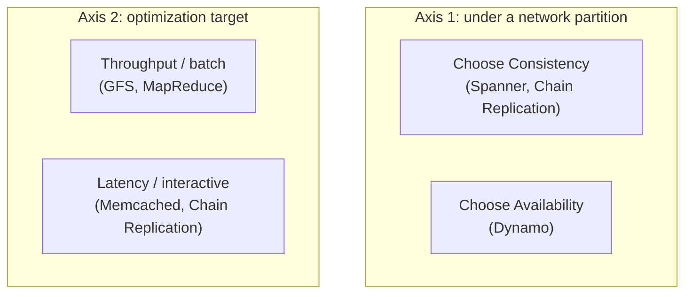

## Learning Objectives

- Explain why the theoretical primitives covered in Distributed Systems I (consensus, replication, consistency models) are necessary but not sufficient to build a real production system.
- Describe the specific new problem cloud-scale systems face that a single-machine or small-cluster system does not: designing for constant partial failure as the normal case, not the exception.
- Identify the two axes every system studied in this discipline makes an explicit, opinionated choice on: consistency versus availability, and throughput versus latency.
- Name the general shape this discipline follows: real, published systems from Google, Amazon, and Facebook, each read as a case study of one specific set of trade-offs rather than as a single "correct" cloud architecture.

## Context & Motivation

Distributed Systems I answers a narrow, precise question: given a fixed, formal model of failure (crash-stop, or Byzantine), what is provably achievable at all? It proves that consensus is solvable despite crash faults (Paxos, Raft), defines exactly what linearizability and eventual consistency mean, and states the CAP theorem as a hard limit. All of that is correct, and none of it tells an engineer what to actually build when asked to store every photo ever uploaded to a service with a billion users, or to run a data-processing job over a petabyte of logs before a deadline. This discipline picks up exactly where that gap opens: it studies real, published systems, each one a specific, working answer to a version of that question, at a scale where a single machine, or even a machine that never fails, is not an option.

The central shift in mindset is this: at the scale these systems operate at (thousands of machines, sourced from commodity hardware, running continuously for years), partial failure of some component is not an edge case to be handled defensively, it is the *expected, steady-state condition* of the system. A design that assumes "the network is usually fine" or "disks rarely fail" will page an on-call engineer every night; a design that assumes "several machines are down or slow right now, always" is the only kind that survives contact with a real data center. Google's own internal experience, cited across several of the papers this discipline studies, put failure rates at a scale where a cluster of a few thousand machines sees multiple failures every single day as a matter of course. Every system studied here, the Google File System, MapReduce, Bigtable, Dynamo, Spanner, treats that fact as the starting assumption of its design, not an afterthought bolted on at the end.

The MIT graduate course this discipline traces most closely (6.5840, Distributed Systems Engineering) is explicit that most of its content, after the first few weeks of consensus theory, consists of exactly this: reading and discussing one classic systems paper per lecture, extracting the specific principles and techniques each system uses. This discipline follows that same structure and the same selection of papers where they overlap, deliberately choosing systems that do *not* duplicate the theory already covered (Paxos, Raft, linearizability, the CAP theorem are assumed known from Distributed Systems I) and instead show how that theory gets composed, bent, or deliberately relaxed inside a real, working system built to answer one specific problem: storing files across thousands of disks (GFS), processing data in parallel across thousands of machines (MapReduce), storing sparse structured data at web scale (Bigtable), staying available even during network partitions (Dynamo), replicating with both throughput and strong consistency (Chain Replication), and remaining consistent across data centers on different continents (Spanner).

## Core Theory

### The two axes every system in this discipline chooses a point on

Every system studied in this discipline can be placed, at least approximately, on two independent axes, and naming where a system sits on each axis is the fastest way to understand *why* it is built the way it is, before reading a single implementation detail.

**Consistency versus availability under partition.** The CAP theorem (Distributed Systems I) says a partitioned system must give up either consistency or availability; it does not say which one to give up, and different systems in this discipline make opposite choices on purpose. Dynamo chooses availability: a write always succeeds somewhere, even during a partition, at the cost of the application later having to reconcile conflicting versions. Spanner chooses consistency: a transaction that cannot reach enough replicas to satisfy its consensus quorum simply does not commit, at the cost of some availability during a severe partition. Neither choice is "the mistake"; each is correct for the workload the system was actually built to serve (Dynamo backs Amazon's shopping cart, where availability of the cart matters more than perfect accuracy of every item; Spanner backs financial and ad-serving data, where a wrong balance is a much worse outcome than a slow response).

**Throughput versus latency, and where work is placed.** GFS and MapReduce prioritize aggregate throughput over any single operation's latency, they are built for huge batch jobs where the *job* finishing matters, not any individual read's speed. Memcached and Chain Replication sit at the opposite end, individual operations need to be fast because a live user is waiting on them. This axis also governs where computation happens: MapReduce famously moves computation to the data (scheduling a map task on the machine that already holds its input chunk) rather than moving huge volumes of data to the computation, because at this scale network bandwidth, not CPU, is very often the scarce resource.

### Reading a systems paper as a case study, not a blueprint

A recurring failure mode when first reading these papers is to treat each one as *the* correct way to build a distributed storage or compute system, and to try to copy its exact mechanisms into an unrelated problem. The more useful reading is to ask, for each system: what specific workload was this built for, what did its designers assume about failure and scale, and which one of the two axes above did they deliberately trade away? GFS's relaxed consistency model (studied next) only makes sense once it is clear GFS was built for MapReduce-style batch jobs writing huge, mostly-append-only files, not for a workload that needs random-access updates with strong consistency; judged against that specific target, the relaxed model is a deliberate, well-reasoned choice, not a shortcut.

## Worked Examples

### Example 1: placing three real systems on the two axes

**Problem:** Using only what is known about their goals so far, place GFS, Dynamo, and Chain Replication on the consistency/availability and throughput/latency axes, and justify each placement.

**GFS:** Built to hold input and output for massive batch analytics jobs (MapReduce). Optimizes overwhelmingly for aggregate throughput over huge sequential reads and appends; a single client's read latency is not the design's priority. On the consistency axis, GFS is intentionally relaxed (the next concept develops this precisely), because its target workload, an append-only log written by many producers, tolerates the specific undefined regions GFS allows in exchange for a lock-free atomic append.

**Dynamo:** Built to back Amazon's shopping cart and similar always-must-respond services. Explicitly chooses availability over consistency under a partition (a write always succeeds, even if that means two conflicting versions must be reconciled later). Sits closer to the latency-sensitive end of the second axis, since a shopping cart write or read is a single, small, interactive operation, not a batch job.

**Chain Replication:** Built to back storage systems (like parts of a Google-style infrastructure stack) that need both strong consistency and high write throughput at once, refusing to treat that as a forced trade-off. Chooses consistency (every read reflects every prior committed write, since only the tail answers reads). On the throughput axis, it is explicitly optimized to spread write load across every node in the chain rather than bottlenecking a single primary, closer to the throughput end while still keeping individual-operation latency reasonable.

### Example 2: why "just use Paxos for everything" is not a complete answer

**Problem:** A newcomer to this discipline argues that since Paxos (or Raft) already solves consensus correctly, every system in this discipline could simply be built as "a Paxos-replicated log," making the rest of the discipline unnecessary. Explain what this misses, using GFS and Bigtable as counterexamples.

**Resolution:** Paxos and Raft solve one specific problem: getting a set of replicas to agree, in order, on a sequence of values, tolerating crash faults. That is genuinely necessary inside several systems in this discipline (Bigtable's Chubby lock service, and the open coordination service ZooKeeper studied later, are both built on a Paxos-like or Raft-like atomic broadcast protocol). But it is not sufficient by itself to answer questions Paxos was never designed to answer: how should petabytes of file data actually be laid out across disks and machines (GFS's chunk-and-master design), what data model and on-disk file format serves a sparse, extremely wide table efficiently (Bigtable's SSTables), or how should a batch computation be scheduled and re-executed on failure across thousands of workers (MapReduce). Consensus is one load-bearing component used inside some of these systems, not a substitute for the rest of the system's design.

## Common Misconceptions & Pitfalls

- **"Since Distributed Systems I already covered consensus and consistency, this discipline is redundant."** The theory concept discipline proves what is possible in principle and gives the vocabulary (linearizability, quorum, replicated state machine) this discipline assumes as already known; it deliberately does not build a single real storage or compute system end to end. This discipline studies exactly that: how five to seven specific engineering teams actually assembled those primitives, plus a great deal of engineering judgment about layout, scheduling, and failure handling, into working systems serving real traffic.
- **"A system that chooses availability over consistency (like Dynamo) is simply less rigorous or less correct than one that chooses consistency (like Spanner)."** Both are precisely specified, rigorously reasoned systems; they simply optimize for different, equally legitimate requirements. A shopping cart that occasionally shows a stale item list but is always available is the right design for its job; a bank ledger that refuses to show two different balances at once, even at some cost to availability, is the right design for its job. "Rigor" in this discipline means clearly stating and honoring the trade-off made, not always picking the strongest possible guarantee.
- **"Failure handling is a detail to add after the main design is done."** Every system studied in this discipline treats constant partial failure as a first-class input to the design, not an add-on. GFS's chunk replication, MapReduce's backup task execution, and Dynamo's hinted handoff are not "extra fault-tolerance code" layered onto an otherwise-complete design; they are integral to what the design even is, removing any of them would leave a fundamentally different (and, at this scale, non-functional) system.

## Summary

Distributed Systems I establishes what is theoretically achievable, consensus, precise consistency models, the CAP theorem's hard limit, using a small, formal model of failure. This discipline studies what real, published systems at Google, Amazon, and Facebook actually built on top of that theory, at a scale where partial failure is the expected steady state, not an exception. Every system studied here can be placed, usefully, on two axes: how it resolves the CAP theorem's forced choice under a partition (consistency, like Spanner and Chain Replication, or availability, like Dynamo), and whether it optimizes for aggregate throughput over batch workloads (GFS, MapReduce) or for individual-operation latency (Memcached, Chain Replication). Reading each system as a case study, asking what workload it targets and which trade-off it deliberately made, rather than as a single universal blueprint, is the right lens for everything that follows in this discipline.

## Documentation Links

- [MIT 6.5840: Course Schedule (case-study papers)](https://pdos.csail.mit.edu/6.824/schedule.html): doc
- [MIT 6.5840: General Information](https://pdos.csail.mit.edu/6.824/general.html): doc
