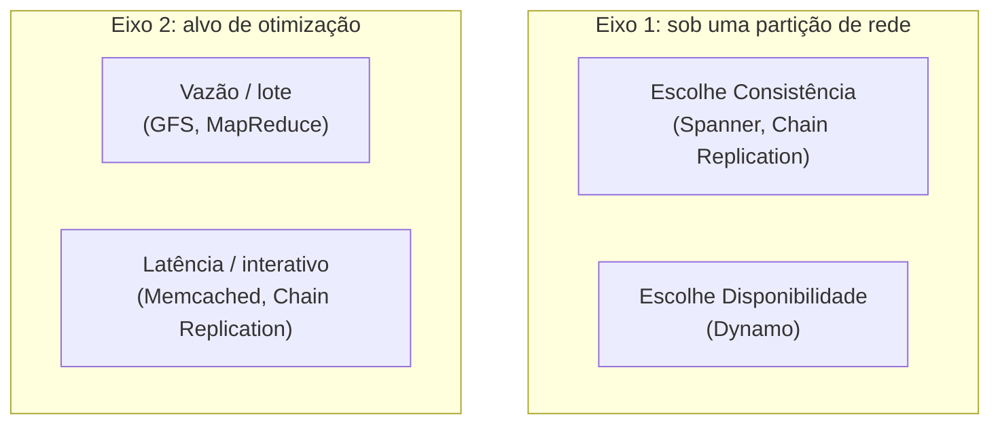

## Objetivos de Aprendizagem

- Explicar por que as primitivas teóricas cobertas em Sistemas Distribuídos I (consenso, replicação, modelos de consistência) são necessárias, mas não suficientes, para construir um sistema de produção real.
- Descrever o problema novo e específico que os sistemas em escala de nuvem enfrentam e que um sistema de uma única máquina ou de um cluster pequeno não enfrenta: projetar para a falha parcial constante como o caso normal, e não a exceção.
- Identificar os dois eixos em que todo sistema estudado nesta disciplina faz uma escolha explícita e opinativa: consistência versus disponibilidade, e vazão versus latência.
- Nomear a forma geral que esta disciplina segue: sistemas reais e publicados do Google, da Amazon e do Facebook, cada um lido como um estudo de caso de um conjunto específico de trade-offs, e não como uma única arquitetura de nuvem "correta".

## Contexto e Motivação

Sistemas Distribuídos I responde a uma pergunta estreita e precisa: dado um modelo formal e fixo de falha (crash-stop, ou bizantino), o que é demonstravelmente possível de alcançar? Ela prova que o consenso é solucionável apesar de falhas por travamento (Paxos, Raft), define exatamente o que significam linearizabilidade e consistência eventual, e enuncia o teorema CAP como um limite rígido. Tudo isso está correto, e nada disso diz a um engenheiro o que de fato construir quando lhe pedem para armazenar toda foto já enviada a um serviço com um bilhão de usuários, ou para rodar um job de processamento de dados sobre um petabyte de logs antes de um prazo. Esta disciplina começa exatamente onde essa lacuna se abre: ela estuda sistemas reais e publicados, cada um uma resposta específica e funcional a uma versão dessa pergunta, numa escala em que uma única máquina, ou mesmo uma máquina que nunca falha, não é uma opção.

A mudança central de mentalidade é esta: na escala em que estes sistemas operam (milhares de máquinas, montadas a partir de hardware comum, rodando continuamente por anos), a falha parcial de algum componente não é um caso extremo a ser tratado defensivamente, é a *condição esperada e permanente* do sistema. Um projeto que assume que "a rede geralmente está bem" ou que "discos raramente falham" vai acionar um engenheiro de plantão toda noite; um projeto que assume que "várias máquinas estão fora do ar ou lentas agora mesmo, sempre" é o único tipo que sobrevive ao contato com um data center real. A própria experiência interna do Google, citada em vários dos artigos que esta disciplina estuda, colocava as taxas de falha numa escala em que um cluster de alguns milhares de máquinas vê várias falhas todo santo dia, como algo corriqueiro. Todo sistema estudado aqui (o Google File System, o MapReduce, o Bigtable, o Dynamo, o Spanner) trata esse fato como a suposição inicial do seu projeto, e não como algo acoplado no fim.

O curso de pós-graduação do MIT que esta disciplina segue mais de perto (6.5840, Distributed Systems Engineering) é explícito ao dizer que a maior parte do seu conteúdo, depois das primeiras semanas de teoria de consenso, consiste exatamente nisto: ler e discutir um artigo clássico de sistemas por aula, extraindo os princípios e as técnicas específicos que cada sistema usa. Esta disciplina segue essa mesma estrutura e a mesma seleção de artigos onde elas se sobrepõem, escolhendo deliberadamente sistemas que *não* duplicam a teoria já coberta (Paxos, Raft, linearizabilidade e o teorema CAP são assumidos como conhecidos de Sistemas Distribuídos I) e que, em vez disso, mostram como essa teoria é composta, dobrada ou deliberadamente relaxada dentro de um sistema real e funcional, construído para responder a um problema específico: armazenar arquivos em milhares de discos (GFS), processar dados em paralelo em milhares de máquinas (MapReduce), armazenar dados estruturados esparsos em escala web (Bigtable), permanecer disponível mesmo durante partições de rede (Dynamo), replicar com vazão e consistência forte ao mesmo tempo (Chain Replication), e permanecer consistente entre data centers em continentes diferentes (Spanner).

## Teoria Central

### Os dois eixos em que todo sistema desta disciplina escolhe um ponto

Todo sistema estudado nesta disciplina pode ser posicionado, pelo menos aproximadamente, em dois eixos independentes, e nomear onde um sistema fica em cada eixo é o jeito mais rápido de entender *por que* ele é construído do jeito que é, antes de ler um único detalhe de implementação.

**Consistência versus disponibilidade sob partição.** O teorema CAP (Sistemas Distribuídos I) diz que um sistema particionado precisa abrir mão da consistência ou da disponibilidade; ele não diz de qual abrir mão, e sistemas diferentes nesta disciplina fazem escolhas opostas de propósito. O Dynamo escolhe a disponibilidade: uma escrita sempre tem sucesso em algum lugar, mesmo durante uma partição, ao custo de a aplicação depois precisar reconciliar versões conflitantes. O Spanner escolhe a consistência: uma transação que não consegue alcançar réplicas suficientes para satisfazer o seu quórum de consenso simplesmente não é confirmada, ao custo de alguma disponibilidade durante uma partição severa. Nenhuma das escolhas é "o erro"; cada uma é correta para a carga de trabalho que o sistema foi de fato construído para atender (o Dynamo sustenta o carrinho de compras da Amazon, onde a disponibilidade do carrinho importa mais do que a precisão perfeita de cada item; o Spanner sustenta dados financeiros e de veiculação de anúncios, onde um saldo errado é um resultado muito pior do que uma resposta lenta).

**Vazão versus latência, e onde o trabalho é colocado.** O GFS e o MapReduce priorizam a vazão agregada acima da latência de qualquer operação individual: eles são construídos para jobs em lote enormes, em que importa o *job* terminar, e não a velocidade de alguma leitura individual. O Memcached e o Chain Replication ficam na ponta oposta: as operações individuais precisam ser rápidas porque um usuário ao vivo está esperando por elas. Esse eixo também governa onde a computação acontece: o MapReduce famosamente leva a computação até os dados (escalonando uma tarefa de map na máquina que já guarda o seu chunk de entrada) em vez de levar volumes enormes de dados até a computação, porque nessa escala a largura de banda da rede, e não a CPU, muitas vezes é o recurso escasso.

### Ler um artigo de sistemas como estudo de caso, e não como planta

Um modo de falha recorrente ao ler estes artigos pela primeira vez é tratar cada um como *o* jeito correto de construir um sistema distribuído de armazenamento ou de computação, e tentar copiar os seus mecanismos exatos para um problema não relacionado. A leitura mais útil é perguntar, para cada sistema: para qual carga de trabalho específica ele foi construído, o que os seus projetistas assumiram sobre falha e escala, e de qual dos dois eixos acima eles abriram mão deliberadamente? O modelo de consistência relaxado do GFS (estudado a seguir) só faz sentido quando fica claro que o GFS foi construído para jobs em lote no estilo MapReduce que escrevem arquivos enormes, majoritariamente só de anexação, e não para uma carga de trabalho que precisa de atualizações de acesso aleatório com consistência forte. Julgado contra esse alvo específico, o modelo relaxado é uma escolha deliberada e bem fundamentada, e não um atalho.

## Exemplos Resolvidos

### Exemplo 1: posicionando três sistemas reais nos dois eixos

**Problema:** Usando só o que se sabe até agora sobre os seus objetivos, posicione o GFS, o Dynamo e o Chain Replication nos eixos de consistência/disponibilidade e de vazão/latência, e justifique cada posicionamento.

**GFS:** Construído para guardar a entrada e a saída de jobs massivos de análise em lote (MapReduce). Otimiza esmagadoramente para a vazão agregada em leituras sequenciais e anexações enormes; a latência de leitura de um único cliente não é a prioridade do projeto. No eixo da consistência, o GFS é intencionalmente relaxado (o próximo conceito desenvolve isso com precisão), porque a sua carga de trabalho alvo, um log só de anexação escrito por muitos produtores, tolera as regiões indefinidas específicas que o GFS permite em troca de uma anexação atômica sem travas.

**Dynamo:** Construído para sustentar o carrinho de compras da Amazon e serviços semelhantes que sempre precisam responder. Escolhe explicitamente a disponibilidade acima da consistência sob uma partição (uma escrita sempre tem sucesso, mesmo que isso signifique que duas versões conflitantes precisem ser reconciliadas depois). Fica mais perto da ponta sensível à latência do segundo eixo, já que uma escrita ou leitura de carrinho de compras é uma operação única, pequena e interativa, e não um job em lote.

**Chain Replication:** Construído para sustentar sistemas de armazenamento (como partes de uma pilha de infraestrutura no estilo Google) que precisam de consistência forte e alta vazão de escrita ao mesmo tempo, recusando-se a tratar isso como um trade-off forçado. Escolhe a consistência (toda leitura reflete toda escrita confirmada anterior, já que só a cauda responde às leituras). No eixo da vazão, ele é explicitamente otimizado para espalhar a carga de escrita por todos os nós da cadeia em vez de criar um gargalo num único primário, mais perto da ponta da vazão, mas ainda mantendo razoável a latência de cada operação individual.

### Exemplo 2: por que "é só usar Paxos para tudo" não é uma resposta completa

**Problema:** Alguém novo nesta disciplina argumenta que, como o Paxos (ou o Raft) já resolve o consenso corretamente, todo sistema desta disciplina poderia simplesmente ser construído como "um log replicado por Paxos", tornando o resto da disciplina desnecessário. Explique o que isso deixa escapar, usando o GFS e o Bigtable como contraexemplos.

**Resolução:** O Paxos e o Raft resolvem um problema específico: fazer um conjunto de réplicas concordar, em ordem, sobre uma sequência de valores, tolerando falhas por travamento. Isso é genuinamente necessário dentro de vários sistemas desta disciplina (o serviço de travas Chubby do Bigtable, e o serviço de coordenação aberto ZooKeeper, estudado mais adiante, são ambos construídos sobre um protocolo de broadcast atômico parecido com Paxos ou com Raft). Mas isso não é suficiente, por si só, para responder perguntas que o Paxos nunca foi projetado para responder: como petabytes de dados de arquivo devem de fato ser dispostos em discos e máquinas (o projeto de chunks e master do GFS), qual modelo de dados e formato de arquivo em disco atende de forma eficiente uma tabela esparsa e extremamente larga (as SSTables do Bigtable), ou como uma computação em lote deve ser escalonada e reexecutada em caso de falha em milhares de workers (MapReduce). O consenso é um componente estrutural usado dentro de alguns destes sistemas, e não um substituto para o resto do projeto do sistema.

## Equívocos Comuns e Armadilhas

- **"Como Sistemas Distribuídos I já cobriu consenso e consistência, esta disciplina é redundante."** A disciplina de teoria prova o que é possível em princípio e dá o vocabulário (linearizabilidade, quórum, máquina de estados replicada) que esta disciplina assume como já conhecido; ela deliberadamente não constrói um único sistema real de armazenamento ou de computação de ponta a ponta. Esta disciplina estuda exatamente isso: como cinco a sete equipes de engenharia específicas de fato montaram essas primitivas, mais uma grande dose de julgamento de engenharia sobre layout, escalonamento e tratamento de falhas, em sistemas funcionais que atendem tráfego real.
- **"Um sistema que escolhe disponibilidade acima de consistência (como o Dynamo) é simplesmente menos rigoroso ou menos correto do que um que escolhe consistência (como o Spanner)."** Os dois são sistemas especificados com precisão e raciocinados com rigor; eles simplesmente otimizam para requisitos diferentes e igualmente legítimos. Um carrinho de compras que ocasionalmente mostra uma lista de itens desatualizada, mas está sempre disponível, é o projeto certo para o seu trabalho; um livro-razão bancário que se recusa a mostrar dois saldos diferentes ao mesmo tempo, mesmo a algum custo de disponibilidade, é o projeto certo para o seu trabalho. "Rigor" nesta disciplina significa enunciar claramente e honrar o trade-off feito, e não escolher sempre a garantia mais forte possível.
- **"O tratamento de falhas é um detalhe a acrescentar depois que o projeto principal estiver pronto."** Todo sistema estudado nesta disciplina trata a falha parcial constante como uma entrada de primeira classe do projeto, e não como um complemento. A replicação de chunks do GFS, a execução de tarefas de backup do MapReduce e o hinted handoff do Dynamo não são "código extra de tolerância a falhas" colocado por cima de um projeto de outro modo completo; eles são parte integrante do que o projeto é. Remover qualquer um deles deixaria um sistema fundamentalmente diferente (e, nessa escala, não funcional).

## Resumo

Sistemas Distribuídos I estabelece o que é teoricamente alcançável (consenso, modelos de consistência precisos, o limite rígido do teorema CAP) usando um modelo de falha pequeno e formal. Esta disciplina estuda o que sistemas reais e publicados do Google, da Amazon e do Facebook de fato construíram em cima dessa teoria, numa escala em que a falha parcial é a condição permanente esperada, e não uma exceção. Todo sistema estudado aqui pode ser posicionado, de forma útil, em dois eixos: como ele resolve a escolha forçada do teorema CAP sob uma partição (consistência, como o Spanner e o Chain Replication, ou disponibilidade, como o Dynamo), e se ele otimiza para a vazão agregada em cargas de trabalho em lote (GFS, MapReduce) ou para a latência de cada operação individual (Memcached, Chain Replication). Ler cada sistema como um estudo de caso, perguntando qual carga de trabalho ele mira e qual trade-off fez deliberadamente, em vez de como uma única planta universal, é a lente certa para tudo o que vem a seguir nesta disciplina.

## Documentation Links

- [MIT 6.5840: Course Schedule (case-study papers)](https://pdos.csail.mit.edu/6.824/schedule.html): doc
- [MIT 6.5840: General Information](https://pdos.csail.mit.edu/6.824/general.html): doc
