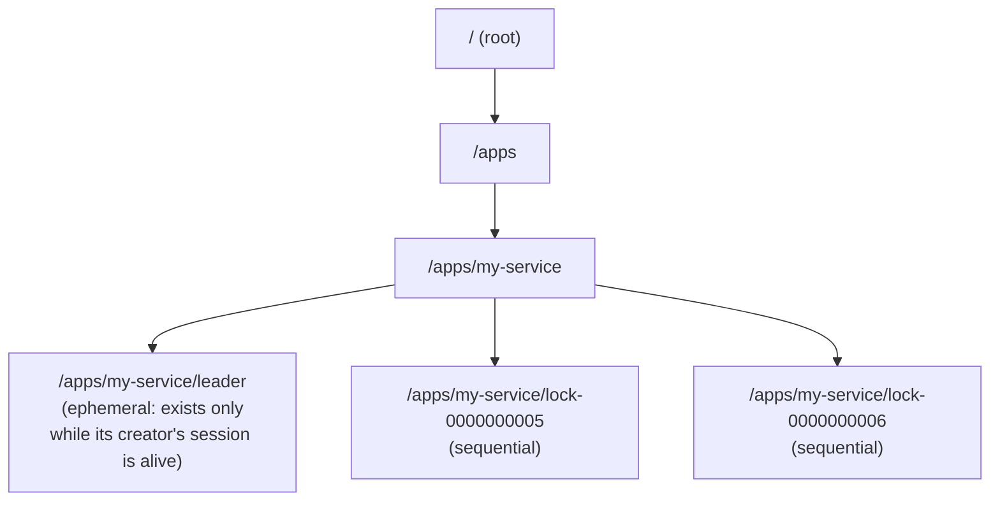

## Learning Objectives

- Describe ZooKeeper's data model: znodes arranged in a hierarchical namespace, and what a watch lets a client do.
- Explain what ZAB (ZooKeeper Atomic Broadcast) actually solves, and connect it explicitly to the Raft and Paxos protocols already covered in this platform's Distributed Systems I discipline.
- Explain why ZooKeeper generalizes Chubby's role into an openly reusable service, rather than remaining tied to one specific system the way Chubby was originally tied to Bigtable.
- Describe how a simple coordination primitive like a znode and a watch can be used to implement a higher-level pattern, such as leader election, without ZooKeeper needing to bake leader election in as a built-in feature.

## Context & Motivation

The previous concept studied Chubby narrowly, through the specific, concrete jobs Bigtable delegates to it: electing a single master, letting tablet servers claim liveness, and storing small metadata files. Chubby itself, however, was not built as a Bigtable-specific tool, it is a general-purpose lock service used by many systems at Google, and this concept studies ZooKeeper, the system that takes that exact same underlying idea, a small, heavily tested, generically reusable coordination service that many larger systems can be a client of, and makes it openly available and widely adopted outside of any single company's internal infrastructure.

ZooKeeper's own paper, published at USENIX ATC in 2010, is explicit about its design philosophy: rather than building specific, named primitives for every coordination pattern applications might want (a built-in "leader election" API, a built-in "distributed lock" API, a built-in "group membership" API), ZooKeeper instead exposes one small, simple, general data model, and lets client libraries and applications compose that small primitive set into whichever higher-level coordination pattern they actually need. This concept develops that data model, the protocol (ZAB) that keeps a ZooKeeper cluster's state correctly replicated and ordered, and, in the worked examples, how a pattern as specific as leader election can be built entirely out of ZooKeeper's small set of general primitives.

## Core Theory

### The data model: znodes in a hierarchical namespace, with watches

ZooKeeper exposes a namespace of **znodes**, arranged hierarchically much like a file system's directory tree (a znode's path looks like `/apps/my-service/leader`), where each znode can hold a small amount of data (ZooKeeper is explicitly designed for small, coordination-relevant metadata, not for storing large application data) and can have child znodes. Two specific znode behaviors, beyond ordinary create, read, update, and delete, are what make ZooKeeper genuinely useful for coordination rather than merely being a small distributed key-value store:

**Ephemeral znodes** exist only as long as the client session that created them remains active; if that client's session ends (whether through an explicit disconnect or a timeout from the client failing to respond), the ephemeral znode is automatically deleted. This is directly analogous to Chubby's session-lease-bound locks from the previous concept, and it is precisely the mechanism that lets ZooKeeper express "this client is currently alive and holds this role" without any separate heartbeat protocol.

**Sequential znodes** are created with a monotonically increasing numeric suffix automatically appended by ZooKeeper itself (for example, requesting to create `/apps/my-service/lock-` might actually result in `/apps/my-service/lock-0000000007`), giving clients a way to obtain a globally, totally ordered position relative to other clients creating znodes under the same parent, without needing to coordinate that ordering among themselves.

A **watch** lets a client register interest in a specific znode and receive a one-time notification the next time that znode changes (is created, deleted, or has its data modified, or gains or loses a child, depending on the type of watch registered). Watches are explicitly one-time and must be re-registered after firing, a deliberate simplicity trade-off the paper defends as avoiding the more complex bookkeeping a persistent, always-on subscription would require, while still being sufficient for clients to efficiently notice changes without needing to poll continuously.

### ZAB: the same replicated-log problem Raft already solves

A single ZooKeeper server would be a single point of failure, so ZooKeeper is deployed as an ensemble of several servers (an odd number, typically 3 or 5, for the same majority-quorum reasoning this platform's Distributed Systems I discipline develops for Raft and Paxos), all of which must agree on the same sequence of state changes applied to the znode tree, in the same order, even as servers fail and recover. The protocol that achieves this is **ZAB**, ZooKeeper Atomic Broadcast, and it is worth being direct about what ZAB actually is: a leader-based, crash-recovery atomic broadcast protocol, with a leader election phase and a broadcast phase in which the elected leader proposes state changes and a majority of followers must acknowledge each one before it is considered committed. This is, structurally, the exact same problem Raft solves (developed fully in Distributed Systems I): a single leader, a majority-quorum commit rule, and a leader-election mechanism triggered when the current leader is suspected to have failed. Where Raft is presented and reasoned about as a general-purpose, standalone consensus algorithm for replicating an arbitrary state machine's log, ZAB is a protocol built specifically to keep ZooKeeper's own znode tree correctly and consistently replicated across its ensemble, with the same fundamental agreement guarantee underneath.

Every write to ZooKeeper (creating, updating, or deleting a znode) is therefore a request that goes through ZAB: the current leader proposes the change, a majority of the ensemble acknowledges it, and only then is it considered committed and visible. Reads, by contrast, can typically be served by any individual ZooKeeper server from its own local, already-replicated state, without needing a fresh round of agreement for every read, trading a small amount of read staleness (a client might read from a follower that has not yet applied the very latest committed write) for substantially better read throughput, since reads vastly outnumber writes in ZooKeeper's typical coordination workload.

### Why this is a generalization, not a rename, of Chubby's role

The previous concept's Chubby, used narrowly inside Bigtable for exactly three jobs (master election, tablet server liveness, small metadata storage), and this concept's ZooKeeper, exposing a small, general znode-and-watch primitive set to any application that links its client library, are the same underlying idea at two different points on a generality spectrum. Chubby was purpose-built and internal to Google's infrastructure; ZooKeeper deliberately exposes its primitives more generally and minimally (plain znodes, ephemeral flags, sequential flags, and watches, rather than baked-in "acquire a lock" or "elect a leader" API calls), specifically so that a wide range of different coordination patterns, developed as compositions of those primitives in application-level client libraries, can all be built on the same one underlying service, rather than each pattern needing its own dedicated, purpose-built system the way Chubby's design was more tightly coupled to Bigtable's specific needs.

## Worked Examples

### Example 1: implementing leader election purely from znodes, ephemeral flags, and watches

**Problem:** Using only ZooKeeper's primitives (create, ephemeral znodes, sequential znodes, watches), describe a leader-election scheme that lets exactly one of several competing application instances become "the leader" at a time, and automatically lets a new leader take over if the current one crashes.

**Design:** Every instance, on startup, creates an ephemeral, sequential znode under a shared parent path, say `/election/candidate-`, receiving back the actual sequential path ZooKeeper assigned it, for example `/election/candidate-0000000012`. Each instance then lists all the children of `/election` and checks: if its own sequential number is the smallest among all current children, it declares itself the leader. If it is not the smallest, it sets a watch specifically on the znode with the next-smaller sequential number (not on every other candidate, which would cause a wasteful flood of notifications every time any candidate changes), and waits.

When the current leader (holding the smallest-numbered znode) crashes, its ZooKeeper session ends, and because its znode was created as ephemeral, ZooKeeper automatically deletes it. This deletion fires the watch belonging to whichever instance was watching that specific znode (the instance with the next-smallest number), which then re-checks the children of `/election`: it is now the smallest remaining, and declares itself the new leader.

**Why this works without ZooKeeper needing a built-in "elect a leader" feature**: ephemeral znodes provide automatic cleanup on failure (exactly the liveness-detection role Chubby's session-bound locks played for Bigtable's master), sequential znodes provide a deterministic, contention-free way to establish a total order among competing candidates without them needing to negotiate directly with each other, and watches provide efficient, targeted notification exactly when the relevant change (the immediate predecessor's znode disappearing) occurs, without any candidate needing to poll.

### Example 2: contrasting a ZAB write with a ZooKeeper read, and what a stale read means concretely

**Problem:** A leader-election candidate reads the children of `/election` from a ZooKeeper follower server that has not yet applied the ensemble's very latest committed write (perhaps a new candidate that just joined a few milliseconds ago). Explain what this candidate might see, and why this is a deliberate, acceptable trade-off rather than a correctness bug.

**Resolution:** The candidate might see a children list that does not yet include the newest candidate's just-created sequential znode, since that write, though already committed by a majority of the ensemble through ZAB, has not yet been locally applied by this specific follower the candidate happened to read from. This means the candidate's view is momentarily stale, not wrong in the sense of showing incorrect data, but potentially incomplete relative to the very latest state. In the leader-election scheme from Example 1, this specific kind of staleness is harmless: the newly created candidate will, on its own next check, see its own sequential position correctly (a client always sees its own writes), and the existing candidates will simply learn about the new candidate slightly later, when their own next read happens to hit a follower that has since caught up, without ever seeing an outright incorrect or contradictory answer, only a momentarily incomplete one. ZooKeeper's design accepts this specific, bounded kind of staleness on reads in exchange for the substantially higher read throughput of not requiring every single read to go through a fresh ZAB agreement round, a deliberate throughput-versus-freshness trade matched to ZooKeeper's actual workload, which is typically dominated by far more reads than writes.

## Common Misconceptions & Pitfalls

- **"ZAB is a completely different, novel algorithm from Raft, since ZooKeeper predates Raft's publication."** ZAB and Raft solve the identical core problem, a single leader proposing entries, a majority-quorum commit rule, and a leader-election mechanism on failure, and were developed independently around a similar time; understanding Raft (already covered in this platform's Distributed Systems I) is directly transferable to understanding what ZAB is doing underneath ZooKeeper, they are two independent, structurally similar answers to the same replicated-state-machine problem, not unrelated techniques.
- **"ZooKeeper has a built-in 'elect a leader' or 'acquire a lock' function, similar to a library call."** ZooKeeper's actual server-side primitives are deliberately smaller and more general: znodes, an ephemeral flag, a sequential flag, and watches. Higher-level patterns like leader election (Example 1) or distributed locking are implemented entirely in client-side logic composing those primitives, not as a single built-in server operation, this is a deliberate design choice favoring a small, general server with flexible client-side composition over a larger server exposing many specific, named coordination features.
- **"Every ZooKeeper operation, including reads, goes through the full ZAB agreement protocol."** Only writes (which change the znode tree's state) go through ZAB's leader-proposal-and-majority-acknowledgment path. Reads are typically served locally by whichever server a client happens to be connected to, from that server's own already-replicated state, which is exactly what makes them fast but also exactly what introduces the bounded staleness Example 2 develops.

## Summary

ZooKeeper generalizes the coordination-service pattern the previous concept studied narrowly through Chubby into an openly reusable service, exposing a small, hierarchical namespace of znodes, with ephemeral znodes (automatically removed when their creating client's session ends) and sequential znodes (automatically assigned a total, contention-free order), plus one-time watches for efficient change notification, as its core primitives. Underneath, ZAB (ZooKeeper Atomic Broadcast) keeps the znode tree consistently replicated across an ensemble of servers, using a leader-based, majority-quorum protocol structurally identical to Raft, already covered in this platform's foundational consensus theory, directly connecting this applied case study back to that theory rather than introducing an unrelated new algorithm. Rather than baking in specific, named coordination patterns, ZooKeeper deliberately keeps its server-side primitives small and general, letting client-side logic compose them into whichever higher-level pattern an application actually needs, demonstrated concretely by building leader election entirely out of ephemeral znodes, sequential znodes, and watches, with no dedicated leader-election feature required from the server at all.

## Documentation Links

- [Hunt, Konar, Junqueira, Reed: ZooKeeper: Wait-free Coordination for Internet-scale Systems (USENIX ATC 2010)](https://www.usenix.org/legacy/event/atc10/tech/full_papers/Hunt.pdf): doc
