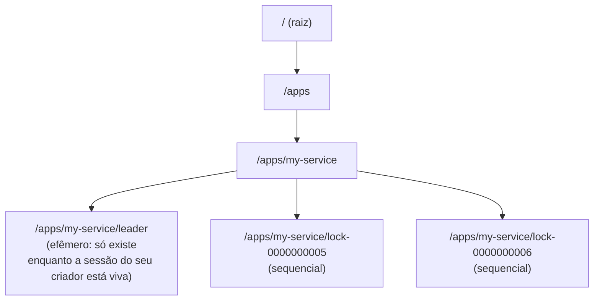

## Objetivos de Aprendizagem

- Descrever o modelo de dados do ZooKeeper: znodes organizados num namespace hierárquico, e o que um watch permite a um cliente fazer.
- Explicar o que o ZAB (ZooKeeper Atomic Broadcast) de fato resolve, e conectá-lo explicitamente aos protocolos Raft e Paxos já cobertos na disciplina de Sistemas Distribuídos I desta plataforma.
- Explicar por que o ZooKeeper generaliza o papel do Chubby num serviço abertamente reutilizável, em vez de ficar preso a um sistema específico, do jeito que o Chubby estava originalmente preso ao Bigtable.
- Descrever como uma primitiva de coordenação simples, como um znode e um watch, pode ser usada para implementar um padrão de nível mais alto, como a eleição de líder, sem que o ZooKeeper precise embutir a eleição de líder como um recurso nativo.

## Contexto e Motivação

O conceito anterior estudou o Chubby de forma estreita, pelos trabalhos específicos e concretos que o Bigtable delega a ele: eleger um único master, permitir que os servidores de tablets anunciem que estão vivos, e armazenar pequenos arquivos de metadados. O próprio Chubby, porém, não foi construído como uma ferramenta específica do Bigtable: ele é um serviço de travas de propósito geral, usado por muitos sistemas no Google. Este conceito estuda o ZooKeeper, o sistema que pega exatamente essa mesma ideia subjacente (um serviço de coordenação pequeno, fortemente testado e genericamente reutilizável, do qual muitos sistemas maiores podem ser clientes) e o torna abertamente disponível e amplamente adotado fora da infraestrutura interna de qualquer empresa.

O próprio artigo do ZooKeeper, publicado no USENIX ATC em 2010, é explícito sobre a sua filosofia de projeto: em vez de construir primitivas específicas e nomeadas para cada padrão de coordenação que as aplicações possam querer (uma API nativa de "eleição de líder", uma API nativa de "trava distribuída", uma API nativa de "pertencimento a grupo"), o ZooKeeper expõe um único modelo de dados pequeno, simples e geral, e deixa que as bibliotecas clientes e as aplicações componham esse pequeno conjunto de primitivas em qualquer padrão de coordenação de nível mais alto de que de fato precisem. Este conceito desenvolve esse modelo de dados, o protocolo (ZAB) que mantém o estado de um cluster ZooKeeper corretamente replicado e ordenado e, nos exemplos resolvidos, como um padrão tão específico quanto a eleição de líder pode ser construído inteiramente a partir do pequeno conjunto de primitivas gerais do ZooKeeper.

## Teoria Central

### O modelo de dados: znodes num namespace hierárquico, com watches

O ZooKeeper expõe um namespace de **znodes**, organizados hierarquicamente de forma muito parecida com a árvore de diretórios de um sistema de arquivos (o caminho de um znode se parece com `/apps/my-service/leader`), em que cada znode pode guardar uma pequena quantidade de dados (o ZooKeeper é explicitamente projetado para metadados pequenos e relevantes para coordenação, e não para armazenar dados grandes de aplicação) e pode ter znodes filhos. Dois comportamentos específicos de znodes, além das operações comuns de criar, ler, atualizar e apagar, são o que tornam o ZooKeeper genuinamente útil para coordenação, em vez de ser meramente um pequeno armazenamento chave-valor distribuído:

Os **znodes efêmeros** existem só enquanto a sessão do cliente que os criou permanecer ativa; se a sessão desse cliente terminar (seja por uma desconexão explícita, seja por um timeout porque o cliente deixou de responder), o znode efêmero é apagado automaticamente. Isso é diretamente análogo às travas presas a leases de sessão do Chubby, do conceito anterior, e é precisamente o mecanismo que permite ao ZooKeeper expressar "este cliente está vivo agora e detém este papel" sem nenhum protocolo de heartbeat separado.

Os **znodes sequenciais** são criados com um sufixo numérico monotonicamente crescente, anexado automaticamente pelo próprio ZooKeeper (por exemplo, pedir para criar `/apps/my-service/lock-` pode de fato resultar em `/apps/my-service/lock-0000000007`), dando aos clientes um jeito de obter uma posição global e totalmente ordenada em relação a outros clientes que criam znodes sob o mesmo pai, sem precisar coordenar essa ordem entre si.

Um **watch** permite que um cliente registre interesse num znode específico e receba uma notificação única na próxima vez que esse znode mudar (for criado, apagado ou tiver os seus dados modificados, ou ganhar ou perder um filho, dependendo do tipo de watch registrado). Os watches são explicitamente de uso único e precisam ser registrados de novo depois de disparar, um trade-off deliberado de simplicidade que o artigo defende por evitar a contabilidade mais complexa que uma assinatura persistente, sempre ativa, exigiria, e ainda assim suficiente para que os clientes notem mudanças de forma eficiente, sem precisar fazer polling continuamente.

### ZAB: o mesmo problema de log replicado que o Raft já resolve

Um único servidor ZooKeeper seria um ponto único de falha, então o ZooKeeper é implantado como um conjunto (ensemble) de vários servidores (um número ímpar, normalmente 3 ou 5, pelo mesmo raciocínio de quórum de maioria que a disciplina de Sistemas Distribuídos I desta plataforma desenvolve para o Raft e o Paxos), e todos precisam concordar sobre a mesma sequência de mudanças de estado aplicadas à árvore de znodes, na mesma ordem, mesmo com servidores falhando e se recuperando. O protocolo que alcança isso é o **ZAB**, ZooKeeper Atomic Broadcast, e vale a pena ser direto sobre o que o ZAB de fato é: um protocolo de broadcast atômico baseado em líder, com recuperação de travamentos, com uma fase de eleição de líder e uma fase de broadcast em que o líder eleito propõe mudanças de estado e uma maioria dos seguidores precisa confirmar cada uma antes que ela seja considerada confirmada. Este é, estruturalmente, exatamente o mesmo problema que o Raft resolve (desenvolvido por completo em Sistemas Distribuídos I): um único líder, uma regra de confirmação por quórum de maioria, e um mecanismo de eleição de líder disparado quando se suspeita que o líder atual falhou. Enquanto o Raft é apresentado e analisado como um algoritmo de consenso de propósito geral e independente para replicar o log de uma máquina de estados arbitrária, o ZAB é um protocolo construído especificamente para manter a própria árvore de znodes do ZooKeeper replicada de forma correta e consistente no seu ensemble, com a mesma garantia fundamental de acordo por baixo.

Toda escrita no ZooKeeper (criar, atualizar ou apagar um znode) é, portanto, um pedido que passa pelo ZAB: o líder atual propõe a mudança, uma maioria do ensemble a confirma, e só então ela é considerada confirmada e visível. As leituras, em contraste, normalmente podem ser atendidas por qualquer servidor ZooKeeper individual a partir do seu próprio estado local, já replicado, sem precisar de uma rodada nova de acordo para cada leitura, trocando uma pequena quantidade de desatualização nas leituras (um cliente pode ler de um seguidor que ainda não aplicou a escrita confirmada mais recente) por uma vazão de leitura substancialmente melhor, já que as leituras superam em muito as escritas na carga de trabalho de coordenação típica do ZooKeeper.

### Por que isto é uma generalização, e não um novo nome, do papel do Chubby

O Chubby do conceito anterior, usado de forma estreita dentro do Bigtable para exatamente três trabalhos (eleição do master, vivacidade dos servidores de tablets, armazenamento de metadados pequenos), e o ZooKeeper deste conceito, que expõe um conjunto pequeno e geral de primitivas de znode e watch a qualquer aplicação que ligue a sua biblioteca cliente, são a mesma ideia subjacente em dois pontos diferentes de um espectro de generalidade. O Chubby foi construído sob medida e é interno à infraestrutura do Google; o ZooKeeper expõe deliberadamente as suas primitivas de forma mais geral e mínima (znodes simples, flags de efêmero, flags de sequencial e watches, em vez de chamadas de API embutidas como "adquirir uma trava" ou "eleger um líder"), especificamente para que uma ampla gama de padrões de coordenação diferentes, desenvolvidos como composições dessas primitivas em bibliotecas clientes no nível da aplicação, possam todos ser construídos sobre o mesmo serviço subjacente, em vez de cada padrão precisar do seu próprio sistema dedicado e construído sob medida, do jeito que o projeto do Chubby era mais fortemente acoplado às necessidades específicas do Bigtable.

## Exemplos Resolvidos

### Exemplo 1: implementando eleição de líder só com znodes, flags de efêmero e watches

**Problema:** Usando só as primitivas do ZooKeeper (criação, znodes efêmeros, znodes sequenciais, watches), descreva um esquema de eleição de líder que permita que exatamente uma de várias instâncias concorrentes da aplicação se torne "o líder" por vez, e que permita automaticamente que um novo líder assuma se o atual travar.

**Projeto:** Toda instância, ao iniciar, cria um znode efêmero e sequencial sob um caminho pai compartilhado, digamos `/election/candidate-`, recebendo de volta o caminho sequencial real que o ZooKeeper atribuiu a ela, por exemplo `/election/candidate-0000000012`. Cada instância então lista todos os filhos de `/election` e verifica: se o seu próprio número sequencial é o menor entre todos os filhos atuais, ela se declara líder. Se não for o menor, ela define um watch especificamente no znode com o número sequencial imediatamente menor (e não em todos os outros candidatos, o que causaria uma enxurrada desperdiçada de notificações toda vez que qualquer candidato mudasse) e espera.

Quando o líder atual (que detém o znode de menor número) trava, a sua sessão no ZooKeeper termina e, como o seu znode foi criado como efêmero, o ZooKeeper o apaga automaticamente. Essa remoção dispara o watch da instância que estava observando aquele znode específico (a instância com o próximo menor número), que então verifica de novo os filhos de `/election`: agora ela é a menor restante, e se declara o novo líder.

**Por que isto funciona sem que o ZooKeeper precise de um recurso nativo de "eleger um líder"**: os znodes efêmeros oferecem limpeza automática em caso de falha (exatamente o papel de detecção de vivacidade que as travas presas a sessões do Chubby desempenhavam para o master do Bigtable), os znodes sequenciais oferecem um jeito determinístico e sem disputa de estabelecer uma ordem total entre candidatos concorrentes sem que eles precisem negociar diretamente entre si, e os watches oferecem notificação eficiente e direcionada exatamente quando a mudança relevante (o desaparecimento do znode do predecessor imediato) acontece, sem que nenhum candidato precise fazer polling.

### Exemplo 2: contrastando uma escrita via ZAB com uma leitura no ZooKeeper, e o que uma leitura desatualizada significa concretamente

**Problema:** Um candidato da eleição de líder lê os filhos de `/election` de um servidor seguidor do ZooKeeper que ainda não aplicou a escrita confirmada mais recente do ensemble (talvez um novo candidato que entrou há poucos milissegundos). Explique o que esse candidato pode ver, e por que isso é um trade-off deliberado e aceitável, e não um bug de corretude.

**Resolução:** O candidato pode ver uma lista de filhos que ainda não inclui o znode sequencial recém-criado pelo candidato mais novo, já que essa escrita, embora já confirmada por uma maioria do ensemble via ZAB, ainda não foi aplicada localmente por este seguidor específico do qual o candidato por acaso leu. Isso significa que a visão do candidato está momentaneamente desatualizada: não errada no sentido de mostrar dados incorretos, mas potencialmente incompleta em relação ao estado mais recente. No esquema de eleição de líder do Exemplo 1, esse tipo específico de desatualização é inofensivo: o candidato recém-criado vai, na sua própria próxima verificação, ver a sua posição sequencial corretamente (um cliente sempre vê as suas próprias escritas), e os candidatos existentes simplesmente vão ficar sabendo do novo candidato um pouco depois, quando a sua própria próxima leitura cair num seguidor que já tenha alcançado o estado atual, sem nunca ver uma resposta francamente incorreta ou contraditória, só uma momentaneamente incompleta. O projeto do ZooKeeper aceita esse tipo específico e limitado de desatualização nas leituras em troca da vazão de leitura substancialmente maior de não exigir que cada leitura passe por uma rodada nova de acordo via ZAB, um trade-off deliberado entre vazão e atualidade, ajustado à carga de trabalho real do ZooKeeper, que normalmente é dominada por muito mais leituras do que escritas.

## Equívocos Comuns e Armadilhas

- **"O ZAB é um algoritmo completamente diferente e inovador em relação ao Raft, já que o ZooKeeper é anterior à publicação do Raft."** O ZAB e o Raft resolvem o mesmo problema central (um único líder propondo entradas, uma regra de confirmação por quórum de maioria, e um mecanismo de eleição de líder em caso de falha) e foram desenvolvidos de forma independente, numa época parecida. Entender o Raft (já coberto em Sistemas Distribuídos I desta plataforma) é diretamente transferível para entender o que o ZAB está fazendo por baixo do ZooKeeper: são duas respostas independentes e estruturalmente parecidas ao mesmo problema de máquina de estados replicada, e não técnicas sem relação.
- **"O ZooKeeper tem uma função nativa de 'eleger um líder' ou 'adquirir uma trava', parecida com uma chamada de biblioteca."** As primitivas reais do lado do servidor do ZooKeeper são deliberadamente menores e mais gerais: znodes, uma flag de efêmero, uma flag de sequencial e watches. Padrões de nível mais alto, como a eleição de líder (Exemplo 1) ou travas distribuídas, são implementados inteiramente em lógica do lado do cliente que compõe essas primitivas, e não como uma única operação nativa do servidor. Esta é uma escolha de projeto deliberada que favorece um servidor pequeno e geral, com composição flexível do lado do cliente, em vez de um servidor maior que expõe muitos recursos de coordenação específicos e nomeados.
- **"Toda operação do ZooKeeper, incluindo as leituras, passa pelo protocolo completo de acordo do ZAB."** Só as escritas (que mudam o estado da árvore de znodes) passam pelo caminho de proposta do líder e confirmação da maioria do ZAB. As leituras normalmente são atendidas localmente por qualquer servidor ao qual o cliente esteja conectado, a partir do estado já replicado desse servidor, e é exatamente isso que as torna rápidas, mas também exatamente o que introduz a desatualização limitada que o Exemplo 2 desenvolve.

## Resumo

O ZooKeeper generaliza o padrão de serviço de coordenação que o conceito anterior estudou de forma estreita pelo Chubby num serviço abertamente reutilizável, expondo como primitivas centrais um namespace hierárquico e pequeno de znodes, com znodes efêmeros (removidos automaticamente quando a sessão do cliente que os criou termina) e znodes sequenciais (que recebem automaticamente uma ordem total e sem disputa), além de watches de uso único para notificação eficiente de mudanças. Por baixo, o ZAB (ZooKeeper Atomic Broadcast) mantém a árvore de znodes replicada de forma consistente num ensemble de servidores, usando um protocolo baseado em líder e em quórum de maioria estruturalmente idêntico ao Raft, já coberto na teoria fundamental de consenso desta plataforma, conectando diretamente este estudo de caso aplicado de volta a essa teoria, em vez de introduzir um algoritmo novo e sem relação. Em vez de embutir padrões de coordenação específicos e nomeados, o ZooKeeper mantém deliberadamente as suas primitivas do lado do servidor pequenas e gerais, deixando que a lógica do lado do cliente as componha em qualquer padrão de nível mais alto de que uma aplicação de fato precise, como demonstrado concretamente ao construir a eleição de líder inteiramente a partir de znodes efêmeros, znodes sequenciais e watches, sem nenhum recurso dedicado de eleição de líder exigido do servidor.

## Documentation Links

- [Hunt, Konar, Junqueira, Reed: ZooKeeper: Wait-free Coordination for Internet-scale Systems (USENIX ATC 2010)](https://www.usenix.org/legacy/event/atc10/tech/full_papers/Hunt.pdf): doc
