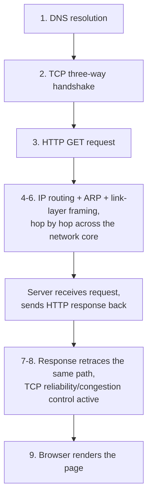

## Learning Objectives

- Trace one HTTP GET request from the moment it is typed into a browser to the moment its response is rendered, naming the specific concept responsible for each step.
- Explain, with named real protocols on each side, the concrete tradeoff between choosing TCP and choosing UDP for a given application.
- Identify explicitly what this discipline does NOT cover — the harder distributed-computing questions (consensus, replication, logical clocks) that build on top of a working network — and where that material belongs instead.
- Recognize the layered structure of this entire discipline reflected directly in the order this capstone's trace proceeds through.
- Recognize TLS as the concrete security layer that would, in a real deployment, wrap this same trace, and know where that material is actually covered.

## Context & Motivation

Every concept in this discipline covered one piece of what has to happen for two hosts to communicate — application protocols, TCP's reliability and congestion control, IP addressing and routing, link-layer framing and address resolution. This capstone does not introduce new material; it traces one single, concrete, familiar action — typing a URL into a browser and pressing enter — through every one of those pieces in the actual order they occur, naming explicitly which earlier concept explains each step. This is the discipline's payoff: the machinery covered in isolation, concept by concept, working together to deliver one ordinary request.

## Core Theory

### The full trace: from URL to rendered page

A user types `http://www.example.com/index.html` into a browser and presses enter. Here is what actually happens, in order, naming the concept responsible for each step:

1. **DNS resolution** (`dns-the-internets-directory-service`). The browser needs `www.example.com`'s IP address before anything else can happen. The local resolver performs (typically) a recursive query, which itself involves iterative queries against root, then `.com` TLD, then `example.com`'s authoritative server — unless the answer is already cached from a prior lookup, in which case this step is nearly instant.

2. **TCP connection establishment** (`tcp-segment-structure-and-the-three-way-handshake`). Now armed with the server's IP address, the browser's operating system initiates a TCP connection to that IP address on port 80 (or 443 for HTTPS): SYN, SYN-ACK, ACK — the three-way handshake, establishing both sides' initial sequence numbers before any HTTP data is exchanged.

3. **HTTP request** (`http-and-the-web`). Over the now-established TCP connection, the browser sends an HTTP GET request: `GET /index.html HTTP/1.1`, with headers including `Host: www.example.com` and, if a prior visit set one, a `Cookie:` header.

4. **IP routing across the network core** (`ipv4-addressing-and-cidr`, `datagram-forwarding-and-longest-prefix-match`, `routing-algorithms-link-state-vs-distance-vector`, `intra-vs-inter-domain-routing-ospf-and-bgp`). The TCP segment carrying this HTTP request is encapsulated in an IP datagram and forwarded hop by hop across the network core — each router along the path performs a longest-prefix-match lookup against its own forwarding table, itself populated by whatever combination of intra-domain routing (OSPF, within the sender's or an intermediate network's own autonomous system) and inter-domain routing (BGP, at autonomous-system boundaries) actually computed the path this datagram takes.

5. **ARP resolution at each hop** (`arp-and-address-resolution`). At every individual hop along that path, whichever node is currently holding the datagram (the original host, or an intermediate router) needs the next hop's MAC address to actually construct a link-layer frame — resolved via ARP, either from a locally cached entry or a fresh broadcast request-and-reply exchange, entirely local to that one hop's broadcast domain.

6. **Link-layer framing and transmission** (`the-link-layer-framing-and-error-detection`, `multiple-access-protocols-and-ethernet`). The IP datagram is encapsulated in a link-layer frame (Ethernet, in the common wired case), with a checksum for error detection, and physically transmitted across that one hop — on a shared medium, subject to whatever multiple-access coordination (CSMA/CD historically, largely superseded by switching in modern deployments) that link's technology requires.

7. **The reverse trip.** The server, having received the request (its own stack unwrapping the same layers in reverse — link layer, then network layer, then TCP, delivering the HTTP request to the actual web server application), constructs an HTTP response and sends it back through the identical set of mechanisms, in the same order, now flowing the opposite direction: HTTP response wrapped in a TCP segment (subject to the sender's — now the server's — congestion window and the client's advertised flow-control window, both already covered), wrapped in an IP datagram, routed hop by hop back across the network core, framed and transmitted at each link.

8. **TCP's ongoing reliability and congestion control** (`tcp-reliable-data-transfer-in-practice`, `tcp-flow-control-the-sliding-window`, `tcp-congestion-control-aimd-slow-start-and-fairness`). If the response is large enough to span multiple TCP segments, every mechanism covered for TCP's steady-state operation is actively in play throughout: cumulative acknowledgments, fast retransmit if any segment is lost, an actively-growing (or, if loss occurs, halving) congestion window, and a flow-control window reflecting the browser's own receive-buffer occupancy.

9. **Rendering.** The browser receives the complete response body and renders the page — the point at which this discipline's trace ends, since page rendering itself is outside this discipline's scope.



### TCP vs. UDP, revisited with named real protocols

This entire trace assumed TCP, because HTTP is a TCP-based protocol. If the application were different — a live video call, say — the choice would likely be UDP instead, precisely for the reasons covered in `transport-services-udp-vs-tcp`: TCP's retransmission and congestion-responsive rate reduction, which serve HTTP's correctness needs perfectly well, would actively work against a real-time application's need for a steady, predictable rate more than perfect reliability. DNS itself, one of the very first steps in this trace, is a concrete real example of the opposite choice already made for a different, genuine reason: a single small query-response exchange, for which TCP's connection-setup overhead is considered unnecessary in the common case.

### Where TLS fits (and where it's actually covered)

A real modern request to `https://www.example.com` (not the plain `http://` used in this trace, for simplicity) would insert one additional step immediately after the TCP handshake and before any HTTP data is exchanged: a TLS handshake, establishing an encrypted, authenticated channel the HTTP request and response then travel through. This discipline does not cover TLS's own mechanics — that material belongs to, and is covered in full by, `capstone-tracing-a-tls-handshake` in the security-cryptography discipline, which traces exactly this additional step, building on Diffie-Hellman key exchange and digital certificates, both covered there. The two capstones are complementary, not overlapping: this one traces the network-layer journey an HTTP request takes; that one traces the cryptographic exchange that, in a real HTTPS deployment, wraps around it.

### What this discipline does not cover

This discipline's trace ends the moment a request or response successfully crosses the network, hop by hop, from one host to another — it does not address what happens when the two communicating parties are not simply "a client and a server" but a distributed system of many cooperating, independently-failing machines that must agree on shared state despite unreliable, unpredictable network delay between them. Questions like "what happens if the message arrives, but the reply confirming it was processed is lost — did the operation actually happen?" or "how do multiple replicas of the same data stay consistent with each other when the network between them is unreliable?" are genuinely different, harder questions that this discipline's network-mechanics focus deliberately does not address — they are `distributed-systems-i`'s subject matter (clocks, replication, consistency, consensus, fault tolerance), building on top of the working, reliable-enough network this discipline has covered, not extending it further at the network-mechanics level.

## Worked Examples

### Example 1: The trace, condensed to a single ordered list with real protocol names

```text
1. DNS (UDP, typically) — resolve www.example.com to an IP address
2. TCP three-way handshake — SYN, SYN-ACK, ACK
3. HTTP GET request — sent over the now-established TCP connection
4. IP routing — datagram forwarded hop by hop (OSPF within an AS,
   BGP between ASes, having already computed the forwarding tables
   each hop consults via longest-prefix match)
5. ARP — resolves each hop's next-hop MAC address, locally, per hop
6. Ethernet framing — the actual bits transmitted across each link
7. (reverse trip: HTTP response, same mechanisms, opposite direction)
8. TCP's ongoing reliability/congestion control, if the response spans
   multiple segments
9. Browser renders the page
```

### Example 2: What changes if this were a live video call instead

```text
Step 2 (TCP handshake): SKIPPED — UDP requires no connection setup.
Step 3 (HTTP): replaced by whatever real-time application protocol
  the video call software uses, sent directly over UDP.
Step 8 (TCP reliability/congestion control): ABSENT — UDP provides
  neither; a lost video/audio packet is simply skipped, not
  retransmitted, since retransmitting a late frame is often worse
  for the user experience than continuing without it.
Steps 1, 4, 5, 6 (DNS, routing, ARP, framing): UNCHANGED — these are
  layer-3-and-below concerns, identical regardless of whether the
  transport layer above happens to be TCP or UDP.
```

This concretely shows which of this discipline's mechanisms are transport-protocol-specific (steps 2 and 8, present only for TCP) versus universal to any Internet communication regardless of transport choice (DNS, routing, ARP, framing).

### Example 3: Where a real HTTPS request's trace actually differs

```text
1. DNS resolution                          — unchanged
2. TCP three-way handshake                 — unchanged
2.5. TLS handshake (NEW — see
     capstone-tracing-a-tls-handshake in
     software-distributed/security-cryptography)
3. HTTP GET request                        — now encrypted, inside
                                              the TLS-protected channel
4-6. IP routing, ARP, link-layer framing   — unchanged (these layers
                                              have no visibility into
                                              whether the payload they
                                              carry is encrypted)
```

The insertion point is precise and instructive: TLS sits entirely between the transport layer (TCP, unchanged) and the application layer (HTTP, now wrapped) — exactly consistent with the layered-stack picture this entire discipline opened with, where each layer's service to the layer above is a fixed contract, regardless of what, if anything, an adjacent layer does differently.

## Common Misconceptions & Pitfalls

- **"This discipline's trace covers everything that happens for two computers to communicate reliably at scale."** It covers the network mechanics — addressing, routing, transport reliability, framing — thoroughly, but explicitly does not cover the harder distributed-systems questions (consensus, replication, fault tolerance across independently-failing machines) that arise once multiple cooperating systems, not just one client and one server, need to agree on shared state.
- **"TLS is part of this discipline's material."** TLS's actual cryptographic mechanics (Diffie-Hellman, certificates, the handshake itself) are covered in full elsewhere, in `security-cryptography`'s own capstone — this discipline names precisely where TLS fits in the layered trace without re-deriving its cryptography.
- **"Every step in this trace happens fresh, every single time."** Several steps are frequently skipped via caching in practice — a cached DNS answer skips step 1's full resolution chain, a persistent HTTP connection (already covered) can skip a fresh TCP handshake for a second request to the same server — the full trace shown here is the "cold" case, not the only case.
- **"Choosing UDP means giving up everything TCP provides, with nothing gained."** UDP's real applications (live video, DNS) deliberately trade TCP's reliability and congestion control for lower overhead and, for real-time media, avoiding the specific harm retransmission would cause to a time-sensitive stream — a genuine, deliberate tradeoff, not merely "TCP done worse."

## Summary

One ordinary HTTP request exercises every mechanism this discipline covered, in a fixed, layered order: DNS resolves a name to an address; TCP's three-way handshake establishes a reliable connection; HTTP's request-response exchange carries the actual application data; IP routing (computed by OSPF within autonomous systems and BGP between them) and longest-prefix-match forwarding move the resulting datagrams hop by hop across the network core; ARP resolves each hop's local next-hop MAC address; and link-layer framing carries the actual bits across each physical link — with TCP's ongoing reliability and congestion-control machinery active throughout if the exchange spans multiple segments. A different application (live video, DNS itself) would make a different, equally deliberate transport-layer choice, trading TCP's guarantees for UDP's lower overhead where that tradeoff genuinely favors the application's real needs. This discipline's scope ends at reliable, addressed, routed network communication between two hosts — the harder, genuinely different questions of coordinating many independently-failing machines (consensus, replication, fault tolerance) belong to `distributed-systems-i`, building on top of, not extending, the network mechanics this discipline has covered in full.

## Documentation Links

- [Kurose & Ross — Computer Networking: A Top-Down Approach (official companion site)](https://gaia.cs.umass.edu/kurose_ross/index.php) — the standard textbook whose top-down, layer-by-layer structure this entire discipline, and this capstone's trace, follows.
- [Stanford CS144 — Introduction to Computer Networking](https://www.scs.stanford.edu/10au-cs144/) — a real course built entirely around implementing this same end-to-end stack, one layer at a time.
