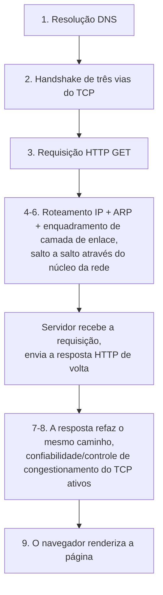

## Objetivos de Aprendizagem

- Rastrear uma requisição HTTP GET desde o momento em que é digitada num navegador até o momento em que sua resposta é renderizada, nomeando o conceito específico responsável por cada passo.
- Explicar, com protocolos reais nomeados de cada lado, o trade-off concreto entre escolher TCP e escolher UDP para uma dada aplicação.
- Identificar explicitamente o que esta disciplina NÃO cobre: as questões mais difíceis de computação distribuída (consenso, replicação, relógios lógicos) que se constroem sobre uma rede funcional, e onde esse material pertence em vez disso.
- Reconhecer a estrutura em camadas desta disciplina inteira refletida diretamente na ordem em que o rastreamento deste capstone prossegue.
- Reconhecer o TLS como a camada de segurança concreta que, em uma implantação real, envolveria este mesmo rastreamento, e saber onde esse material é de fato coberto.

## Contexto e Motivação

Cada conceito desta disciplina cobriu uma peça do que precisa acontecer para que dois hosts se comuniquem: protocolos de aplicação, a confiabilidade e o controle de congestionamento do TCP, o endereçamento e o roteamento IP, o enquadramento de camada de enlace e a resolução de endereços. Este capstone não introduz material novo; ele rastreia uma única ação concreta e familiar, digitar uma URL num navegador e pressionar enter, através de cada uma dessas peças na ordem real em que ocorrem, nomeando explicitamente qual conceito anterior explica cada passo. Esta é a recompensa da disciplina: a maquinaria coberta isoladamente, conceito por conceito, trabalhando em conjunto para entregar uma requisição comum.

## Teoria Central

### O rastreamento completo: da URL à página renderizada

Um usuário digita `http://www.example.com/index.html` num navegador e pressiona enter. Eis o que de fato acontece, em ordem, nomeando o conceito responsável por cada passo:

1. **Resolução DNS** (`dns-the-internets-directory-service`). O navegador precisa do endereço IP de `www.example.com` antes que qualquer outra coisa possa acontecer. O resolvedor local realiza (tipicamente) uma consulta recursiva, que por si só envolve consultas iterativas contra a raiz, depois o TLD `.com`, depois o servidor autoritativo de `example.com`, a menos que a resposta já esteja em cache de uma busca anterior, caso em que este passo é quase instantâneo.

2. **Estabelecimento da conexão TCP** (`tcp-segment-structure-and-the-three-way-handshake`). Agora munido do endereço IP do servidor, o sistema operacional do navegador inicia uma conexão TCP para esse endereço IP na porta 80 (ou 443 para HTTPS): SYN, SYN-ACK, ACK, o handshake de três vias, estabelecendo os números de sequência iniciais de ambos os lados antes que quaisquer dados HTTP sejam trocados.

3. **Requisição HTTP** (`http-and-the-web`). Sobre a conexão TCP agora estabelecida, o navegador envia uma requisição HTTP GET: `GET /index.html HTTP/1.1`, com cabeçalhos incluindo `Host: www.example.com` e, se uma visita anterior definiu um, um cabeçalho `Cookie:`.

4. **Roteamento IP através do núcleo da rede** (`ipv4-addressing-and-cidr`, `datagram-forwarding-and-longest-prefix-match`, `routing-algorithms-link-state-vs-distance-vector`, `intra-vs-inter-domain-routing-ospf-and-bgp`). O segmento TCP que carrega esta requisição HTTP é encapsulado em um datagrama IP e encaminhado salto a salto através do núcleo da rede: cada roteador ao longo do caminho realiza uma busca por correspondência de prefixo mais longo contra sua própria tabela de encaminhamento, ela mesma preenchida por qualquer combinação de roteamento intradomínio (OSPF, dentro do próprio sistema autônomo do remetente ou de uma rede intermediária) e roteamento interdomínio (BGP, nas fronteiras entre sistemas autônomos) que de fato computou o caminho que este datagrama toma.

5. **Resolução ARP a cada salto** (`arp-and-address-resolution`). A cada salto individual ao longo desse caminho, qualquer nó que esteja atualmente retendo o datagrama (o host original ou um roteador intermediário) precisa do endereço MAC do próximo salto para de fato construir um quadro de camada de enlace, resolvido via ARP, seja de uma entrada em cache local ou de uma nova troca de requisição e resposta em broadcast, inteiramente local ao domínio de broadcast daquele único salto.

6. **Enquadramento e transmissão de camada de enlace** (`the-link-layer-framing-and-error-detection`, `multiple-access-protocols-and-ethernet`). O datagrama IP é encapsulado em um quadro de camada de enlace (Ethernet, no caso comum cabeado), com um checksum para detecção de erros, e fisicamente transmitido através daquele único salto, em um meio compartilhado, sujeito a qualquer coordenação de acesso múltiplo (CSMA/CD historicamente, amplamente substituído por comutação em implantações modernas) que a tecnologia daquele enlace exija.

7. **A viagem de volta.** O servidor, tendo recebido a requisição (sua própria pilha desembrulhando as mesmas camadas em ordem reversa: camada de enlace, depois camada de rede, depois TCP, entregando a requisição HTTP à aplicação de servidor web de fato), constrói uma resposta HTTP e a envia de volta através do conjunto idêntico de mecanismos, na mesma ordem, agora fluindo na direção oposta: resposta HTTP embrulhada em um segmento TCP (sujeita à janela de congestionamento do remetente, agora o servidor, e à janela de controle de fluxo anunciada pelo cliente, ambas já cobertas), embrulhada em um datagrama IP, roteada salto a salto de volta através do núcleo da rede, enquadrada e transmitida a cada enlace.

8. **A confiabilidade e o controle de congestionamento contínuos do TCP** (`tcp-reliable-data-transfer-in-practice`, `tcp-flow-control-the-sliding-window`, `tcp-congestion-control-aimd-slow-start-and-fairness`). Se a resposta for grande o suficiente para abranger múltiplos segmentos TCP, cada mecanismo coberto para a operação em regime permanente do TCP está ativamente em jogo durante todo o processo: confirmações cumulativas, retransmissão rápida se qualquer segmento for perdido, uma janela de congestionamento em crescimento ativo (ou, se ocorrer perda, pela metade) e uma janela de controle de fluxo refletindo a ocupação do próprio buffer de recepção do navegador.

9. **Renderização.** O navegador recebe o corpo completo da resposta e renderiza a página, o ponto em que o rastreamento desta disciplina termina, já que a renderização de página em si está fora do escopo desta disciplina.



### TCP vs. UDP, revisitado com protocolos reais nomeados

Este rastreamento inteiro assumiu TCP, porque o HTTP é um protocolo baseado em TCP. Se a aplicação fosse diferente, uma chamada de vídeo ao vivo, digamos, a escolha provavelmente seria UDP em vez disso, precisamente pelas razões cobertas em `transport-services-udp-vs-tcp`: a retransmissão e a redução de taxa responsiva a congestionamento do TCP, que atendem muito bem às necessidades de correção do HTTP, trabalhariam ativamente contra a necessidade de uma aplicação em tempo real de uma taxa estável e previsível mais do que confiabilidade perfeita. O próprio DNS, um dos primeiros passos neste rastreamento, é um exemplo real concreto da escolha oposta já feita por uma razão diferente e genuína: uma única e pequena troca de consulta-resposta, para a qual o overhead de estabelecimento de conexão do TCP é considerado desnecessário no caso comum.

### Onde o TLS se encaixa (e onde ele é de fato coberto)

Uma requisição moderna real a `https://www.example.com` (não o simples `http://` usado neste rastreamento, por simplicidade) inseriria um passo adicional imediatamente após o handshake TCP e antes que quaisquer dados HTTP fossem trocados: um handshake TLS, estabelecendo um canal criptografado e autenticado através do qual a requisição e a resposta HTTP então viajam. Esta disciplina não cobre a mecânica própria do TLS: esse material pertence a, e é coberto por completo por, `capstone-tracing-a-tls-handshake` na disciplina de segurança-criptografia, que rastreia exatamente este passo adicional, construindo-se sobre a troca de chaves de Diffie-Hellman e certificados digitais, ambos cobertos lá. Os dois capstones são complementares, não sobrepostos: este rastreia a jornada de camada de rede que uma requisição HTTP faz; aquele rastreia a troca criptográfica que, em uma implantação HTTPS real, a envolve.

### O que esta disciplina não cobre

O rastreamento desta disciplina termina no momento em que uma requisição ou resposta cruza com sucesso a rede, salto a salto, de um host a outro: ele não aborda o que acontece quando as duas partes em comunicação não são simplesmente "um cliente e um servidor", mas um sistema distribuído de muitas máquinas cooperantes, que falham independentemente e que precisam concordar sobre um estado compartilhado apesar de um atraso de rede não confiável e imprevisível entre elas. Questões como "o que acontece se a mensagem chega, mas a resposta confirmando que foi processada é perdida, a operação de fato aconteceu?" ou "como múltiplas réplicas dos mesmos dados permanecem consistentes umas com as outras quando a rede entre elas é não confiável?" são questões genuinamente diferentes e mais difíceis que o foco em mecânica de rede desta disciplina deliberadamente não aborda: são o assunto de `distributed-systems-i` (relógios, replicação, consistência, consenso, tolerância a falhas), construindo-se sobre a rede funcional e suficientemente confiável que esta disciplina cobriu, não estendendo-a ainda mais no nível de mecânica de rede.

## Exemplos Resolvidos

### Exemplo 1: O rastreamento, condensado em uma única lista ordenada com nomes reais de protocolos

```text
1. DNS (UDP, tipicamente): resolve www.example.com para um endereço IP
2. Handshake de três vias do TCP: SYN, SYN-ACK, ACK
3. Requisição HTTP GET: enviada sobre a conexão TCP agora estabelecida
4. Roteamento IP: datagrama encaminhado salto a salto (OSPF dentro de um AS,
   BGP entre ASes, tendo já computado as tabelas de encaminhamento
   que cada salto consulta via correspondência de prefixo mais longo)
5. ARP: resolve o endereço MAC do próximo salto de cada salto, localmente, por salto
6. Enquadramento Ethernet: os bits de fato transmitidos através de cada enlace
7. (viagem de volta: resposta HTTP, mesmos mecanismos, direção oposta)
8. Confiabilidade/controle de congestionamento contínuos do TCP, se a resposta abranger
   múltiplos segmentos
9. O navegador renderiza a página
```

### Exemplo 2: O que muda se isto fosse uma chamada de vídeo ao vivo

```text
Passo 2 (handshake TCP): PULADO: UDP não requer estabelecimento de conexão.
Passo 3 (HTTP): substituído por qualquer protocolo de aplicação em tempo real
  que o software de chamada de vídeo use, enviado diretamente sobre UDP.
Passo 8 (confiabilidade/controle de congestionamento do TCP): AUSENTE: UDP não fornece
  nenhum dos dois; um pacote de vídeo/áudio perdido é simplesmente pulado, não
  retransmitido, já que retransmitir um quadro atrasado é frequentemente pior
  para a experiência do usuário do que continuar sem ele.
Passos 1, 4, 5, 6 (DNS, roteamento, ARP, enquadramento): INALTERADOS: estas são
  preocupações de camada 3 e abaixo, idênticas independentemente de a
  camada de transporte acima ser TCP ou UDP.
```

Isto mostra concretamente quais dos mecanismos desta disciplina são específicos do protocolo de transporte (passos 2 e 8, presentes apenas para TCP) versus universais a qualquer comunicação da Internet independentemente da escolha de transporte (DNS, roteamento, ARP, enquadramento).

### Exemplo 3: Onde o rastreamento de uma requisição HTTPS real de fato difere

```text
1. Resolução DNS                          : inalterado
2. Handshake de três vias do TCP          : inalterado
2.5. Handshake TLS (NOVO: veja
     capstone-tracing-a-tls-handshake em
     software-distributed/security-cryptography)
3. Requisição HTTP GET                     : agora criptografada, dentro
                                              do canal protegido por TLS
4-6. Roteamento IP, ARP, enquadramento de  : inalterado (estas camadas
     camada de enlace                         não têm visibilidade sobre
                                              se a carga útil que carregam
                                              está criptografada)
```

O ponto de inserção é preciso e instrutivo: o TLS fica inteiramente entre a camada de transporte (TCP, inalterada) e a camada de aplicação (HTTP, agora embrulhada), exatamente consistente com a figura de pilha em camadas com que esta disciplina inteira abriu, onde o serviço de cada camada à camada acima é um contrato fixo, independentemente do que, se é que algo, uma camada adjacente faz diferente.

## Equívocos Comuns e Armadilhas

- **"O rastreamento desta disciplina cobre tudo o que acontece para que dois computadores se comuniquem de forma confiável em escala."** Ele cobre a mecânica de rede (endereçamento, roteamento, confiabilidade de transporte, enquadramento) a fundo, mas explicitamente não cobre as questões mais difíceis de sistemas distribuídos (consenso, replicação, tolerância a falhas através de máquinas que falham independentemente) que surgem assim que múltiplos sistemas cooperantes, não apenas um cliente e um servidor, precisam concordar sobre um estado compartilhado.
- **"O TLS faz parte do material desta disciplina."** A mecânica criptográfica de fato do TLS (Diffie-Hellman, certificados, o próprio handshake) é coberta por completo em outro lugar, no capstone próprio de `security-cryptography`: esta disciplina nomeia precisamente onde o TLS se encaixa no rastreamento em camadas sem rederivar sua criptografia.
- **"Cada passo neste rastreamento acontece do zero, todas as vezes."** Vários passos são frequentemente pulados via cache na prática: uma resposta DNS em cache pula a cadeia de resolução completa do passo 1, uma conexão HTTP persistente (já coberta) pode pular um novo handshake TCP para uma segunda requisição ao mesmo servidor. O rastreamento completo mostrado aqui é o caso "frio", não o único caso.
- **"Escolher UDP significa abrir mão de tudo o que o TCP fornece, sem nada ganho."** As aplicações reais do UDP (vídeo ao vivo, DNS) deliberadamente trocam a confiabilidade e o controle de congestionamento do TCP por menor overhead e, para mídia em tempo real, por evitar o dano específico que a retransmissão causaria a um fluxo sensível ao tempo, um trade-off genuíno e deliberado, não meramente "TCP feito pior".

## Resumo

Uma requisição HTTP comum exercita cada mecanismo que esta disciplina cobriu, em uma ordem fixa e em camadas: o DNS resolve um nome para um endereço; o handshake de três vias do TCP estabelece uma conexão confiável; a troca de requisição-resposta do HTTP carrega os dados de aplicação de fato; o roteamento IP (computado por OSPF dentro de sistemas autônomos e BGP entre eles) e o encaminhamento por correspondência de prefixo mais longo movem os datagramas resultantes salto a salto através do núcleo da rede; o ARP resolve o endereço MAC do próximo salto local de cada salto; e o enquadramento de camada de enlace carrega os bits de fato através de cada enlace físico, com a maquinaria de confiabilidade e controle de congestionamento contínuos do TCP ativa durante todo o processo se a troca abranger múltiplos segmentos. Uma aplicação diferente (vídeo ao vivo, o próprio DNS) faria uma escolha de camada de transporte diferente e igualmente deliberada, trocando as garantias do TCP pelo menor overhead do UDP onde esse trade-off genuinamente favorece as necessidades reais da aplicação. O escopo desta disciplina termina na comunicação de rede confiável, endereçada e roteada entre dois hosts: as questões mais difíceis e genuinamente diferentes de coordenar muitas máquinas que falham independentemente (consenso, replicação, tolerância a falhas) pertencem a `distributed-systems-i`, construindo-se sobre, não estendendo, a mecânica de rede que esta disciplina cobriu por completo.

## Documentation Links

- [Kurose & Ross: Computer Networking: A Top-Down Approach (official companion site)](https://gaia.cs.umass.edu/kurose_ross/index.php): o livro-texto padrão cuja estrutura de cima para baixo, camada por camada, esta disciplina inteira, e o rastreamento deste capstone, segue.
- [Stanford CS144: Introduction to Computer Networking](https://www.scs.stanford.edu/10au-cs144/): um curso real construído inteiramente em torno da implementação desta mesma pilha de ponta a ponta, uma camada de cada vez.
