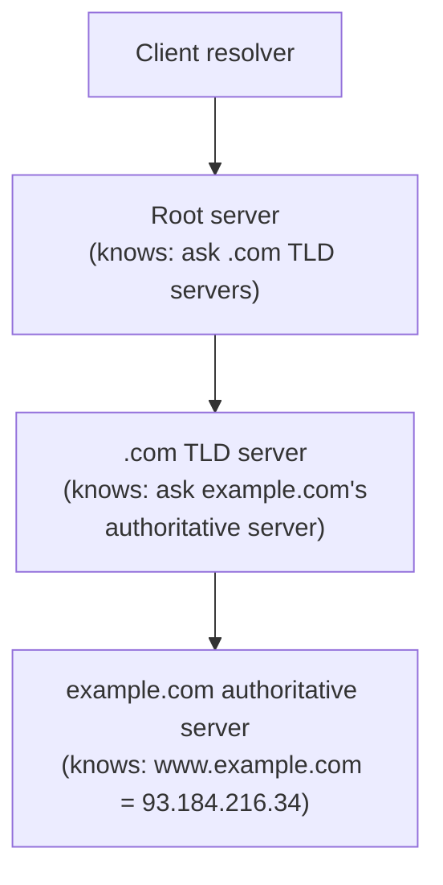

## Learning Objectives

- Explain why a distributed, hierarchical directory service is needed at all, rather than a single centralized name-to-address table.
- Describe DNS's three-level server hierarchy: root, top-level-domain (TLD), and authoritative servers, and the role each plays in resolving a name.
- Distinguish an iterative query from a recursive query, and trace a real resolution through both patterns.
- Explain the role of caching and TTL in making DNS resolution fast in practice, and the tradeoff a TTL value represents.
- Explain DNS's position in the layered stack: an application-layer protocol, typically running over UDP, that most other application protocols depend on before they can even begin.

## Context & Motivation

HTTP, just covered, lets a browser talk to `www.example.com` — but `www.example.com` is not something any network-layer device can actually route a packet to; every network-layer and link-layer mechanism this discipline covers operates on IP addresses and MAC addresses, never on human-readable names. DNS (the Domain Name System) is the application-layer protocol that bridges this gap: it translates a name a person can remember into the IP address a network actually needs. This might look like a small, almost trivial lookup problem, but at Internet scale — billions of names, queried constantly, by systems all over the planet — a single centralized table simply cannot keep up, and DNS's real design is a distributed, hierarchical, heavily-cached system built specifically to solve that scale problem.

## Core Theory

### Why not one centralized table?

A single, centralized DNS server holding every name-to-address mapping on Earth would be a single point of failure (its outage would break name resolution for the entire Internet), a single point of massive contention (every single Internet transaction anywhere starts with a name lookup), and a single point requiring impossibly fast updates from an enormous number of independent organizations that each manage their own piece of the namespace. DNS instead distributes both the data and the query load across a hierarchy of many servers, administered by many different organizations, each responsible for only a small piece of the total namespace.

### The three-level hierarchy

DNS names are organized as a hierarchy, read right to left in dotted notation (`www.example.com`): the root, then a top-level domain (TLD, e.g. `.com`, `.org`, `.edu`), then a specific domain within that TLD (`example.com`), which may itself have subdomains (`www.example.com`). Three levels of DNS servers mirror this hierarchy:

1. **Root DNS servers.** Do not know the IP address for any specific domain; they know which TLD servers to ask for a given TLD (e.g., they can direct a query for anything ending in `.com` to the `.com` TLD servers).
2. **TLD DNS servers.** Responsible for one top-level domain (e.g., all of `.com`); they do not know the specific IP address for `example.com` either, but they know which authoritative server is responsible for that specific domain.
3. **Authoritative DNS servers.** Hold the actual, definitive name-to-address mapping for a specific domain (e.g., the authoritative server for `example.com` genuinely knows the IP address of `www.example.com`), typically operated by the organization that owns the domain or a DNS hosting provider on its behalf.



### Iterative vs. recursive resolution

In an iterative query, the querying host (typically a local DNS resolver, run by an ISP or an organization) contacts the root server, receives a referral (not an answer, just "ask this TLD server next"), then contacts that TLD server, receives another referral, then contacts the authoritative server, and finally receives the actual answer — the querying host does all the follow-up work itself, contacting a new server at each step. In a recursive query, the querying host asks a single server (typically its local resolver) for the full answer, and that server takes on the burden of iteratively contacting root, TLD, and authoritative servers on the client's behalf, returning only the final answer to the original requester. In practice, the path from an end-user's application to their local resolver is typically recursive (the application just wants an answer), while the local resolver's own queries to root, TLD, and authoritative servers are typically iterative.

### Caching and TTL

Contacting root and TLD servers for every single name lookup, worldwide, would still be an enormous, unsustainable load — DNS's actual scalability comes overwhelmingly from caching. A local resolver caches every answer it receives, along with a time-to-live (TTL) value the authoritative server specifies, and serves subsequent queries for the same name directly from its cache until the TTL expires, without contacting root, TLD, or authoritative servers again. TTL represents a real, deliberate tradeoff: a longer TTL means fewer queries reach the authoritative infrastructure (less load, faster resolution for clients) but means a change to the actual mapping (the domain's owner moving to a new IP address) takes longer to propagate to clients still serving a stale cached answer; a shorter TTL propagates changes faster but at the cost of more frequent queries reaching the authoritative servers.

## Worked Examples

### Example 1: Tracing a full iterative resolution for `www.example.com`

```text
1. Local resolver has no cached entry for www.example.com. It queries a
   root server: "What is the IP address for www.example.com?"
2. Root server does not know, but responds with a referral: "I don't
   know, but ask the .com TLD servers — here is their address."
3. Local resolver queries a .com TLD server with the same question.
4. TLD server does not know the specific IP either, but responds with a
   referral: "Ask example.com's authoritative server — here is its
   address."
5. Local resolver queries example.com's authoritative server.
6. Authoritative server responds with the actual answer:
   "www.example.com is 93.184.216.34," along with a TTL (e.g., 3600
   seconds).
7. Local resolver caches this answer for 3600 seconds and returns it to
   the original application that asked.
```

Three separate queries (root, TLD, authoritative) were needed for this first lookup — but every subsequent lookup for the same name, from any client using this same local resolver, is served instantly from the cache until the TTL expires.

### Example 2: TTL as a real tradeoff, with numbers

A company changes the IP address of `www.example.com` because it is migrating to new server infrastructure.

```text
If the previous TTL was 86,400 seconds (24 hours): any client (or, more
  precisely, any resolver) that cached the old answer within the last 24
  hours continues sending traffic to the OLD IP address for up to 24
  hours after the change — a full day of clients potentially reaching a
  decommissioned server, unless the old address is kept alive as a
  fallback during the transition.

If the TTL had instead been 60 seconds: stale answers expire from caches
  within a minute of the change, but the authoritative server for
  example.com now receives roughly 1,440 times more queries per day than
  it would with the 24-hour TTL, since almost every lookup misses the
  cache and has to be re-resolved.
```

This is exactly why organizations planning an IP address migration deliberately lower a domain's TTL well in advance of the actual change — trading some extra query load beforehand for much faster propagation once the real change happens.

### Example 3: Recursive query from the client's point of view

```text
Application: "resolve www.example.com for me" → local resolver

Local resolver (doing all the iterative work internally, invisible to
  the application): root → TLD → authoritative → final answer

Local resolver → Application: "93.184.216.34"
```

From the application's point of view, this looks like a single request-response exchange — the entire multi-hop iterative process happens inside the local resolver, which is precisely the point of the recursive/iterative split: applications get a simple interface, while the actual distributed lookup complexity is absorbed by the resolver infrastructure.

## Common Misconceptions & Pitfalls

- **"DNS is one big global database queried directly."** It is a distributed hierarchy of many independently-administered servers, each holding only a small piece of the total namespace, deliberately designed this way to avoid a single point of failure or contention at Internet scale.
- **"A TLD server knows the IP address for every domain under it."** A TLD server knows only which authoritative server is responsible for a given domain — it does not hold the actual name-to-address mapping itself, only a referral to whoever does.
- **"Caching means DNS answers are always perfectly current."** A cached answer is only as current as its TTL allows — a change to the authoritative mapping is invisible to any resolver serving a still-valid cached (and now stale) answer, which is exactly the tradeoff TTL represents.
- **"DNS uses TCP, like most reliable application protocols."** DNS predominantly uses UDP for ordinary queries — a single query and response typically fit in one small UDP datagram, and the overhead of a full TCP connection setup for that tiny exchange is considered unnecessary in the common case (DNS does fall back to TCP for larger responses, such as zone transfers between DNS servers).

## Summary

DNS solves a scale problem, not just a lookup problem: translating human-readable names into IP addresses across the entire Internet, without any single centralized point of failure or contention, via a distributed hierarchy of root, top-level-domain, and authoritative servers, each responsible for a manageable slice of the total namespace. A recursive query lets an application ask one server (its local resolver) for a complete answer; that resolver does the actual iterative work of contacting root, then TLD, then authoritative servers in sequence. Caching, governed by each answer's TTL, is what actually makes the system fast and scalable in practice — trading propagation speed for lookup load, a real, deliberate tradeoff domain operators tune directly. DNS is the very first thing that happens, at the application layer, before an HTTP request (or almost any other application protocol) can even begin — exactly the role this discipline's capstone traces as the opening step of a full end-to-end request.

## Documentation Links

- [Stanford CS144 — Lecture Schedule ("DNS")](https://www.scs.stanford.edu/10au-cs144/sched/) — a real course lecture dedicated specifically to DNS's hierarchy and resolution process.
- [Kurose & Ross — Computer Networking: A Top-Down Approach (official companion site)](https://gaia.cs.umass.edu/kurose_ross/index.php) — the standard textbook's treatment of DNS as a distributed database and application-layer protocol.
