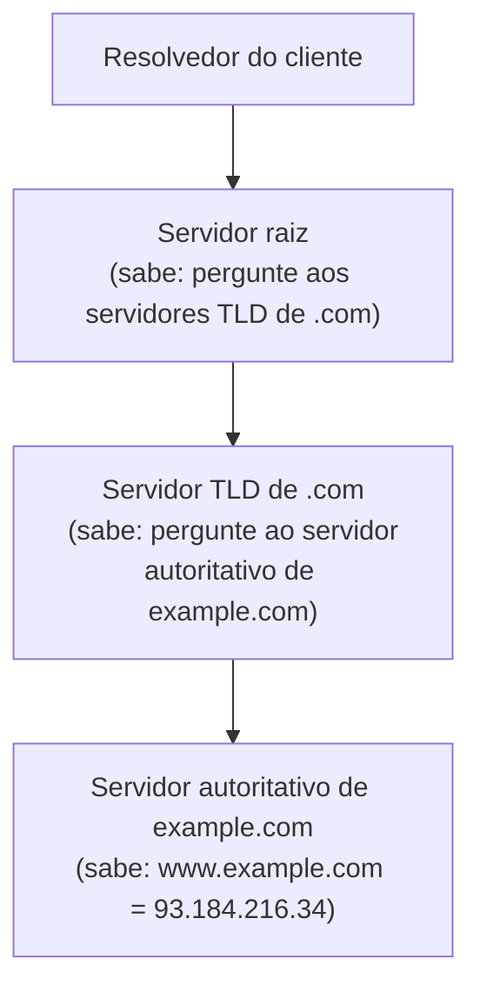

## Objetivos de Aprendizagem

- Explicar por que um serviço de diretório distribuído e hierárquico é sequer necessário, em vez de uma única tabela centralizada de nome para endereço.
- Descrever a hierarquia de servidores de três níveis do DNS: servidores raiz, de domínio de topo (TLD) e autoritativos, e o papel que cada um desempenha na resolução de um nome.
- Distinguir uma consulta iterativa de uma consulta recursiva, e rastrear uma resolução real pelos dois padrões.
- Explicar o papel do cache e do TTL em tornar a resolução DNS rápida na prática, e o trade-off que um valor de TTL representa.
- Explicar a posição do DNS na pilha em camadas: um protocolo da camada de aplicação, tipicamente rodando sobre UDP, do qual a maioria dos outros protocolos de aplicação depende antes mesmo de poder começar.

## Contexto e Motivação

O HTTP, recém-coberto, permite a um navegador falar com `www.example.com`, mas `www.example.com` não é algo para o qual qualquer dispositivo da camada de rede consiga de fato rotear um pacote; todo mecanismo das camadas de rede e de enlace que esta disciplina cobre opera sobre endereços IP e endereços MAC, nunca sobre nomes legíveis por humanos. O DNS (Domain Name System) é o protocolo da camada de aplicação que preenche essa lacuna: ele traduz um nome que uma pessoa consegue lembrar no endereço IP de que uma rede de fato precisa. Isso pode parecer um problema de consulta pequeno, quase trivial, mas na escala da Internet (bilhões de nomes, consultados constantemente, por sistemas do planeta inteiro), uma única tabela centralizada simplesmente não dá conta, e o projeto real do DNS é um sistema distribuído, hierárquico e fortemente cacheado, construído especificamente para resolver esse problema de escala.

## Teoria Central

### Por que não uma única tabela centralizada?

Um único servidor DNS centralizado guardando todo mapeamento de nome para endereço da Terra seria um ponto único de falha (a sua queda quebraria a resolução de nomes para a Internet inteira), um ponto único de contenção maciça (toda transação da Internet em qualquer lugar começa com uma consulta de nome) e um ponto único exigindo atualizações impossivelmente rápidas de um número enorme de organizações independentes, cada uma gerenciando o seu próprio pedaço do espaço de nomes. O DNS, em vez disso, distribui tanto os dados quanto a carga de consultas por uma hierarquia de muitos servidores, administrados por muitas organizações diferentes, cada uma responsável por só um pequeno pedaço do espaço de nomes total.

### A hierarquia de três níveis

Os nomes DNS são organizados como uma hierarquia, lida da direita para a esquerda na notação com pontos (`www.example.com`): a raiz, depois um domínio de topo (TLD, ex.: `.com`, `.org`, `.edu`), depois um domínio específico dentro desse TLD (`example.com`), que pode ele mesmo ter subdomínios (`www.example.com`). Três níveis de servidores DNS espelham essa hierarquia:

1. **Servidores DNS raiz.** Não sabem o endereço IP de nenhum domínio específico; eles sabem a quais servidores TLD perguntar para um dado TLD (ex.: eles conseguem direcionar uma consulta para qualquer coisa terminando em `.com` aos servidores TLD de `.com`).
2. **Servidores DNS TLD.** Responsáveis por um domínio de topo (ex.: todo o `.com`); eles também não sabem o endereço IP específico de `example.com`, mas sabem qual servidor autoritativo é responsável por aquele domínio específico.
3. **Servidores DNS autoritativos.** Guardam o mapeamento de nome para endereço real e definitivo de um domínio específico (ex.: o servidor autoritativo de `example.com` genuinamente sabe o endereço IP de `www.example.com`), tipicamente operados pela organização dona do domínio ou por um provedor de hospedagem DNS em nome dela.



### Resolução iterativa vs. recursiva

Numa consulta iterativa, o host que consulta (tipicamente um resolvedor DNS local, operado por um provedor ou por uma organização) contata o servidor raiz, recebe uma indicação (não uma resposta, só "pergunte a este servidor TLD a seguir"), depois contata esse servidor TLD, recebe outra indicação, depois contata o servidor autoritativo e, finalmente, recebe a resposta de fato: o host que consulta faz ele mesmo todo o trabalho de acompanhamento, contatando um novo servidor a cada passo. Numa consulta recursiva, o host que consulta pede a resposta completa a um único servidor (tipicamente o seu resolvedor local), e esse servidor assume o fardo de contatar iterativamente os servidores raiz, TLD e autoritativo em nome do cliente, retornando só a resposta final a quem pediu originalmente. Na prática, o caminho da aplicação de um usuário final até o seu resolvedor local é tipicamente recursivo (a aplicação só quer uma resposta), enquanto as consultas do próprio resolvedor local aos servidores raiz, TLD e autoritativo são tipicamente iterativas.

### Cache e TTL

Contatar os servidores raiz e TLD a cada consulta de nome, no mundo inteiro, ainda seria uma carga enorme e insustentável; a escalabilidade de fato do DNS vem, de forma esmagadora, do cache. Um resolvedor local guarda em cache toda resposta que recebe, junto com um valor de time-to-live (TTL) que o servidor autoritativo especifica, e atende as consultas subsequentes pelo mesmo nome diretamente do seu cache até que o TTL expire, sem contatar de novo os servidores raiz, TLD ou autoritativo. O TTL representa um trade-off real e deliberado: um TTL mais longo significa que menos consultas chegam à infraestrutura autoritativa (menos carga, resolução mais rápida para os clientes), mas significa que uma mudança no mapeamento de fato (o dono do domínio se mudando para um novo endereço IP) leva mais tempo para se propagar para os clientes que ainda servem uma resposta desatualizada do cache; um TTL mais curto propaga as mudanças mais rápido, mas ao custo de mais consultas frequentes chegando aos servidores autoritativos.

## Exemplos Resolvidos

### Exemplo 1: Rastreando uma resolução iterativa completa de `www.example.com`

```text
1. O resolvedor local não tem entrada em cache para www.example.com. Ele
   consulta um servidor raiz: "Qual é o endereço IP de www.example.com?"
2. O servidor raiz não sabe, mas responde com uma indicação: "Não sei,
   mas pergunte aos servidores TLD de .com -- aqui está o endereço deles."
3. O resolvedor local consulta um servidor TLD de .com com a mesma pergunta.
4. O servidor TLD também não sabe o IP específico, mas responde com uma
   indicação: "Pergunte ao servidor autoritativo de example.com -- aqui
   está o endereço dele."
5. O resolvedor local consulta o servidor autoritativo de example.com.
6. O servidor autoritativo responde com a resposta de fato:
   "www.example.com é 93.184.216.34", junto com um TTL (ex.: 3600
   segundos).
7. O resolvedor local guarda esta resposta em cache por 3600 segundos e a
   retorna à aplicação original que perguntou.
```

Três consultas separadas (raiz, TLD, autoritativo) foram necessárias para esta primeira busca, mas toda busca subsequente pelo mesmo nome, de qualquer cliente usando este mesmo resolvedor local, é atendida instantaneamente do cache até que o TTL expire.

### Exemplo 2: O TTL como um trade-off real, com números

Uma empresa muda o endereço IP de `www.example.com` porque está migrando para uma nova infraestrutura de servidores.

```text
Se o TTL anterior era 86.400 segundos (24 horas): qualquer cliente (ou,
  mais precisamente, qualquer resolvedor) que guardou a resposta antiga em
  cache nas últimas 24 horas continua enviando tráfego para o endereço IP
  ANTIGO por até 24 horas depois da mudança -- um dia inteiro de clientes
  potencialmente alcançando um servidor desativado, a menos que o endereço
  antigo seja mantido vivo como alternativa durante a transição.

Se o TTL tivesse sido 60 segundos: as respostas desatualizadas expiram dos
  caches em menos de um minuto depois da mudança, mas o servidor
  autoritativo de example.com agora recebe aproximadamente 1.440 vezes mais
  consultas por dia do que receberia com o TTL de 24 horas, já que quase
  toda busca erra o cache e precisa ser resolvida de novo.
```

É exatamente por isso que organizações planejando uma migração de endereço IP baixam deliberadamente o TTL de um domínio bem antes da mudança de fato, trocando alguma carga extra de consultas antes por uma propagação muito mais rápida quando a mudança real acontecer.

### Exemplo 3: A consulta recursiva do ponto de vista do cliente

```text
Aplicação: "resolva www.example.com para mim" → resolvedor local

Resolvedor local (fazendo todo o trabalho iterativo internamente,
  invisível para a aplicação): raiz → TLD → autoritativo → resposta final

Resolvedor local → Aplicação: "93.184.216.34"
```

Do ponto de vista da aplicação, isto parece uma única troca de requisição e resposta: todo o processo iterativo de vários saltos acontece dentro do resolvedor local, que é precisamente o ponto da divisão recursiva/iterativa: as aplicações recebem uma interface simples, enquanto a complexidade de fato da busca distribuída é absorvida pela infraestrutura do resolvedor.

## Equívocos Comuns e Armadilhas

- **"O DNS é um grande banco de dados global consultado diretamente."** Ele é uma hierarquia distribuída de muitos servidores administrados de forma independente, cada um guardando só um pequeno pedaço do espaço de nomes total, deliberadamente projetada assim para evitar um ponto único de falha ou de contenção na escala da Internet.
- **"Um servidor TLD sabe o endereço IP de todo domínio sob ele."** Um servidor TLD sabe só qual servidor autoritativo é responsável por um dado domínio; ele não guarda o próprio mapeamento de nome para endereço, só uma indicação para quem guarda.
- **"O cache significa que as respostas DNS estão sempre perfeitamente atuais."** Uma resposta em cache só é tão atual quanto o seu TTL permite: uma mudança no mapeamento autoritativo é invisível para qualquer resolvedor que sirva uma resposta em cache ainda válida (e agora desatualizada), que é exatamente o trade-off que o TTL representa.
- **"O DNS usa TCP, como a maioria dos protocolos de aplicação confiáveis."** O DNS usa predominantemente UDP para consultas comuns: uma única consulta e resposta tipicamente cabem num pequeno datagrama UDP, e o overhead de um estabelecimento completo de conexão TCP para essa troca minúscula é considerado desnecessário no caso comum (o DNS recorre ao TCP para respostas maiores, como transferências de zona entre servidores DNS).

## Resumo

O DNS resolve um problema de escala, e não só um problema de consulta: traduzir nomes legíveis por humanos em endereços IP pela Internet inteira, sem nenhum ponto único centralizado de falha ou de contenção, via uma hierarquia distribuída de servidores raiz, de domínio de topo e autoritativos, cada um responsável por uma fatia gerenciável do espaço de nomes total. Uma consulta recursiva permite a uma aplicação pedir uma resposta completa a um servidor (o seu resolvedor local); esse resolvedor faz o trabalho iterativo de fato de contatar os servidores raiz, depois TLD, depois autoritativo, em sequência. O cache, governado pelo TTL de cada resposta, é o que de fato torna o sistema rápido e escalável na prática, trocando velocidade de propagação por carga de consultas, um trade-off real e deliberado que os operadores de domínio ajustam diretamente. O DNS é a primeiríssima coisa que acontece, na camada de aplicação, antes que uma requisição HTTP (ou quase qualquer outro protocolo de aplicação) possa sequer começar, exatamente o papel que o capstone desta disciplina rastreia como o passo de abertura de uma requisição completa de ponta a ponta.

## Documentation Links

- [Stanford CS144: Lecture Schedule ("DNS")](https://www.scs.stanford.edu/10au-cs144/sched/): uma aula de um curso real dedicada especificamente à hierarquia e ao processo de resolução do DNS.
- [Kurose & Ross: Computer Networking: A Top-Down Approach (site oficial de apoio)](https://gaia.cs.umass.edu/kurose_ross/index.php): o tratamento do livro-texto padrão do DNS como um banco de dados distribuído e um protocolo da camada de aplicação.
