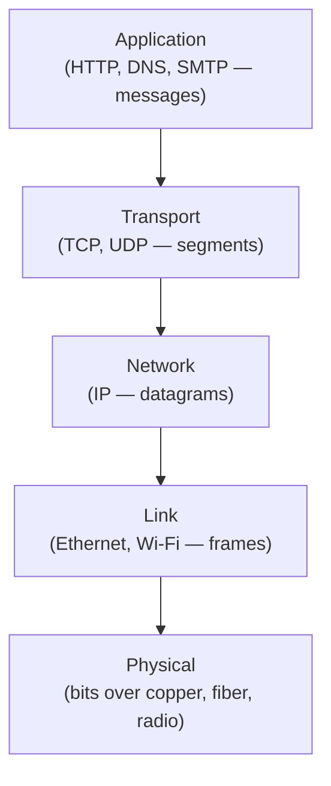

## Learning Objectives

- List the Internet's five protocol layers in order — application, transport, network, link, physical — and state the one-sentence job of each.
- Explain encapsulation: how a message gains a new header at each layer going down the stack, and loses one at each layer going back up.
- Connect protocol layering to information hiding, already covered as a software-design principle, as the same idea applied to protocol design instead of code design.
- Explain why layering is a real engineering tradeoff (modularity and independent evolution) rather than a free simplification with no cost.
- Distinguish the layer a given networking concept belongs to, given its description.

## Context & Motivation

The previous concept established that the Internet moves data through a physically messy core — millions of routers, owned by different organizations, with no single point of control. Building anything usable on top of that mess requires imposing structure, and the Internet's designers chose the same structural tool software engineers reach for when a system gets too complex to reason about all at once: layering. The Internet's protocol stack divides the entire job of "get this application's data from one host to another" into five layers, each with a narrow, fixed responsibility, each built only on the guarantees the layer below it promises, and each completely ignorant of how the layer below actually fulfills that promise.

This is not a new idea invented for networking. `information-hiding-and-abstraction`, already covered in this curriculum's software-construction discipline, made exactly this argument about software modules: a well-designed module exposes a narrow interface and hides its internal implementation, so that a caller can depend on the interface without knowing or caring how it's satisfied underneath, and the implementation is free to change without breaking any caller. Protocol layering is the identical argument, one level of abstraction removed — an application layer protocol like HTTP depends on the transport layer's promise of a byte stream (if it uses TCP), but has no idea whether that promise is fulfilled over Ethernet, Wi-Fi, or a satellite link, and does not need to. This concept develops the concrete five layers this discipline is organized around, in the same order this whole curriculum will address them.

## Core Theory

### The five-layer Internet model

The Internet's protocol stack — a simplified, five-layer version of the more academic seven-layer OSI model — consists of, from top to bottom:

1. **Application layer.** Where network applications and their protocols live: HTTP (the Web), DNS (name resolution), SMTP (email). Data here is called a *message*.
2. **Transport layer.** Moves application messages between processes on different hosts: TCP (reliable, connection-oriented) or UDP (unreliable, connectionless). Data here is called a *segment*.
3. **Network layer.** Moves transport-layer segments between hosts, across the entire network core, via routing and forwarding: primarily IP. Data here is called a *datagram*.
4. **Link layer.** Moves network-layer datagrams between two directly-connected nodes, across one physical link at a time: Ethernet, Wi-Fi. Data here is called a *frame*.
5. **Physical layer.** Moves the individual bits of a link-layer frame across the physical medium — copper wire, fiber, radio — as actual electrical, optical, or electromagnetic signals.

Each layer's job is fixed and narrow; each layer relies only on the service the layer directly below it exposes, never on how that service is actually implemented.



### Encapsulation

As data moves down the stack at the sending host, each layer wraps the data handed to it by the layer above with its own header, a process called encapsulation. An HTTP message becomes the payload of a TCP segment (which adds a TCP header), which becomes the payload of an IP datagram (which adds an IP header), which becomes the payload of an Ethernet frame (which adds an Ethernet header, and often a trailer). At the receiving host, the reverse happens: each layer strips off its own header and passes the remaining payload up to the layer above, which reads only the header meant for it. Crucially, an intermediate router along the path only needs to look as far as the network-layer header to do its job (decide which outgoing link to forward toward) — it does not open the transport-layer segment or the application-layer message inside, which is exactly what lets one router forward traffic for HTTP, DNS, and every other application, all identically, without knowing anything about any of them.

### Layering as information hiding, applied to protocols

This is the same design principle already covered under `information-hiding-and-abstraction`: a layer exposes a fixed service interface to the layer above (e.g., "I will deliver your segment reliably and in order," TCP's promise to the application layer) while hiding every detail of how it actually does that (retransmission timers, sequence numbers, congestion control — all covered later in this discipline) from anything above it. The direct payoff mirrors the software-engineering payoff: the application layer can be written once, against TCP's fixed interface, and it keeps working correctly even if the network layer underneath changes completely — from IPv4 to IPv6, or from a wired link to a wireless one — because those changes are invisible above the layer boundary where they happen.

### The real cost of layering

Layering is not free. A strict layered design means a layer cannot skip over the one below it to talk directly to a layer two levels down, even in cases where doing so might genuinely be more efficient — a real, if usually acceptable, performance cost paid for modularity. Layering can also duplicate functionality across layers (both the link layer and the transport layer, for instance, can independently perform error detection) in ways that are not strictly necessary from a pure efficiency standpoint, but are kept anyway because each layer's guarantee needs to hold on its own, independent of whether a higher or lower layer happens to also provide something similar. This discipline treats layering as the right tradeoff for the Internet's scale and diversity of participants, not as a costless abstraction.

## Worked Examples

### Example 1: One HTTP request, layer by layer

Consider a browser sending `GET /index.html HTTP/1.1` to a web server. Tracing what actually gets transmitted on the wire, from the top down:

```text
1. Application layer: the browser constructs the HTTP request message
   (plain text: "GET /index.html HTTP/1.1\r\nHost: example.com\r\n...").

2. Transport layer (TCP): the message becomes the payload of a TCP
   segment. A TCP header is prepended, containing (among other fields)
   source port, destination port (80 or 443), sequence number, and flags.

3. Network layer (IP): the TCP segment becomes the payload of an IP
   datagram. An IP header is prepended, containing the source and
   destination IP addresses and a time-to-live field.

4. Link layer (Ethernet): the IP datagram becomes the payload of an
   Ethernet frame. An Ethernet header is prepended, containing the
   source and destination MAC addresses for this one physical hop.

5. Physical layer: the entire frame, including all four headers plus
   the original HTTP message, is converted into electrical or optical
   signals and transmitted bit by bit across the physical medium.
```

At every router the packet crosses en route to the server, only the link-layer frame is unwrapped and the network-layer (IP) header is read to make a forwarding decision — the TCP header and the HTTP message inside remain untouched and unread until the packet reaches the destination host.

### Example 2: What a layer violation would look like, and why it's avoided

Imagine an application layer protocol that tried to directly specify which physical medium (copper vs. fiber) its bits should travel over. This would violate layering in two direct ways: it would require every application to be rewritten if the physical medium changed (breaking the "layers below can evolve independently" property), and it would require every application programmer to understand physical-layer signaling details entirely irrelevant to their actual job (breaking the "layer above doesn't need to know how the layer below is implemented" property). This is precisely why HTTP, in the real Internet stack, has no concept of copper or fiber at all — that decision is made entirely by the link and physical layers, several layers below, completely opaque to the application.

### Example 3: Classifying real components by layer

```text
Component                       Layer
-------------------------------  ----------
HTTP request headers             Application
TCP sequence number               Transport
IP address (source/destination)   Network
MAC address (source/destination) Link
Voltage level on a copper wire    Physical
```

The pattern: anything concerned with *which process on which host* the data is for belongs to transport or above; anything concerned with *routing across the network core* belongs to network; anything concerned with *one physical hop* belongs to link and below.

## Common Misconceptions & Pitfalls

- **"Layering means each layer is a physically separate piece of hardware or software."** Layers are conceptual/logical divisions of responsibility, typically all implemented in software within a single host's networking stack (with the physical layer being the genuine hardware boundary) — not separate machines.
- **"A router processes all five layers for every packet it forwards."** A router typically only needs to process up through the network layer to make a forwarding decision; it does not open the transport-layer segment or application-layer message inside a packet it is merely forwarding (end hosts are where all five layers are fully processed).
- **"OSI's seven layers and the Internet's five layers are the same model with different names."** The Internet model collapses OSI's separate presentation and session layers into the application layer, since in practice the Internet's application protocols handle those concerns themselves rather than relying on a distinct standardized layer for them.
- **"Encapsulation adds overhead that makes layering inefficient in a way that matters in practice."** Header overhead is real but typically small relative to payload size for anything but the tiniest messages, and the modularity payoff (independent evolution of each layer, reuse of lower layers across every application) is judged, by essentially every major real network design, to be worth that small, bounded cost.

## Summary

The Internet's protocol stack divides networking into five layers — application, transport, network, link, physical — each exposing a narrow, fixed service to the layer above while hiding how it actually delivers that service, the exact same information-hiding principle already covered in software design, now applied to protocol design. Data moving down the stack gains a header at each layer (encapsulation); moving up, each layer strips its own header and passes the remainder upward. This buys real, valuable independence — the application layer can be written once and keep working even as the network and link layers underneath change completely — at a real, accepted cost in flexibility and occasional duplicated functionality across layers. Every concept in the remainder of this discipline is organized by which of these five layers it belongs to, in the same top-down order introduced here.

## Documentation Links

- [Kurose & Ross — Computer Networking: A Top-Down Approach (official companion site)](https://gaia.cs.umass.edu/kurose_ross/index.php) — the standard textbook's five-layer Internet protocol stack and encapsulation model.
- [Stanford CS144 — Introduction to Computer Networking](https://www.scs.stanford.edu/10au-cs144/) — a real course built around implementing this exact layered stack, one layer at a time, in a sequence of programming assignments.
