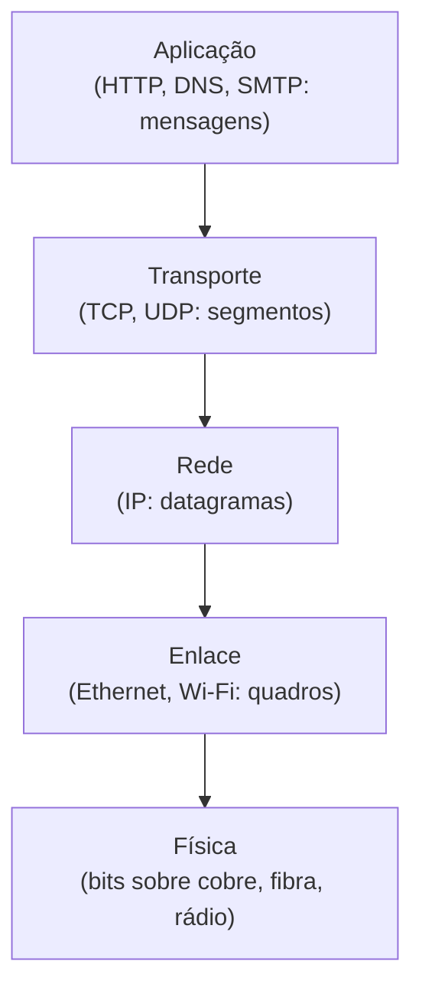

## Objetivos de Aprendizagem

- Listar em ordem as cinco camadas de protocolo da Internet (aplicação, transporte, rede, enlace, física) e enunciar em uma frase o trabalho de cada uma.
- Explicar o encapsulamento: como uma mensagem ganha um novo cabeçalho a cada camada descendo a pilha, e perde um a cada camada subindo de volta.
- Conectar as camadas de protocolo à ocultação de informação, já coberta como um princípio de projeto de software, como a mesma ideia aplicada ao projeto de protocolos em vez do projeto de código.
- Explicar por que as camadas são um trade-off de engenharia real (modularidade e evolução independente), e não uma simplificação gratuita sem custo.
- Distinguir a camada à qual um dado conceito de redes pertence, dada a sua descrição.

## Contexto e Motivação

O conceito anterior estabeleceu que a Internet move dados por um núcleo fisicamente bagunçado: milhões de roteadores, de propriedade de organizações diferentes, sem um ponto único de controle. Construir qualquer coisa utilizável em cima dessa bagunça exige impor estrutura, e os projetistas da Internet escolheram a mesma ferramenta estrutural a que engenheiros de software recorrem quando um sistema fica complexo demais para raciocinar sobre ele de uma vez: as camadas. A pilha de protocolos da Internet divide o trabalho inteiro de "levar os dados desta aplicação de um host para outro" em cinco camadas, cada uma com uma responsabilidade estreita e fixa, cada uma construída apenas sobre as garantias que a camada abaixo promete, e cada uma completamente ignorante de como a camada abaixo de fato cumpre essa promessa.

Esta não é uma ideia nova inventada para as redes. `information-hiding-and-abstraction`, já coberto na disciplina de construção de software deste currículo, fez exatamente este argumento sobre módulos de software: um módulo bem projetado expõe uma interface estreita e esconde a sua implementação interna, para que quem o chama possa depender da interface sem saber nem se importar com como ela é satisfeita por baixo, e a implementação fica livre para mudar sem quebrar nenhum chamador. As camadas de protocolo são o argumento idêntico, um nível de abstração adiante: um protocolo da camada de aplicação como o HTTP depende da promessa da camada de transporte de um fluxo de bytes (se usar TCP), mas não faz ideia se essa promessa é cumprida sobre Ethernet, Wi-Fi ou um enlace de satélite, e não precisa saber. Este conceito desenvolve as cinco camadas concretas em torno das quais esta disciplina é organizada, na mesma ordem em que todo este currículo vai tratá-las.

## Teoria Central

### O modelo de cinco camadas da Internet

A pilha de protocolos da Internet (uma versão simplificada, de cinco camadas, do modelo OSI mais acadêmico, de sete camadas) consiste em, de cima para baixo:

1. **Camada de aplicação.** Onde as aplicações de rede e os seus protocolos vivem: HTTP (a Web), DNS (resolução de nomes), SMTP (e-mail). Os dados aqui são chamados de *mensagem*.
2. **Camada de transporte.** Move as mensagens da aplicação entre processos em hosts diferentes: TCP (confiável, orientado a conexão) ou UDP (não confiável, sem conexão). Os dados aqui são chamados de *segmento*.
3. **Camada de rede.** Move os segmentos da camada de transporte entre hosts, por todo o núcleo da rede, via roteamento e encaminhamento: principalmente o IP. Os dados aqui são chamados de *datagrama*.
4. **Camada de enlace.** Move os datagramas da camada de rede entre dois nós diretamente conectados, por um enlace físico de cada vez: Ethernet, Wi-Fi. Os dados aqui são chamados de *quadro*.
5. **Camada física.** Move os bits individuais de um quadro da camada de enlace pelo meio físico (fio de cobre, fibra, rádio) como sinais elétricos, ópticos ou eletromagnéticos reais.

O trabalho de cada camada é fixo e estreito; cada camada depende apenas do serviço que a camada diretamente abaixo expõe, nunca de como esse serviço é de fato implementado.



### Encapsulamento

Conforme os dados descem a pilha no host remetente, cada camada embrulha os dados entregues pela camada acima com o seu próprio cabeçalho, um processo chamado encapsulamento. Uma mensagem HTTP se torna o payload de um segmento TCP (que acrescenta um cabeçalho TCP), que se torna o payload de um datagrama IP (que acrescenta um cabeçalho IP), que se torna o payload de um quadro Ethernet (que acrescenta um cabeçalho Ethernet e, frequentemente, um trailer). No host receptor, acontece o inverso: cada camada remove o seu próprio cabeçalho e passa o payload restante para a camada acima, que lê só o cabeçalho destinado a ela. Crucialmente, um roteador intermediário no caminho só precisa olhar até o cabeçalho da camada de rede para fazer o seu trabalho (decidir para qual enlace de saída encaminhar); ele não abre o segmento da camada de transporte nem a mensagem da camada de aplicação lá dentro, e é exatamente isso que permite a um roteador encaminhar tráfego de HTTP, DNS e toda outra aplicação, todos de forma idêntica, sem saber nada sobre nenhum deles.

### As camadas como ocultação de informação, aplicada a protocolos

Este é o mesmo princípio de projeto já coberto em `information-hiding-and-abstraction`: uma camada expõe uma interface de serviço fixa para a camada acima (ex.: "vou entregar o seu segmento de forma confiável e em ordem", a promessa do TCP à camada de aplicação) enquanto esconde todo detalhe de como ela de fato faz isso (temporizadores de retransmissão, números de sequência, controle de congestionamento, todos cobertos mais adiante nesta disciplina) de qualquer coisa acima dela. O retorno direto espelha o retorno da engenharia de software: a camada de aplicação pode ser escrita uma vez, contra a interface fixa do TCP, e continua funcionando corretamente mesmo que a camada de rede por baixo mude completamente (do IPv4 para o IPv6, ou de um enlace cabeado para um sem fio), porque essas mudanças são invisíveis acima da fronteira de camada onde elas acontecem.

### O custo real das camadas

As camadas não são de graça. Um projeto em camadas estrito significa que uma camada não pode pular a de baixo para falar diretamente com uma camada dois níveis abaixo, mesmo em casos em que fazer isso poderia genuinamente ser mais eficiente: um custo real de desempenho, ainda que geralmente aceitável, pago pela modularidade. As camadas também podem duplicar funcionalidade entre camadas (tanto a camada de enlace quanto a de transporte, por exemplo, podem fazer detecção de erros de forma independente) de maneiras que não são estritamente necessárias do ponto de vista da eficiência pura, mas são mantidas mesmo assim porque a garantia de cada camada precisa valer por conta própria, independentemente de uma camada mais alta ou mais baixa calhar de também fornecer algo parecido. Esta disciplina trata as camadas como o trade-off certo para a escala e a diversidade de participantes da Internet, e não como uma abstração sem custo.

## Exemplos Resolvidos

### Exemplo 1: Uma requisição HTTP, camada por camada

Considere um navegador enviando `GET /index.html HTTP/1.1` a um servidor web. Rastreando o que de fato é transmitido no fio, de cima para baixo:

```text
1. Camada de aplicação: o navegador constrói a mensagem de requisição
   HTTP (texto puro: "GET /index.html HTTP/1.1\r\nHost: example.com\r\n...").

2. Camada de transporte (TCP): a mensagem se torna o payload de um
   segmento TCP. Um cabeçalho TCP é prefixado, contendo (entre outros
   campos) porta de origem, porta de destino (80 ou 443), número de
   sequência e flags.

3. Camada de rede (IP): o segmento TCP se torna o payload de um
   datagrama IP. Um cabeçalho IP é prefixado, contendo os endereços IP
   de origem e de destino e um campo time-to-live.

4. Camada de enlace (Ethernet): o datagrama IP se torna o payload de um
   quadro Ethernet. Um cabeçalho Ethernet é prefixado, contendo os
   endereços MAC de origem e de destino para este único salto físico.

5. Camada física: o quadro inteiro, incluindo os quatro cabeçalhos mais
   a mensagem HTTP original, é convertido em sinais elétricos ou ópticos
   e transmitido bit a bit pelo meio físico.
```

Em cada roteador que o pacote atravessa a caminho do servidor, só o quadro da camada de enlace é desembrulhado e o cabeçalho da camada de rede (IP) é lido para tomar uma decisão de encaminhamento; o cabeçalho TCP e a mensagem HTTP lá dentro permanecem intocados e não lidos até que o pacote chegue ao host de destino.

### Exemplo 2: Como seria uma violação de camada, e por que ela é evitada

Imagine um protocolo da camada de aplicação que tentasse especificar diretamente por qual meio físico (cobre vs. fibra) os seus bits deveriam viajar. Isso violaria as camadas de duas formas diretas: exigiria que toda aplicação fosse reescrita se o meio físico mudasse (quebrando a propriedade de "as camadas de baixo podem evoluir de forma independente"), e exigiria que todo programador de aplicação entendesse detalhes de sinalização da camada física inteiramente irrelevantes para o seu trabalho real (quebrando a propriedade de "a camada de cima não precisa saber como a camada de baixo é implementada"). É precisamente por isso que o HTTP, na pilha real da Internet, não tem conceito algum de cobre ou fibra: essa decisão é tomada inteiramente pelas camadas de enlace e física, várias camadas abaixo, completamente opaca para a aplicação.

### Exemplo 3: Classificando componentes reais por camada

```text
Componente                         Camada
---------------------------------  ----------
Cabeçalhos de requisição HTTP      Aplicação
Número de sequência TCP            Transporte
Endereço IP (origem/destino)       Rede
Endereço MAC (origem/destino)      Enlace
Nível de tensão num fio de cobre   Física
```

O padrão: qualquer coisa preocupada com *para qual processo em qual host* os dados são pertence ao transporte ou acima; qualquer coisa preocupada com *o roteamento pelo núcleo da rede* pertence à rede; qualquer coisa preocupada com *um salto físico* pertence ao enlace e abaixo.

## Equívocos Comuns e Armadilhas

- **"Camadas significam que cada camada é uma peça de hardware ou software fisicamente separada."** As camadas são divisões conceituais/lógicas de responsabilidade, tipicamente todas implementadas em software dentro da pilha de rede de um único host (com a camada física sendo a fronteira genuína de hardware), e não máquinas separadas.
- **"Um roteador processa as cinco camadas para cada pacote que encaminha."** Um roteador tipicamente só precisa processar até a camada de rede para tomar uma decisão de encaminhamento; ele não abre o segmento da camada de transporte nem a mensagem da camada de aplicação dentro de um pacote que está meramente encaminhando (os hosts finais são onde as cinco camadas são processadas por completo).
- **"As sete camadas do OSI e as cinco camadas da Internet são o mesmo modelo com nomes diferentes."** O modelo da Internet colapsa as camadas separadas de apresentação e de sessão do OSI na camada de aplicação, já que, na prática, os protocolos de aplicação da Internet tratam eles mesmos dessas preocupações em vez de depender de uma camada padronizada distinta para elas.
- **"O encapsulamento acrescenta um overhead que torna as camadas ineficientes de uma forma que importa na prática."** O overhead dos cabeçalhos é real, mas tipicamente pequeno em relação ao tamanho do payload para qualquer coisa além das mensagens mais minúsculas, e o retorno da modularidade (evolução independente de cada camada, reuso das camadas de baixo por toda aplicação) é julgado, por essencialmente todo grande projeto de rede real, como valendo esse custo pequeno e limitado.

## Resumo

A pilha de protocolos da Internet divide as redes em cinco camadas (aplicação, transporte, rede, enlace, física), cada uma expondo um serviço estreito e fixo para a camada acima enquanto esconde como ela de fato entrega esse serviço, exatamente o mesmo princípio de ocultação de informação já coberto no projeto de software, agora aplicado ao projeto de protocolos. Dados descendo a pilha ganham um cabeçalho a cada camada (encapsulamento); subindo, cada camada remove o seu próprio cabeçalho e passa o restante para cima. Isso compra uma independência real e valiosa (a camada de aplicação pode ser escrita uma vez e continuar funcionando mesmo que as camadas de rede e de enlace por baixo mudem completamente) a um custo real e aceito em flexibilidade e em funcionalidade ocasionalmente duplicada entre camadas. Todo conceito do restante desta disciplina é organizado por qual destas cinco camadas ele pertence, na mesma ordem de cima para baixo introduzida aqui.

## Documentation Links

- [Kurose & Ross: Computer Networking: A Top-Down Approach (site oficial de apoio)](https://gaia.cs.umass.edu/kurose_ross/index.php): a pilha de protocolos da Internet de cinco camadas e o modelo de encapsulamento do livro-texto padrão.
- [Stanford CS144: Introduction to Computer Networking](https://www.scs.stanford.edu/10au-cs144/): um curso real construído em torno de implementar exatamente esta pilha em camadas, uma camada por vez, numa sequência de trabalhos de programação.
