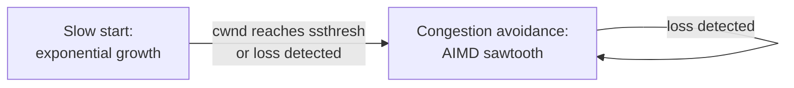

## Learning Objectives

- Explain why TCP treats packet loss as its primary signal for network congestion, in the absence of any explicit signal from routers.
- Describe slow start: exponential congestion-window growth, and why it eventually gives way to a different growth phase.
- Describe congestion avoidance (AIMD — additive increase, multiplicative decrease) and trace a real congestion-window sawtooth across several round trips.
- Explain, at least informally, why independently-run TCP connections sharing a bottleneck link tend to converge toward a fair split of that link's capacity.
- Explain how congestion control's window interacts with flow control's window from the previous concept to determine a sender's actual allowed rate.

## Context & Motivation

Flow control, just covered, protects a receiver's buffer from a sender that transmits faster than the receiving application can consume. Congestion control solves a related but genuinely distinct problem: protecting the shared network itself — the routers and links every connection's packets travel through — from being overwhelmed by the combined traffic of every connection simultaneously, none of which has any built-in visibility into how much traffic every other connection is also sending at that same moment. TCP's congestion control is a real feat of decentralized coordination: with no central authority telling any one connection how much bandwidth it may use, every well-behaved TCP connection independently infers network conditions from indirect signals and adjusts its own rate accordingly, and the aggregate result — largely because every connection runs essentially the same algorithm — tends toward a genuinely fair sharing of whatever capacity is actually available.

## Core Theory

### Loss as the congestion signal

TCP has no direct way to ask a router "how congested are you right now?" — the network layer, as established when packet switching was introduced, provides no such feedback by default. TCP instead infers congestion indirectly, from packet loss: when a router's queue is full (a real consequence, already covered, of traffic intensity approaching or exceeding 1), it drops arriving packets, and TCP interprets a detected loss (via timeout or triple duplicate ACK, both already covered) as a signal that the network is currently congested, and reduces its sending rate in response. This is an imperfect signal — loss can occasionally result from a corrupted bit on a wireless link rather than genuine congestion — but it is the signal TCP's classic congestion-control algorithm is built around.

### The congestion window

TCP maintains a congestion window (`cwnd`), a second limit on in-flight, unacknowledged data, separate from and computed independently of the flow-control receive window covered in the previous concept. A sender's actual allowed in-flight data at any moment is the minimum of `cwnd` and the receiver's advertised flow-control window — whichever is more restrictive at that moment governs the sender's real sending rate.

### Slow start

A new TCP connection begins with a small congestion window (often 1 or a few maximum segment sizes) and grows it exponentially — roughly doubling `cwnd` every round-trip time an ACK is received without loss — during a phase called slow start, despite the name actually describing rapid, exponential growth (the name refers to starting from a small initial value, not to a slow rate of growth). Slow start continues until either a loss is detected, or `cwnd` reaches a threshold value (`ssthresh`), at which point TCP transitions into congestion avoidance.

### Congestion avoidance: AIMD

Once past slow start, TCP grows `cwnd` far more conservatively: additive increase, roughly one maximum segment size per round-trip time (linear growth, not exponential) — probing gently for additional available bandwidth. When loss is detected, TCP responds with multiplicative decrease: cutting `cwnd` sharply, typically by half, on the theory that a detected loss means the network is currently overloaded and a sender's rate needs to back off substantially, not just slightly. This additive-increase/multiplicative-decrease (AIMD) pattern, repeated indefinitely, produces a characteristic sawtooth shape when `cwnd` is plotted over time: a long, gradual, linear climb, followed by a sharp drop at each detected loss, then climbing again.



### Why AIMD converges toward fairness

Consider two TCP connections sharing one bottleneck link, both running the same AIMD algorithm. When the link becomes congested (both connections' combined rate exceeds the link's capacity), loss is likely to affect either connection roughly proportionally to how much of the link's capacity it is currently using — the connection currently sending faster has more packets in flight and is statistically more likely to have one dropped. Multiplicative decrease then cuts the faster connection's rate by a larger absolute amount (half of a larger number is a larger cut) than it cuts the slower connection's rate, while additive increase adds the same fixed amount to both connections regardless of their current rate. Repeated over many rounds, this asymmetric response — proportionally larger cuts to whoever is currently ahead, identical increases to everyone — tends to push both connections' rates toward convergence on a roughly equal share of the link's capacity, an emergent, decentralized fairness property that no single connection is deliberately trying to produce.

## Worked Examples

### Example 1: Slow start's exponential growth, round by round

Starting `cwnd = 1` MSS (maximum segment size), doubling each round-trip time with no loss:

```text
RTT 1: cwnd = 1
RTT 2: cwnd = 2
RTT 3: cwnd = 4
RTT 4: cwnd = 8
RTT 5: cwnd = 16
```

Five round-trip times take `cwnd` from 1 to 16 — exponential growth, not the "slow" the phase's name might suggest; a connection reaches a substantial sending rate remarkably quickly during slow start, which is precisely why it must transition to the far more conservative AIMD phase before `cwnd` grows large enough to genuinely overwhelm the network.

### Example 2: A congestion-window sawtooth over several round trips

Starting `cwnd = 16` MSS, in congestion avoidance (additive increase of 1 MSS per RTT), with a loss detected at RTT 4:

```text
RTT 1: cwnd = 16
RTT 2: cwnd = 17
RTT 3: cwnd = 18
RTT 4: cwnd = 19  →  LOSS DETECTED. Multiplicative decrease: cwnd = 19/2 ≈ 9
RTT 5: cwnd = 10
RTT 6: cwnd = 11
RTT 7: cwnd = 12
RTT 8: cwnd = 13  →  LOSS DETECTED. Multiplicative decrease: cwnd = 13/2 ≈ 6
```

Plotted over time, this produces the classic sawtooth: a slow linear climb (additive increase), followed by a sharp halving at each loss (multiplicative decrease) — the visible signature of AIMD in every real TCP throughput graph.

### Example 3: Two connections converging toward fairness

Two TCP connections share a bottleneck link, both in congestion avoidance. Connection A currently has `cwnd = 20`; Connection B currently has `cwnd = 10`. The link becomes congested and both experience loss at roughly the same moment (a simplification — in reality, loss timing is probabilistic, but this illustrates the mechanism):

```text
Connection A: cwnd = 20 → 10 (halved: lost 10 units of window)
Connection B: cwnd = 10 → 5  (halved: lost 5 units of window)

Next round, additive increase adds +1 to both:
Connection A: cwnd = 11
Connection B: cwnd = 6
```

The gap between the two connections (originally 10, i.e. 20 vs 10) shrinks with each such cycle (down to 5, i.e. 11 vs 6) — repeated over many rounds, this asymmetric-cut/symmetric-increase pattern drives the two connections' windows toward convergence, the concrete mechanism behind AIMD's fairness property.

## Common Misconceptions & Pitfalls

- **"Slow start means TCP grows its rate slowly."** Slow start's growth is exponential — genuinely fast — the name refers to starting from a small initial `cwnd`, not to a slow rate of increase; congestion avoidance's additive increase is the phase that actually grows slowly (linearly).
- **"Congestion control and flow control use the same window."** They are computed entirely independently — `cwnd` reflects TCP's own inference about network conditions; the flow-control receive window reflects the receiver's buffer occupancy — and the sender's actual allowed rate is capped by whichever of the two is currently smaller.
- **"All packet loss means the network is congested."** TCP's classic algorithm assumes this, but loss can also result from bit corruption on an unreliable physical link (common on some wireless connections) with no actual congestion present — TCP's congestion-avoidance response (a rate cut) is, in that specific case, reacting to the wrong cause, a known real limitation of loss-based congestion control.
- **"Multiplicative decrease and additive increase are symmetric operations."** They are deliberately asymmetric: multiplicative decrease is fast and aggressive (halving), reflecting that overshooting available capacity is a real, immediate cost to the whole network; additive increase is slow and gentle (adding a fixed small amount), reflecting that probing for more available bandwidth should be cautious, not aggressive — the asymmetry itself is what produces both stability and the fairness-convergence property.

## Summary

TCP infers network congestion indirectly, from detected packet loss, since the network layer provides no direct congestion signal, and maintains a congestion window (`cwnd`) — separate from and independent of flow control's receive window — governing how much data it will keep in flight. A new connection begins with exponential growth (slow start) before transitioning to far more conservative linear growth (additive increase) once a threshold or a loss is reached; any detected loss triggers a sharp multiplicative decrease (typically halving `cwnd`). This additive-increase/multiplicative-decrease pattern, repeated indefinitely, produces the characteristic sawtooth shape visible in real TCP throughput traces, and — because every well-behaved connection runs essentially the same algorithm, with proportionally larger cuts falling on whoever is currently sending faster — tends to converge multiple connections sharing a bottleneck link toward a genuinely fair split of available capacity, with no central coordinator arranging it. A sender's real, effective rate at any moment is the minimum of this congestion window and flow control's receive window from the previous concept — completing TCP's full picture of what actually governs how fast data moves across a real connection.

## Documentation Links

- [Kurose & Ross — Computer Networking: A Top-Down Approach (official companion site)](https://gaia.cs.umass.edu/kurose_ross/index.php) — the standard textbook's treatment of TCP congestion control, slow start, AIMD, and the fairness argument.
- [Stanford CS144 — Lecture Schedule ("TCP & Congestion control")](https://www.scs.stanford.edu/10au-cs144/sched/) — a real course lecture dedicated specifically to TCP's congestion-control mechanism.
