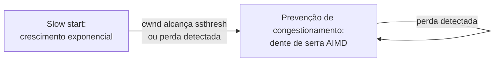

## Objetivos de Aprendizagem

- Explicar por que o TCP trata a perda de pacotes como o seu sinal principal de congestionamento da rede, na ausência de qualquer sinal explícito dos roteadores.
- Descrever o slow start: o crescimento exponencial da janela de congestionamento, e por que ele eventualmente dá lugar a uma fase de crescimento diferente.
- Descrever a prevenção de congestionamento (AIMD: aumento aditivo, diminuição multiplicativa) e rastrear um dente de serra real da janela de congestionamento por várias idas e voltas.
- Explicar, ao menos informalmente, por que conexões TCP rodando de forma independente e compartilhando um enlace gargalo tendem a convergir para uma divisão justa da capacidade desse enlace.
- Explicar como a janela do controle de congestionamento interage com a janela do controle de fluxo do conceito anterior para determinar a taxa real permitida a um remetente.

## Contexto e Motivação

O controle de fluxo, recém-coberto, protege o buffer de um receptor de um remetente que transmite mais rápido do que a aplicação receptora consegue consumir. O controle de congestionamento resolve um problema relacionado, mas genuinamente distinto: proteger a própria rede compartilhada (os roteadores e enlaces pelos quais os pacotes de toda conexão viajam) de ser sobrecarregada pelo tráfego combinado de todas as conexões simultaneamente, nenhuma das quais tem visibilidade embutida de quanto tráfego toda outra conexão também está enviando naquele mesmo momento. O controle de congestionamento do TCP é um feito real de coordenação descentralizada: sem nenhuma autoridade central dizendo a qualquer conexão quanta largura de banda ela pode usar, toda conexão TCP bem-comportada infere de forma independente as condições da rede a partir de sinais indiretos e ajusta a sua própria taxa de acordo, e o resultado agregado (em grande parte porque toda conexão roda essencialmente o mesmo algoritmo) tende a um compartilhamento genuinamente justo de qualquer capacidade que esteja de fato disponível.

## Teoria Central

### A perda como sinal de congestionamento

O TCP não tem forma direta de perguntar a um roteador "quão congestionado você está agora?": a camada de rede, como estabelecido quando a comutação de pacotes foi introduzida, não fornece esse retorno por padrão. O TCP, em vez disso, infere o congestionamento indiretamente, a partir da perda de pacotes: quando a fila de um roteador está cheia (uma consequência real, já coberta, de a intensidade de tráfego se aproximar de 1 ou excedê-lo), ele descarta os pacotes que chegam, e o TCP interpreta uma perda detectada (via timeout ou três ACKs duplicados, ambos já cobertos) como um sinal de que a rede está congestionada no momento, e reduz a sua taxa de envio em resposta. Este é um sinal imperfeito (a perda pode ocasionalmente resultar de um bit corrompido num enlace sem fio, e não de congestionamento genuíno), mas é o sinal em torno do qual o algoritmo clássico de controle de congestionamento do TCP é construído.

### A janela de congestionamento

O TCP mantém uma janela de congestionamento (`cwnd`), um segundo limite para os dados em trânsito e não confirmados, separado da janela de recepção do controle de fluxo coberta no conceito anterior e calculado de forma independente dela. Os dados em trânsito de fato permitidos a um remetente a qualquer momento são o mínimo entre `cwnd` e a janela de controle de fluxo anunciada pelo receptor: qualquer das duas que for mais restritiva naquele momento governa a taxa de envio real do remetente.

### Slow start

Uma nova conexão TCP começa com uma janela de congestionamento pequena (frequentemente 1 ou alguns tamanhos máximos de segmento) e a faz crescer exponencialmente (aproximadamente dobrando `cwnd` a cada tempo de ida e volta em que um ACK é recebido sem perda) durante uma fase chamada slow start, apesar de o nome de fato descrever um crescimento rápido e exponencial (o nome se refere a começar de um valor inicial pequeno, e não a uma taxa lenta de crescimento). O slow start continua até que uma perda seja detectada ou que `cwnd` alcance um valor de limiar (`ssthresh`), ponto em que o TCP passa para a prevenção de congestionamento.

### Prevenção de congestionamento: AIMD

Passado o slow start, o TCP faz `cwnd` crescer de forma muito mais conservadora: aumento aditivo, aproximadamente um tamanho máximo de segmento por tempo de ida e volta (crescimento linear, e não exponencial), sondando com delicadeza por largura de banda adicional disponível. Quando uma perda é detectada, o TCP responde com uma diminuição multiplicativa: corta `cwnd` acentuadamente, tipicamente pela metade, com a teoria de que uma perda detectada significa que a rede está sobrecarregada no momento e a taxa de um remetente precisa recuar substancialmente, e não só um pouco. Este padrão de aumento aditivo/diminuição multiplicativa (AIMD), repetido indefinidamente, produz um formato característico de dente de serra quando `cwnd` é plotado ao longo do tempo: uma subida longa, gradual e linear, seguida de uma queda acentuada a cada perda detectada, e depois subindo de novo.



### Por que o AIMD converge para a justiça

Considere duas conexões TCP compartilhando um enlace gargalo, ambas rodando o mesmo algoritmo AIMD. Quando o enlace fica congestionado (a taxa combinada das duas conexões excede a capacidade do enlace), a perda tende a afetar cada conexão aproximadamente em proporção a quanto da capacidade do enlace ela está usando no momento: a conexão que está enviando mais rápido tem mais pacotes em trânsito e tem estatisticamente mais chance de ter um descartado. A diminuição multiplicativa então corta a taxa da conexão mais rápida por uma quantidade absoluta maior (metade de um número maior é um corte maior) do que corta a taxa da conexão mais lenta, enquanto o aumento aditivo acrescenta a mesma quantidade fixa às duas conexões, independentemente da sua taxa atual. Repetida por muitas rodadas, esta resposta assimétrica (cortes proporcionalmente maiores para quem estiver na frente no momento, aumentos idênticos para todos) tende a empurrar as taxas das duas conexões para a convergência numa fatia aproximadamente igual da capacidade do enlace, uma propriedade de justiça emergente e descentralizada que nenhuma conexão isolada está tentando deliberadamente produzir.

## Exemplos Resolvidos

### Exemplo 1: O crescimento exponencial do slow start, rodada a rodada

Começando com `cwnd = 1` MSS (tamanho máximo de segmento), dobrando a cada tempo de ida e volta sem perda:

```text
RTT 1: cwnd = 1
RTT 2: cwnd = 2
RTT 3: cwnd = 4
RTT 4: cwnd = 8
RTT 5: cwnd = 16
```

Cinco tempos de ida e volta levam `cwnd` de 1 a 16: crescimento exponencial, e não o "lento" que o nome da fase poderia sugerir. Uma conexão alcança uma taxa de envio substancial notavelmente rápido durante o slow start, e é precisamente por isso que ela precisa passar para a fase AIMD, muito mais conservadora, antes que `cwnd` cresça o suficiente para genuinamente sobrecarregar a rede.

### Exemplo 2: Um dente de serra da janela de congestionamento por várias idas e voltas

Começando com `cwnd = 16` MSS, em prevenção de congestionamento (aumento aditivo de 1 MSS por RTT), com uma perda detectada no RTT 4:

```text
RTT 1: cwnd = 16
RTT 2: cwnd = 17
RTT 3: cwnd = 18
RTT 4: cwnd = 19  →  PERDA DETECTADA. Diminuição multiplicativa: cwnd = 19/2 ≈ 9
RTT 5: cwnd = 10
RTT 6: cwnd = 11
RTT 7: cwnd = 12
RTT 8: cwnd = 13  →  PERDA DETECTADA. Diminuição multiplicativa: cwnd = 13/2 ≈ 6
```

Plotado ao longo do tempo, isto produz o dente de serra clássico: uma subida linear lenta (aumento aditivo), seguida de uma redução acentuada pela metade a cada perda (diminuição multiplicativa), a assinatura visível do AIMD em todo gráfico real de vazão do TCP.

### Exemplo 3: Duas conexões convergindo para a justiça

Duas conexões TCP compartilham um enlace gargalo, ambas em prevenção de congestionamento. A Conexão A tem atualmente `cwnd = 20`; a Conexão B tem atualmente `cwnd = 10`. O enlace fica congestionado e as duas sofrem perda aproximadamente no mesmo momento (uma simplificação: na realidade, o timing da perda é probabilístico, mas isto ilustra o mecanismo):

```text
Conexão A: cwnd = 20 → 10 (reduzida pela metade: perdeu 10 unidades de janela)
Conexão B: cwnd = 10 → 5  (reduzida pela metade: perdeu 5 unidades de janela)

Na próxima rodada, o aumento aditivo acrescenta +1 às duas:
Conexão A: cwnd = 11
Conexão B: cwnd = 6
```

A diferença entre as duas conexões (originalmente 10, ou seja, 20 vs 10) encolhe a cada ciclo desses (caindo para 5, ou seja, 11 vs 6). Repetido por muitas rodadas, este padrão de corte assimétrico/aumento simétrico leva as janelas das duas conexões à convergência, o mecanismo concreto por trás da propriedade de justiça do AIMD.

## Equívocos Comuns e Armadilhas

- **"Slow start significa que o TCP faz a sua taxa crescer devagar."** O crescimento do slow start é exponencial, genuinamente rápido; o nome se refere a começar de uma `cwnd` inicial pequena, e não a uma taxa lenta de aumento. O aumento aditivo da prevenção de congestionamento é a fase que de fato cresce devagar (linearmente).
- **"O controle de congestionamento e o controle de fluxo usam a mesma janela."** Elas são calculadas de forma inteiramente independente: `cwnd` reflete a própria inferência do TCP sobre as condições da rede; a janela de recepção do controle de fluxo reflete a ocupação do buffer do receptor. A taxa real permitida ao remetente é limitada por qualquer das duas que estiver no momento menor.
- **"Toda perda de pacote significa que a rede está congestionada."** O algoritmo clássico do TCP presume isso, mas a perda também pode resultar da corrupção de bits num enlace físico não confiável (comum em algumas conexões sem fio) sem nenhum congestionamento real presente. A resposta de prevenção de congestionamento do TCP (um corte de taxa) está, nesse caso específico, reagindo à causa errada, uma limitação real e conhecida do controle de congestionamento baseado em perda.
- **"A diminuição multiplicativa e o aumento aditivo são operações simétricas."** Elas são deliberadamente assimétricas: a diminuição multiplicativa é rápida e agressiva (pela metade), refletindo que ultrapassar a capacidade disponível é um custo real e imediato para a rede inteira; o aumento aditivo é lento e delicado (acrescentando uma pequena quantidade fixa), refletindo que sondar por mais largura de banda disponível deve ser cauteloso, e não agressivo. A própria assimetria é o que produz tanto a estabilidade quanto a propriedade de convergência para a justiça.

## Resumo

O TCP infere o congestionamento da rede indiretamente, a partir da perda de pacotes detectada, já que a camada de rede não fornece nenhum sinal direto de congestionamento, e mantém uma janela de congestionamento (`cwnd`), separada e independente da janela de recepção do controle de fluxo, que governa quantos dados ele vai manter em trânsito. Uma nova conexão começa com um crescimento exponencial (slow start) antes de passar para um crescimento linear muito mais conservador (aumento aditivo) quando um limiar ou uma perda é alcançado; qualquer perda detectada dispara uma diminuição multiplicativa acentuada (tipicamente reduzindo `cwnd` pela metade). Este padrão de aumento aditivo/diminuição multiplicativa, repetido indefinidamente, produz o formato característico de dente de serra visível em rastros reais de vazão do TCP e, como toda conexão bem-comportada roda essencialmente o mesmo algoritmo, com cortes proporcionalmente maiores caindo sobre quem estiver enviando mais rápido no momento, tende a fazer múltiplas conexões compartilhando um enlace gargalo convergirem para uma divisão genuinamente justa da capacidade disponível, sem nenhum coordenador central organizando isso. A taxa real e efetiva de um remetente a qualquer momento é o mínimo entre esta janela de congestionamento e a janela de recepção do controle de fluxo do conceito anterior, completando o quadro completo do TCP sobre o que de fato governa quão rápido os dados se movem por uma conexão real.

## Documentation Links

- [Kurose & Ross: Computer Networking: A Top-Down Approach (site oficial de apoio)](https://gaia.cs.umass.edu/kurose_ross/index.php): o tratamento do livro-texto padrão do controle de congestionamento do TCP, do slow start, do AIMD e do argumento de justiça.
- [Stanford CS144: Lecture Schedule ("TCP & Congestion control")](https://www.scs.stanford.edu/10au-cs144/sched/): uma aula de um curso real dedicada especificamente ao mecanismo de controle de congestionamento do TCP.
