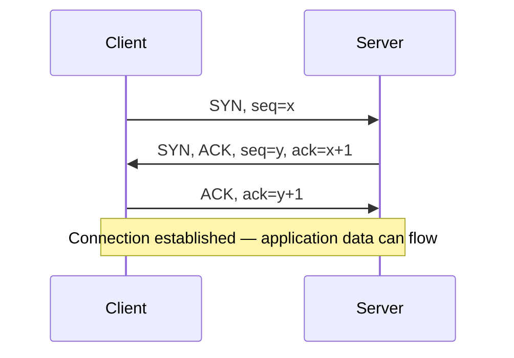

## Learning Objectives

- Name the key fields of a real TCP segment header: source/destination port, sequence number, acknowledgment number, flags, and window size.
- Explain what a TCP sequence number actually counts (bytes, not segments) and why that choice matters.
- Trace the three-way handshake step by step (SYN, SYN-ACK, ACK) and explain what each of the three segments accomplishes.
- Explain why a two-way handshake would be insufficient, connecting the argument directly back to reliable data transfer's need for both sides to agree on initial state.
- Describe the four-way connection teardown (FIN-based) at a high level and contrast it briefly with the handshake's three steps.

## Context & Motivation

Reliable data transfer principles, just covered, described acknowledgments, sequence numbers, and timers in the abstract, as general tools. TCP is the concrete protocol that actually implements them, and this concept starts making that concrete: the real fields in a real TCP segment header, and the real three-step exchange — the three-way handshake — that establishes a TCP connection before either side sends a single byte of application data. The handshake is not an arbitrary formality; it exists to solve a real problem reliable data transfer's abstract principles already implied — both sides need to agree on the starting sequence numbers they'll use, and, less obviously, both sides need positive confirmation that the *other* side is actually ready to communicate, not just that a message from them arrived.

## Core Theory

### TCP segment header fields

A real TCP segment header includes, among other fields: a 16-bit source port and destination port (identifying the specific sockets involved, per the process-to-process delivery already covered); a 32-bit sequence number; a 32-bit acknowledgment number; a set of single-bit flags including SYN, ACK, and FIN (each signaling a specific control purpose); and a 16-bit receive window (used for flow control, covered two concepts from now). The header format is fixed and standardized so any two independent TCP implementations, written by different organizations, can interoperate correctly.

### Sequence numbers count bytes, not segments

A genuinely easy-to-miss detail: TCP's sequence number does not count segments (1st segment, 2nd segment, ...) — it counts the byte offset, within the entire connection's byte stream, of the first byte carried by that segment. If a connection's initial sequence number is 1,000 and the first segment carries 500 bytes of data, that segment's sequence number is 1,000, and the next segment's sequence number (assuming no loss or reordering) is 1,500 — the byte immediately following the previous segment's last byte. This byte-oriented numbering is exactly what lets TCP treat the data it transfers as a single continuous stream rather than a series of discrete, individually-addressed messages.

### The three-way handshake

Before any application data flows, TCP performs a three-segment exchange:

1. **SYN.** The client sends a segment with the SYN flag set and a randomly-chosen initial sequence number, call it `x`. This segment carries no application data — it exists purely to propose a connection and announce the client's starting sequence number.
2. **SYN-ACK.** The server responds with a segment that has both the SYN and ACK flags set: SYN because the server is also proposing its own randomly-chosen initial sequence number, call it `y`; ACK, with acknowledgment number `x+1`, confirming receipt of the client's SYN.
3. **ACK.** The client responds with a segment that has the ACK flag set, with acknowledgment number `y+1`, confirming receipt of the server's SYN. This third segment may already carry the first byte of actual application data, since both sides now have everything they need to begin.



### Why three steps, not two

A two-way handshake — client sends SYN, server responds with SYN-ACK, and the connection is immediately considered established without the client's final ACK — would leave the server with no confirmation that its own SYN-ACK actually reached the client. If the server's SYN-ACK were lost, the client, having received nothing back, would correctly retry; but a two-way scheme would have already committed the server to believing the connection was live. The third step gives the *server* the same confirmation the client already got from step 2: proof that the other side received what was sent, symmetric on both sides, before either commits real resources (buffers, connection state) to a connection that might not actually be live.

### Connection teardown

Ending a TCP connection uses a similar but distinct exchange, based on the FIN flag rather than SYN: each side independently signals "I have no more data to send" with a FIN segment, and the other side acknowledges it. Because either side can still have data to send even after the other side is done sending (a connection is full-duplex — two independent, simultaneous byte streams, one in each direction), a complete teardown typically involves four segments (FIN, ACK, FIN, ACK) rather than the handshake's three, reflecting that each direction of the connection must be closed independently.

## Worked Examples

### Example 1: Tracing sequence and acknowledgment numbers through the handshake

Client picks initial sequence number `x = 42`; server picks initial sequence number `y = 7000`.

```text
1. Client → Server:  SYN, seq=42

2. Server → Client:  SYN, ACK, seq=7000, ack=43
   (ack=43 = x+1, confirming the SYN at seq=42 was received —
    a SYN segment, though it carries no data, "consumes" one
    sequence number, which is why the ack is x+1, not x)

3. Client → Server:  ACK, ack=7001
   (ack=7001 = y+1, confirming the SYN-ACK at seq=7000 was received)
```

Both sides now know the other's starting sequence number, and both have received explicit confirmation their own SYN was received — the two conditions the handshake exists to establish.

### Example 2: What happens if the SYN-ACK is lost

```text
1. Client → Server: SYN, seq=42
2. Server sends SYN-ACK, but it is lost in the network.
3. Client's timer for the SYN expires (no SYN-ACK arrived); client
   retransmits: SYN, seq=42 (same sequence number as before —
   this is a retransmission, not a new connection attempt).
4. Server, having already responded once but received a duplicate
   SYN, responds with SYN-ACK again — this second SYN-ACK is not
   lost, and the handshake completes from here as in Example 1.
```

The handshake's reliance on timers and retransmission is exactly the reliable-data-transfer machinery from the previous concept, applied specifically to the connection-establishment exchange itself.

### Example 3: Why a SYN segment "consumes" a sequence number

Even though a SYN segment carries zero bytes of application data, TCP's design treats it as if it occupies one byte of sequence-number space — this is why the acknowledgment for a SYN at sequence number `x` is `x+1`, not `x`. This is a deliberate convention (not a mistake or an inconsistency), ensuring that the first byte of actual application data, sent immediately after the handshake, gets an unambiguous sequence number of its own (in Example 1, the client's first real data byte, if sent, would be sequence number 43 — immediately following the "virtual" byte the SYN itself occupied).

## Common Misconceptions & Pitfalls

- **"TCP sequence numbers count segments/packets."** They count bytes — the offset of the first byte of application data (or the SYN/FIN control flag's virtual byte) within the connection's total byte stream, not a segment index.
- **"The handshake exists just to be polite/formal, not to solve a real problem."** It solves a specific, real problem: both sides need to (a) agree on each other's starting sequence numbers, and (b) receive explicit confirmation that their own SYN (or SYN-ACK) actually reached the other side, before committing to a connection that might not really be live.
- **"A connection is torn down the moment one side sends a FIN."** Because TCP connections are full-duplex, each direction must be closed independently — one side sending FIN only closes that side's ability to send further data; the connection isn't fully torn down until both directions have been closed via their own FIN/ACK exchange.
- **"The client's final ACK in the handshake can't carry application data."** It can — since the client already has everything it needs (its own sequence number, the server's sequence number, and confirmation the server received the client's SYN) by the time it sends that third segment, it is free to piggyback the first byte of real application data on it.

## Summary

A real TCP segment header carries source/destination ports, a byte-oriented sequence number, an acknowledgment number, control flags (SYN, ACK, FIN), and a receive window. The three-way handshake — SYN, SYN-ACK, ACK — establishes a connection by having both sides exchange and confirm receipt of each other's randomly-chosen initial sequence numbers, with the third step specifically giving the server the same confirmation the client already received from the server's SYN-ACK, which a two-way handshake could not provide. Connection teardown, based on the FIN flag, typically takes four segments rather than three, reflecting that each direction of a full-duplex connection is closed independently. This concrete mechanism is TCP's actual implementation of the abstract reliable-data-transfer principles covered in the previous concept — the next concept builds directly on this same sequence/acknowledgment machinery to develop TCP's ongoing retransmission and RTT-estimation behavior during a connection, not just at its start.

## Documentation Links

- [Stanford CS144 — Lecture Schedule ("TCP & Congestion control")](https://www.scs.stanford.edu/10au-cs144/sched/) — a real course lecture covering TCP's segment structure and connection establishment directly.
- [Kurose & Ross — Computer Networking: A Top-Down Approach (official companion site)](https://gaia.cs.umass.edu/kurose_ross/index.php) — the standard textbook's detailed treatment of the TCP segment header and the three-way handshake.
