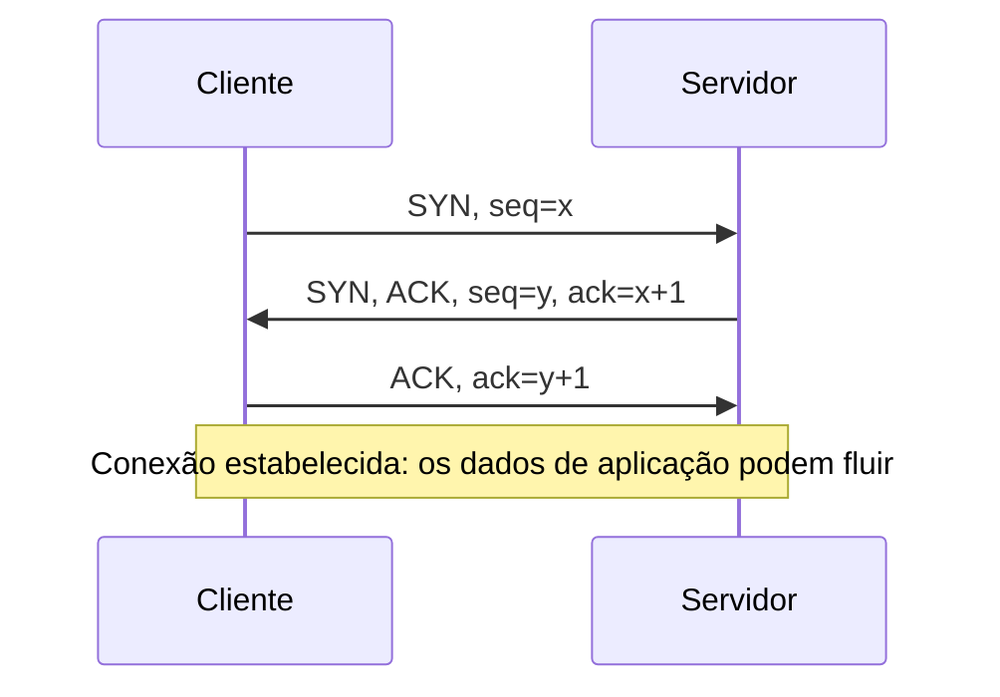

## Objetivos de Aprendizagem

- Nomear os campos-chave de um cabeçalho real de segmento TCP: porta de origem/destino, número de sequência, número de confirmação, flags e tamanho da janela.
- Explicar o que um número de sequência TCP de fato conta (bytes, e não segmentos) e por que essa escolha importa.
- Rastrear o three-way handshake passo a passo (SYN, SYN-ACK, ACK) e explicar o que cada um dos três segmentos realiza.
- Explicar por que um handshake de duas vias seria insuficiente, conectando o argumento diretamente à necessidade, na transferência confiável de dados, de os dois lados concordarem sobre o estado inicial.
- Descrever em alto nível o encerramento de conexão em quatro vias (baseado em FIN) e contrastá-lo brevemente com os três passos do handshake.

## Contexto e Motivação

Os princípios de transferência confiável de dados, recém-cobertos, descreveram confirmações, números de sequência e temporizadores em abstrato, como ferramentas gerais. O TCP é o protocolo concreto que de fato os implementa, e este conceito começa a tornar isso concreto: os campos reais num cabeçalho real de segmento TCP, e a troca real em três passos (o three-way handshake) que estabelece uma conexão TCP antes que qualquer lado envie um único byte de dados da aplicação. O handshake não é uma formalidade arbitrária; ele existe para resolver um problema real que os princípios abstratos da transferência confiável de dados já implicavam: os dois lados precisam concordar sobre os números de sequência iniciais que vão usar e, menos obviamente, os dois lados precisam de confirmação positiva de que o *outro* lado está de fato pronto para se comunicar, e não só de que uma mensagem dele chegou.

## Teoria Central

### Os campos do cabeçalho do segmento TCP

Um cabeçalho real de segmento TCP inclui, entre outros campos: uma porta de origem e uma porta de destino de 16 bits (identificando os sockets específicos envolvidos, segundo a entrega de processo a processo já coberta); um número de sequência de 32 bits; um número de confirmação de 32 bits; um conjunto de flags de um bit incluindo SYN, ACK e FIN (cada uma sinalizando um propósito de controle específico); e uma janela de recepção de 16 bits (usada para o controle de fluxo, coberto dois conceitos adiante). O formato do cabeçalho é fixo e padronizado, para que quaisquer duas implementações independentes de TCP, escritas por organizações diferentes, consigam interoperar corretamente.

### Os números de sequência contam bytes, e não segmentos

Um detalhe genuinamente fácil de passar despercebido: o número de sequência do TCP não conta segmentos (1º segmento, 2º segmento, ...); ele conta o deslocamento em bytes, dentro do fluxo de bytes da conexão inteira, do primeiro byte carregado por aquele segmento. Se o número de sequência inicial de uma conexão é 1.000 e o primeiro segmento carrega 500 bytes de dados, o número de sequência desse segmento é 1.000, e o número de sequência do próximo segmento (supondo nenhuma perda ou reordenação) é 1.500: o byte imediatamente seguinte ao último byte do segmento anterior. Esta numeração orientada a bytes é exatamente o que permite ao TCP tratar os dados que transfere como um único fluxo contínuo, em vez de uma série de mensagens discretas e endereçadas individualmente.

### O three-way handshake

Antes que qualquer dado de aplicação flua, o TCP realiza uma troca de três segmentos:

1. **SYN.** O cliente envia um segmento com a flag SYN ligada e um número de sequência inicial escolhido aleatoriamente, chame-o de `x`. Este segmento não carrega dado de aplicação algum; ele existe puramente para propor uma conexão e anunciar o número de sequência inicial do cliente.
2. **SYN-ACK.** O servidor responde com um segmento que tem tanto a flag SYN quanto a ACK ligadas: SYN porque o servidor também está propondo o seu próprio número de sequência inicial escolhido aleatoriamente, chame-o de `y`; ACK, com número de confirmação `x+1`, confirmando o recebimento do SYN do cliente.
3. **ACK.** O cliente responde com um segmento com a flag ACK ligada, com número de confirmação `y+1`, confirmando o recebimento do SYN do servidor. Este terceiro segmento já pode carregar o primeiro byte de dados de aplicação de fato, já que os dois lados agora têm tudo o que precisam para começar.



### Por que três passos, e não dois

Um handshake de duas vias (o cliente envia SYN, o servidor responde com SYN-ACK, e a conexão é imediatamente considerada estabelecida sem o ACK final do cliente) deixaria o servidor sem confirmação de que o seu próprio SYN-ACK de fato chegou ao cliente. Se o SYN-ACK do servidor se perdesse, o cliente, sem ter recebido nada de volta, tentaria de novo corretamente; mas um esquema de duas vias já teria comprometido o servidor a acreditar que a conexão estava viva. O terceiro passo dá ao *servidor* a mesma confirmação que o cliente já recebeu no passo 2: prova de que o outro lado recebeu o que foi enviado, simétrica nos dois lados, antes que qualquer um comprometa recursos reais (buffers, estado da conexão) com uma conexão que pode não estar de fato viva.

### O encerramento da conexão

Encerrar uma conexão TCP usa uma troca parecida, mas distinta, baseada na flag FIN em vez da SYN: cada lado sinaliza independentemente "não tenho mais dados a enviar" com um segmento FIN, e o outro lado o confirma. Como qualquer lado ainda pode ter dados a enviar mesmo depois que o outro terminou de enviar (uma conexão é full-duplex: dois fluxos de bytes independentes e simultâneos, um em cada direção), um encerramento completo tipicamente envolve quatro segmentos (FIN, ACK, FIN, ACK) em vez dos três do handshake, refletindo que cada direção da conexão precisa ser fechada de forma independente.

## Exemplos Resolvidos

### Exemplo 1: Rastreando os números de sequência e de confirmação pelo handshake

O cliente escolhe o número de sequência inicial `x = 42`; o servidor escolhe o número de sequência inicial `y = 7000`.

```text
1. Cliente → Servidor:  SYN, seq=42

2. Servidor → Cliente:  SYN, ACK, seq=7000, ack=43
   (ack=43 = x+1, confirmando que o SYN em seq=42 foi recebido --
    um segmento SYN, embora não carregue dados, "consome" um número
    de sequência, e é por isso que o ack é x+1, e não x)

3. Cliente → Servidor:  ACK, ack=7001
   (ack=7001 = y+1, confirmando que o SYN-ACK em seq=7000 foi recebido)
```

Os dois lados agora sabem o número de sequência inicial do outro, e os dois receberam confirmação explícita de que o seu próprio SYN foi recebido: as duas condições que o handshake existe para estabelecer.

### Exemplo 2: O que acontece se o SYN-ACK se perder

```text
1. Cliente → Servidor: SYN, seq=42
2. O servidor envia o SYN-ACK, mas ele se perde na rede.
3. O temporizador do cliente para o SYN expira (nenhum SYN-ACK chegou);
   o cliente retransmite: SYN, seq=42 (o mesmo número de sequência de
   antes -- isto é uma retransmissão, e não uma nova tentativa de conexão).
4. O servidor, tendo já respondido uma vez, mas recebendo um SYN duplicado,
   responde com o SYN-ACK de novo -- este segundo SYN-ACK não se perde, e
   o handshake se completa a partir daqui como no Exemplo 1.
```

A dependência do handshake em temporizadores e retransmissão é exatamente a maquinaria de transferência confiável de dados do conceito anterior, aplicada especificamente à própria troca de estabelecimento de conexão.

### Exemplo 3: Por que um segmento SYN "consome" um número de sequência

Mesmo que um segmento SYN carregue zero bytes de dados de aplicação, o projeto do TCP o trata como se ele ocupasse um byte do espaço de números de sequência, e é por isso que a confirmação de um SYN no número de sequência `x` é `x+1`, e não `x`. Esta é uma convenção deliberada (e não um erro ou uma inconsistência), garantindo que o primeiro byte de dados de aplicação de fato, enviado logo depois do handshake, receba um número de sequência próprio e inequívoco (no Exemplo 1, o primeiro byte de dados real do cliente, se enviado, seria o número de sequência 43, imediatamente seguinte ao byte "virtual" que o próprio SYN ocupou).

## Equívocos Comuns e Armadilhas

- **"Os números de sequência do TCP contam segmentos/pacotes."** Eles contam bytes: o deslocamento do primeiro byte de dados de aplicação (ou do byte virtual da flag de controle SYN/FIN) dentro do fluxo total de bytes da conexão, e não um índice de segmento.
- **"O handshake existe só para ser educado/formal, e não para resolver um problema real."** Ele resolve um problema específico e real: os dois lados precisam (a) concordar sobre os números de sequência iniciais um do outro, e (b) receber confirmação explícita de que o seu próprio SYN (ou SYN-ACK) de fato chegou ao outro lado, antes de se comprometerem com uma conexão que pode não estar de fato viva.
- **"Uma conexão é encerrada no momento em que um lado envia um FIN."** Como as conexões TCP são full-duplex, cada direção precisa ser fechada de forma independente: um lado enviar FIN só fecha a capacidade daquele lado de enviar mais dados; a conexão não é totalmente encerrada até que as duas direções tenham sido fechadas pela sua própria troca de FIN/ACK.
- **"O ACK final do cliente no handshake não pode carregar dados de aplicação."** Pode: como o cliente já tem tudo o que precisa (o seu próprio número de sequência, o número de sequência do servidor e a confirmação de que o servidor recebeu o SYN do cliente) quando envia esse terceiro segmento, ele está livre para pegar carona com o primeiro byte de dados de aplicação real nele.

## Resumo

Um cabeçalho real de segmento TCP carrega portas de origem/destino, um número de sequência orientado a bytes, um número de confirmação, flags de controle (SYN, ACK, FIN) e uma janela de recepção. O three-way handshake (SYN, SYN-ACK, ACK) estabelece uma conexão fazendo os dois lados trocarem e confirmarem o recebimento dos números de sequência iniciais escolhidos aleatoriamente um do outro, com o terceiro passo dando especificamente ao servidor a mesma confirmação que o cliente já recebeu do SYN-ACK do servidor, que um handshake de duas vias não conseguiria fornecer. O encerramento da conexão, baseado na flag FIN, tipicamente leva quatro segmentos em vez de três, refletindo que cada direção de uma conexão full-duplex é fechada de forma independente. Este mecanismo concreto é a implementação de fato, pelo TCP, dos princípios abstratos de transferência confiável de dados cobertos no conceito anterior; o próximo conceito constrói diretamente sobre esta mesma maquinaria de sequência/confirmação para desenvolver o comportamento contínuo de retransmissão e de estimativa de RTT do TCP durante uma conexão, e não só no seu início.

## Documentation Links

- [Stanford CS144: Lecture Schedule ("TCP & Congestion control")](https://www.scs.stanford.edu/10au-cs144/sched/): uma aula de um curso real que cobre diretamente a estrutura do segmento TCP e o estabelecimento de conexão.
- [Kurose & Ross: Computer Networking: A Top-Down Approach (site oficial de apoio)](https://gaia.cs.umass.edu/kurose_ross/index.php): o tratamento detalhado do livro-texto padrão do cabeçalho do segmento TCP e do three-way handshake.
