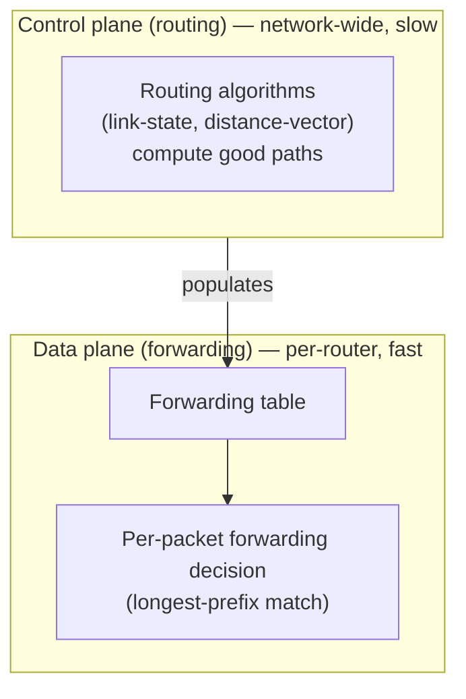

## Learning Objectives

- Define forwarding as the data plane's local, per-packet decision, and routing as the control plane's network-wide, much slower computation.
- Explain why this distinction matters: forwarding must happen in nanoseconds per packet, while routing can take much longer since it runs far less frequently.
- Identify which concepts in this discipline's Network Layer cluster belong to the data plane and which belong to the control plane.
- Explain traditionally where forwarding tables come from, and preview that modern networks increasingly separate control-plane computation onto dedicated infrastructure (a brief, honest signpost, not developed in depth here).
- Connect this distinction back to the network layer's overall job: moving datagrams from a source host, across the network core, to a destination host.

## Context & Motivation

Every concept so far in this discipline has stayed above the network layer — application protocols, and TCP's transport-layer mechanisms. This concept opens the Network Layer cluster by establishing a single distinction every following concept in this cluster depends on keeping straight: forwarding is not the same job as routing, even though casual conversation often uses the two words interchangeably. Confusing them makes several later concepts — particularly the relationship between forwarding tables and the routing algorithms that populate them — genuinely hard to reason about correctly, so this concept exists specifically to fix the distinction before anything else in the cluster builds on it.

## Core Theory

### Forwarding: the data plane

Forwarding is the local, per-router action of moving an arriving packet from an input link to the appropriate output link, based on the packet's destination address and the router's local forwarding table. This decision happens for every single packet a router handles, and must therefore be extremely fast — on the order of nanoseconds — since a router might be forwarding millions of packets per second. Forwarding is a "data plane" function: it is about moving the actual data (packets) through the router, hop by hop, as fast as possible, using whatever forwarding table the router already has, without recomputing anything about the broader network's topology at the moment each packet arrives.

### Routing: the control plane

Routing is the network-wide process of determining what a router's forwarding table *should contain* — computing good paths through the network, given the current topology of routers and links, and their costs. Unlike forwarding, routing does not happen per packet; it happens periodically, or in reaction to a topology change (a link failing, a new router joining), and its output (updated forwarding-table entries) is what forwarding then uses locally, quickly, for every subsequent packet. Routing is a "control plane" function: it is about deciding policy — which paths are good — at a much slower timescale than the data plane's per-packet work.

### Why the distinction matters: different timescales, different jobs

A router that had to recompute good paths through the entire network for every single arriving packet would be hopelessly slow — routing algorithms (developed later in this cluster) can take a meaningful amount of time to converge on good paths across a network with many routers, entirely unsuitable for a decision that must be made in nanoseconds. Separating the two lets each be optimized for its actual job: forwarding tables are built for extremely fast lookup (a real, fast structure — often implemented with hardware-assisted lookups over the longest-prefix-match rule, covered two concepts from now); routing algorithms are built for correctness and reasonable convergence time over a much slower cycle, since their output only needs to be recomputed when the network's actual topology changes, not for every packet.

### Where this cluster's later concepts fit

IPv4 addressing and CIDR (the next concept) and datagram forwarding via longest-prefix match (two concepts from now) are both data-plane concerns — how an address is structured, and how a router does the actual per-packet lookup, respectively. Routing algorithms — link-state and distance-vector — and the real protocols built from them (OSPF, BGP) are control-plane concerns — how the entries in that forwarding table actually get computed and kept up to date as the network's topology evolves.



### A brief, honest signpost: modern control-plane separation

Traditionally, every router computes its own control-plane routing decisions locally, in a distributed fashion, alongside its own data-plane forwarding. A more modern trend — software-defined networking, where a logically-centralized controller computes routing decisions for many routers and pushes forwarding-table entries to them directly — separates the control plane onto dedicated infrastructure even further from the per-router data plane. This discipline does not develop software-defined networking in depth; it is named here honestly as a real, active direction the field has moved in, without claiming it is covered by the classical routing-algorithm concepts that follow.

## Worked Examples

### Example 1: Timescale comparison, made concrete

```text
Forwarding decision: ~microsecond or faster, per packet. A busy router
  might make millions of these decisions per second.

Routing computation: seconds to tens of seconds (or longer, for very
  large networks) to converge on good paths after a topology change —
  happening perhaps a handful of times per hour under normal, stable
  conditions, far less often than once per packet.
```

The many-orders-of-magnitude gap between these two timescales is exactly why the two jobs must be handled by separate mechanisms, not a single unified per-packet computation.

### Example 2: Tracing what happens when a link fails

```text
1. A link between two routers fails.
2. CONTROL PLANE: routing algorithms on the routers affected by this
   topology change detect the failure and recompute paths that no
   longer rely on the failed link — this can take some real time
   (seconds, depending on the algorithm and network size).
3. Once recomputed, updated entries are installed into the affected
   routers' forwarding tables.
4. DATA PLANE: from this point forward, every arriving packet destined
   for an address affected by the failure is forwarded using the NEW
   table entry — this per-packet decision itself is just as fast as
   before, nothing about the forwarding mechanism's speed changed; only
   the table's contents changed.
```

This traces exactly why a network can survive a link failure without every individual packet's forwarding becoming slow — the slow part (recomputing routes) happens once, upstream of the fast part (forwarding), which continues operating at its normal speed throughout.

### Example 3: Classifying concepts in this cluster by plane

```text
Concept                                          Plane
------------------------------------------------  --------------
IPv4 Addressing and CIDR                          Data plane
Datagram Forwarding and Longest-Prefix Match      Data plane
Routing Algorithms (link-state / distance-vector) Control plane
Intra- vs. Inter-Domain Routing (OSPF, BGP)       Control plane
```

## Common Misconceptions & Pitfalls

- **"Forwarding and routing are two words for the same thing."** They are genuinely different jobs at genuinely different timescales — forwarding is the fast, per-packet, local action; routing is the slower, network-wide computation that decides what forwarding should do. Conflating them makes it hard to reason correctly about why a router can forward packets at line rate while routing protocols converge over seconds.
- **"A router recomputes routing information for every packet it forwards."** It consults an already-computed forwarding table for every packet — routing computation happens far less frequently, only when the network's topology actually changes or on a periodic refresh cycle, never per individual packet.
- **"The control plane is slower because it's less important."** It is slower because its job is fundamentally different and genuinely can afford to be — computing good, correct paths across an entire network's topology is a harder computational problem than looking up one entry in an already-built table, and the control plane's output only needs to be recomputed when topology actually changes.
- **"Software-defined networking replaces forwarding entirely."** It changes *where* the control-plane decision is made (a centralized controller instead of each router computing its own) but the data-plane forwarding job — fast, per-packet, local decisions using a table — remains conceptually the same.

## Summary

Forwarding (the data plane) is a router's fast, local, per-packet decision — consult a forwarding table, pick an outgoing link — happening potentially millions of times per second. Routing (the control plane) is the much slower, network-wide computation of what that forwarding table should actually contain, given the network's current topology, happening only when topology changes or on a periodic cycle, not per packet. This distinction is essential for reasoning correctly about the rest of this discipline's Network Layer cluster: IPv4 addressing and longest-prefix-match forwarding are data-plane concerns; link-state/distance-vector routing algorithms and the real protocols built from them (OSPF, BGP) are control-plane concerns. Separating the two lets each be optimized for its own job — blistering per-packet speed for forwarding, correctness and reasonable convergence for routing — rather than forcing one unified mechanism to do both at once.

## Documentation Links

- [Kurose & Ross — Computer Networking: A Top-Down Approach (official companion site)](https://gaia.cs.umass.edu/kurose_ross/index.php) — the standard textbook's explicit data-plane/control-plane organization of the network layer, reflected directly in this cluster's structure.
- [ACM/IEEE CS2013 — Networking and Communication Knowledge Area](https://csed.acm.org/knowledge-areas-networking-and-communication-nc-cs2013-version/) — curriculum guidelines listing routing and forwarding as distinct core knowledge units.
