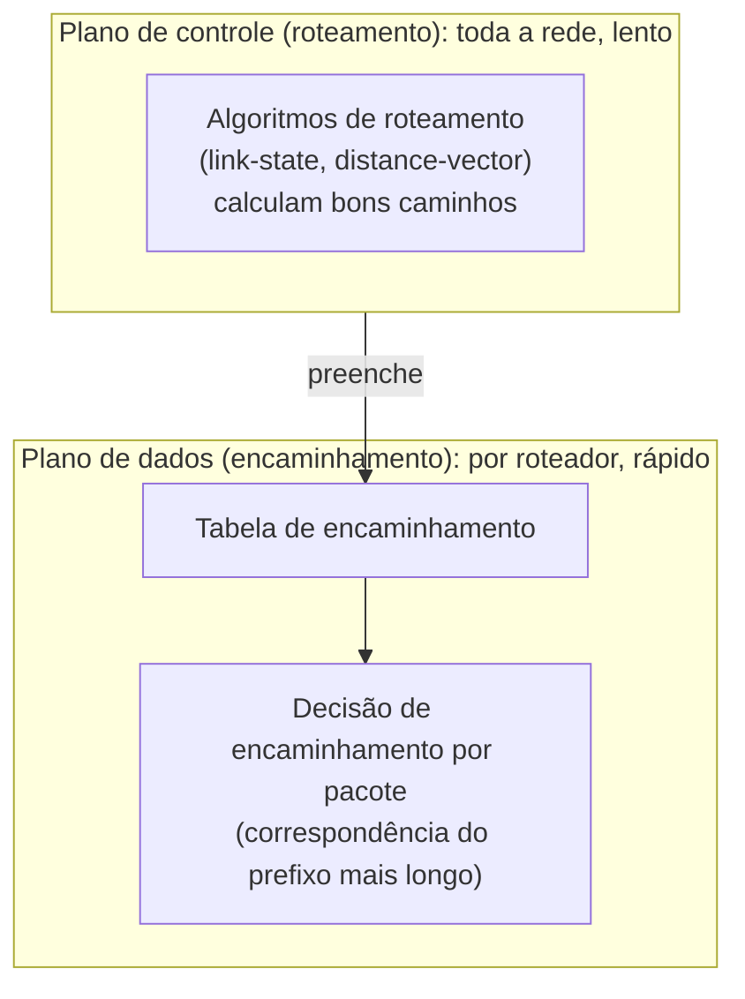

## Objetivos de Aprendizagem

- Definir o encaminhamento como a decisão local e por pacote do plano de dados, e o roteamento como o cálculo de toda a rede, muito mais lento, do plano de controle.
- Explicar por que esta distinção importa: o encaminhamento precisa acontecer em nanossegundos por pacote, enquanto o roteamento pode levar muito mais tempo, já que roda com frequência muito menor.
- Identificar quais conceitos do bloco de Camada de Rede desta disciplina pertencem ao plano de dados e quais pertencem ao plano de controle.
- Explicar de onde vêm tradicionalmente as tabelas de encaminhamento, e antecipar que redes modernas cada vez mais separam o cálculo do plano de controle em infraestrutura dedicada (uma sinalização breve e honesta, não desenvolvida a fundo aqui).
- Conectar esta distinção de volta ao trabalho geral da camada de rede: mover datagramas de um host de origem, pelo núcleo da rede, até um host de destino.

## Contexto e Motivação

Todo conceito até agora nesta disciplina ficou acima da camada de rede: protocolos de aplicação e os mecanismos da camada de transporte do TCP. Este conceito abre o bloco de Camada de Rede estabelecendo uma única distinção que todo conceito seguinte deste bloco depende de manter clara: o encaminhamento não é o mesmo trabalho que o roteamento, mesmo que a conversa casual frequentemente use as duas palavras de forma intercambiável. Confundi-las torna vários conceitos posteriores (particularmente a relação entre as tabelas de encaminhamento e os algoritmos de roteamento que as preenchem) genuinamente difíceis de raciocinar corretamente, então este conceito existe especificamente para fixar a distinção antes que qualquer outra coisa do bloco construa sobre ela.

## Teoria Central

### Encaminhamento: o plano de dados

O encaminhamento é a ação local, por roteador, de mover um pacote que chega de um enlace de entrada para o enlace de saída apropriado, com base no endereço de destino do pacote e na tabela de encaminhamento local do roteador. Esta decisão acontece para cada pacote que um roteador trata, e por isso precisa ser extremamente rápida (na ordem de nanossegundos), já que um roteador pode estar encaminhando milhões de pacotes por segundo. O encaminhamento é uma função do "plano de dados": ele trata de mover os dados de fato (pacotes) pelo roteador, salto a salto, o mais rápido possível, usando qualquer tabela de encaminhamento que o roteador já tenha, sem recalcular nada sobre a topologia mais ampla da rede no momento em que cada pacote chega.

### Roteamento: o plano de controle

O roteamento é o processo de toda a rede que determina o que a tabela de encaminhamento de um roteador *deve conter*: calcular bons caminhos pela rede, dada a topologia atual de roteadores e enlaces, e os seus custos. Diferente do encaminhamento, o roteamento não acontece por pacote; ele acontece periodicamente, ou em reação a uma mudança de topologia (um enlace falhando, um novo roteador entrando), e a sua saída (entradas atualizadas da tabela de encaminhamento) é o que o encaminhamento então usa localmente, rapidamente, para cada pacote subsequente. O roteamento é uma função do "plano de controle": ele trata de decidir a política (quais caminhos são bons) numa escala de tempo muito mais lenta que o trabalho por pacote do plano de dados.

### Por que a distinção importa: escalas de tempo diferentes, trabalhos diferentes

Um roteador que precisasse recalcular bons caminhos pela rede inteira para cada pacote que chega seria irremediavelmente lento: os algoritmos de roteamento (desenvolvidos mais adiante neste bloco) podem levar uma quantidade significativa de tempo para convergir para bons caminhos numa rede com muitos roteadores, inteiramente inadequado para uma decisão que precisa ser tomada em nanossegundos. Separar os dois permite que cada um seja otimizado para o seu trabalho real: as tabelas de encaminhamento são construídas para busca extremamente rápida (uma estrutura real e rápida, frequentemente implementada com buscas assistidas por hardware sobre a regra de correspondência do prefixo mais longo, coberta dois conceitos adiante); os algoritmos de roteamento são construídos para corretude e tempo de convergência razoável num ciclo muito mais lento, já que a sua saída só precisa ser recalculada quando a topologia real da rede muda, e não para cada pacote.

### Onde os conceitos posteriores deste bloco se encaixam

O endereçamento IPv4 e o CIDR (o próximo conceito) e o encaminhamento de datagramas via correspondência do prefixo mais longo (dois conceitos adiante) são ambos preocupações do plano de dados: como um endereço é estruturado, e como um roteador faz a busca de fato por pacote, respectivamente. Os algoritmos de roteamento (link-state e distance-vector) e os protocolos reais construídos a partir deles (OSPF, BGP) são preocupações do plano de controle: como as entradas dessa tabela de encaminhamento de fato são calculadas e mantidas atualizadas conforme a topologia da rede evolui.



### Uma sinalização breve e honesta: a separação moderna do plano de controle

Tradicionalmente, todo roteador calcula as suas próprias decisões de roteamento do plano de controle localmente, de forma distribuída, junto com o seu próprio encaminhamento do plano de dados. Uma tendência mais moderna (as redes definidas por software, em que um controlador logicamente centralizado calcula as decisões de roteamento para muitos roteadores e empurra entradas de tabela de encaminhamento diretamente para eles) separa ainda mais o plano de controle em infraestrutura dedicada, longe do plano de dados de cada roteador. Esta disciplina não desenvolve as redes definidas por software a fundo; elas são nomeadas aqui honestamente como uma direção real e ativa para a qual a área se moveu, sem afirmar que são cobertas pelos conceitos clássicos de algoritmos de roteamento que vêm a seguir.

## Exemplos Resolvidos

### Exemplo 1: Comparação de escalas de tempo, tornada concreta

```text
Decisão de encaminhamento: ~microssegundo ou menos, por pacote. Um roteador
  movimentado pode tomar milhões dessas decisões por segundo.

Cálculo de roteamento: de segundos a dezenas de segundos (ou mais, para
  redes muito grandes) para convergir para bons caminhos depois de uma
  mudança de topologia -- acontecendo talvez um punhado de vezes por hora
  sob condições normais e estáveis, muito menos que uma vez por pacote.
```

A diferença de muitas ordens de grandeza entre estas duas escalas de tempo é exatamente por que os dois trabalhos precisam ser tratados por mecanismos separados, e não por um único cálculo unificado por pacote.

### Exemplo 2: Rastreando o que acontece quando um enlace falha

```text
1. Um enlace entre dois roteadores falha.
2. PLANO DE CONTROLE: os algoritmos de roteamento nos roteadores afetados
   por esta mudança de topologia detectam a falha e recalculam caminhos que
   não dependem mais do enlace que falhou -- isso pode levar algum tempo
   real (segundos, dependendo do algoritmo e do tamanho da rede).
3. Uma vez recalculadas, as entradas atualizadas são instaladas nas tabelas
   de encaminhamento dos roteadores afetados.
4. PLANO DE DADOS: deste ponto em diante, todo pacote que chega destinado a
   um endereço afetado pela falha é encaminhado usando a NOVA entrada da
   tabela -- esta decisão por pacote em si é tão rápida quanto antes; nada
   na velocidade do mecanismo de encaminhamento mudou; só o conteúdo da
   tabela mudou.
```

Isto rastreia exatamente por que uma rede consegue sobreviver a uma falha de enlace sem que o encaminhamento de cada pacote individual fique lento: a parte lenta (recalcular rotas) acontece uma vez, antes da parte rápida (encaminhamento), que continua operando na sua velocidade normal o tempo todo.

### Exemplo 3: Classificando os conceitos deste bloco por plano

```text
Conceito                                                    Plano
----------------------------------------------------------  ---------------
Endereçamento IPv4 e CIDR                                    Plano de dados
Encaminhamento de Datagramas e Correspondência do Prefixo   Plano de dados
  Mais Longo
Algoritmos de Roteamento (link-state / distance-vector)     Plano de controle
Roteamento Intra vs. Interdomínio (OSPF, BGP)               Plano de controle
```

## Equívocos Comuns e Armadilhas

- **"Encaminhamento e roteamento são duas palavras para a mesma coisa."** São trabalhos genuinamente diferentes em escalas de tempo genuinamente diferentes: o encaminhamento é a ação rápida, por pacote e local; o roteamento é o cálculo mais lento, de toda a rede, que decide o que o encaminhamento deve fazer. Confundi-los dificulta raciocinar corretamente sobre por que um roteador consegue encaminhar pacotes na velocidade da linha enquanto os protocolos de roteamento convergem em segundos.
- **"Um roteador recalcula as informações de roteamento para cada pacote que encaminha."** Ele consulta uma tabela de encaminhamento já calculada para cada pacote; o cálculo de roteamento acontece com frequência muito menor, só quando a topologia da rede de fato muda ou num ciclo periódico de atualização, nunca por pacote individual.
- **"O plano de controle é mais lento porque é menos importante."** Ele é mais lento porque o seu trabalho é fundamentalmente diferente e genuinamente pode se dar a esse luxo: calcular caminhos bons e corretos pela topologia de uma rede inteira é um problema computacional mais difícil do que buscar uma entrada numa tabela já construída, e a saída do plano de controle só precisa ser recalculada quando a topologia de fato muda.
- **"As redes definidas por software substituem o encaminhamento por completo."** Elas mudam *onde* a decisão do plano de controle é tomada (um controlador centralizado em vez de cada roteador calcular a sua), mas o trabalho de encaminhamento do plano de dados (decisões rápidas, por pacote e locais, usando uma tabela) continua conceitualmente o mesmo.

## Resumo

O encaminhamento (o plano de dados) é a decisão rápida, local e por pacote de um roteador (consultar uma tabela de encaminhamento, escolher um enlace de saída), acontecendo potencialmente milhões de vezes por segundo. O roteamento (o plano de controle) é o cálculo muito mais lento, de toda a rede, do que essa tabela de encaminhamento deve de fato conter, dada a topologia atual da rede, acontecendo só quando a topologia muda ou num ciclo periódico, e não por pacote. Esta distinção é essencial para raciocinar corretamente sobre o resto do bloco de Camada de Rede desta disciplina: o endereçamento IPv4 e o encaminhamento por correspondência do prefixo mais longo são preocupações do plano de dados; os algoritmos de roteamento link-state/distance-vector e os protocolos reais construídos a partir deles (OSPF, BGP) são preocupações do plano de controle. Separar os dois permite que cada um seja otimizado para o seu próprio trabalho (velocidade avassaladora por pacote para o encaminhamento, corretude e convergência razoável para o roteamento), em vez de forçar um único mecanismo unificado a fazer as duas coisas ao mesmo tempo.

## Documentation Links

- [Kurose & Ross: Computer Networking: A Top-Down Approach (site oficial de apoio)](https://gaia.cs.umass.edu/kurose_ross/index.php): a organização explícita do livro-texto padrão da camada de rede em plano de dados/plano de controle, refletida diretamente na estrutura deste bloco.
- [ACM/IEEE CS2013: Networking and Communication Knowledge Area](https://csed.acm.org/knowledge-areas-networking-and-communication-nc-cs2013-version/): diretrizes curriculares que listam o roteamento e o encaminhamento como unidades de conhecimento centrais distintas.
