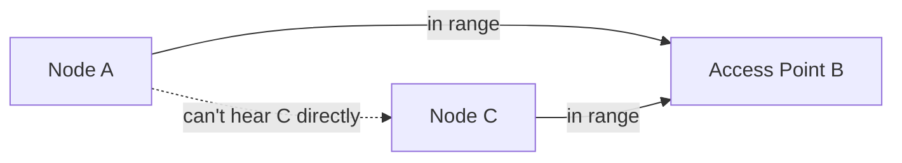

## Learning Objectives

- Explain the hidden-terminal problem: why carrier sensing, which worked for wired Ethernet, can fail on a wireless medium.
- Describe CSMA/CA (collision avoidance) as wireless's real answer, and explain why it avoids rather than detects collisions.
- Explain why collision detection (as CSMA/CD used) is fundamentally difficult on a wireless radio, distinct from wired Ethernet.
- Describe the basic handoff problem in mobile networking: what has to happen as a moving host moves from one access point's coverage to another's.
- Explain, honestly, that this concept covers only introductory wireless/mobile concepts, and that deeper treatment belongs to more advanced coursework this discipline does not attempt.

## Context & Motivation

The previous two concepts developed Ethernet's shared-medium contention problem and its classic wired solution, CSMA/CD, plus ARP's local address resolution. Wireless networking shares the same fundamental multiple-access problem — many devices sharing one physical medium, here open radio spectrum instead of a wire — but a key assumption wired Ethernet's CSMA/CD relied on breaks down for wireless in a genuinely important way, motivating a different real protocol design: CSMA/CA. This concept covers this difference and the basic mobility problem — what has to happen as a device physically moves between different wireless access points — at an introductory level; deeper wireless and mobile networking (covered in real courses as substantial specializations of their own) is explicitly out of scope here.

## Core Theory

### The hidden-terminal problem

Wired Ethernet's carrier sensing assumed that if a node cannot sense another node's transmission, that other node is not actually transmitting on the shared medium. On a wireless network, this assumption can be false in a specific, important way: two wireless nodes, A and C, might both be within range of a common access point, B, but far enough apart that A and C cannot sense each other's radio transmissions directly, even though both can reach B. If A senses the medium (locally, from its own position) as idle and transmits to B, and C, independently sensing the medium as idle from its own, different position, also transmits to B at the same time, their signals can collide at B — even though neither A nor C detected the other's transmission beforehand, since each was "hidden" from the other's carrier sense, despite both being within range of the same access point.



### CSMA/CA: collision avoidance, not detection

Because collision detection on a wireless radio is genuinely difficult (a transmitting radio's own outgoing signal typically overwhelms its ability to simultaneously listen for a faint, incoming colliding signal — a fundamentally different physical constraint from wired Ethernet, where a transmitting node can meaningfully listen while sending), wireless networking generally cannot detect a collision the way CSMA/CD does. Instead, wireless protocols use CSMA/CA (Collision Avoidance): rather than reacting to a detected collision after the fact, nodes take active steps to avoid a collision from happening in the first place — this can include a node sending a short reservation exchange before its actual data transmission (announcing its intent to transmit, and reserving the medium for that duration), specifically to address the hidden-terminal scenario by letting even a "hidden" node overhear the reservation exchange (if it's within range of the same access point) and defer its own transmission accordingly.

### Handoff: mobility's basic problem

A mobile device — a phone moving through a city, a laptop moving between rooms in a building with multiple Wi-Fi access points — needs to switch, at some point, from being served by one access point to being served by a different one, as it physically moves out of the first access point's effective range and into the second's. This handoff needs to happen, ideally, without interrupting any of the device's active connections (an ongoing video call, a file download) — which requires coordination between the old and new access points (and, in a cellular network, potentially between different base stations and the broader network infrastructure) to redirect in-flight traffic to the device's new point of attachment with minimal disruption.

## Worked Examples

### Example 1: Tracing the hidden-terminal problem step by step

```text
1. Node A and node C are both within radio range of access point B,
   but too far apart from each other to sense each other's
   transmissions directly.
2. Node A senses the medium (from A's own position) as idle — it
   cannot hear C, because C is out of A's radio range even though C
   is in range of B.
3. Node A begins transmitting to B.
4. At nearly the same moment, node C, independently sensing the medium
   (from C's own position) as idle for the exact same reason (A is out
   of C's radio range), also begins transmitting to B.
5. Both signals arrive at B simultaneously and collide — even though
   neither A nor C detected any ongoing transmission before starting
   their own, since each was genuinely "hidden" from the other.
```

Wired Ethernet's carrier-sense assumption — "if I can't hear anyone else, no one else is transmitting" — is simply false in this specific wireless scenario, which is exactly why an entirely carrier-sense-based approach, without some additional coordination mechanism, is insufficient for wireless.

### Example 2: A reservation exchange addressing the hidden terminal

```text
1. Node A wants to transmit to access point B. Instead of transmitting
   its actual data immediately, A first sends a short reservation
   request to B, announcing its intent and the duration it needs.
2. B responds with a short reservation grant, broadcast so that any
   node within B's range — INCLUDING node C, even though C could not
   hear A's original request directly — receives it.
3. Node C, having received B's reservation grant (naming A as the
   reserving node and the duration), defers its own transmission
   attempt for that duration, even though C never directly heard A.
4. Node A transmits its actual data to B, now without contention from
   C, since C is deliberately waiting.
```

The reservation exchange's real value is specifically that it is relayed through the access point B — a point every relevant node (including "hidden" ones like C, relative to A) can hear directly — solving a coordination problem that pure, direct carrier sensing between A and C could never solve on its own, since A and C simply cannot hear each other.

### Example 3: A basic handoff, traced at a high level

```text
1. A mobile device is connected to Access Point 1 (AP1), actively
   downloading a file.
2. The device physically moves, and AP1's signal strength, as measured
   by the device, begins to weaken while AP2's signal strength
   (a different, nearby access point) begins to strengthen.
3. The device (or the network infrastructure, depending on the
   specific technology) initiates a handoff: establishing a connection
   with AP2 while the connection with AP1 is still active.
4. In-flight traffic destined for the device is redirected toward AP2
   (the specific mechanism for this redirection varies significantly
   by technology and is genuinely more involved than sketched here).
5. The connection to AP1 is released once the handoff to AP2 completes
   successfully, ideally with the file download continuing with no
   perceptible interruption to the user.
```

This trace names the real steps involved at a conceptual level without developing the substantial additional protocol machinery real cellular and Wi-Fi roaming systems use to make handoff work reliably — genuinely more advanced material this introductory concept deliberately leaves for further, dedicated study.

## Common Misconceptions & Pitfalls

- **"Wireless networking uses CSMA/CD, just like Ethernet."** Wireless uses CSMA/CA (collision avoidance), not CSMA/CD (collision detection) — a transmitting radio generally cannot simultaneously listen for a colliding signal while sending its own, a fundamentally different physical constraint from wired Ethernet, which is exactly why wireless protocols emphasize avoiding collisions proactively rather than detecting and reacting to them after the fact.
- **"The hidden-terminal problem means wireless carrier sensing is useless."** Carrier sensing still provides real value in the common case where nodes genuinely can hear each other — the hidden-terminal problem is a specific, real failure mode of carrier sensing *alone*, which is exactly why additional coordination mechanisms (like a reservation exchange relayed through a common access point) are layered on top of, not instead of, carrier sensing.
- **"Handoff is just re-establishing a fresh connection from scratch on the new access point."** A well-designed handoff aims specifically to preserve an active connection's continuity (an ongoing call or download shouldn't have to restart) — this requires real coordination between old and new access points to redirect in-flight traffic, a genuinely harder problem than simply connecting fresh to a new access point with no regard for existing active sessions.
- **"This concept covers everything meaningful about wireless and mobile networking."** It intentionally does not — wireless and mobile networking are substantial specializations with their own dedicated advanced coursework in most real curricula; this concept covers only the introductory contention (hidden terminal, CSMA/CA) and mobility (handoff) problems, honestly signposted as a starting point, not a complete treatment.

## Summary

Wireless networking shares Ethernet's basic multiple-access problem but breaks a key assumption wired carrier sensing relied on: two nodes both in range of a common access point can be genuinely unable to hear each other directly, the hidden-terminal problem, which can produce collisions neither node could have anticipated from carrier sensing alone. CSMA/CA addresses this via proactive collision avoidance — often a reservation exchange relayed through a common access point, reaching even nodes that cannot hear each other directly — rather than CSMA/CD's reactive collision detection, which is largely infeasible on a wireless radio that generally cannot listen while transmitting. Mobility adds handoff: the real coordination problem of transferring an active connection from one access point's coverage to another's as a device physically moves, ideally without perceptibly interrupting the connection. This concept intentionally stays introductory — full wireless and mobile networking depth is real, substantial specialized material beyond this discipline's scope. This concludes the Link & Physical Layer cluster; the capstone that follows traces one complete HTTP request through every layer and mechanism this entire discipline has covered.

## Documentation Links

- [Stanford CS144 — Lecture Schedule ("Wireless")](https://www.scs.stanford.edu/10au-cs144/sched/) — a real course lecture dedicated to wireless networking's distinct challenges.
- [ACM/IEEE CS2013 — Networking and Communication Knowledge Area](https://csed.acm.org/knowledge-areas-networking-and-communication-nc-cs2013-version/) — curriculum guidelines listing Mobility as a distinct core knowledge unit alongside wired networking fundamentals.
