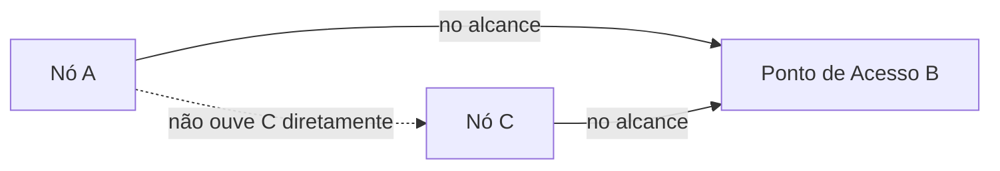

## Objetivos de Aprendizagem

- Explicar o problema do terminal oculto: por que a detecção de portadora, que funcionava para a Ethernet cabeada, pode falhar num meio sem fio.
- Descrever o CSMA/CA (prevenção de colisão) como a resposta real do sem fio, e explicar por que ele evita colisões em vez de detectá-las.
- Explicar por que a detecção de colisão (como o CSMA/CD a usava) é fundamentalmente difícil num rádio sem fio, diferentemente da Ethernet cabeada.
- Descrever o problema básico de handoff em redes móveis: o que precisa acontecer quando um host em movimento passa da cobertura de um ponto de acesso para a de outro.
- Explicar, honestamente, que este conceito cobre só noções introdutórias de redes sem fio e móveis, e que um tratamento mais profundo pertence a disciplinas mais avançadas que esta disciplina não tenta cobrir.

## Contexto e Motivação

Os dois conceitos anteriores desenvolveram o problema de disputa do meio compartilhado da Ethernet e a sua solução cabeada clássica, o CSMA/CD, além da resolução local de endereços do ARP. As redes sem fio compartilham o mesmo problema fundamental de acesso múltiplo (muitos dispositivos compartilhando um único meio físico, aqui o espectro de rádio aberto em vez de um fio), mas uma suposição-chave em que o CSMA/CD da Ethernet cabeada se apoiava deixa de valer no sem fio de um jeito genuinamente importante, motivando um projeto de protocolo real diferente: o CSMA/CA. Este conceito cobre essa diferença e o problema básico de mobilidade (o que precisa acontecer quando um dispositivo se move fisicamente entre pontos de acesso sem fio diferentes) num nível introdutório; redes sem fio e móveis mais aprofundadas (cobertas em cursos reais como especializações substanciais por si só) estão explicitamente fora do escopo aqui.

## Teoria Central

### O problema do terminal oculto

A detecção de portadora da Ethernet cabeada assumia que, se um nó não consegue detectar a transmissão de outro nó, esse outro nó não está de fato transmitindo no meio compartilhado. Numa rede sem fio, essa suposição pode ser falsa de um jeito específico e importante: dois nós sem fio, A e C, podem estar ambos dentro do alcance de um ponto de acesso comum, B, mas afastados o suficiente para que A e C não consigam detectar diretamente as transmissões de rádio um do outro, mesmo que os dois consigam alcançar B. Se A detecta o meio como ocioso (localmente, da sua própria posição) e transmite para B, e C, detectando de forma independente o meio como ocioso a partir da sua própria posição, diferente, também transmite para B ao mesmo tempo, os seus sinais podem colidir em B. Isso acontece mesmo que nem A nem C tenham detectado a transmissão do outro antes, já que cada um estava "oculto" da detecção de portadora do outro, apesar de ambos estarem dentro do alcance do mesmo ponto de acesso.



### CSMA/CA: prevenção de colisão, e não detecção

Como a detecção de colisão num rádio sem fio é genuinamente difícil (o próprio sinal de saída de um rádio transmissor normalmente sobrepuja a sua capacidade de escutar, ao mesmo tempo, um sinal de colisão fraco chegando, uma restrição física fundamentalmente diferente da Ethernet cabeada, em que um nó transmissor consegue escutar de forma significativa enquanto envia), as redes sem fio geralmente não conseguem detectar uma colisão do jeito que o CSMA/CD faz. Em vez disso, os protocolos sem fio usam o CSMA/CA (Collision Avoidance): em vez de reagir a uma colisão detectada depois do fato, os nós tomam medidas ativas para evitar que uma colisão aconteça, para começo de conversa. Isso pode incluir um nó enviando uma troca curta de reserva antes da sua transmissão de dados de fato (anunciando a sua intenção de transmitir e reservando o meio por essa duração), especificamente para tratar o cenário do terminal oculto, permitindo que até um nó "oculto" escute a troca de reserva (se estiver dentro do alcance do mesmo ponto de acesso) e adie a sua própria transmissão de acordo.

### Handoff: o problema básico da mobilidade

Um dispositivo móvel (um celular atravessando uma cidade, um notebook passando de sala em sala num prédio com vários pontos de acesso Wi-Fi) precisa trocar, em algum momento, de ser atendido por um ponto de acesso para ser atendido por outro, conforme sai fisicamente do alcance efetivo do primeiro e entra no do segundo. Esse handoff precisa acontecer, idealmente, sem interromper nenhuma das conexões ativas do dispositivo (uma chamada de vídeo em andamento, um download de arquivo), o que exige coordenação entre os pontos de acesso antigo e novo (e, numa rede celular, potencialmente entre estações-base diferentes e a infraestrutura de rede mais ampla) para redirecionar o tráfego em trânsito ao novo ponto de conexão do dispositivo com o mínimo de interrupção.

## Exemplos Resolvidos

### Exemplo 1: Rastreando o problema do terminal oculto passo a passo

```text
1. O nó A e o nó C estão ambos dentro do alcance de rádio do ponto de
   acesso B, mas longe demais um do outro para detectar diretamente as
   transmissões um do outro.
2. O nó A detecta o meio (da própria posição de A) como ocioso: ele não
   consegue ouvir C, porque C está fora do alcance de rádio de A, mesmo
   C estando no alcance de B.
3. O nó A começa a transmitir para B.
4. Quase no mesmo momento, o nó C, detectando de forma independente o
   meio (da própria posição de C) como ocioso exatamente pela mesma
   razão (A está fora do alcance de rádio de C), também começa a
   transmitir para B.
5. Os dois sinais chegam a B ao mesmo tempo e colidem, mesmo que nem A
   nem C tenham detectado nenhuma transmissão em andamento antes de
   começar a sua, já que cada um estava genuinamente "oculto" do outro.
```

A suposição de detecção de portadora da Ethernet cabeada ("se eu não consigo ouvir mais ninguém, ninguém mais está transmitindo") é simplesmente falsa neste cenário sem fio específico, e é exatamente por isso que uma abordagem inteiramente baseada em detecção de portadora, sem algum mecanismo adicional de coordenação, é insuficiente para o sem fio.

### Exemplo 2: Uma troca de reserva tratando o terminal oculto

```text
1. O nó A quer transmitir para o ponto de acesso B. Em vez de transmitir
   os seus dados de fato imediatamente, A primeiro envia um pedido de
   reserva curto para B, anunciando a sua intenção e a duração de que
   precisa.
2. B responde com uma concessão de reserva curta, enviada em broadcast
   para que qualquer nó dentro do alcance de B (INCLUSIVE o nó C, mesmo
   que C não tenha conseguido ouvir o pedido original de A diretamente)
   a receba.
3. O nó C, tendo recebido a concessão de reserva de B (que nomeia A como
   o nó que reservou e a duração), adia a sua própria tentativa de
   transmissão por essa duração, mesmo que C nunca tenha ouvido A
   diretamente.
4. O nó A transmite os seus dados de fato para B, agora sem disputa com
   C, já que C está esperando deliberadamente.
```

O valor real da troca de reserva é especificamente que ela é retransmitida pelo ponto de acesso B, um ponto que todo nó relevante (incluindo os "ocultos" como C, em relação a A) consegue ouvir diretamente, resolvendo um problema de coordenação que a detecção de portadora pura e direta entre A e C nunca conseguiria resolver sozinha, já que A e C simplesmente não conseguem se ouvir.

### Exemplo 3: Um handoff básico, rastreado em alto nível

```text
1. Um dispositivo móvel está conectado ao Ponto de Acesso 1 (AP1),
   baixando um arquivo ativamente.
2. O dispositivo se move fisicamente, e a intensidade do sinal do AP1,
   medida pelo dispositivo, começa a enfraquecer, enquanto a intensidade
   do sinal do AP2 (um ponto de acesso diferente, próximo) começa a
   ficar mais forte.
3. O dispositivo (ou a infraestrutura de rede, dependendo da tecnologia
   específica) inicia um handoff: estabelece uma conexão com o AP2
   enquanto a conexão com o AP1 ainda está ativa.
4. O tráfego em trânsito destinado ao dispositivo é redirecionado para
   o AP2 (o mecanismo específico desse redirecionamento varia bastante
   conforme a tecnologia e é genuinamente mais envolvente do que o
   esboçado aqui).
5. A conexão com o AP1 é liberada assim que o handoff para o AP2 se
   completa com sucesso, idealmente com o download do arquivo
   continuando sem nenhuma interrupção perceptível para o usuário.
```

Este rastreamento nomeia os passos reais envolvidos num nível conceitual, sem desenvolver a maquinaria de protocolo adicional e substancial que os sistemas reais de roaming celular e Wi-Fi usam para fazer o handoff funcionar de forma confiável: material genuinamente mais avançado que este conceito introdutório deixa deliberadamente para um estudo posterior e dedicado.

## Equívocos Comuns e Armadilhas

- **"As redes sem fio usam CSMA/CD, igual à Ethernet."** O sem fio usa CSMA/CA (prevenção de colisão), e não CSMA/CD (detecção de colisão). Um rádio transmissor geralmente não consegue escutar um sinal de colisão enquanto envia o seu próprio, uma restrição física fundamentalmente diferente da Ethernet cabeada, e é exatamente por isso que os protocolos sem fio enfatizam evitar colisões proativamente, em vez de detectá-las e reagir a elas depois do fato.
- **"O problema do terminal oculto significa que a detecção de portadora sem fio é inútil."** A detecção de portadora ainda tem valor real no caso comum em que os nós genuinamente conseguem se ouvir. O problema do terminal oculto é um modo de falha específico e real da detecção de portadora *sozinha*, e é exatamente por isso que mecanismos adicionais de coordenação (como uma troca de reserva retransmitida por um ponto de acesso comum) são colocados em camada por cima da detecção de portadora, e não no lugar dela.
- **"O handoff é só restabelecer uma conexão nova do zero no novo ponto de acesso."** Um handoff bem projetado busca especificamente preservar a continuidade de uma conexão ativa (uma chamada ou um download em andamento não deveria precisar recomeçar). Isso exige coordenação real entre os pontos de acesso antigo e novo para redirecionar o tráfego em trânsito, um problema genuinamente mais difícil do que simplesmente se conectar do zero a um novo ponto de acesso sem levar em conta as sessões ativas existentes.
- **"Este conceito cobre tudo o que importa sobre redes sem fio e móveis."** Intencionalmente, não: redes sem fio e móveis são especializações substanciais, com as suas próprias disciplinas avançadas dedicadas na maioria dos currículos reais. Este conceito cobre só os problemas introdutórios de disputa (terminal oculto, CSMA/CA) e de mobilidade (handoff), sinalizados honestamente como um ponto de partida, e não como um tratamento completo.

## Resumo

As redes sem fio compartilham o problema básico de acesso múltiplo da Ethernet, mas quebram uma suposição-chave em que a detecção de portadora cabeada se apoiava: dois nós ambos no alcance de um ponto de acesso comum podem ser genuinamente incapazes de se ouvir diretamente (o problema do terminal oculto), o que pode produzir colisões que nenhum dos nós poderia ter previsto só pela detecção de portadora. O CSMA/CA trata disso via prevenção proativa de colisões (frequentemente uma troca de reserva retransmitida por um ponto de acesso comum, alcançando até nós que não conseguem se ouvir diretamente), em vez da detecção reativa de colisões do CSMA/CD, que é praticamente inviável num rádio sem fio que geralmente não consegue escutar enquanto transmite. A mobilidade acrescenta o handoff: o problema real de coordenação de transferir uma conexão ativa da cobertura de um ponto de acesso para a de outro conforme um dispositivo se move fisicamente, idealmente sem interromper a conexão de forma perceptível. Este conceito permanece intencionalmente introdutório: a profundidade completa das redes sem fio e móveis é material especializado, real e substancial, além do escopo desta disciplina. Isto conclui o bloco de Camada de Enlace e Física; o projeto final que vem a seguir rastreia uma requisição HTTP completa por todas as camadas e mecanismos que esta disciplina inteira cobriu.

## Documentation Links

- [Stanford CS144: Lecture Schedule ("Wireless")](https://www.scs.stanford.edu/10au-cs144/sched/): uma aula de um curso real dedicada aos desafios próprios das redes sem fio.
- [ACM/IEEE CS2013: Networking and Communication Knowledge Area](https://csed.acm.org/knowledge-areas-networking-and-communication-nc-cs2013-version/): diretrizes curriculares que listam a Mobilidade como uma unidade de conhecimento central distinta, ao lado dos fundamentos de redes cabeadas.
