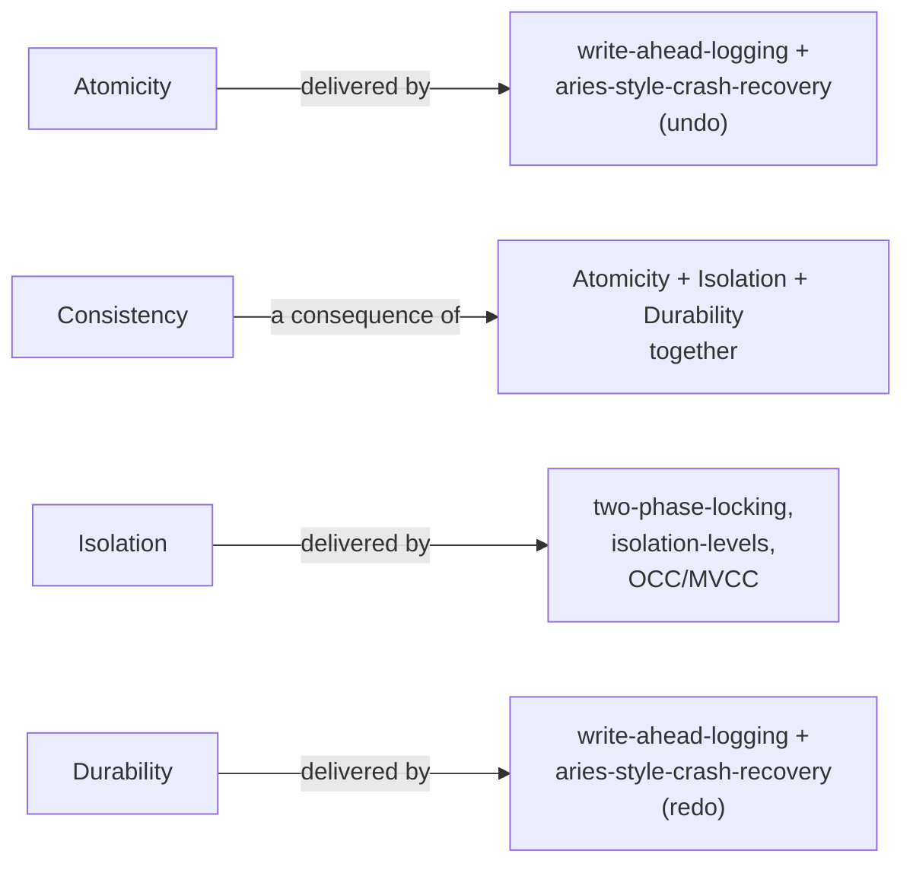

## Learning Objectives

- State the precise definition of each ACID property — Atomicity, Consistency, Isolation, Durability — not just the acronym.
- Explain why Consistency is fundamentally different from the other three: an application-level invariant the DBMS enforces only indirectly.
- Define Isolation precisely as equivalence to some serial (one-at-a-time) execution, not merely "transactions don't interfere."
- Map each of the next five concepts in this discipline to the specific ACID guarantee it is responsible for delivering.

## Context & Motivation

Every concept up to this point in this discipline has quietly assumed a single query running alone against a stable, already-correct set of pages. Real systems never work that way: many clients read and write concurrently, and the machine can crash at any instant, including mid-write. **ACID** — Atomicity, Consistency, Isolation, Durability — is the set of guarantees a DBMS makes about what happens to a **transaction** (a sequence of one or more operations grouped as a single logical unit of work) despite both of those realities. The acronym is everywhere in casual database discussion, almost always quoted without precise definitions; this concept exists specifically to close that gap before the next five concepts each build the actual machinery that delivers one piece of it.

## Core Theory

### Atomicity — all or nothing

**Atomicity** guarantees that a transaction's writes take effect completely, or not at all — there is no state, visible to any later reader, in which only *some* of a transaction's writes have taken effect. If a transaction is aborted (or the system crashes before it commits), every write it had made must be undone, as if the transaction had never started. This is precisely the guarantee that makes a multi-step operation — like moving money between two accounts, which requires *both* a debit and a credit to happen together — safe to express as one transaction rather than two independent statements a crash could catch in between.

### Consistency — an application invariant, enforced only indirectly

**Consistency** guarantees that a transaction moves the database from one valid state to another valid state, where "valid" means satisfying whatever invariants the *application* has declared — a foreign key must reference an existing row, an account balance must never go negative, a total across a set of rows must stay constant across a transfer. Crucially, the DBMS does not understand what these invariants *mean*; it enforces only the specific constraints an application explicitly declares (foreign keys, `CHECK` constraints, uniqueness) and otherwise delivers Consistency purely as a *consequence* of the other three properties — Atomicity (no partial writes to leave an invariant half-updated), Isolation (no concurrent transaction observing an invariant mid-violation), and Durability (a validated state, once committed, doesn't silently revert). Consistency is the one ACID letter that is not itself a mechanism this discipline builds; it is the outcome the other three mechanisms jointly produce.

### Isolation — equivalent to some serial execution

**Isolation** guarantees that the outcome of running several transactions concurrently is equivalent to *some* serial (one-at-a-time, in some order) execution of those same transactions — not that transactions literally run one at a time (that would forfeit all the performance benefit of concurrency), but that whatever interleaving the system actually chooses to execute produces a result indistinguishable from one of the possible serial orders. This precise definition — equivalence to a serial schedule — is exactly what `two-phase-locking-and-conflict-serializability`, several concepts ahead, formally proves a specific concurrency-control protocol achieves, and exactly what `isolation-levels-and-what-serializable-guarantees` later shows the SQL standard's weaker isolation levels deliberately relax.

### Durability — survives any subsequent crash

**Durability** guarantees that once a transaction has committed — the DBMS has told the client "this succeeded" — its writes survive any crash that happens afterward, no matter how soon. `buffer-pool-management` already established that real systems use NO-FORCE (a dirty page need not be flushed to disk before commit returns), which means Durability cannot be delivered by simply writing pages to disk at commit time — `write-ahead-logging`, several concepts ahead, is the actual mechanism: a durable log record describing the change reaches disk before commit returns, even though the data page itself may not.

### Which concept in this discipline delivers which guarantee

`concurrency-anomalies-dirty-reads-and-lost-updates`, immediately next, shows concretely what goes wrong with *no* isolation mechanism at all. `two-phase-locking-and-conflict-serializability` and `deadlocks-in-two-phase-locking` build the classic pessimistic mechanism for Isolation; `isolation-levels-and-what-serializable-guarantees` pins down exactly which anomalies each SQL isolation level still permits; `optimistic-concurrency-control-and-mvcc` builds the two real alternative Isolation mechanisms production systems use instead of locking. `write-ahead-logging` and `aries-style-crash-recovery`, the discipline's final cluster before the capstone, jointly deliver both Atomicity (via undo of uncommitted work) and Durability (via redo of committed work) after any crash.

## Worked Examples

### Example 1 — Atomicity: a crash mid-transfer

A transaction `T1` moves $100 from account A to account B: `UPDATE Accounts SET balance = balance - 100 WHERE id = 'A'` followed by `UPDATE Accounts SET balance = balance + 100 WHERE id = 'B'`. Suppose the machine crashes after the first statement executes (A's page has been modified) but before the second one runs. Atomicity guarantees that on restart, the DBMS's recovery process treats `T1` as if it had never happened at all — A's balance is restored to its pre-transaction value, not left $100 short with no corresponding credit to B anywhere. This is exactly the *undo* half of the recovery machinery `aries-style-crash-recovery` builds several concepts ahead.

### Example 2 — Consistency as an emergent property, not a mechanism

Suppose the application declares the invariant "the sum of all account balances never changes except via an explicit deposit or withdrawal transaction" — the DBMS has no built-in notion of "sum of all balances," and enforces nothing about it directly. What the DBMS *does* guarantee is: Atomicity, so `T1` from Example 1 either both moves $100 out of A and into B, or does neither (never one without the other, which alone would violate the sum invariant); Isolation, so a concurrent transaction reading the total balance never observes a moment where A has already been debited but B not yet credited; and Durability, so once `T1` commits, that consistent state isn't later reverted by a crash. The invariant itself is never "known" to the engine — it holds only because the three mechanistic guarantees, each built in a later concept of this discipline, jointly prevent every way it could otherwise be violated.

### Example 3 — Isolation and Durability distinguished with a concrete interleaving

Two transactions run concurrently against the same A/B account pair from Example 1: `T1` (the $100 transfer) and `T2` (`SELECT balance FROM Accounts` to compute the total across A and B). If the system lets `T2` read A's already-debited balance but B's not-yet-credited balance — a real interleaving that is possible with *no* isolation mechanism at all — `T2` reports a total $100 short of the true value, even though neither individual statement was wrong in isolation. Isolation's precise guarantee is that this interleaving must be equivalent to *some* serial order — either "all of `T1`, then all of `T2`" (T2 sees the post-transfer total, correct) or "all of `T2`, then all of `T1`" (T2 sees the pre-transfer total, also correct) — but never the interleaved, neither-serial-order result above. Separately, suppose `T1` does commit correctly and the machine crashes moments later, before B's dirty page has been flushed to disk (a real possibility under the NO-FORCE policy `buffer-pool-management` already established as standard) — Durability guarantees B's $100 credit is still recoverable after restart regardless, because a durable log record of that exact write reached disk before `T1`'s commit returned, independent of whether the data page itself had.

## Common Misconceptions & Pitfalls

- **"Consistency means the database enforces business logic correctness."** The DBMS enforces only the specific constraints an application explicitly declares (foreign keys, `CHECK`, uniqueness) — it has no understanding of an invariant like "total balance is conserved" unless that invariant is expressed as one of those declared constraint types; Consistency in the ACID sense is a *consequence* of Atomicity, Isolation, and Durability holding, not a fourth independent mechanism the engine separately implements.
- **"Isolation means transactions literally execute one at a time."** Real systems run transactions concurrently for performance — Isolation's actual guarantee is only that the *result* is equivalent to some serial order, which is a much weaker (and far more implementable, without forfeiting concurrency) requirement than true one-at-a-time execution; the concurrency-control mechanisms built over the next several concepts exist specifically to achieve that equivalence while still running work in parallel.
- **"Durability means a committed write is immediately on disk."** `buffer-pool-management` already established that real systems use NO-FORCE, meaning a committed transaction's dirty pages may still be sitting in the buffer pool, not yet flushed, when commit returns — Durability is delivered not by the data page reaching disk immediately, but by a durable log record of the change reaching disk before commit returns, a distinction `write-ahead-logging` makes precise several concepts ahead.

## Summary

Atomicity, Consistency, Isolation, and Durability are not one flat list of equally-mechanistic guarantees: Atomicity is all-or-nothing execution of a transaction's writes, Isolation is equivalence to some serial execution of concurrently-running transactions, and Durability is a committed write surviving any subsequent crash — each delivered by real, specific machinery built later in this discipline (write-ahead logging and ARIES for Atomicity and Durability; two-phase locking, isolation levels, and OCC/MVCC for Isolation) — while Consistency is the emergent outcome of the other three holding together, not a separate mechanism of its own. Pinning down these four definitions precisely, rather than leaving them at the level of the acronym, is what lets each of the next five concepts in this discipline claim exactly which guarantee it is responsible for, and no more.

## Documentation Links

- [Database System Concepts (Silberschatz, Korth, Sudarshan) — Companion Site](https://www.db-book.com/) — the standard textbook source for the precise ACID definitions this concept builds from, particularly the framing of Isolation as equivalence to a serial schedule.
- [CMU 15-445/645 — Schedule (Concurrency Control Theory)](https://15445.courses.cs.cmu.edu/fall2026/schedule.html) — the course schedule confirming where ACID's precise definitions sit relative to the concurrency-control and recovery material this discipline builds over the next several concepts.
