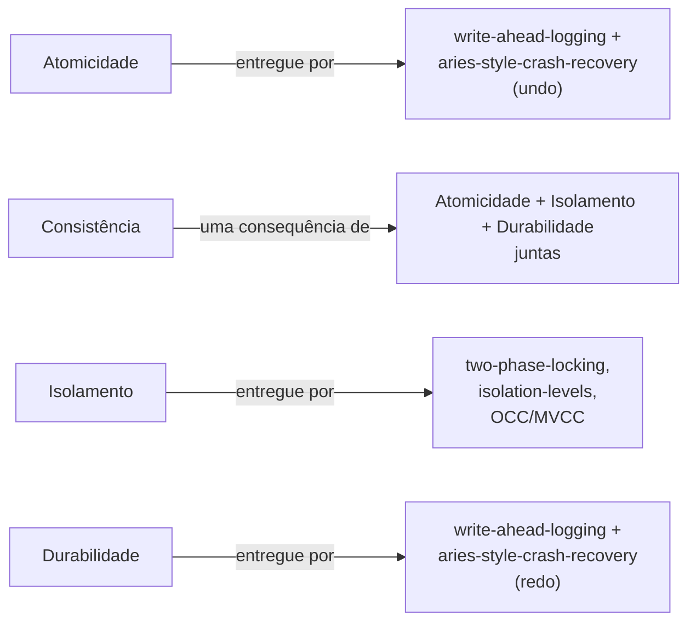

## Objetivos de Aprendizagem

- Enunciar a definição precisa de cada propriedade ACID, Atomicidade, Consistência, Isolamento, Durabilidade, não apenas o acrônimo.
- Explicar por que a Consistência é fundamentalmente diferente das outras três: um invariante de nível de aplicação que o SGBD impõe apenas indiretamente.
- Definir o Isolamento precisamente como equivalência a alguma execução serial (uma de cada vez), não meramente "transações não interferem".
- Mapear cada um dos próximos cinco conceitos desta disciplina à garantia ACID específica que ele é responsável por entregar.

## Contexto e Motivação

Todo conceito até este ponto nesta disciplina assumiu silenciosamente uma única consulta rodando sozinha contra um conjunto de páginas estável e já correto. Sistemas reais nunca funcionam assim: muitos clientes leem e escrevem concorrentemente, e a máquina pode travar a qualquer instante, inclusive no meio de uma escrita. **ACID**, Atomicidade, Consistência, Isolamento, Durabilidade, é o conjunto de garantias que um SGBD faz sobre o que acontece com uma **transação** (uma sequência de uma ou mais operações agrupadas como uma única unidade lógica de trabalho) apesar dessas duas realidades. O acrônimo está em toda parte na discussão casual sobre bancos de dados, quase sempre citado sem definições precisas; este conceito existe especificamente para fechar essa lacuna antes que os próximos cinco conceitos construam, cada um, o maquinário real que entrega uma parte dele.

## Teoria Central

### Atomicidade: tudo ou nada

A **Atomicidade** garante que as escritas de uma transação surtam efeito completamente, ou de forma nenhuma: não há estado, visível a qualquer leitor posterior, no qual apenas *algumas* das escritas de uma transação surtiram efeito. Se uma transação é abortada (ou o sistema trava antes de ela confirmar), toda escrita que ela havia feito deve ser desfeita, como se a transação nunca tivesse começado. Esta é precisamente a garantia que torna uma operação de múltiplos passos, como mover dinheiro entre duas contas, que exige que *ambos* um débito e um crédito aconteçam juntos, segura de expressar como uma transação em vez de dois comandos independentes que um travamento poderia pegar no meio.

### Consistência: um invariante de aplicação, imposto apenas indiretamente

A **Consistência** garante que uma transação move o banco de dados de um estado válido para outro estado válido, onde "válido" significa satisfazer quaisquer invariantes que a *aplicação* declarou: uma chave estrangeira deve referenciar uma linha existente, um saldo de conta nunca deve ficar negativo, um total ao longo de um conjunto de linhas deve permanecer constante através de uma transferência. Crucialmente, o SGBD não entende o que esses invariantes *significam*; ele impõe apenas as restrições específicas que uma aplicação declara explicitamente (chaves estrangeiras, restrições `CHECK`, unicidade) e de resto entrega Consistência puramente como uma *consequência* das outras três propriedades: Atomicidade (nenhuma escrita parcial para deixar um invariante atualizado pela metade), Isolamento (nenhuma transação concorrente observando um invariante no meio de uma violação) e Durabilidade (um estado validado, uma vez confirmado, não reverte silenciosamente). A Consistência é a única letra do ACID que não é ela mesma um mecanismo que esta disciplina constrói; é o resultado que os outros três mecanismos produzem conjuntamente.

### Isolamento: equivalente a alguma execução serial

O **Isolamento** garante que o resultado de rodar várias transações concorrentemente é equivalente a *alguma* execução serial (uma de cada vez, em alguma ordem) dessas mesmas transações, não que as transações literalmente rodem uma de cada vez (isso abdicaria de todo o benefício de desempenho da concorrência), mas que qualquer intercalamento que o sistema de fato escolha executar produza um resultado indistinguível de uma das ordens seriais possíveis. Esta definição precisa, equivalência a um escalonamento serial, é exatamente o que `two-phase-locking-and-conflict-serializability`, vários conceitos adiante, prova formalmente que um protocolo específico de controle de concorrência alcança, e exatamente o que `isolation-levels-and-what-serializable-guarantees` mostra depois que os níveis de isolamento mais fracos do padrão SQL relaxam deliberadamente.

### Durabilidade: sobrevive a qualquer travamento subsequente

A **Durabilidade** garante que, uma vez que uma transação confirmou (o SGBD disse ao cliente "isto teve sucesso"), suas escritas sobrevivem a qualquer travamento que aconteça depois, não importa quão cedo. `buffer-pool-management` já estabeleceu que sistemas reais usam NO-FORCE (uma página suja não precisa ser descarregada para o disco antes de a confirmação retornar), o que significa que a Durabilidade não pode ser entregue simplesmente escrevendo páginas no disco no momento da confirmação: `write-ahead-logging`, vários conceitos adiante, é o mecanismo real: um registro de log durável descrevendo a mudança chega ao disco antes de a confirmação retornar, mesmo que a própria página de dados possa não chegar.

### Qual conceito desta disciplina entrega qual garantia

`concurrency-anomalies-dirty-reads-and-lost-updates`, imediatamente a seguir, mostra concretamente o que dá errado com *nenhum* mecanismo de isolamento. `two-phase-locking-and-conflict-serializability` e `deadlocks-in-two-phase-locking` constroem o mecanismo pessimista clássico para o Isolamento; `isolation-levels-and-what-serializable-guarantees` fixa exatamente quais anomalias cada nível de isolamento SQL ainda permite; `optimistic-concurrency-control-and-mvcc` constrói os dois mecanismos reais alternativos de Isolamento que sistemas de produção usam em vez de travas. `write-ahead-logging` e `aries-style-crash-recovery`, o agrupamento final da disciplina antes do projeto culminante, entregam conjuntamente tanto a Atomicidade (via undo do trabalho não confirmado) quanto a Durabilidade (via redo do trabalho confirmado) após qualquer travamento.

## Exemplos Resolvidos

### Exemplo 1: Atomicidade, um travamento no meio de uma transferência

Uma transação `T1` move R$100 da conta A para a conta B: `UPDATE Accounts SET balance = balance - 100 WHERE id = 'A'` seguido de `UPDATE Accounts SET balance = balance + 100 WHERE id = 'B'`. Suponha que a máquina trave depois de o primeiro comando executar (a página de A foi modificada), mas antes de o segundo rodar. A Atomicidade garante que, na reinicialização, o processo de recuperação do SGBD trate `T1` como se nunca tivesse acontecido: o saldo de A é restaurado ao seu valor pré-transação, não deixado R$100 a menos sem nenhum crédito correspondente em B em lugar nenhum. Esta é exatamente a metade de *undo* do maquinário de recuperação que `aries-style-crash-recovery` constrói vários conceitos adiante.

### Exemplo 2: Consistência como propriedade emergente, não um mecanismo

Suponha que a aplicação declare o invariante "a soma de todos os saldos de conta nunca muda exceto por uma transação explícita de depósito ou saque": o SGBD não tem noção embutida de "soma de todos os saldos", e não impõe nada sobre isso diretamente. O que o SGBD *de fato* garante é: Atomicidade, de modo que `T1` do Exemplo 1 ou move R$100 para fora de A e para dentro de B, ou não faz nenhum dos dois (nunca um sem o outro, o que sozinho violaria o invariante da soma); Isolamento, de modo que uma transação concorrente lendo o saldo total nunca observe um momento em que A já foi debitada mas B ainda não creditada; e Durabilidade, de modo que, uma vez que `T1` confirme, esse estado consistente não seja depois revertido por um travamento. O invariante em si nunca é "conhecido" pelo motor; ele se mantém apenas porque as três garantias mecanísticas, cada uma construída em um conceito posterior desta disciplina, impedem conjuntamente toda maneira pela qual ele poderia de outro modo ser violado.

### Exemplo 3: Isolamento e Durabilidade distinguidos com um intercalamento concreto

Duas transações rodam concorrentemente contra o mesmo par de contas A/B do Exemplo 1: `T1` (a transferência de R$100) e `T2` (`SELECT balance FROM Accounts` para computar o total entre A e B). Se o sistema deixa `T2` ler o saldo já debitado de A mas o saldo ainda não creditado de B, um intercalamento real que é possível com *nenhum* mecanismo de isolamento, `T2` reporta um total R$100 a menos do valor verdadeiro, embora nenhum dos comandos individuais estivesse errado isoladamente. A garantia precisa do Isolamento é que este intercalamento deve ser equivalente a *alguma* ordem serial: ou "toda a `T1`, depois toda a `T2`" (T2 vê o total pós-transferência, correto) ou "toda a `T2`, depois toda a `T1`" (T2 vê o total pré-transferência, também correto), mas nunca o resultado intercalado de nenhuma ordem serial acima. Separadamente, suponha que `T1` de fato confirme corretamente e a máquina trave momentos depois, antes de a página suja de B ter sido descarregada para o disco (uma possibilidade real sob a política NO-FORCE que `buffer-pool-management` já estabeleceu como padrão): a Durabilidade garante que o crédito de R$100 de B ainda é recuperável após a reinicialização independentemente disso, porque um registro de log durável daquela exata escrita chegou ao disco antes de a confirmação de `T1` retornar, independentemente de a própria página de dados ter chegado.

## Equívocos Comuns e Armadilhas

- **"Consistência significa que o banco de dados impõe a correção da lógica de negócio."** O SGBD impõe apenas as restrições específicas que uma aplicação declara explicitamente (chaves estrangeiras, `CHECK`, unicidade): ele não tem entendimento de um invariante como "o saldo total é conservado" a menos que esse invariante seja expresso como um desses tipos de restrição declarados; Consistência no sentido ACID é uma *consequência* de Atomicidade, Isolamento e Durabilidade se mantendo, não um quarto mecanismo independente que o motor implementa separadamente.
- **"Isolamento significa que transações literalmente executam uma de cada vez."** Sistemas reais rodam transações concorrentemente por desempenho: a garantia real do Isolamento é apenas que o *resultado* seja equivalente a alguma ordem serial, o que é um requisito muito mais fraco (e muito mais implementável, sem abdicar da concorrência) do que a verdadeira execução uma de cada vez; os mecanismos de controle de concorrência construídos ao longo dos próximos vários conceitos existem especificamente para alcançar essa equivalência enquanto ainda rodam trabalho em paralelo.
- **"Durabilidade significa que uma escrita confirmada está imediatamente no disco."** `buffer-pool-management` já estabeleceu que sistemas reais usam NO-FORCE, significando que as páginas sujas de uma transação confirmada podem ainda estar na buffer pool, ainda não descarregadas, quando a confirmação retorna: a Durabilidade é entregue não pela página de dados chegar ao disco imediatamente, mas por um registro de log durável da mudança chegar ao disco antes de a confirmação retornar, uma distinção que `write-ahead-logging` torna precisa vários conceitos adiante.

## Resumo

Atomicidade, Consistência, Isolamento e Durabilidade não são uma lista plana de garantias igualmente mecanísticas: Atomicidade é a execução tudo-ou-nada das escritas de uma transação, Isolamento é a equivalência a alguma execução serial de transações rodando concorrentemente, e Durabilidade é uma escrita confirmada sobrevivendo a qualquer travamento subsequente, cada uma entregue por maquinário real e específico construído depois nesta disciplina (write-ahead logging e ARIES para Atomicidade e Durabilidade; two-phase locking, níveis de isolamento e OCC/MVCC para Isolamento), enquanto a Consistência é o resultado emergente das outras três se mantendo juntas, não um mecanismo próprio separado. Fixar essas quatro definições precisamente, em vez de deixá-las no nível do acrônimo, é o que permite que cada um dos próximos cinco conceitos desta disciplina reivindique exatamente qual garantia ele é responsável por entregar, e nada mais.

## Documentation Links

- [Database System Concepts (Silberschatz, Korth, Sudarshan): Companion Site](https://www.db-book.com/): a fonte padrão de livro-texto para as definições ACID precisas das quais este conceito parte, particularmente o enquadramento do Isolamento como equivalência a um escalonamento serial.
- [CMU 15-445/645: Schedule (Concurrency Control Theory)](https://15445.courses.cs.cmu.edu/fall2026/schedule.html): o cronograma do curso confirmando onde as definições precisas de ACID se situam em relação ao material de controle de concorrência e recuperação que esta disciplina constrói ao longo dos próximos vários conceitos.