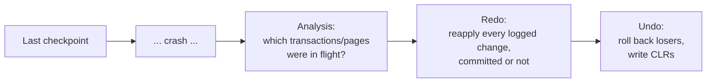

## Learning Objectives

- Explain why crash recovery needs three distinct phases rather than one, and what each phase is individually responsible for.
- Trace the Analysis phase reconstructing exactly which transactions and pages were in flight at the instant of a crash.
- Trace the Redo phase reapplying logged changes regardless of commit status, and explain why this recreates the precise pre-crash state, not just the committed one.
- Trace the Undo phase rolling back active-at-crash transactions using compensation log records, and explain why those records make a second crash mid-undo safe.

## Context & Motivation

`write-ahead-logging` built the log-record format — LSN, pageLSN, flushedLSN — and proved that logging a change durably before its data page reaches disk (and before commit is acknowledged) is sufficient to make STEAL and NO-FORCE safe. What it did not build is the actual recovery procedure that runs after a real crash, using exactly that log, to bring the database back to a correct state. **ARIES** ("Algorithm for Recovery and Isolation Exploiting Semantics") is the real, three-phase algorithm this concept builds — Analysis, Redo, Undo — each phase doing a specific, separate job, run in that exact order every time the system restarts after any crash.

## Core Theory

### Why three separate phases

A crash can happen at literally any instant — mid-transaction, mid-page-write, or between any two log records — so recovery cannot simply assume "the last thing in the log is where we stopped, so just continue from there." It first has to find out, from the log alone, exactly what state everything was in the moment before the crash (**Analysis**), then reconstruct that exact pre-crash state on disk (**Redo**), and only then decide what to do about the transactions that were still incomplete at that moment (**Undo**). Doing these three jobs in a single pass is not possible, because Undo cannot safely begin until Redo has finished re-establishing the precise pre-crash state each undo operation needs to reason about correctly.

### Analysis: reconstructing what was in flight

Analysis starts from the most recent **checkpoint** (a periodically-written log record recording, at that moment, which transactions were active and which pages were dirty — bounding how far back recovery ever needs to scan, rather than replaying the entire history of the database from its creation) and scans forward through the log to its very end. As it scans, it rebuilds two tables: the **Active Transaction Table**, adding a transaction the first time any of its log records is seen and removing it the moment its commit or abort record is seen — whatever remains in this table once the scan reaches the end of the log is exactly the set of transactions that were still active, unfinished, at the instant of the crash (the "losers" Undo will need to roll back); and the **Dirty Page Table**, recording every page touched by any log record since the checkpoint, which tells Redo exactly which pages — and from which LSN onward — might need reapplied changes.

### Redo: repeating history

Redo starts from the earliest LSN recorded in the reconstructed Dirty Page Table and scans forward through the log to its end, and — this is ARIES's central, distinctive idea — reapplies **every** logged change it finds, regardless of whether the transaction that made it had committed, aborted, or was still active at crash time. For each update log record, Redo compares the record's LSN against the affected page's *current on-disk* pageLSN: if the page's on-disk pageLSN is already at least as high as the record's LSN, the change is already durably reflected on disk and is skipped (redo is idempotent — reapplying an already-applied change would corrupt it); otherwise, the change is reapplied and the page's pageLSN is updated to match. The result, once Redo finishes, is the database's exact state at the instant of the crash — including the effects of transactions that were never committed — deliberately *not* just the state reflecting committed work, because Undo (next) needs to see the real, complete pre-crash state to correctly reverse exactly what each active-at-crash transaction had actually done.

### Undo: rolling back losers, safely

Undo takes the Active Transaction Table's final contents from Analysis — the "loser" transactions still active at crash time — and rolls each one back by scanning its log records in reverse order, undoing each one (restoring the "before" value the original update record recorded). Each undo operation itself writes a new log record, a **Compensation Log Record (CLR)**, describing the undo just performed. CLRs exist specifically to make a *second* crash, occurring in the middle of Undo itself, safe: a CLR is a **redo-only** record — if the system crashes again mid-undo and restarts, Redo (which always runs before Undo, every time) will reapply any CLR it finds exactly like any other logged change, meaning any undo work already completed and logged before the second crash is never repeated, and Undo on the second restart resumes rolling back only whatever genuinely remains.

## Worked Examples

### Example 1 — Analysis, reconstructing exactly what was in flight

A checkpoint at LSN `99` records empty Active Transaction and Dirty Page Tables. The log then contains: `LSN 100: [T1, UPDATE, A, before=500, after=400]`; `LSN 101: [T1, UPDATE, B, before=300, after=400]`; `LSN 102: [T1, COMMIT]`; `LSN 103: [T2, UPDATE, C, before=200, after=150]`; `LSN 104: [T2, UPDATE, D, before=900, after=800]` — and then the system crashes, with no further records. Analysis scans forward from LSN `99`: `T1` is added to the Active Transaction Table at LSN `100`, then *removed* at LSN `102` (its commit) — `T1` is not a loser. `T2` is added at LSN `103` and never removed — the scan reaches the end of the log with `T2` still in the table, identifying it as the one transaction that needs undoing. The Dirty Page Table accumulates all four touched pages: `{A: 100, B: 101, C: 103, D: 104}`.

### Example 2 — Redo, reconstructing the exact pre-crash state (including T2's uncommitted work)

Redo starts at LSN `100` (the earliest entry in the Dirty Page Table) and scans to the end. Suppose, at crash time, page `A`'s on-disk pageLSN already happens to be `100` (it had been flushed to disk by ordinary buffer-pool eviction before the crash) — Redo checks LSN `100` against it: `100 ≥ 100`, so this change is skipped, already durably applied. Pages `B`, `C`, and `D`, by contrast, were never flushed (on-disk pageLSN `0` for each) — Redo reapplies LSN `101` (`B := 400`), LSN `103` (`C := 150`), and LSN `104` (`D := 800`) in turn, updating each page's pageLSN to match. After Redo completes, the database reads `A=400, B=400, C=150, D=800` — the *exact* state at the instant of the crash, including `T2`'s two uncommitted changes to `C` and `D`, which Redo deliberately reapplies without regard to `T2`'s eventual fate; that decision belongs entirely to Undo, next.

### Example 3 — Undo, rolling back T2 with CLRs, and surviving a second crash

Undo takes Analysis's loser set, `{T2}`, and rolls it back by scanning `T2`'s log records in reverse: first LSN `104` (`D`, before `900`) is undone — `D` is restored to `900`, and a compensation record `LSN 105: [T2, CLR, D, undoing 104, restore=900]` is written. Next LSN `103` (`C`, before `200`) is undone — `C` is restored to `200`, and `LSN 106: [T2, CLR, C, undoing 103, restore=200]` is written. With no earlier `T2` records remaining, Undo writes `LSN 107: [T2, END]`, marking `T2` fully rolled back. Now suppose a **second crash** occurs right after LSN `105` is written but before LSN `106` is processed. On restart, Analysis and Redo run again exactly as before — Redo reapplies LSN `105`'s CLR (restoring `D` to `900`) exactly like any other logged change, since a CLR is redo-only and never itself subject to being undone again. Undo then resumes: it finds `T2` still active (no `END` record was ever written), and — because `D`'s undo is already durably recorded via its CLR — correctly proceeds to undo only what remains, `C` via LSN `103`, without ever redundantly re-undoing `D` a second time.

## Common Misconceptions & Pitfalls

- **"Redo should only reapply committed transactions' changes."** Example 2 shows the opposite is essential: Redo reapplies *every* logged change, including `T2`'s two updates that were never committed, precisely because Redo's job is to reconstruct the true pre-crash state, not a pre-filtered "committed only" state — filtering by commit status is Undo's job, and it can only do that job correctly once the real pre-crash state genuinely exists to undo from.
- **"Undoing a transaction just means restoring its before-images, without needing to log anything new."** Example 3 shows each undo operation is itself logged, as a CLR — this is not incidental bookkeeping, it is exactly what makes a second crash mid-undo safe, since without a durable record of "this specific undo already happened," a second recovery pass would have no way to distinguish already-completed undo work from work still remaining, and could redo (or worse, re-undo) it incorrectly.
- **"Analysis has to scan the entire history of the database from the beginning every time."** Checkpoints exist specifically to bound this: Analysis starts from the most recent checkpoint's recorded Active Transaction and Dirty Page Tables, not from the database's creation — Example 1's checkpoint at LSN `99` is exactly what lets Analysis begin its scan there instead of replaying every log record the system has ever produced.

## Summary

ARIES recovers from a crash in exactly three ordered phases, each with a distinct job: **Analysis** replays the log forward from the last checkpoint to reconstruct exactly which transactions and which pages were still in flight the instant the system crashed (Example 1's real Active Transaction and Dirty Page Tables); **Redo** then repeats history, reapplying every logged change regardless of whether it belonged to a committed or still-active transaction, to reconstruct the precise pre-crash state rather than just the committed one (Example 2's full state including `T2`'s uncommitted work); **Undo** then rolls back the transactions that were still active at crash time, writing Compensation Log Records as it goes so that a second crash in the middle of undo does not redo the same rollback twice, or skip work that still genuinely remains (Example 3). This three-phase structure — and the specific insight that Redo must reconstruct the *complete* pre-crash state before Undo can safely reason about what to reverse — is exactly what the ARIES paper contributed as a real, still-standard recovery algorithm.

## Documentation Links

- [CMU 15-445/645 — Database Logging / Recovery Slides](https://15445.courses.cs.cmu.edu/fall2025/slides/22-recovery.pdf) — the source of this concept's Analysis/Redo/Undo phase breakdown and the checkpoint-bounded Analysis scan worked through in the examples.
- [ARIES: A Transaction Recovery Method (Mohan et al., 1992) — IBM Research](https://research.ibm.com/publications/aries-a-transaction-recovery-method-supporting-fine-granularity-locking-and-partial-rollbacks-using-write-ahead-logging) — the original paper this concept's algorithm is named after and built directly from, including the compensation-log-record mechanism traced in Example 3.
