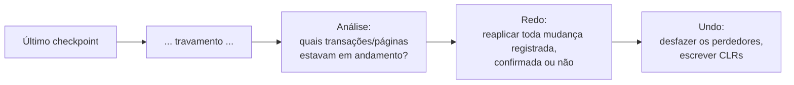

## Objetivos de Aprendizagem

- Explicar por que a recuperação de travamento precisa de três fases distintas em vez de uma, e pelo que cada fase é individualmente responsável.
- Rastrear a fase de Análise reconstruindo exatamente quais transações e páginas estavam em andamento no instante de um travamento.
- Rastrear a fase de Redo reaplicando mudanças registradas em log independentemente do status de confirmação, e explicar por que isso recria o estado exato pré-travamento, não apenas o estado confirmado.
- Rastrear a fase de Undo desfazendo transações ativas no momento do travamento usando registros de log de compensação, e explicar por que esses registros tornam seguro um segundo travamento no meio do undo.

## Contexto e Motivação

`write-ahead-logging` construiu o formato de registro de log (LSN, pageLSN, flushedLSN) e provou que registrar uma mudança de forma durável antes de sua página de dados chegar ao disco (e antes de a confirmação ser reconhecida) é suficiente para tornar STEAL e NO-FORCE seguros. O que ele não construiu é o procedimento de recuperação real que roda após um travamento real, usando exatamente esse log, para trazer o banco de dados de volta a um estado correto. **ARIES** ("Algorithm for Recovery and Isolation Exploiting Semantics") é o algoritmo real de três fases que este conceito constrói, Análise, Redo, Undo, cada fase fazendo um trabalho específico e separado, rodado nessa exata ordem toda vez que o sistema reinicia após qualquer travamento.

## Teoria Central

### Por que três fases separadas

Um travamento pode acontecer literalmente a qualquer instante, no meio de uma transação, no meio de uma escrita de página, ou entre quaisquer dois registros de log, então a recuperação não pode simplesmente assumir "a última coisa no log é onde paramos, então basta continuar daí". Ela primeiro tem de descobrir, só a partir do log, em que estado exatamente tudo estava no momento antes do travamento (**Análise**), depois reconstruir esse exato estado pré-travamento no disco (**Redo**), e só então decidir o que fazer sobre as transações que ainda estavam incompletas naquele momento (**Undo**). Fazer esses três trabalhos em uma única passagem não é possível, porque o Undo não pode começar com segurança até que o Redo tenha terminado de restabelecer o estado preciso pré-travamento sobre o qual cada operação de undo precisa raciocinar corretamente.

### Análise: reconstruindo o que estava em andamento

A Análise começa a partir do **checkpoint** mais recente (um registro de log escrito periodicamente que registra, naquele momento, quais transações estavam ativas e quais páginas estavam sujas, limitando quão para trás a recuperação alguma vez precisa varrer, em vez de reexecutar toda a história do banco de dados desde a sua criação) e varre para frente pelo log até o seu final. À medida que varre, ela reconstrói duas tabelas: a **Tabela de Transações Ativas**, adicionando uma transação na primeira vez que qualquer um de seus registros de log é visto e removendo-a no momento em que seu registro de commit ou abort é visto: o que quer que reste nesta tabela quando a varredura chega ao final do log é exatamente o conjunto de transações que ainda estavam ativas, inacabadas, no instante do travamento (os "perdedores" que o Undo precisará desfazer); e a **Tabela de Páginas Sujas**, registrando toda página tocada por qualquer registro de log desde o checkpoint, o que diz ao Redo exatamente quais páginas, e a partir de qual LSN, podem precisar de mudanças reaplicadas.

### Redo: repetindo a história

O Redo começa a partir do LSN mais antigo registrado na Tabela de Páginas Sujas reconstruída e varre para frente pelo log até o seu final, e, esta é a ideia central e distintiva do ARIES, reaplica **toda** mudança registrada que encontra, independentemente de a transação que a fez ter confirmado, abortado, ou ainda estar ativa no momento do travamento. Para cada registro de log de atualização, o Redo compara o LSN do registro com o pageLSN *atual em disco* da página afetada: se o pageLSN em disco da página já é pelo menos tão alto quanto o LSN do registro, a mudança já está durávelmente refletida no disco e é pulada (o redo é idempotente: reaplicar uma mudança já aplicada a corromperia); caso contrário, a mudança é reaplicada e o pageLSN da página é atualizado para corresponder. O resultado, uma vez que o Redo termina, é o estado exato do banco de dados no instante do travamento, incluindo os efeitos de transações que nunca foram confirmadas, deliberadamente *não* apenas o estado refletindo trabalho confirmado, porque o Undo (a seguir) precisa ver o estado real e completo pré-travamento para reverter corretamente exatamente o que cada transação ativa no momento do travamento de fato havia feito.

### Undo: desfazendo os perdedores, com segurança

O Undo pega o conteúdo final da Tabela de Transações Ativas da Análise, as transações "perdedoras" ainda ativas no momento do travamento, e desfaz cada uma varrendo seus registros de log em ordem reversa, desfazendo cada um (restaurando o valor "antes" que o registro de atualização original registrou). Cada operação de undo em si escreve um novo registro de log, um **Registro de Log de Compensação (CLR)**, descrevendo o undo recém-executado. Os CLRs existem especificamente para tornar seguro um *segundo* travamento, ocorrendo no meio do próprio Undo: um CLR é um registro **apenas de redo**: se o sistema trava de novo no meio do undo e reinicia, o Redo (que sempre roda antes do Undo, toda vez) reaplicará qualquer CLR que encontre exatamente como qualquer outra mudança registrada, significando que qualquer trabalho de undo já completado e registrado antes do segundo travamento nunca é repetido, e o Undo na segunda reinicialização retoma desfazendo apenas o que genuinamente resta.

## Exemplos Resolvidos

### Exemplo 1: Análise, reconstruindo exatamente o que estava em andamento

Um checkpoint no LSN `99` registra Tabelas de Transações Ativas e de Páginas Sujas vazias. O log então contém: `LSN 100: [T1, UPDATE, A, before=500, after=400]`; `LSN 101: [T1, UPDATE, B, before=300, after=400]`; `LSN 102: [T1, COMMIT]`; `LSN 103: [T2, UPDATE, C, before=200, after=150]`; `LSN 104: [T2, UPDATE, D, before=900, after=800]`, e então o sistema trava, sem mais registros. A Análise varre para frente a partir do LSN `99`: `T1` é adicionada à Tabela de Transações Ativas no LSN `100`, depois *removida* no LSN `102` (seu commit): `T1` não é um perdedor. `T2` é adicionada no LSN `103` e nunca removida: a varredura chega ao final do log com `T2` ainda na tabela, identificando-a como a única transação que precisa de undo. A Tabela de Páginas Sujas acumula todas as quatro páginas tocadas: `{A: 100, B: 101, C: 103, D: 104}`.

### Exemplo 2: Redo, reconstruindo o estado exato pré-travamento (incluindo o trabalho não confirmado de T2)

O Redo começa no LSN `100` (a entrada mais antiga na Tabela de Páginas Sujas) e varre até o final. Suponha que, no momento do travamento, o pageLSN em disco da página `A` já seja por acaso `100` (ela havia sido descarregada para o disco por despejo ordinário da buffer pool antes do travamento): o Redo verifica o LSN `100` contra ele: `100 ≥ 100`, então esta mudança é pulada, já durávelmente aplicada. As páginas `B`, `C` e `D`, em contraste, nunca foram descarregadas (pageLSN em disco `0` para cada uma): o Redo reaplica o LSN `101` (`B := 400`), o LSN `103` (`C := 150`) e o LSN `104` (`D := 800`) por sua vez, atualizando o pageLSN de cada página para corresponder. Após o Redo completar, o banco de dados lê `A=400, B=400, C=150, D=800`, o estado *exato* no instante do travamento, incluindo as duas mudanças não confirmadas de `T2` em `C` e `D`, que o Redo deliberadamente reaplica sem considerar o destino eventual de `T2`; essa decisão pertence inteiramente ao Undo, a seguir.

### Exemplo 3: Undo, desfazendo T2 com CLRs, e sobrevivendo a um segundo travamento

O Undo pega o conjunto de perdedores da Análise, `{T2}`, e o desfaz varrendo os registros de log de `T2` em reverso: primeiro o LSN `104` (`D`, antes `900`) é desfeito: `D` é restaurado para `900`, e um registro de compensação `LSN 105: [T2, CLR, D, undoing 104, restore=900]` é escrito. Em seguida o LSN `103` (`C`, antes `200`) é desfeito: `C` é restaurado para `200`, e `LSN 106: [T2, CLR, C, undoing 103, restore=200]` é escrito. Sem registros `T2` mais antigos restantes, o Undo escreve `LSN 107: [T2, END]`, marcando `T2` como totalmente desfeita. Agora suponha que um **segundo travamento** ocorra logo após o LSN `105` ser escrito mas antes de o LSN `106` ser processado. Na reinicialização, a Análise e o Redo rodam de novo exatamente como antes: o Redo reaplica o CLR do LSN `105` (restaurando `D` para `900`) exatamente como qualquer outra mudança registrada, já que um CLR é apenas de redo e nunca ele mesmo sujeito a ser desfeito de novo. O Undo então retoma: ele encontra `T2` ainda ativa (nenhum registro `END` foi jamais escrito), e, porque o undo de `D` já está durávelmente registrado via seu CLR, procede corretamente a desfazer apenas o que resta, `C` via LSN `103`, sem nunca redundantemente desfazer `D` uma segunda vez.

## Equívocos Comuns e Armadilhas

- **"O Redo deveria reaplicar apenas as mudanças de transações confirmadas."** O Exemplo 2 mostra que o oposto é essencial: o Redo reaplica *toda* mudança registrada, incluindo as duas atualizações de `T2` que nunca foram confirmadas, precisamente porque o trabalho do Redo é reconstruir o verdadeiro estado pré-travamento, não um estado "apenas confirmado" pré-filtrado: filtrar por status de confirmação é trabalho do Undo, e ele só pode fazer esse trabalho corretamente uma vez que o estado real pré-travamento genuinamente exista do qual desfazer.
- **"Desfazer uma transação significa apenas restaurar suas imagens-antes, sem precisar registrar nada de novo."** O Exemplo 3 mostra que cada operação de undo é ela mesma registrada, como um CLR: isto não é escrituração incidental, é exatamente o que torna seguro um segundo travamento no meio do undo, já que sem um registro durável de "este undo específico já aconteceu", uma segunda passagem de recuperação não teria como distinguir trabalho de undo já completado de trabalho ainda restante, e poderia refazê-lo (ou pior, desfazê-lo de novo) incorretamente.
- **"A Análise tem de varrer toda a história do banco de dados desde o início toda vez."** Os checkpoints existem especificamente para limitar isto: a Análise começa a partir das Tabelas de Transações Ativas e de Páginas Sujas registradas do checkpoint mais recente, não a partir da criação do banco de dados: o checkpoint do Exemplo 1 no LSN `99` é exatamente o que permite à Análise começar sua varredura ali em vez de reexecutar todo registro de log que o sistema alguma vez produziu.

## Resumo

O ARIES se recupera de um travamento em exatamente três fases ordenadas, cada uma com um trabalho distinto: a **Análise** reexecuta o log para frente a partir do último checkpoint para reconstruir exatamente quais transações e quais páginas ainda estavam em andamento no instante em que o sistema travou (as Tabelas reais de Transações Ativas e de Páginas Sujas do Exemplo 1); o **Redo** então repete a história, reaplicando toda mudança registrada independentemente de ela pertencer a uma transação confirmada ou ainda ativa, para reconstruir o estado preciso pré-travamento em vez de apenas o confirmado (o estado completo do Exemplo 2 incluindo o trabalho não confirmado de `T2`); o **Undo** então desfaz as transações que ainda estavam ativas no momento do travamento, escrevendo Registros de Log de Compensação à medida que avança, de modo que um segundo travamento no meio do undo não refaça o mesmo rollback duas vezes, nem pule trabalho que genuinamente ainda resta (Exemplo 3). Esta estrutura de três fases, e a percepção específica de que o Redo deve reconstruir o estado *completo* pré-travamento antes de o Undo poder raciocinar com segurança sobre o que reverter, é exatamente o que o artigo do ARIES contribuiu como um algoritmo de recuperação real e ainda padrão.

## Documentation Links

- [CMU 15-445/645: Database Logging / Recovery Slides](https://15445.courses.cs.cmu.edu/fall2025/slides/22-recovery.pdf): a fonte do detalhamento das fases Análise/Redo/Undo deste conceito e da varredura de Análise limitada por checkpoint trabalhada nos exemplos.
- [ARIES: A Transaction Recovery Method (Mohan et al., 1992): IBM Research](https://research.ibm.com/publications/aries-a-transaction-recovery-method-supporting-fine-granularity-locking-and-partial-rollbacks-using-write-ahead-logging): o artigo original que dá nome ao algoritmo deste conceito e do qual ele foi construído diretamente, incluindo o mecanismo de registro de log de compensação rastreado no Exemplo 3.