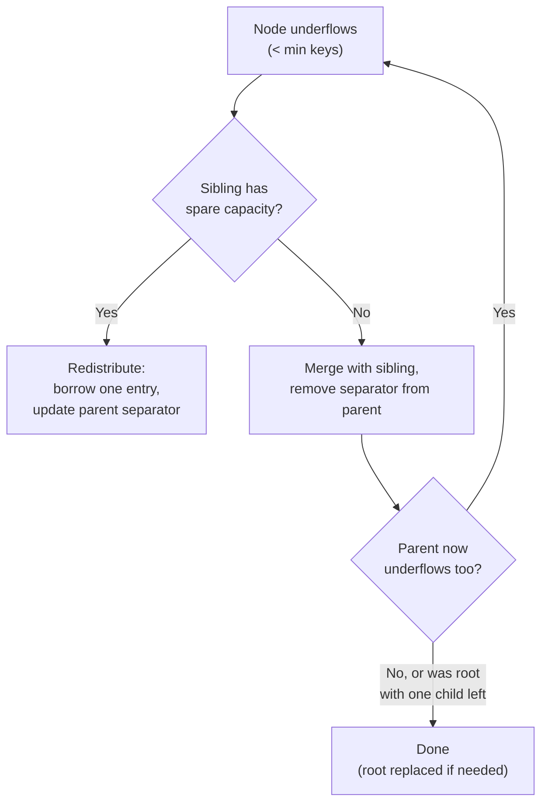

## Learning Objectives

- State the B+Tree deletion algorithm precisely: remove the key, then redistribute or merge if the node underflows.
- Explain why redistribution (borrowing from a sibling) is preferred over merging whenever a sibling has spare capacity.
- Trace a deletion sequence by hand that requires a merge, including one that propagates upward and shrinks the tree's height.
- Explain why the half-full invariant, not just "the key is gone," is what deletion has to preserve.

## Context & Motivation

Insertion, in the previous concept, only ever had to handle nodes getting *too full*. Deletion has the opposite problem: removing a key can leave a node with *too few* keys, violating the half-full invariant `b-plus-trees-structure-and-search` established as mandatory — not a nicety, but the exact property that keeps effective fanout, and therefore search cost, from silently degrading. Deletion has to actively repair that violation, and — mirroring insertion's local-first, propagate-only-if-needed structure — it does so with two mechanisms tried in a strict order: **redistribution** (borrow a key from a sibling that has room to spare) whenever possible, falling back to a **merge** (combine two siblings into one, removing the now-unneeded separator from the parent) only when no sibling can lend without underflowing itself.

## Core Theory

### The algorithm

To delete key `k`: find the leaf `L` containing it exactly as search would, and remove it from `L`'s sorted key list. If `L` still has at least `⌈m/2⌉ − 1` keys, deletion is done. If `L` has dropped below that minimum, first check `L`'s immediate sibling (left or right, whichever is adjacent in the parent): if that sibling has *more* than the minimum, **redistribute** — move one entry from the sibling into `L`, and update the separator key in the parent to reflect the new dividing point between them. If the sibling is itself already at the minimum and cannot lend without underflowing, **merge** `L` with that sibling instead — combine all their entries into a single node, and remove the now-unnecessary separator key from the parent. Removing a key from the parent during a merge can itself underflow the parent, in which case the exact same redistribute-or-merge decision repeats one level up — potentially all the way to the root, which is handled by a special rule: if the root ends up with only one child after a merge removes its last key, the root itself is deleted and that one remaining child becomes the new root, shrinking the tree's height by one.

## Worked Examples

All three examples continue directly from the tree built at the end of `b-plus-tree-insertion-and-splits`'s Example 3: root `= [35]`, left child (inner) `= [15,25]` with leaves `L1=[5,10]`, `L2=[15,20]`, `L3=[25,30]`, right child (inner) `= [45]` with leaves `L4=[35,40]`, `L5=[45,50]`. Minimum keys per non-root node (leaf or inner) is `⌈4/2⌉ − 1 = 1`.

### Example 1 — a deletion with no underflow at all

Delete `40` from `L4 = [35,40]`. Removing it leaves `L4 = [35]` — exactly 1 key, still at (not below) the minimum. No redistribution or merge is triggered; the tree's structure is otherwise completely unchanged.

### Example 2 — redistribution (borrowing from a sibling)

Delete `35` from `L4 = [35]`. Removing it leaves `L4 = []` — 0 keys, below the minimum of 1. `L4`'s only sibling under the same parent is `L5 = [45,50]`, which has 2 keys — one more than its own minimum, so it can lend without underflowing itself. **Redistribute**: move `L5`'s smallest key, `45`, into `L4`. Result: `L4 = [45]`, `L5 = [50]`. The parent's separator key between them (previously `45`, marking the boundary "less than 45 goes left") must be updated to reflect the new boundary — the right child's new smallest key, `50` — so the right inner node's key list becomes `[50]` in place of `[45]`.

### Example 3 — a merge that propagates upward and shrinks the tree's height

Continuing from Example 2, delete `50` from `L5 = [50]`. Removing it leaves `L5 = []` — underflow again. This time `L4 = [45]` is `L4`'s only sibling, and `L4` is already exactly at the minimum (1 key) — it cannot lend a key without underflowing itself. So instead of redistributing, **merge**: combine `L4` and (the now-empty) `L5` into a single leaf `[45]`, and remove the separator key between them (`50`) from their parent, the right inner node. That parent, which held only the single key `[50]` and two children, now holds `0` keys and only `1` child (the merged leaf) — an inner node with zero keys is itself in violation of the minimum, so the exact same repair logic applies one level up.

At the root level: the root is `[35]` with two children — the left inner node `[15,25]` (3 children: `L1, L2, L3`) and the now-underflowed right inner node (0 keys, 1 child). The left inner node has 2 keys, one more than its own minimum, so in principle it *could* lend — but merging here is simpler and, since the right side has shrunk to a single leaf, is the natural outcome: **merge** the two inner nodes into one, pulling the separating key down from the root (`35`) to sit between them: the merged inner node's keys become `[15, 25, 35]` (left node's keys, plus the pulled-down root key), with children `L1, L2, L3,` and the merged leaf `[45]` — 3 keys and 4 children, consistent with the invariant. The root now has 0 keys and exactly 1 child (this merged inner node). By the special root rule, the root itself is deleted, and its one remaining child — the merged inner node `[15,25,35]` — becomes the tree's new root. The tree's height has shrunk from 3 to 2, and every leaf (`L1=[5,10]`, `L2=[15,20]`, `L3=[25,30]`, merged leaf `[45]`) is still at identical depth, exactly as the balance invariant requires.

## Common Misconceptions & Pitfalls

- **"Merging is the default response to underflow."** Real implementations always try redistribution first, specifically because it's strictly cheaper — it touches only two leaves/nodes and one parent key, with no change in the tree's shape or height — while a merge additionally risks propagating an underflow upward through every ancestor, in the worst case all the way to a height-reducing root replacement, as Example 3 shows; merging is the fallback for when a sibling genuinely has no spare capacity to lend, not the first choice.
- **"An underflowed node with the wrong number of keys is fine as long as the key that was searched for is gone."** Deletion isn't just "remove the key and stop" — an unrepaired underflow silently degrades the tree's effective fanout at exactly the location where lookups will keep passing through, which is precisely the half-full invariant `b-plus-trees-structure-and-search` built specifically to prevent; a correct deletion implementation always checks and repairs the invariant, not just the presence or absence of one key.
- **"The root is a node like any other and needs to satisfy the same minimum-keys rule."** The root is explicitly exempt from the minimum-keys invariant (it's allowed to have as few as 1 key, or even 0 with a single child during a transient merge, right before that child replaces it) — the whole point of the special root-replacement rule in Example 3 is that shrinking the tree's height has to happen *somewhere*, and the root, having no parent to redistribute with, is exactly where that termination case is handled.

## Summary

B+Tree deletion removes the target key from its leaf and then actively repairs any resulting violation of the half-full invariant — preferring a cheap local redistribution (borrowing one entry from a sibling with spare capacity, adjusting the parent's separator key) whenever possible, and falling back to a merge (combining two siblings, removing their separator from the parent) only when no sibling can lend without underflowing itself. A merge can cascade upward exactly the way a split could cascade in the opposite direction during insertion, and in the extreme case — Example 3 — that cascade reaches the root itself, which is then deleted and replaced by its one remaining child, shrinking the tree's height by exactly one level while every leaf, old and new, stays at identical depth.

## Documentation Links

- [CMU 15-445/645 — Indexes & Filters II Slides](https://15445.courses.cs.cmu.edu/fall2025/slides/09-indexes2.pdf) — the source of this concept's deletion algorithm, including the redistribute-before-merge ordering and the root-shrinking special case traced in Example 3.
- [Database System Concepts (Silberschatz, Korth, Sudarshan) — Companion Site](https://www.db-book.com/) — the standard textbook treatment of B+Tree deletion, useful for cross-checking the redistribution and merge cases against a second worked presentation.
