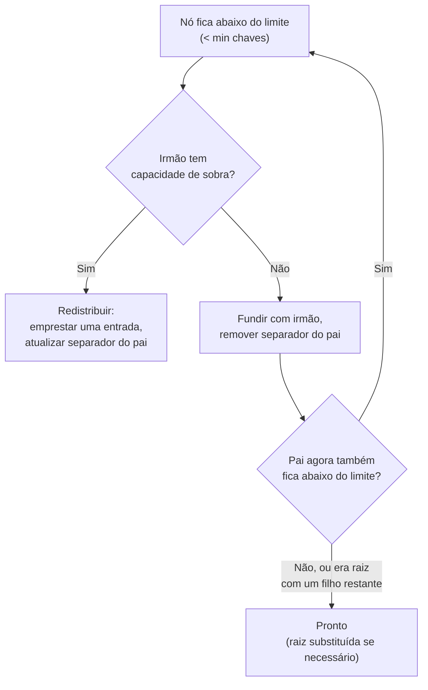

## Objetivos de Aprendizagem

- Enunciar o algoritmo de remoção da árvore B+ precisamente: remover a chave, depois redistribuir ou fundir se o nó ficar abaixo do limite.
- Explicar por que a redistribuição (emprestar de um irmão) é preferida à fusão sempre que um irmão tem capacidade de sobra.
- Rastrear à mão uma sequência de remoção que exige uma fusão, incluindo uma que se propaga para cima e encolhe a altura da árvore.
- Explicar por que o invariante meio-cheio, não apenas "a chave sumiu", é o que a remoção tem de preservar.

## Contexto e Motivação

A inserção, no conceito anterior, só jamais teve de lidar com nós ficando *cheios demais*. A remoção tem o problema oposto: remover uma chave pode deixar um nó com *poucas chaves demais*, violando o invariante meio-cheio que `b-plus-trees-structure-and-search` estabeleceu como obrigatório, não um detalhe elegante, mas a propriedade exata que impede o fanout efetivo, e portanto o custo de busca, de degradar silenciosamente. A remoção tem de reparar ativamente essa violação, e, espelhando a estrutura local-primeiro e propaga-só-se-necessário da inserção, ela o faz com dois mecanismos tentados numa ordem estrita: **redistribuição** (emprestar uma chave de um irmão que tem espaço de sobra) sempre que possível, recorrendo a uma **fusão** (combinar dois irmãos em um, removendo o separador agora desnecessário do pai) apenas quando nenhum irmão pode emprestar sem ficar abaixo do limite ele mesmo.

## Teoria Central

### O algoritmo

Para remover a chave `k`: encontrar a folha `L` que a contém exatamente como a busca faria, e removê-la da lista ordenada de chaves de `L`. Se `L` ainda tiver pelo menos `⌈m/2⌉ − 1` chaves, a remoção está pronta. Se `L` tiver caído abaixo desse mínimo, primeiro verificar o irmão imediato de `L` (esquerdo ou direito, qualquer que seja adjacente no pai): se esse irmão tiver *mais* que o mínimo, **redistribuir**: mover uma entrada do irmão para `L`, e atualizar a chave separadora no pai para refletir o novo ponto de divisão entre eles. Se o irmão já estiver ele mesmo no mínimo e não puder emprestar sem ficar abaixo do limite, **fundir** `L` com esse irmão em vez disso: combinar todas as suas entradas em um único nó, e remover a chave separadora agora desnecessária do pai. Remover uma chave do pai durante uma fusão pode ele mesmo levar o pai abaixo do limite, caso em que a exata mesma decisão redistribuir-ou-fundir se repete um nível acima, potencialmente até a raiz, o que é tratado por uma regra especial: se a raiz acaba com apenas um filho depois de uma fusão remover sua última chave, a própria raiz é removida e esse único filho restante torna-se a nova raiz, encolhendo a altura da árvore em um.

## Exemplos Resolvidos

Todos os três exemplos continuam diretamente da árvore construída ao final do Exemplo 3 de `b-plus-tree-insertion-and-splits`: raiz `= [35]`, filho esquerdo (interno) `= [15,25]` com folhas `L1=[5,10]`, `L2=[15,20]`, `L3=[25,30]`, filho direito (interno) `= [45]` com folhas `L4=[35,40]`, `L5=[45,50]`. O mínimo de chaves por nó não-raiz (folha ou interno) é `⌈4/2⌉ − 1 = 1`.

### Exemplo 1: uma remoção sem nenhum déficit

Remover `40` de `L4 = [35,40]`. Removê-la deixa `L4 = [35]`, exatamente 1 chave, ainda no (não abaixo do) mínimo. Nenhuma redistribuição ou fusão é disparada; a estrutura da árvore fica de resto completamente inalterada.

### Exemplo 2: redistribuição (emprestando de um irmão)

Remover `35` de `L4 = [35]`. Removê-la deixa `L4 = []`, 0 chaves, abaixo do mínimo de 1. O único irmão de `L4` sob o mesmo pai é `L5 = [45,50]`, que tem 2 chaves, uma a mais que seu próprio mínimo, então pode emprestar sem ficar abaixo do limite ele mesmo. **Redistribuir**: mover a menor chave de `L5`, `45`, para `L4`. Resultado: `L4 = [45]`, `L5 = [50]`. A chave separadora do pai entre eles (anteriormente `45`, marcando a fronteira "menor que 45 vai para a esquerda") deve ser atualizada para refletir a nova fronteira, a nova menor chave do filho direito, `50`, de modo que a lista de chaves do nó interno direito torna-se `[50]` no lugar de `[45]`.

### Exemplo 3: uma fusão que se propaga para cima e encolhe a altura da árvore

Continuando do Exemplo 2, remover `50` de `L5 = [50]`. Removê-la deixa `L5 = []`, déficit de novo. Desta vez `L4 = [45]` é o único irmão de `L4`, e `L4` já está exatamente no mínimo (1 chave): ele não pode emprestar uma chave sem ficar abaixo do limite ele mesmo. Então, em vez de redistribuir, **fundir**: combinar `L4` e (a agora vazia) `L5` numa única folha `[45]`, e remover a chave separadora entre elas (`50`) de seu pai, o nó interno direito. Esse pai, que continha apenas a única chave `[50]` e dois filhos, agora contém `0` chaves e apenas `1` filho (a folha fundida): um nó interno com zero chaves está ele mesmo em violação do mínimo, então a exata mesma lógica de reparo se aplica um nível acima.

No nível da raiz: a raiz é `[35]` com dois filhos, o nó interno esquerdo `[15,25]` (3 filhos: `L1, L2, L3`) e o nó interno direito agora abaixo do limite (0 chaves, 1 filho). O nó interno esquerdo tem 2 chaves, uma a mais que seu próprio mínimo, então em princípio *poderia* emprestar, mas fundir aqui é mais simples e, já que o lado direito encolheu a uma única folha, é o resultado natural: **fundir** os dois nós internos em um, puxando a chave separadora para baixo da raiz (`35`) para ficar entre eles: as chaves do nó interno fundido tornam-se `[15, 25, 35]` (chaves do nó esquerdo, mais a chave da raiz puxada para baixo), com filhos `L1, L2, L3,` e a folha fundida `[45]`, 3 chaves e 4 filhos, consistente com o invariante. A raiz agora tem 0 chaves e exatamente 1 filho (este nó interno fundido). Pela regra especial da raiz, a própria raiz é removida, e seu único filho restante, o nó interno fundido `[15,25,35]`, torna-se a nova raiz da árvore. A altura da árvore encolheu de 3 para 2, e toda folha (`L1=[5,10]`, `L2=[15,20]`, `L3=[25,30]`, folha fundida `[45]`) ainda está em profundidade idêntica, exatamente como o invariante de balanceamento exige.

## Equívocos Comuns e Armadilhas

- **"Fundir é a resposta padrão ao déficit."** Implementações reais sempre tentam redistribuição primeiro, especificamente porque é estritamente mais barata, ela toca apenas duas folhas/nós e uma chave do pai, sem mudança na forma ou altura da árvore, enquanto uma fusão adicionalmente arrisca propagar um déficit para cima por todo ancestral, no pior caso até uma substituição de raiz que reduz a altura, como o Exemplo 3 mostra; fundir é o recurso para quando um irmão genuinamente não tem capacidade de sobra para emprestar, não a primeira escolha.
- **"Um nó abaixo do limite com o número errado de chaves está bem desde que a chave buscada tenha sumido."** A remoção não é apenas "remover a chave e parar": um déficit não reparado degrada silenciosamente o fanout efetivo da árvore exatamente no local por onde as buscas continuarão passando, o que é precisamente o invariante meio-cheio que `b-plus-trees-structure-and-search` construiu especificamente para prevenir; uma implementação correta de remoção sempre verifica e repara o invariante, não apenas a presença ou ausência de uma chave.
- **"A raiz é um nó como qualquer outro e precisa satisfazer a mesma regra de mínimo de chaves."** A raiz é explicitamente isenta do invariante de mínimo de chaves (ela pode ter tão poucas quanto 1 chave, ou mesmo 0 com um único filho durante uma fusão transitória, logo antes de esse filho substituí-la): o ponto inteiro da regra especial de substituição de raiz no Exemplo 3 é que encolher a altura da árvore tem de acontecer em *algum lugar*, e a raiz, não tendo pai com quem redistribuir, é exatamente onde esse caso de terminação é tratado.

## Resumo

A remoção na árvore B+ remove a chave alvo de sua folha e então repara ativamente qualquer violação resultante do invariante meio-cheio, preferindo uma redistribuição local barata (emprestar uma entrada de um irmão com capacidade de sobra, ajustando a chave separadora do pai) sempre que possível, e recorrendo a uma fusão (combinar dois irmãos, removendo seu separador do pai) apenas quando nenhum irmão pode emprestar sem ficar abaixo do limite ele mesmo. Uma fusão pode cascatear para cima exatamente da maneira que uma divisão poderia cascatear na direção oposta durante a inserção, e no caso extremo, o Exemplo 3, essa cascata alcança a própria raiz, que é então removida e substituída por seu único filho restante, encolhendo a altura da árvore em exatamente um nível enquanto toda folha, velha e nova, permanece em profundidade idêntica.

## Documentation Links

- [CMU 15-445/645: Indexes & Filters II Slides](https://15445.courses.cs.cmu.edu/fall2025/slides/09-indexes2.pdf): a fonte do algoritmo de remoção deste conceito, incluindo a ordenação redistribuir-antes-de-fundir e o caso especial de encolhimento da raiz rastreado no Exemplo 3.
- [Database System Concepts (Silberschatz, Korth, Sudarshan): Companion Site](https://www.db-book.com/): o tratamento padrão de livro-texto da remoção em árvore B+, útil para verificar os casos de redistribuição e fusão contra uma segunda apresentação resolvida.