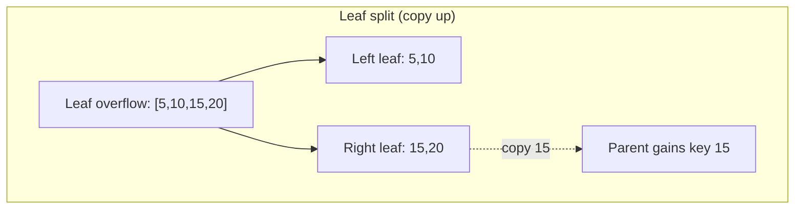

## Learning Objectives

- State the B+Tree insertion algorithm precisely: find the leaf, insert in sorted order, split if overflowing.
- Distinguish "copy up" (leaf split) from "push up" (inner-node split) and explain why the two cases differ.
- Trace a complete sequence of insertions into a small real B+Tree by hand, including both kinds of split.
- Explain why a split never needs to touch more than one root-to-leaf path, keeping insertion cost logarithmic.

## Context & Motivation

The previous concept fixed the B+Tree's target shape — perfectly balanced, every node at least half-full, all data at the leaves — but said nothing about how that shape survives an actual insertion. This concept builds exactly that: the algorithm that inserts a new key while never leaving the tree in a state that violates any of the three invariants, even temporarily persisted to disk. The key design idea, and the reason a B+Tree never needs the kind of tree-wide rebalancing operation a naive unbalanced BST insertion could require, is that a **split only ever affects nodes along a single root-to-leaf path** — an insertion that overflows a leaf fixes that leaf locally, and only propagates upward if the fix itself causes the parent to overflow too, one level at a time.

## Core Theory

### The algorithm

To insert a key `k`: find the correct leaf `L` by descending the tree exactly as in a search. Insert `k` into `L`'s sorted list of keys. If `L` still has at most `m − 1` keys, the insertion is done — no other node is touched. If `L` now has `m` keys (one too many), **split** `L` into two leaves, redistributing its `m` keys evenly across them, and insert a new separator entry pointing at the new right leaf into `L`'s parent. If that insertion into the parent itself causes the parent to overflow, the same split logic repeats one level up — and so on, potentially all the way to the root, in which case the tree gains one new level (a brand-new root) and grows taller by exactly one for the first time since its creation.

### Copy up vs. push up

The split logic differs subtly between leaves and inner nodes, for a reason directly tied to the previous concept's invariant that data lives only in leaves:

- **Leaf split**: redistribute the leaf's keys evenly between the original leaf and a new sibling leaf, then **copy** the first key of the new right leaf up into the parent as a separator — copy, not move, because that key must still physically exist in the leaf (it's real data, still needed there for lookups and the leaf chain), even though a duplicate of its value now also lives in the parent purely as a routing signpost.
- **Inner-node split**: redistribute the node's keys evenly between it and a new sibling inner node, then **push** the middle key up into the parent — push, not copy, because inner-node keys carry no data of their own, only routing information, so once a key's routing job is handed to the parent there is no reason to keep a redundant copy in the child.

## Worked Examples

The following trace uses fanout `m = 4` (maximum 3 keys per node, minimum 1 key per non-root node) and inserts keys `5, 10, 15, 20, 25, 30, 35, 40, 45, 50` one at a time into an initially empty tree.

### Example 1 — building up to the first leaf split

Inserting `5, 10, 15` fills the (currently single, root-as-leaf) node to exactly `[5, 10, 15]` — 3 keys, at the maximum, but not yet overflowing. Inserting `20` overflows it to `[5, 10, 15, 20]` (4 keys). **Split**: redistribute evenly into left leaf `L1 = [5, 10]` and right leaf `L2 = [15, 20]`, then copy the first key of `L2` (which is `15`) up to form a brand-new root. Result: root (inner) `= [15]`, with children `L1 = [5,10]` and `L2 = [15,20]` — the tree has grown from a single leaf to height 2.

### Example 2 — a second and third leaf split, root absorbing new separators

Inserting `25` lands in `L2` (`25 ≥ 15`): `L2 = [15, 20, 25]`, at the maximum, no split. Inserting `30` overflows `L2` to `[15,20,25,30]`; split into `L2 = [15,20]` and a new `L3 = [25,30]`, copying `25` up. The root absorbs this new separator directly (it currently has only 1 key, well under its own maximum of 3): root `= [15, 25]`, children `[L1, L2, L3]`. Continuing the same pattern, inserting `35` fills `L3` to `[25,30,35]` (no split), and inserting `40` overflows `L3` to `[25,30,35,40]`; split into `L3=[25,30]` and new `L4=[35,40]`, copying `35` up. The root absorbs this too: root `= [15, 25, 35]`, children `[L1,L2,L3,L4]` — the root now has exactly 3 keys, at its own maximum, with no overflow yet, but no room left to absorb another separator without splitting itself.

### Example 3 — an inner-node split (push up), root grows a new root

Inserting `45` fills `L4` to `[35,40,45]` (no split). Inserting `50` overflows `L4` to `[35,40,45,50]`; split into `L4 = [35,40]` and new `L5 = [45,50]`, copying `45` up — but the root, currently `[15,25,35]`, is already at its 3-key maximum, so inserting `45` overflows *it* too, conceptually to `[15,25,35,45]` with children `[L1,L2,L3,L4,L5]`. This time it's an **inner-node split**: redistribute the 4 keys evenly — left inner node keeps `[15,25]` with children `[L1,L2,L3]`, right inner node keeps `[45]` with children `[L4,L5]` — and **push** the middle key `35` up to form a brand-new root, rather than copying it (there is no leaf-level data associated with `35` to preserve a copy of; its only job was ever routing). Final structure: root `= [35]`, left child (inner) `= [15,25]` → `[L1,L2,L3]`, right child (inner) `= [45]` → `[L4,L5]` — the tree has grown to height 3, and every leaf is still at identical depth, exactly as the balance invariant requires.

## Common Misconceptions & Pitfalls

- **"A split rebalances the whole tree, like a rotation cascading through an AVL tree."** A B+Tree split only ever touches nodes on the single root-to-leaf path being inserted into — Example 3's inner-node split touched the overflowing leaf, its parent, and nothing else; the other three leaves (`L1`, `L2`, `L3`, unaffected siblings) and their positions in the tree were never examined or modified, unlike a rotation which inspects ancestor balance factors along the path but can restructure pointers at each one it touches.
- **"The tree grows a new root on every split."** Only a split that reaches the *current* root (because every ancestor on the path was already full) creates a new root and increases height; the far more common case — Example 2's two leaf splits — stops as soon as it reaches a parent with spare capacity, leaving the tree's height unchanged.
- **"Copy up and push up are just two names for the same operation."** They differ in a way that matters for correctness, not just terminology: a leaf split's copied-up key must remain in the leaf (it's real, queryable data, and the leaf chain depends on every leaf holding its own full complement of keys), while an inner-node split's pushed-up key is *removed* from both children entirely, since inner nodes never store data, only routing keys, and keeping a stale duplicate there would serve no purpose and waste space.

## Summary

B+Tree insertion finds the target leaf exactly as search would, inserts the new key in sorted order, and — only if that overflows the leaf's capacity — splits it into two, propagating a new separator key upward one level at a time until some ancestor has spare room, or, in the worst case, all the way to a brand-new root. Leaf splits copy their separator key up (since it's still real leaf data), while inner-node splits push it up (since inner-node keys carry no data to preserve), and because a split only ever touches one root-to-leaf path, insertion cost stays exactly the O(logₘ n) the previous concept's balance guarantee promised — never degrading into anything resembling a whole-tree rebalance.

## Documentation Links

- [CMU 15-445/645 — Indexes & Filters I Slides](https://15445.courses.cs.cmu.edu/fall2025/slides/08-indexes1.pdf) — covers the B+Tree invariants this concept's split algorithm is built to preserve, carried over from the structure-and-search concept.
- [CMU 15-445/645 — Indexes & Filters II Slides](https://15445.courses.cs.cmu.edu/fall2025/slides/09-indexes2.pdf) — the source of this concept's insertion algorithm itself, including the copy-up (leaf split) vs. push-up (inner-node split) distinction worked through in the examples.
