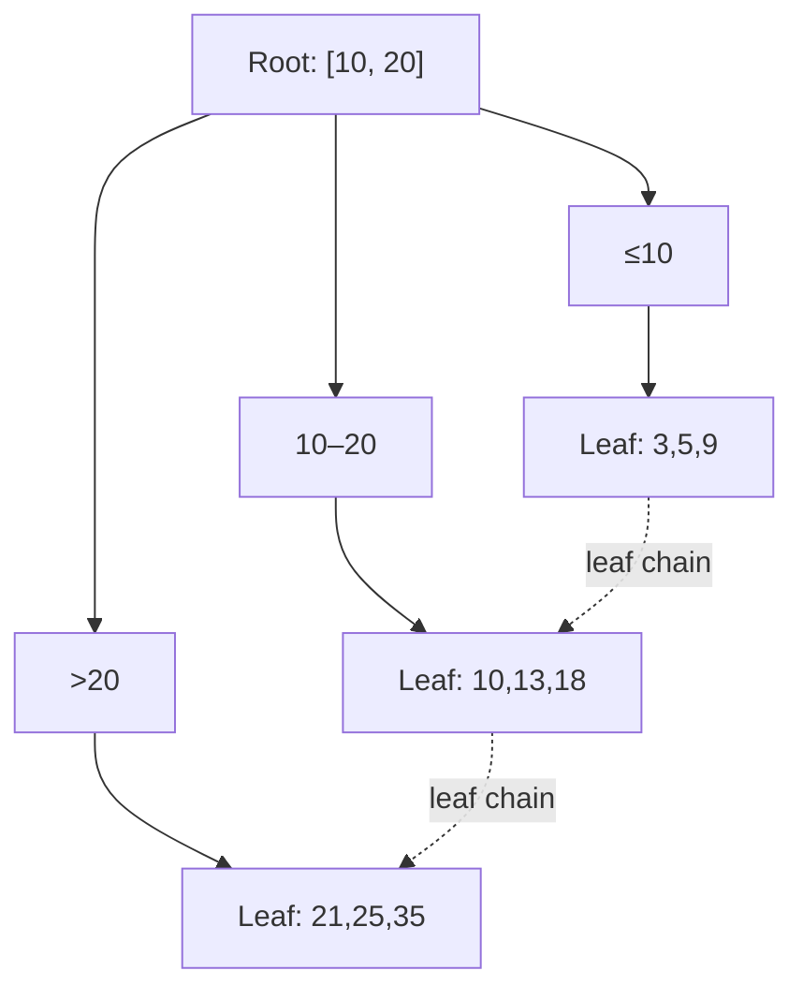

## Learning Objectives

- State the B+Tree's structural invariants precisely: perfect leaf-depth balance, half-full nodes, and the parent-key/child-pointer relationship.
- Explain why fanout — not height alone — is the design parameter that matters for a disk-resident tree.
- Trace a search from root to leaf by hand on a small concrete B+Tree.
- Connect the B+Tree's balance guarantee to the balance-invariant idea already proved necessary for binary search trees.

## Context & Motivation

`foundations/data-structures-i`'s `bst-performance-and-balance` already established the core problem: an unbalanced binary search tree can degrade to O(n) height, and even a *balanced* binary tree's height is O(log₂n) — for a million tuples, roughly 20 levels. `algorithms-software/data-structures-ii` then built two real fixes for a binary tree specifically: `avl-trees-the-balance-invariant` enforces a strict per-node balance factor via rotations, and `red-black-trees` enforces a looser but cheaper-to-maintain coloring invariant — both keep height at O(log₂n) by an explicit, provable structural rule, not by hoping insertions happen to arrive in a good order.

A disk-resident index has an additional, sharper problem that neither AVL trees nor red-black trees were designed to solve: every level of tree descended is a separate page fetched through the buffer pool, and a page fetch that misses the buffer pool costs a real disk I/O — many orders of magnitude slower than an in-memory pointer comparison. Twenty levels of binary comparisons collapsed into twenty *disk I/Os* per lookup would make an index barely faster than the sequential scan it's meant to replace. The **B+Tree** solves this not by inventing a new balance invariant from scratch, but by generalizing the same balance-invariant idea `avl-trees-the-balance-invariant` and `red-black-trees` already proved necessary — from a *binary* tree (2-way branching) to an *m-way* tree, where `m` (the fanout) is chosen specifically to make one tree level fit in exactly one disk page.

## Core Theory

### Structural definition

A **B+Tree** is a self-balancing, ordered m-way tree supporting search, sequential access, insertion, and deletion in O(logₘ n), where `m` is the tree's fanout (maximum number of children per node) and `n` is the number of keys stored. It satisfies three invariants, enforced at every insertion and deletion (built in the next two concepts):

- **Perfect balance** — every leaf node sits at exactly the same depth. Unlike an AVL tree's *bounded* imbalance (heights of the two subtrees of any node differ by at most one), a B+Tree allows *zero* imbalance between leaves by design, achieved by growing the tree's height only from the root, never from an individual leaf.
- **Half-full nodes** — with fanout `m`, every node except the root holds between `⌈m/2⌉ − 1` and `m − 1` keys, and every inner node with `k` keys has exactly `k + 1` non-null children. This is the direct m-way generalization of a binary tree needing at least one key per non-empty node — a B+Tree additionally guarantees no node is ever *sparsely* populated, which is exactly what keeps height logarithmic in `m` rather than in 2.
- **All data at the leaves** — inner nodes hold only separator keys and child pointers, used purely to route a search toward the correct leaf; the actual index entries (key + pointer to the tuple's location) live only in the leaf nodes, which are additionally linked together in a chain (leaf-to-leaf pointers) supporting fast ordered sequential access without re-traversing the tree — exactly what a range query needs, and exactly what a hash index, built in the previous concept, cannot provide at all.

### Fanout is the whole point

The reason a B+Tree, not an AVL tree, is the canonical disk index structure is entirely about the constant `m`. With fanout chosen so one node fills exactly one disk page (commonly `m` in the hundreds, since a page can hold many small key+pointer entries), a B+Tree over a billion keys needs only `log_m(10⁹)` levels — with `m = 200`, that's under 4 levels, meaning under 4 page I/Os to find any key. The same billion keys in a binary tree (`m = 2`) would need roughly 30 levels — 30 page I/Os in the worst case if each node lives on its own page. Balance alone (what AVL/red-black trees guarantee) bounds height *in terms of the number of keys*; fanout is the separate, additional lever a disk-aware tree pulls to make each level itself cost as little as possible, by cramming as much branching as possible into the one page each level fetch already has to pay for.

### Searching a B+Tree

A search for key `k` starts at the root and, at each inner node, compares `k` against the node's separator keys to choose exactly one child pointer to follow — the same binary-search-style comparison already used to navigate a BST, just choosing among `m` children per step instead of 2 — repeating until a leaf is reached, at which point the leaf's entries are scanned directly for `k`. Because every leaf sits at identical depth, this search always takes exactly `⌈log_m n⌉` page fetches, with no worst case that differs from the average case the way an unbalanced BST's search could.

## Worked Examples

### Example 1 — searching a small real B+Tree

Using the tree in the diagram above: search for key `18`. At the root `[10, 20]`, `18` falls in the range `10 ≤ 18 < 20`, so follow the middle child B. At leaf B `{10, 13, 18}`, scan directly and find `18` — two page fetches total (root, then leaf B), regardless of how many total keys exist below the other two children.

### Example 2 — a range query using the leaf chain

Search for all keys in `[13, 25]`: descend to the leaf holding the smallest matching key (`13`, in leaf B), then instead of returning to the root, follow leaf B's forward pointer directly to leaf C, reading `18, 21, 25` in order without ever touching an inner node again. This sequential leaf-chain traversal is exactly the operation a hash index has no equivalent for — order among keys was never preserved by a hash function, but a B+Tree's leaves are ordered by construction.

### Example 3 — fanout's effect on real height

Comparing two B+Trees over the same 1,000,000 keys: with fanout `m = 4` (an artificially small value, closer to a binary tree), height is `⌈log₄(1,000,000)⌉ = 10` levels — 10 page fetches per lookup. With a realistic fanout `m = 200` (hundreds of small key+pointer entries per page), height is `⌈log₂₀₀(1,000,000)⌉ = 3` levels — a search that costs 10 page I/Os with small fanout costs only 3 with realistic fanout, over the exact same data, which is the entire engineering reason B+Trees are built with a fanout chosen from the real page size rather than an arbitrary small constant.

## Common Misconceptions & Pitfalls

- **"A B+Tree is just a B-Tree with a different name."** A B-Tree stores data (key + record pointer, or the record itself) in *inner* nodes as well as leaves, while a B+Tree stores data *only* in leaves, with inner nodes holding pure routing keys — a small-sounding difference that has a large practical consequence: a B+Tree's uniform, data-free inner nodes pack far more separator keys per page (higher fanout) than a B-Tree's inner nodes would, and the linked leaf chain a B+Tree adds is exactly what makes range scans and sequential access fast — B-Trees have neither advantage, which is why B+Trees, not B-Trees, are what virtually every real relational DBMS actually implements despite "B-Tree" remaining the more commonly heard name.
- **"Balance alone explains why B+Trees are fast on disk."** Balance (guaranteeing O(logₘ n) height) is necessary but not sufficient — an AVL tree is just as rigorously balanced and would still need one disk I/O per level with fanout 2; the actual disk-performance win is the *combination* of balance and a large, page-sized fanout, and either one alone (balanced-but-binary, or wide-but-unbalanced) leaves most of the benefit on the table.
- **"The half-full invariant is just an efficiency nicety."** The half-full guarantee (every non-root node has at least `⌈m/2⌉ − 1` keys) is what bounds the tree's height from *below* as well as above — without it, an adversarial sequence of deletions could leave the tree with mostly near-empty nodes, silently degrading effective fanout toward 1 and losing the entire disk-I/O advantage this concept exists to provide, which is exactly why the deletion concept two steps ahead treats maintaining this invariant as mandatory, not optional.

## Summary

A B+Tree generalizes the same balance-invariant idea `avl-trees-the-balance-invariant` and `red-black-trees` already proved necessary for binary search trees — from 2-way to m-way branching — specifically to solve a problem those binary structures were never designed for: making each level of the tree cost exactly one disk page fetch, with fanout `m` chosen to match the page size so that even a billion-key index needs only a handful of levels. Its three invariants — perfect leaf-depth balance, every non-root node at least half-full, and all data confined to leaves linked in a chain for fast ordered access — together guarantee O(logₘ n) search, insertion, and deletion, and set up exactly the mechanics the next two concepts (insertion with splits, deletion with merges) have to preserve under every possible update.

## Documentation Links

- [CMU 15-445/645 — Indexes & Filters I Slides](https://15445.courses.cs.cmu.edu/fall2025/slides/08-indexes1.pdf) — the source of this concept's B+Tree structural invariants (perfect leaf balance, half-full nodes, data-only-at-leaves) and the fanout-vs-disk-page reasoning worked through here.
- [Database System Concepts (Silberschatz, Korth, Sudarshan) — Companion Site](https://www.db-book.com/) — the standard textbook reference for B+Tree definitions and the search algorithm, useful for cross-checking the invariants and root-to-leaf traversal described in this concept.
