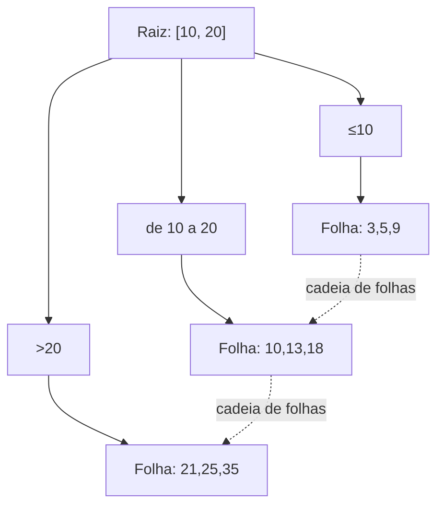

## Objetivos de Aprendizagem

- Enunciar com precisão os invariantes estruturais da B+Tree: balanceamento perfeito da profundidade das folhas, nós meio cheios e a relação entre chave do pai e ponteiro para o filho.
- Explicar por que o fanout (e não só a altura) é o parâmetro de projeto que importa para uma árvore residente em disco.
- Rastrear à mão uma busca da raiz até a folha numa B+Tree pequena e concreta.
- Conectar a garantia de balanceamento da B+Tree à ideia de invariante de balanceamento já provada necessária para árvores binárias de busca.

## Contexto e Motivação

`bst-performance-and-balance`, de `foundations/data-structures-i`, já estabeleceu o problema central: uma árvore binária de busca desbalanceada pode se degradar para altura O(n), e mesmo a altura de uma árvore binária *balanceada* é O(log₂n), para um milhão de tuplas, aproximadamente 20 níveis. `algorithms-software/data-structures-ii` então construiu duas correções reais especificamente para uma árvore binária: `avl-trees-the-balance-invariant` impõe um fator de balanceamento estrito por nó via rotações, e `red-black-trees` impõe um invariante de coloração mais frouxo, porém mais barato de manter. Os dois mantêm a altura em O(log₂n) por uma regra estrutural explícita e demonstrável, e não torcendo para que as inserções calhem de chegar numa boa ordem.

Um índice residente em disco tem um problema adicional, mais agudo, que nem as árvores AVL nem as árvores rubro-negras foram projetadas para resolver: cada nível da árvore descido é uma página separada buscada pelo buffer pool, e uma busca de página que erra o buffer pool custa uma E/S de disco real, muitas ordens de grandeza mais lenta que uma comparação de ponteiro em memória. Vinte níveis de comparações binárias transformados em vinte *E/Ss de disco* por busca deixariam um índice pouco mais rápido que a varredura sequencial que ele deveria substituir. A **B+Tree** resolve isso não inventando um invariante de balanceamento novo do zero, mas generalizando a mesma ideia de invariante de balanceamento que `avl-trees-the-balance-invariant` e `red-black-trees` já provaram ser necessária: de uma árvore *binária* (ramificação de 2 vias) para uma árvore *m-ária*, onde `m` (o fanout) é escolhido especificamente para fazer um nível da árvore caber em exatamente uma página de disco.

## Teoria Central

### Definição estrutural

Uma **B+Tree** é uma árvore m-ária ordenada e autobalanceada que suporta busca, acesso sequencial, inserção e remoção em O(logₘ n), onde `m` é o fanout da árvore (número máximo de filhos por nó) e `n` é o número de chaves armazenadas. Ela satisfaz três invariantes, impostos a cada inserção e remoção (construídas nos próximos dois conceitos):

- **Balanceamento perfeito**: todo nó folha fica exatamente na mesma profundidade. Diferente do desbalanceamento *limitado* de uma árvore AVL (as alturas das duas subárvores de qualquer nó diferem em no máximo um), uma B+Tree permite *zero* desbalanceamento entre folhas por projeto, alcançado fazendo a altura da árvore crescer só a partir da raiz, nunca a partir de uma folha individual.
- **Nós meio cheios**: com fanout `m`, todo nó exceto a raiz guarda entre `⌈m/2⌉ − 1` e `m − 1` chaves, e todo nó interno com `k` chaves tem exatamente `k + 1` filhos não nulos. Esta é a generalização m-ária direta de uma árvore binária precisar de pelo menos uma chave por nó não vazio; uma B+Tree adicionalmente garante que nenhum nó jamais fica *esparsamente* povoado, que é exatamente o que mantém a altura logarítmica em `m`, e não em 2.
- **Todos os dados nas folhas**: os nós internos guardam só chaves separadoras e ponteiros para filhos, usados puramente para encaminhar uma busca em direção à folha correta; as entradas de índice de fato (chave + ponteiro para a localização da tupla) vivem só nos nós folha, que são adicionalmente ligados numa cadeia (ponteiros de folha para folha) que suporta acesso sequencial ordenado rápido sem percorrer a árvore de novo, exatamente o que uma consulta por intervalo precisa, e exatamente o que um índice hash, construído no conceito anterior, não consegue fornecer de forma alguma.

### O fanout é todo o ponto

A razão de uma B+Tree, e não uma árvore AVL, ser a estrutura de índice em disco canônica tem tudo a ver com a constante `m`. Com o fanout escolhido para que um nó preencha exatamente uma página de disco (comumente `m` na casa das centenas, já que uma página consegue guardar muitas entradas pequenas de chave+ponteiro), uma B+Tree sobre um bilhão de chaves precisa de apenas `log_m(10⁹)` níveis; com `m = 200`, isso fica abaixo de 4 níveis, o que significa menos de 4 E/Ss de página para encontrar qualquer chave. O mesmo bilhão de chaves numa árvore binária (`m = 2`) precisaria de aproximadamente 30 níveis: 30 E/Ss de página no pior caso, se cada nó viver na sua própria página. O balanceamento sozinho (o que as árvores AVL/rubro-negras garantem) limita a altura *em termos do número de chaves*; o fanout é a alavanca separada e adicional que uma árvore ciente do disco puxa para fazer cada nível em si custar o mínimo possível, enfiando a maior ramificação possível na única página que a busca de cada nível já precisa pagar.

### Buscando numa B+Tree

Uma busca pela chave `k` começa na raiz e, em cada nó interno, compara `k` com as chaves separadoras do nó para escolher exatamente um ponteiro de filho a seguir (a mesma comparação no estilo busca binária já usada para navegar uma BST, só que escolhendo entre `m` filhos por passo em vez de 2), repetindo até alcançar uma folha, ponto em que as entradas da folha são varridas diretamente atrás de `k`. Como toda folha fica na mesma profundidade, esta busca sempre leva exatamente `⌈log_m n⌉` buscas de página, sem nenhum pior caso que difira do caso médio, como a busca numa BST desbalanceada poderia ter.

## Exemplos Resolvidos

### Exemplo 1: buscando numa B+Tree real pequena

Usando a árvore do diagrama acima: busque a chave `18`. Na raiz `[10, 20]`, `18` cai no intervalo `10 ≤ 18 < 20`, então siga o filho do meio, B. Na folha B `{10, 13, 18}`, varra diretamente e encontre `18`: duas buscas de página no total (a raiz, depois a folha B), não importa quantas chaves existam no total abaixo dos outros dois filhos.

### Exemplo 2: uma consulta por intervalo usando a cadeia de folhas

Busque todas as chaves em `[13, 25]`: desça até a folha que guarda a menor chave correspondente (`13`, na folha B) e então, em vez de voltar à raiz, siga o ponteiro para frente da folha B diretamente até a folha C, lendo `18, 21, 25` em ordem sem jamais tocar um nó interno de novo. Esta travessia sequencial pela cadeia de folhas é exatamente a operação para a qual um índice hash não tem equivalente: a ordem entre as chaves nunca foi preservada por uma função hash, mas as folhas de uma B+Tree são ordenadas por construção.

### Exemplo 3: o efeito do fanout na altura real

Comparando duas B+Trees sobre o mesmo 1.000.000 de chaves: com fanout `m = 4` (um valor artificialmente pequeno, mais próximo de uma árvore binária), a altura é `⌈log₄(1.000.000)⌉ = 10` níveis, 10 buscas de página por busca. Com um fanout realista `m = 200` (centenas de pequenas entradas de chave+ponteiro por página), a altura é `⌈log₂₀₀(1.000.000)⌉ = 3` níveis. Uma busca que custa 10 E/Ss de página com fanout pequeno custa só 3 com fanout realista, sobre exatamente os mesmos dados, que é toda a razão de engenharia pela qual B+Trees são construídas com um fanout escolhido a partir do tamanho real da página, e não de uma constante pequena arbitrária.

## Equívocos Comuns e Armadilhas

- **"Uma B+Tree é só uma B-Tree com outro nome."** Uma B-Tree guarda dados (chave + ponteiro para o registro, ou o próprio registro) nos nós *internos* além das folhas, enquanto uma B+Tree guarda dados *só* nas folhas, com nós internos guardando chaves de roteamento puras. É uma diferença que soa pequena, mas que tem uma grande consequência prática: os nós internos uniformes e sem dados de uma B+Tree empacotam muito mais chaves separadoras por página (fanout maior) do que os nós internos de uma B-Tree empacotariam, e a cadeia de folhas ligadas que uma B+Tree acrescenta é exatamente o que torna rápidas as varreduras por intervalo e o acesso sequencial. As B-Trees não têm nenhuma das duas vantagens, e é por isso que as B+Trees, e não as B-Trees, são o que praticamente todo SGBD relacional real de fato implementa, apesar de "B-Tree" continuar sendo o nome mais ouvido.
- **"O balanceamento sozinho explica por que as B+Trees são rápidas em disco."** O balanceamento (garantir altura O(logₘ n)) é necessário, mas não suficiente: uma árvore AVL é tão rigorosamente balanceada quanto e ainda precisaria de uma E/S de disco por nível com fanout 2. O ganho de desempenho em disco de fato é a *combinação* de balanceamento com um fanout grande, do tamanho de uma página, e qualquer um dos dois sozinho (balanceada mas binária, ou larga mas desbalanceada) deixa a maior parte do benefício na mesa.
- **"O invariante de meio cheio é só um detalhe de eficiência."** A garantia de meio cheio (todo nó que não é raiz tem pelo menos `⌈m/2⌉ − 1` chaves) é o que limita a altura da árvore *por baixo*, além de por cima. Sem ela, uma sequência adversarial de remoções poderia deixar a árvore com nós em sua maioria quase vazios, degradando silenciosamente o fanout efetivo em direção a 1 e perdendo toda a vantagem de E/S de disco que este conceito existe para fornecer, e é exatamente por isso que o conceito de remoção, dois passos adiante, trata manter este invariante como obrigatório, e não opcional.

## Resumo

Uma B+Tree generaliza a mesma ideia de invariante de balanceamento que `avl-trees-the-balance-invariant` e `red-black-trees` já provaram ser necessária para árvores binárias de busca (de ramificação de 2 vias para m vias) especificamente para resolver um problema para o qual essas estruturas binárias nunca foram projetadas: fazer cada nível da árvore custar exatamente uma busca de página de disco, com o fanout `m` escolhido para casar com o tamanho da página, de modo que até um índice de um bilhão de chaves precise de só um punhado de níveis. Os seus três invariantes (balanceamento perfeito da profundidade das folhas, todo nó que não é raiz pelo menos meio cheio e todos os dados confinados às folhas, ligadas numa cadeia para acesso ordenado rápido) juntos garantem busca, inserção e remoção em O(logₘ n), e preparam exatamente a mecânica que os próximos dois conceitos (inserção com divisões, remoção com fusões) precisam preservar sob toda atualização possível.

## Documentation Links

- [CMU 15-445/645: Indexes & Filters I Slides](https://15445.courses.cs.cmu.edu/fall2025/slides/08-indexes1.pdf): a fonte dos invariantes estruturais da B+Tree deste conceito (balanceamento perfeito das folhas, nós meio cheios, dados só nas folhas) e do raciocínio de fanout vs. página de disco percorrido aqui.
- [Database System Concepts (Silberschatz, Korth, Sudarshan): Companion Site](https://www.db-book.com/): a referência padrão de livro-texto para as definições de B+Tree e o algoritmo de busca, útil para conferir os invariantes e a travessia da raiz à folha descritos neste conceito.
