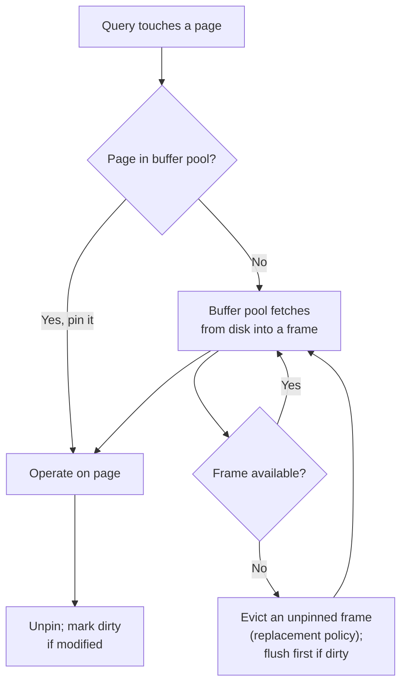

## Learning Objectives

- Explain why a DBMS maintains its own page cache (the buffer pool) rather than relying solely on the OS file cache.
- Describe the role of pin counts and dirty flags in buffer-pool bookkeeping.
- Connect buffer-pool page replacement to the same eviction problem already solved for OS physical frames.
- Define STEAL and NO-FORCE and explain why they make crash recovery a real engineering problem rather than a trivial one.

## Context & Motivation

`computer/operating-systems-i` already built the general version of this problem twice: `address-spaces-and-memory-virtualization` established that a process sees a virtual address space backed by physical frames the OS manages, and `page-replacement-policies` established that when physical memory is full, the OS must choose which resident page to evict to make room for a new one — a decision it makes using an approximation of "which page will be used furthest in the future" (LRU and its relatives). A DBMS's **buffer pool** is exactly the same idea, one layer up: it is a fixed-size region of memory holding database pages fetched from disk, and when it's full and a new page needs to be loaded, the buffer pool manager has to decide which resident page to evict — the identical problem `page-replacement-policies` already solved, just applied to database pages instead of process memory frames.

A DBMS could, in principle, simply rely on the operating system's own file cache to hold hot pages in memory and skip building a second cache on top of it. Real production systems do not do this, for reasons specific to what a DBMS knows that a generic OS file cache cannot: a DBMS knows exactly which pages are part of an in-flight transaction and must not be evicted yet, which pages have been modified and need special handling before eviction, and which access pattern a specific query will follow (sequential scan vs. random index lookup) — none of which a general-purpose OS page cache, oblivious to what a "transaction" even is, can take advantage of.

## Core Theory

### Buffer pool structure: pages, pin counts, and dirty flags

The buffer pool is an in-memory array of fixed-size frames, each either empty or holding one page's worth of bytes, plus a **page table** mapping page IDs to the frame currently holding them (if any). Two pieces of per-frame metadata drive every buffer-pool decision:

- **Pin count** — the number of "in-use" references currently held on a page by active operations. A page with a pin count above zero must never be evicted, since evicting it would invalidate a pointer some in-progress operation is still using; only once every operation has "unpinned" a page does it become eligible for eviction.
- **Dirty flag** — set the moment any operation modifies a page while it's resident in the buffer pool. A dirty page's in-memory contents differ from what's currently on disk, so evicting it safely requires first writing (flushing) it back to disk — unless the buffer pool's replacement policy allows evicting it anyway and dealing with the consequences later (the STEAL policy below).

### Replacement policy

When every frame is occupied and pin count zero for at least one of them, the buffer pool manager must choose an eviction victim among the unpinned frames — the exact eviction decision `page-replacement-policies` already built an approximation for. Real systems typically use LRU or the clock algorithm (a cheaper LRU approximation using a reference bit per frame, swept in a circular scan) rather than true LRU, for the same reason an OS does: tracking exact recency for every frame has real bookkeeping overhead that a cheap approximation avoids while losing little effective hit rate.

### STEAL and NO-FORCE: the two policies that make recovery hard

Two buffer-pool policy choices, each independent of the other, determine how hard crash recovery — several concepts ahead in this discipline — has to work:

- **STEAL** (yes/no): may the buffer pool evict ("steal" the frame of) a dirty page belonging to a transaction that has *not yet committed*? A **no-steal** policy never evicts an uncommitted transaction's dirty pages, which makes undo trivial (nothing uncommitted ever reaches disk) but forces the buffer pool to hold every dirty page of every long-running transaction in memory simultaneously — often infeasible. A **steal** policy allows eviction of uncommitted dirty pages whenever needed, trading simple recovery for far more practical memory usage.
- **FORCE** (yes/no): must every dirty page belonging to a transaction be flushed to disk *before* that transaction is allowed to commit? A **force** policy makes durability trivial (a committed transaction's writes are already on disk the instant it commits) but adds real, synchronous I/O latency to every single commit. A **no-force** policy lets commit return immediately while dirty pages are flushed lazily later, trading a fast commit for the requirement that some other mechanism guarantee those writes survive a crash before they're actually on disk.

Real, high-performance systems universally choose **STEAL + NO-FORCE** — maximum flexibility for the buffer pool, minimum latency on commit — which is precisely why write-ahead logging and ARIES-style crash recovery, both later in this discipline, have to exist at all: neither trivial case above applies once a real system's buffer pool is free to evict uncommitted work and delay flushing committed work.

## Worked Examples

### Example 1 — pin counts blocking eviction mid-scan

A sequential scan over a large table is midway through page #17: the scan operator holds a pin on page #17 while it iterates over the tuples currently loaded from it. If, at that same moment, a different query needs to load a new page and the buffer pool is full, the replacement policy must skip page #17 as a candidate victim (pin count > 0) and choose among the other, currently-unpinned resident pages instead — even if page #17 would otherwise have been the least-recently-used and thus the "best" eviction target by the policy's own metric.

### Example 2 — a dirty page evicted mid-transaction under STEAL

Under a STEAL policy, a long-running transaction has modified page #42 (setting its dirty flag) but has not yet committed. If the buffer pool needs page #42's frame for something else and no other unpinned frame is available, it flushes page #42's current (uncommitted!) contents to disk and reuses the frame. This is exactly the scenario a NO-STEAL policy would forbid — and exactly the scenario that makes crash recovery's Undo phase (built in `aries-style-crash-recovery`, several concepts ahead) necessary: if the system crashes before this transaction commits, disk now contains uncommitted changes that must be actively rolled back on restart, not simply ignored.

### Example 3 — NO-FORCE meaning "committed" and "on disk" are different moments

A transaction updates a row in page #8, then commits. Under a NO-FORCE policy, commit returns to the client immediately — page #8 is still dirty in the buffer pool and has not yet been physically written to disk. If the machine crashes one second later, before page #8's next scheduled flush, disk still holds the *old* pre-update contents of page #8, even though the client was already told the transaction committed successfully. Durability nonetheless holds — but only because write-ahead logging (the next-but-two concept in this discipline) guarantees the *log record* describing this exact change reached durable storage before commit returned, even though the data page itself did not.

## Common Misconceptions & Pitfalls

- **"The buffer pool is just the OS file cache under a different name."** A DBMS deliberately maintains its own cache, bypassing or working alongside the OS file cache, precisely because it has domain knowledge (pin counts tied to active transactions, dirty tracking tied to write-ahead logging) a generic file cache cannot represent — the two caches can and often do coexist, with the DBMS's buffer pool making the decisions that matter for correctness.
- **"NO-FORCE means committed data can be lost."** NO-FORCE only delays *when* a dirty page physically reaches disk relative to commit — it does not weaken durability, because write-ahead logging (built two concepts ahead) guarantees the change is durably recorded in the log before commit returns, independent of when the data page itself gets flushed; NO-FORCE moves the durability burden from the data page to the log, it doesn't remove it.
- **"A pinned page can always be safely modified."** A pin count above zero only prevents *eviction* — it says nothing about whether a lock has been acquired for correct concurrent access to that page's tuples; pinning is a buffer-pool-internal bookkeeping mechanism, completely separate from the two-phase-locking concurrency-control mechanism built later in this discipline, and a page can be pinned by multiple concurrent readers at once with no conflict at all.

## Summary

The buffer pool is the DBMS's own page cache, layered on top of disk-based page storage, making the same eviction decision `page-replacement-policies` already solved for OS physical frames — but tracked via pin counts (blocking eviction of in-use pages) and dirty flags (marking pages that differ from their on-disk copy) that only a DBMS, aware of its own transactions, can maintain correctly. Real systems universally choose the STEAL + NO-FORCE combination of buffer-pool policies for performance, and that single choice is exactly what makes crash recovery — write-ahead logging and ARIES, several concepts ahead — a genuinely hard engineering problem rather than something a naive no-steal/force policy could sidestep for free.

## Documentation Links

- [CMU 15-445/645 — Database Storage I Slides](https://15445.courses.cs.cmu.edu/fall2025/slides/03-storage1.pdf) — covers the buffer pool's page-table/pin-count/dirty-flag bookkeeping and the STEAL/NO-FORCE policy choices this concept builds its recovery-hardness argument on.
- [Berkeley CS186 — Course Notes (Buffer Management)](https://cs186berkeley.net/notes/) — the course notes' treatment of buffer-pool replacement policy and eviction mechanics, the same eviction decision this concept ties back to `page-replacement-policies`.
